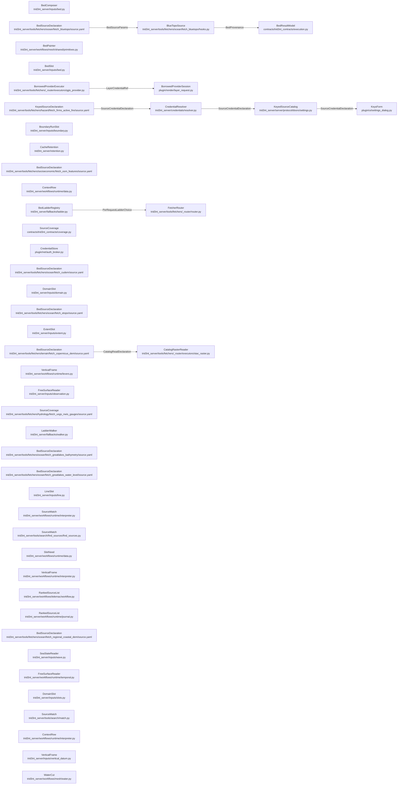

# DataSeam - derived view

GENERATED from `docs/model/data-seam.sysml` by `scripts/model_check.py --view`. Never hand-edited: regenerate it, and `tests/model/test_model_conformance.py` fails while it is stale.

Plane: **workflow**. System: **fetcher**. One seam of the system of systems indexed by [`README.md`](README.md) - never the whole picture.

## Blocks and flows

## Interface items

### `BedProvenance`

What a bed fetch knows and the bytes do not. The DATUM is the load- bearing one: BlueTopo is on NAVD88, an orthometric datum and explicitly not a navigational or tidal one, which is the whole reason it merges with a NAVD88 land DEM with no transformation. ``coverage_fraction`` is below 1.0 for any AOI holding land, by construction, and saying so is the honest report rather than a failure.

| item | type | required |
| --- | --- | --- |
| `vertical_datum` | String | required |
| `tile_count` | Integer | required |
| `resolution_tiers` | StringList | required |
| `coverage_fraction` | Real | required |
| `rung_coverage` | Map | optional |

### `BedSourceParams`

The request a bed source takes. ``resolution_m`` is the one lever name every raster fetcher shares: it floors the merge at the asked cell size, never invents a cell finer than the tile that was read and never coarsens past the ask, which is why it is the param the resolution declaration hangs off.

| item | type | required |
| --- | --- | --- |
| `bbox` | RealList | required |
| `target_crs` | String | required |
| `timeout_s` | Real | required |
| `resolution_m` | Real | optional |

### `CatalogReadDeclaration`

What a source row tells a catalog reader. Every key is a coordinate INTO a catalog, never a claim about the pixels: the reader can find the asset and put it on a grid, and it still cannot say which datum the numbers are on. That is why a bed source published through a catalog states its datum on its own row and the reader carries none.

| item | type | required |
| --- | --- | --- |
| `collection` | String | required |
| `data_asset` | String | required |
| `native_cell_m` | Real | required |
| `render` | String | required |
| `sign` | String | required |

### `LayerCredentialRef`

Which credential a borrowed provider row needs, by NAME only. The session resolves it in its own store, so this is the whole of what the daemon can say about a keyed provider row and the key itself never crosses the wire in either direction.

| item | type | required |
| --- | --- | --- |
| `credential` | String | optional |

### `PerRequestLadderChoice`

Which ladder governs ONE request. The chooser reads the request's own params; returning nothing means no per-request ladder applies and the capability's static ladder stands.

| item | type | required |
| --- | --- | --- |
| `capability` | String | required |
| `params` | Map | required |
| `selector` | Callable | optional |

### `SourceCredentialDeclaration`

The key a source needs, stated where the source is. ``name`` is the SCOPE a stored key lands under, which is why two rows served by one upstream account state the same name; ``env_var`` is the same variable the source's own hook reads, so the form and the code cannot disagree about which key this is.

| item | type | required |
| --- | --- | --- |
| `name` | String | required |
| `label` | String | required |
| `signup_url` | String | optional |
| `env_var` | String | required |

## Requirements

| requirement | satisfied by | verified by |
| --- | --- | --- |
| **ABoundaryRunIsTwoPointsAndAType** | `boundaryRunSlot`, `bedPainter` | `tests/inputs/test_slot_inputs.py::test_a_domain_producer_hands_over_the_runs_it_cut_the_polygon_between` `tests/inputs/test_slot_inputs.py::test_a_run_is_two_points_on_the_edge_and_a_type` `tests/inputs/test_slot_inputs.py::test_a_drawn_line_is_the_run_between_its_two_ends` `tests/inputs/test_slot_inputs.py::test_a_closed_body_states_no_run_and_prescribes_nothing` `tests/mesh/test_bed_sources_and_runs.py::test_boundary_runs_prescribe_the_roles_their_types_name` `tests/mesh/test_bed_sources_and_runs.py::test_a_closed_body_states_no_run_and_the_mesh_has_only_walls` `tests/telemac/test_workflow_owns_its_stages.py::test_the_boundary_runs_ride_on_the_polygon_the_domain_arrived_as` `tests/mesh/test_bed_sources_and_runs.py::test_runs_and_named_faces_are_the_same_statement` `tests/telemac/test_telemac_open_channel.py::test_a_domain_with_no_inflow_run_has_no_channel_to_open` |
| **ABoxIsNotADomainAndIsItsOwnSlot** | `extentSlot`, `slotDoor` | `tests/inputs/test_slot_inputs.py::test_an_extent_slot_reads_a_box_however_the_caller_named_it` `tests/inputs/test_slot_inputs.py::test_only_the_slots_a_user_can_draw_are_offered_on_the_canvas` `tests/telemac/test_agitation_template.py::test_the_extent_is_a_slot_the_canvas_offers_a_rectangle_for` `tests/telemac/test_agitation_template.py::test_the_mesh_is_cut_from_the_domain_polygon_and_not_from_a_box` |
| **ACatalogReaderCarriesNoProvenance** | `stacRasterReader`, `copernicusDeclaration` | `tests/fetchers/test_router_stac_raster.py::test_float_render_applies_scale_offset_and_fill` `tests/fetchers/test_router_stac_raster.py::test_mosaic_fuse_is_first_valid_in_search_order` `tests/fetchers/test_bathymetry_data_seam.py::test_every_bed_capable_source_row_states_its_vertical_datum` |
| **AConsumedObjectIsPinnedWhileItsCaseLives** | `cacheRetention` | `tests/server/test_store_retention.py::test_a_referenced_object_survives_its_ttl` `tests/server/test_store_retention.py::test_an_unreferenced_object_goes_and_a_current_one_stays` `tests/server/test_store_retention.py::test_a_deleted_case_releases_its_objects` `tests/server/test_store_retention.py::test_a_case_held_object_no_run_names_survives_and_is_released` |
| **AContextRowsAbsenceContinuesTheRun** | `contextRow`, `unreadContextAsk` | `tests/runtime/test_domain_bed_and_context_slots.py::test_a_context_row_no_step_reads_is_asked_all_the_same` `tests/runtime/test_domain_bed_and_context_slots.py::test_a_context_rows_absence_continues_the_run_and_says_so` `tests/runtime/test_domain_bed_and_context_slots.py::test_a_hard_producer_row_still_refuses_when_its_source_is_empty` `tests/runtime/test_domain_bed_and_context_slots.py::test_a_malformed_ask_on_a_context_row_refuses_rather_than_reading_absent` `tests/runtime/test_domain_bed_and_context_slots.py::test_a_malformed_value_handed_to_a_context_rows_slot_refuses_too` `tests/runtime/test_domain_bed_and_context_slots.py::test_context_needs_something_to_ask_and_optional_still_refuses_a_producer` `tests/runtime/test_domain_bed_and_context_slots.py::test_a_context_row_states_what_the_sheet_says_when_its_source_is_empty` `tests/runtime/test_domain_bed_and_context_slots.py::test_a_tail_read_off_a_wholly_absent_row_is_nothing` `tests/runtime/test_domain_bed_and_context_slots.py::test_the_sheet_reads_a_wholly_absent_row_as_nothing` |
| **AFreeSurfaceAndABedShareOneStatedDatum** | `lakeLevelDeclaration`, `lakeDeclaration`, `freeSurfaceReader` | `tests/telemac/test_telemac3d_stratified_flow.py::test_the_level_is_ranked_against_the_domain_and_may_be_absent` `tests/inputs/test_slot_inputs.py::test_each_slot_reads_through_the_ingestion_its_role_names` `tests/telemac/test_open_water_domains.py::test_the_thermocline_is_stated_below_the_water_top_not_the_datum` `tests/inputs/test_bed_merge.py::test_two_datums_refuse_by_name` `tests/inputs/test_bed_merge.py::test_an_unstated_datum_refuses` `tests/inputs/test_vertical_datum.py::test_a_layer_states_its_own_datum_and_a_name_reads_its_source_row` |
| **AKeyedProviderRowsKeyNeverLeavesTheSession** | `borrowedProviderExecutor`, `borrowedProviderSession`, `credentialStore` | `tests/fetchers/test_router_qgis_provider.py::test_a_keyed_row_carries_its_credential_NAME_and_no_key` `plugin/tests/test_layer_request.py::test_open_attaches_the_stored_config_id` `plugin/tests/test_layer_request.py::test_materialise_attaches_the_stored_config_id` `plugin/tests/test_layer_request.py::test_the_key_value_never_rides_the_uri` `plugin/tests/test_layer_request.py::test_no_stored_key_refuses_by_name_toward_the_form` |
| **AKeyedSourceStatesTheKeyItNeeds** | `firmsDeclaration`, `credentialResolver`, `keyedSourceCatalog`, `keysForm` | `tests/credentials/test_credential_resolver.py::test_keyed_credentials_are_the_rows_that_declare_one` `tests/credentials/test_credential_resolver.py::test_one_pushed_key_serves_every_row_naming_it` `tests/credentials/test_credential_resolver.py::test_refusal_names_the_credential_and_the_form` `tests/fetchers/test_router_stations.py::test_keyed_missing_key_refuses_pre_network` `plugin/tests/test_keys_form.py::test_one_row_per_credential_not_per_source` |
| **ASeaStateIsAReservedSlot** | `seaStateReader`, `slotDoor` | `tests/inputs/test_wave.py::test_the_slot_reserves_the_name_and_reads_the_class_the_buoys_publish` `tests/inputs/test_wave.py::test_each_quantity_is_read_off_the_column_stated_in_its_own_unit` `tests/inputs/test_wave.py::test_two_columns_in_one_unit_refuse_rather_than_the_first_being_taken` `tests/inputs/test_wave.py::test_the_two_conversions_a_deck_needs_are_made_here` `tests/telemac/test_nearshore_waves_template.py::test_the_seaward_edge_is_opened_so_the_spectrum_has_somewhere_to_enter` `tests/telemac/test_nearshore_waves_template.py::test_a_window_whose_rim_is_all_wall_refuses_rather_than_solving_zeros` `tests/telemac/test_wave_driven_currents_template.py::test_the_seaward_rim_is_opened_so_the_tide_and_the_spectrum_both_enter` |
| **ASeriesIsAlignedToTheRunsEventTime** | `seriesOnTheRunsClock`, `freeSurfaceReader`, `gaugeDeclaration`, `matchedSlot` | `tests/inputs/test_observation.py::test_the_run_opens_at_its_own_moment_inside_the_record` `tests/inputs/test_observation.py::test_a_record_that_stops_before_the_run_does_refuses_naming_the_nearest` `tests/inputs/test_observation.py::test_a_window_in_no_stated_unit_refuses_rather_than_reading_the_slot_s` `tests/inputs/test_observation.py::test_the_coverage_row_s_column_unit_is_what_a_bare_record_is_read_in` `tests/inputs/test_observation.py::test_a_gage_height_reaches_the_run_s_frame_over_the_gauge_s_own_zero` `tests/inputs/test_observation.py::test_a_gauge_that_publishes_no_zero_refuses_rather_than_reading_a_height` `tests/fetchers/test_router_nwis.py::test_the_window_read_publishes_the_stage_series_beside_the_discharge` `tests/fetchers/test_router_nwis.py::test_the_read_carries_the_gauge_s_own_zero` `tests/runtime/test_matched_slots.py::test_a_run_series_is_asked_for_the_window_the_deck_will_solve` |
| **ASlotStatesANeedAndTheMatchFillsIt** | `needDeclaration`, `domainSlot`, `sourceMatch`, `matchedSlot` | `tests/inputs/test_place_kind.py::test_the_geocoder_s_word_becomes_the_word_a_source_publishes` `tests/inputs/test_place_kind.py::test_a_place_that_is_not_water_says_nothing` `tests/runtime/test_feature_ref.py::test_a_domain_states_no_kind_and_the_seed_says_which_water` `tests/runtime/test_feature_ref.py::test_the_kind_a_template_states_is_not_overruled_by_the_place` `tests/runtime/test_declared_rows.py::test_a_place_on_a_flowline_has_its_water_surface_produced_for_it` `tests/runtime/test_declared_rows.py::test_a_declared_row_nothing_measured_refuses_by_name` `tests/inputs/test_domain_cut.py::test_a_place_on_a_flowline_declares_the_water_surface_beside_it` `tests/inputs/test_domain_cut.py::test_the_cut_domain_carries_its_two_runs_and_the_centerline` `tests/search/test_source_match.py::test_one_survivor_fills_the_slot_and_the_sentence_names_the_facts` `tests/search/test_source_match.py::test_a_gauge_on_another_river_is_not_this_domain_s_discharge` `tests/search/test_source_match.py::test_a_gauge_on_the_reach_survives_the_place_filter` `tests/search/test_source_match.py::test_the_reach_still_answers_for_a_water_level_gauge` `tests/search/test_source_match.py::test_a_source_too_coarse_for_the_mesh_ranks_below_every_source_that_resolves_it` `tests/search/test_source_match.py::test_a_source_already_on_the_run_s_frame_outranks_one_that_needs_a_shift` `tests/search/test_source_match.py::test_a_place_no_source_reaches_refuses_naming_what_each_filter_excluded` `tests/search/test_source_match.py::test_a_static_survey_older_than_the_run_is_never_dropped_by_the_window` `tests/search/test_source_match.py::test_a_series_outside_the_window_refuses_with_the_nearest_record_named` `tests/search/test_source_match.py::test_one_run_level_statement_loosens_the_window_as_the_user_s_choice` `tests/search/test_source_match.py::test_a_measured_gauge_at_the_place_outranks_a_modelled_grid_over_it` `tests/search/test_source_match.py::test_a_measured_gauge_outranks_a_prediction_a_hundred_kilometres_away` `tests/search/test_source_match.py::test_a_station_beyond_its_reach_is_not_a_survivor_at_all` `tests/search/test_source_match.py::test_a_run_that_picks_a_survivor_takes_it_as_the_user_s_choice` `tests/search/test_source_match.py::test_a_run_that_picks_a_source_the_filters_excluded_is_refused` `tests/runtime/test_matched_slots.py::test_a_merge_op_lays_the_rows_it_names_in_the_order_it_names_them` `tests/runtime/test_matched_slots.py::test_no_measurement_over_this_domain_refuses_rather_than_reaching_a_class` `tests/runtime/test_matched_slots.py::test_the_next_survivor_takes_its_turn_when_the_top_one_held_nothing` `tests/runtime/test_matched_slots.py::test_a_need_and_a_producer_on_one_row_is_refused_at_declaration` `tests/inputs/test_slot_inputs.py::test_a_row_a_merge_names_is_asked_at_the_spacing_the_run_is_meshed_at` `tests/inputs/test_slot_inputs.py::test_the_merge_ask_clears_the_budget_that_refused_the_named_row` `tests/inputs/test_slot_inputs.py::test_a_held_ask_is_stated_on_the_run_rather_than_coarsened_in_silence` `tests/runtime/test_domain_bed_and_context_slots.py::test_a_row_a_merge_names_is_fetched_at_the_spacing_the_run_is_meshed_at` |
| **ASourceStatesWhatItCovers** | `coverageContract`, `gaugeDeclaration`, `lakeDeclaration` | `tests/fetchers/test_coverage_rows.py::test_every_spec_loads_and_its_rows_validate` `tests/fetchers/test_coverage_rows.py::test_a_source_with_no_row_says_it_is_model_callable` `tests/fetchers/test_coverage_rows.py::test_a_station_row_lists_its_stations` `tests/fetchers/test_coverage_rows.py::test_the_tide_gauge_states_the_record_and_the_prediction_apart` `tests/fetchers/test_coverage_rows.py::test_the_nearest_station_is_what_a_listed_set_is_measured_from` `tests/fetchers/test_coverage_rows.py::test_every_series_source_states_the_unit_of_its_value_columns` `tests/fetchers/test_coverage_rows.py::test_the_gauge_network_states_each_column_on_its_own_row` `tests/fetchers/test_coverage_rows.py::test_a_lake_row_covers_its_lake_and_not_the_open_coast` `tests/fetchers/test_router_spec_loader.py::test_a_coverage_row_naming_a_class_outside_the_vocabulary_is_refused` `tests/fetchers/test_router_spec_loader.py::test_a_spec_states_no_coverage_by_default` |
| **AStoppedRungNeverShips** | `blueTopoSource`, `cudemDeclaration`, `regionalCoastalDemDeclaration` | `tests/fetchers/test_bathymetry_data_seam.py::test_a_tile_row_with_no_delivered_link_is_not_data` `tests/fetchers/test_bathymetry_data_seam.py::test_an_aoi_no_delivered_tile_reaches_refuses_by_name` `tests/fetchers/test_bathymetry_data_seam.py::test_an_aoi_no_cudem_tile_reaches_refuses_rather_than_serving_something_else` `tests/fetchers/test_bathymetry_data_seam.py::test_a_coast_with_no_published_regional_collection_refuses_by_name` `tests/fetchers/test_bathymetry_data_seam.py::test_a_regional_collection_that_cannot_be_listed_refuses_rather_than_skipping` |
| **BedSourceStatesItsDatum** | `blueTopoSource`, `blueTopoDeclaration`, `bedResultModel` | `tests/fetchers/test_bathymetry_data_seam.py::test_a_tile_that_states_navd88_passes_the_datum_gate` `tests/fetchers/test_bathymetry_data_seam.py::test_a_tile_that_states_no_navd88_refuses_rather_than_merging` `tests/fetchers/test_bathymetry_data_seam.py::test_the_envelope_states_the_datum_in_provenance` `tests/fetchers/test_bathymetry_data_seam.py::test_the_bluetopo_spec_declares_the_delegate_hooks_and_the_result_model` |
| **OneBedOverEverySourceAUserCanHave** | `bedSlot`, `bedPainter`, `bedComposer` | `tests/inputs/test_slot_inputs.py::test_the_bed_slot_takes_one_source_and_composes_nothing` `tests/telemac/test_workflow_owns_its_stages.py::test_the_bed_op_takes_the_one_row_the_merge_derive_produced` `tests/inputs/test_bed_merge.py::test_an_absent_survey_leaves_the_terrain_as_the_whole_bed` `tests/inputs/test_slot_inputs.py::test_the_bed_slot_says_which_shape_it_was_handed` `tests/mesh/test_bed_sources_and_runs.py::test_a_stated_depth_is_a_flat_bed_below_the_free_surface` `tests/mesh/test_bed_sources_and_runs.py::test_the_bed_is_one_source_and_two_are_merged_before_the_op` `tests/inputs/test_bed_merge.py::test_the_primary_wins_where_it_measured_and_the_fallback_fills_the_rest` `tests/inputs/test_bed_merge.py::test_the_sidecar_says_which_input_painted_each_cell` `tests/inputs/test_bed_merge.py::test_each_row_paints_the_cells_the_ones_before_it_left` `tests/inputs/test_bed_merge.py::test_a_grid_every_row_leaves_unpainted_refuses_naming_them` `tests/inputs/test_bed_merge.py::test_one_surface_alone_is_still_laid_and_still_states_what_it_covers` `tests/mesh/test_bed_sources_and_runs.py::test_a_domain_no_source_covers_refuses_by_name` `tests/mesh/test_bed_sources_and_runs.py::test_a_layer_of_soundings_goes_through_the_grid_at_the_meshs_own_scale` `tests/telemac/test_workflow_owns_its_stages.py::test_the_bed_op_takes_the_one_row_the_merge_derive_produced` |
| **OneSourceReadsOnOneStatedDatum** | `bedPainter`, `lakeDeclaration`, `cudemDeclaration`, `etopoDeclaration`, `regionalCoastalDemDeclaration`, `blueTopoDeclaration` | `tests/fetchers/test_bathymetry_data_seam.py::test_every_bed_capable_source_row_states_its_vertical_datum` `tests/fetchers/test_bathymetry_data_seam.py::test_the_lake_row_pins_one_product_of_the_mixed_mosaic` `tests/mesh/test_mesh_topology_and_bed.py::test_a_source_row_that_states_no_datum_is_not_a_bed` `tests/mesh/test_mesh_topology_and_bed.py::test_the_bed_card_states_the_datum_and_the_native_cell_of_its_source` `tests/fetchers/test_emit_on_fetch_seam.py::test_input_layer_name_shape_and_purpose` `tests/fetchers/test_router_spec_loader.py::test_a_row_stating_its_datum_as_prose_is_refused` `tests/fetchers/test_router_spec_loader.py::test_a_row_stating_a_served_frame_or_the_record_loads` |
| **SubstitutionIsDeclared** | `bedLadderRegistry`, `ladderWalker` | `tests/fetchers/test_fallback_ladder.py::test_declared_rung_fills_the_gap_and_splits_coverage` `tests/fetchers/test_fallback_ladder.py::test_gap_no_rung_permitted_keeps_the_capabilitys_coverage_code` `tests/fetchers/test_fallback_sweep_guard.py::test_every_ladder_is_a_complete_account_of_its_own_rungs` |
| **ThalwegBurningIsNeverABedSource** | `blueTopoSource`, `cudemDeclaration`, `etopoDeclaration` | `tests/model/test_model_conformance.py::test_the_model_conforms_to_the_tree` `tests/fetchers/test_bathymetry_data_seam.py::test_the_selected_tiles_run_coarsest_first_so_the_finest_paints_last` |
| **TheDomainIsOneSlotHoweverItIsFilled** | `domainSlot`, `slotDoor`, `contextRow` | `tests/runtime/test_domain_bed_and_context_slots.py::test_a_domain_row_is_one_slot_however_it_is_filled` `tests/inputs/test_slot_inputs.py::test_a_drawn_ring_a_geojson_polygon_and_a_collection_read_the_same` `tests/inputs/test_slot_inputs.py::test_several_polygons_are_one_domain_with_parts` `tests/inputs/test_slot_inputs.py::test_a_shape_that_is_not_closed_refuses_rather_than_being_squared_off` `tests/telemac/test_workflow_owns_its_stages.py::test_the_domain_and_the_bed_reach_the_wire_as_the_slots_they_are` `tests/inputs/test_slot_inputs.py::test_a_domain_says_its_own_name_when_it_is_read_as_text` |
| **TheRankedListIsOneObjectInThreeViews** | `rankedListCard`, `rankedListRecord`, `coverageContract` | `tests/runtime/test_matched_slots.py::test_the_ranked_list_is_one_object_the_card_and_the_sheet_both_read` `tests/search/test_source_match.py::test_several_equal_on_every_fact_present_as_a_tie` `tests/search/test_source_match.py::test_the_ranked_list_carries_at_most_five_rows` |
| **TheRunHasOneVerticalFrame** | `verticalFrame`, `frameLever`, `bedSlot`, `bedComposer`, `freeSurfaceReader`, `offsetRowDeclaration` | `tests/inputs/test_bed_merge.py::test_two_populations_farther_apart_than_the_relief_refuse_as_a_cliff` `tests/inputs/test_bed_merge.py::test_a_primary_of_depths_is_read_as_elevations_on_the_fallbacks_zero` `tests/inputs/test_bed_merge.py::test_a_depth_surface_whose_zero_nothing_bridges_refuses_by_name` `tests/runtime/test_domain_bed_and_context_slots.py::test_every_elevation_slot_is_read_on_the_runs_own_vertical_frame` `tests/inputs/test_vertical_datum.py::test_a_survey_reaches_the_runs_frame_through_the_shift_it_publishes` `tests/inputs/test_vertical_datum.py::test_a_source_publishing_no_shift_owes_an_offset_row` `tests/inputs/test_vertical_datum.py::test_the_coercion_reads_the_rows_value_and_fetches_nothing` `tests/runtime/test_domain_bed_and_context_slots.py::test_the_runtime_declares_the_offset_row_a_differing_source_owes` `tests/inputs/test_vertical_datum.py::test_a_pair_nothing_measures_refuses_naming_both_frames` `tests/inputs/test_slot_inputs.py::test_the_bed_slot_says_which_shape_it_was_handed` `tests/inputs/test_bed_merge.py::test_each_source_off_the_runs_frame_is_shifted_onto_it_before_the_overlay` `tests/inputs/test_bed_merge.py::test_a_frame_no_offset_reaches_refuses_naming_both` `tests/runtime/test_matched_slots.py::test_the_runtime_declares_the_offset_row_a_merge_source_owes` `tests/inputs/test_bed_merge.py::test_each_row_is_read_onto_the_frame_through_the_offset_declared_for_it` `tests/fetchers/test_router_ehydro_surveys.py::test_a_depth_on_igld85_is_counted_from_the_low_water_datum` `tests/inputs/test_vertical_datum.py::test_a_record_stating_a_chart_datum_asks_for_the_chart_datum` `tests/inputs/test_vertical_datum.py::test_a_record_stating_a_datum_no_service_serves_refuses_by_name` `tests/inputs/test_vertical_datum.py::test_a_record_on_the_runs_frame_is_read_on_it_and_not_shifted` `tests/inputs/test_vertical_datum.py::test_a_footprint_missing_the_box_centre_is_asked_at_the_seed` `tests/inputs/test_vertical_datum.py::test_a_seed_off_the_footprint_is_asked_at_the_nearest_measured_point` `tests/inputs/test_vertical_datum.py::test_a_point_the_service_does_not_reach_refuses_naming_it` `tests/runtime/test_domain_bed_and_context_slots.py::test_an_offset_row_is_asked_where_the_source_measured_not_at_the_seed` `tests/inputs/test_bed_merge.py::test_a_row_the_service_cannot_place_drops_off_and_the_rest_paint` `tests/inputs/test_bed_merge.py::test_the_first_row_the_service_cannot_place_refuses_the_whole_merge` `tests/inputs/test_slot_inputs.py::test_a_bed_the_runs_frame_cannot_reach_names_its_zero_once` |
| **TheShorelineIsTheDomainsOwnEdge** | `waterCut`, `coastlineDeclaration` | `tests/mesh/test_mesh_polygon_domain.py::test_the_shoreline_the_sizing_functions_measure_is_the_polygons_own_edge` `tests/mesh/test_mesh_polygon_domain.py::test_a_reach_with_two_open_runs_drops_those_stretches_from_the_shore` `tests/mesh/test_mesh_polygon_domain.py::test_an_island_ring_is_shore_too` `tests/mesh/test_mesh_polygon_domain.py::test_a_domain_whose_whole_edge_is_crossed_refuses_by_name` `tests/mesh/test_mesh_om2d.py::test_a_box_extent_refuses_and_names_the_cut_that_makes_it_a_domain` `tests/mesh/test_mesh_water.py::test_the_water_is_the_side_the_way_does_not_have_its_land_on` `tests/mesh/test_mesh_water.py::test_reversing_the_way_moves_the_water_to_the_other_side` `tests/mesh/test_mesh_water.py::test_a_way_that_ends_inside_the_box_divides_nothing_and_refuses` |
| **WaterNothingMeasuredIsPaintedOnlyWhenAskedFor** | `bedSlot`, `bedComposer` | `tests/inputs/test_slot_inputs.py::test_water_no_row_measured_is_feedback_and_not_a_refusal` `tests/inputs/test_slot_inputs.py::test_a_fill_that_names_the_share_it_refuses_at_is_refused_above_it` `tests/telemac/test_telemac_run_identity.py::test_what_the_cut_covers_is_on_the_card_before_the_solve` `tests/inputs/test_bed_merge.py::test_the_terrain_paints_only_outside_the_polygon_the_domain_was_cut_with` `tests/inputs/test_bed_merge.py::test_the_feedback_states_the_water_and_the_land_separately` `tests/inputs/test_bed_merge.py::test_the_stated_op_paints_the_water_from_the_shore_to_the_measurements` `tests/inputs/test_bed_merge.py::test_the_interpolated_row_is_laid_last_and_says_so_per_cell` `tests/inputs/test_slot_inputs.py::test_a_fill_that_names_the_share_it_refuses_at_is_refused_above_it` `tests/inputs/test_slot_inputs.py::test_the_op_the_run_states_is_what_lets_the_unmeasured_water_through` `tests/inputs/test_bed_merge.py::test_a_dry_hole_is_offered_the_rows_that_measure_land` `tests/inputs/test_bed_merge.py::test_the_seeded_shore_stands_at_the_opening_the_run_states` `tests/inputs/test_bed_merge.py::test_a_fill_with_no_opening_stated_refuses_rather_than_seeding_a_number` `tests/inputs/test_slot_inputs.py::test_every_merge_the_call_states_names_rows_that_are_laid` `tests/runtime/test_matched_slots.py::test_the_fill_is_handed_the_level_the_run_opens_at` `tests/runtime/test_matched_slots.py::test_the_ops_the_run_states_reach_the_merge_in_the_order_stated` `tests/runtime/test_matched_slots.py::test_an_op_stated_for_a_row_the_workflow_does_not_declare_refuses_by_name` |

## What each requirement says

- **ABoundaryRunIsTwoPointsAndAType** - A run is two Points on the domain's edge and a type - wall by default, inflow, outflow, open. A template or a producer states zero or more, and STATING NONE IS AN ANSWER: a closed body has no liquid boundary and its mesh has only walls, so nothing is prescribed where nothing is named. A PRODUCER that cut its polygon between two faces returns those faces as rows of the same artifact, and the domain slot reads them off it: the producer names which row is which in its OWN vocabulary, and the slot reads that rather than asking a fetcher to speak the slot's. A row naming a stretch that prescribes nothing is the wall the edge already is, and is not a run. A template declares the slot and nothing else about it. What fills it, in order: what the caller supplied, the runs the DOMAIN row carries because its producer measured them, what the user draws under the boundary-run purpose, and then nothing - which is a closed body. A question that needs a run and was given none refuses by naming the run it lacked, never by opening on a condition nobody stated.
- **ABoxIsNotADomainAndIsItsOwnSlot** - A box has no shoreline, so it is not a domain and the mesher refuses one by name. What it IS is the window a question is asked inside, and a question that cuts its domain out of one declares that window as its own slot - which is what puts a canvas ask back where the domain's producer took it away: a slot with a producer is never drawn, so a harbour whose water is CUT would otherwise have nothing a user with nothing can fill. One role, one ingestion, one draw purpose: a rectangle picked on the canvas, four numbers, a place or a layer's bounds all read as ``.bbox`` afterwards, and the raster engines fill the same slot with the grid window they solve on.
- **ACatalogReaderCarriesNoProvenance** - The STAC rows read through a maintained catalog library rather than hand-written search-and-warp code. The library owns the socket, the grid and the pixel fuse; it owns nothing else. Provenance facts - the vertical datum, the resolution and the style row - stay on the source row whatever library performs the fetch, so a bed published through a catalog is as mergeable after the fold as before it.
- **AConsumedObjectIsPinnedWhileItsCaseLives** - An object a run consumed is pinned by that run's journal record for as long as a case still holds one of the layers the run published, so a case reopened long after answers from the same bytes it was answered with. A case deleted releases what it held. Everything else ages by the TTL class its own key was salted with: past that window the key can no longer be computed, so the bytes are already unreachable and the sweep is only what makes unreachable mean gone. An object and the provenance sidecar beside it share one fate, because a pinned object whose sidecar went is a miss. Only the cache is swept: a run's own products carry no class to age by.
- **AContextRowsAbsenceContinuesTheRun** - A producer row declared as CONTEXT continues the run when its source held nothing, and the sheet carries the sentence the row states. Every other producer row still fails typed: the difference is declared, not inferred, because a row that is load-bearing and a row that is background look identical from inside the fetch. ONLY AN EMPTY SOURCE IS AN ABSENCE. A window, a bbox or a unit the caller stated wrong is the ASK being wrong and refuses, because a run that swallowed it would report that nothing was there about a question nobody managed to put. The refusal for a producer row declared .optional() stands: absence with nothing said about it is the failure mode this row was written to end. A tail read off a row that is WHOLLY ABSENT reads as nothing, exactly as a field that is present and empty does - otherwise the keyword reading a context row refuses the very run the row was declared to let continue. THE SENTENCE IS THE PRODUCT, so a context row no step and no sibling row dereferences is asked all the same, before the run works: a row declared to say what the run stood beside and then never asked says nothing at all. Every other declared artifact nothing reads still costs no fetch.
- **AFreeSurfaceAndABedShareOneStatedDatum** - A water body's LEVEL is an observation, fetched the way a river's discharge is - the nearest gauge to the AOI, at the day the run is about - and the run's free surface opens at it. Data is assumed true; nothing thresholds the reading. WHAT MAKES THE ARITHMETIC LEGAL is that both documents state their zero. The gauge row and the bed row each state a vertical datum, and the subtraction between a level and an elevation is only defined when the two statements agree. Two rows stating different zeros, with no offset stated anywhere, REFUSE BY NAME - both names and both datums - rather than adding numbers that are not on one axis. A row stating none refuses for the reason OneSourceReadsOnOneStatedDatum already gives. Left at the dictionary's own zero the free surface sits ON the chart datum, which is where the bed is counted from, so the rim of a surveyed basin carries no water at all. Clipping that rim away would be a threshold on values; giving it its real water is the observation.
- **AKeyedProviderRowsKeyNeverLeavesTheSession** - A borrowed provider row states which credential it needs and the daemon stops there. The session resolves that name in its OWN credential store and attaches the stored config as the uri's ``authcfg=`` token, so the key is never on the wire, never in a log and never in the daemon's memory. A row whose credential nothing has stored is refused by name toward the keys form rather than opened - the provider's own rejection would name neither the credential nor where a key is entered.
- **AKeyedSourceStatesTheKeyItNeeds** - The key a source needs is a fact ABOUT THE SOURCE, so it is stated on the source's own row and nowhere else - name, label, signup url and the env var the source's own hook reads. Everything downstream is a reader of those rows: the resolver takes the session's pushed key first and the row's env var behind it, the catalog projects the rows for a key-entering surface, and the keys form shows one field per credential NAME rather than per source, so two sources served by one upstream account take one entered key. A keyed call with no key REFUSES before it dispatches, naming the credential and the one place a key is entered. The chat is never that place: a key pasted into a conversation is a key in the model's context and in the history, so the refusal points at the form and the form is the only surface that takes a value.
- **ASeaStateIsAReservedSlot** - THE SEA STATE AT AN OPEN BOUNDARY IS A RESERVED SLOT, not a composite and not an observation under another name. It is the same kind of thing as the weather over a domain - one record of several measured columns - so it is a name on the reserved list, serving one class, and the match fills it the way it fills every other need. What makes it its own slot is what its INGESTION does: every column of the record becomes a KEYWORD the deck states, so the turn from the record's words to the engine's lives there and nowhere else. A quantity is read off the column stated in that quantity's own unit - a record stating two columns in one unit refuses rather than taking the first - and the two conversions a spectral deck needs are made at that one place: the peak FREQUENCY is one over the period reported, and the deck's MAIN DIRECTION is the bearing the waves run TOWARD, which a met record's own is turned through 180 to reach. Neither is folded silently into a number: the journal says the buoy, how far off it stands, the moment, what it reported, and both turns. A PRESCRIBED SEA STATE NEEDS AN EDGE TO ENTER BY. The deck that imposes one states the depth a boundary stretch has to reach for it to be designated open, on the scenario door, and every stretch that reaches it opens; no deck inherits the meshing library's own default, which is set for a shelf-scale domain and is deeper than every node of a nearshore window. A mesh where nothing reaches the stated depth is sealed, and one settle refuses it for every deck that prescribes a sea state, naming the deck and the depth it stated - a sealed domain solves green with every wave answer zero, which is the one failure a reader cannot see.
- **ASeriesIsAlignedToTheRunsEventTime** - A run opens at the moment it asks about, INSIDE the record: t=0 is that instant and the readings before it carry negative times, rather than the record's first sample standing in for a moment nobody asked about. A record that does not span the window the run solves over refuses, naming the nearest sample it holds and the statement that would take it as a stand-in - reading a record flat past its last sample is a forcing nobody measured. A record is read in the unit it was MEASURED in, off its source's coverage row where the record carries no unit column of its own; a record that states none refuses rather than being read in the unit the slot wanted. And a gauge publishes a HEIGHT above its own zero, which is a different surface from the one a bed is painted on: the run reaches that surface by adding the zero's own elevation, which the site record publishes, and a gauge that publishes none refuses.
- **ASlotStatesANeedAndTheMatchFillsIt** - A RUNTIME SLOT STATES THE CLASS IT NEEDS AND NAMES NO FETCHER. The slot is the ROW'S NAME - one reserved list, the runtime slot registry's keys - and the modifiers are absence and the sentence an absence carries. A need is one class of the coarse data-class vocabulary; the window and the frame it is matched under are the RUN's - the deck's own duration from the moment the run asks at, the vertical lever - and the place is the domain's centre unless the row states the point it is asked at. WHAT OF THE CLASS the row asks for is the word the answering source publishes it under: the published variable a record is a measurement of, and on the DOMAIN the KIND the equations are solved over. A domain's kind is a fact of the PLACE, read off the word the service that resolved it already published and turned by the domain slot into the word the sources publish that feature under, so a question never carries the narrowing itself. A seed nothing said a type for is unclassified and every row of the class is ranked. Where the seed CANNOT imply the kind - the land draining through a pour point, the water inside a box drawn over land and water - the template states its domain's kind as one word on the need, and a stated kind wins. A SLOT MAY DECLARE ROWS BESIDE ITS OWN. What fills a slot is not always one artifact: a place on a flowline reaches the domain as a line, and a line is not something the equations are solved over. The slot states the rows it needs - the water surface the line runs between - and the runtime produces each through the match, under the slot, the way the rows a merge op names are produced; the cut between them is the slot's own coercion. Declaring a need is not fetching. NO ROW STATES A UNIT. What a measured slot's record is read in is the unit of the KEYWORD its role fills, which the engine's transform fixes, or - where the row names the PUBLISHED VARIABLE it observes - that variable's own unit off the run's published table: a measurement and the thing it is a measurement of are comparable in one unit and no other, so the ingestion's opening value and the residual a pairing takes go through one conversion. A row that names a variable this run publishes no unit under refuses rather than reading the record in whatever its source published. How far the question's domain REACHES is the one opinion a row still states about its own extent, and it states it generically: the answering source's coverage row maps it onto the param that source calls it by, and a row that states none leaves the param off the call so the source's own default answers. The filter is mechanical: class and place are hard, the window is hard for a SERIES source and never for a static surface - a 2014 survey answers a 2026 question and recency ranks it - and a differing datum is FLAGGED rather than filtered, because the offset row is what refuses at. A station set states the REACH one station serves, read against the nearest station the row lists, and a place further from it than that is not a survivor at all. A DISCHARGE is the water passing one section, so its place filter is the domain itself: the gauge has to stand on this domain's own water - inside the polygon the run drew, or its box, within the cell the mesh resolves - and a gauge on another river is dropped by name however near it stands. A level propagates up a reach, so the reach stays its rule. What the top survivor is CALLED with closes through the match: the run's box and window, the matched row's own request values, and the nearest listed station where the source is called by a station name. A source whose required params the row can answer for is a survivor; one whose it cannot is dropped by name. The sort is on facts, in the order they decide: how the numbers were come by - measured, then predicted, then modelled - how far the place is from them, the cell against the mesh, how current the record is, and whether the source is already on the run's frame. The top survivor is CALLED and dropped on an empty source, so the list a reader sees says what the world answered rather than what the sort preferred, and a refusal NAMES every source and what each one had to say. One run-level statement loosens one filter - a stand-in window, a datum taken unconverted - and one names the PICK for a slot among the survivors; both show as the user's choice, never as the match's own judgement, and a named source the filters excluded is a refusal rather than a way past them. The bed takes the ONE row its class matched, like every other slot, and then whatever the run's own ops lay over it: a row reaches this bed only because a merge op NAMED it, and the water no row measured is painted only because the run stated the fill. Soundings are gridded at the run's own edge before the merge reads them. What the run was not given is the surface's own coverage feedback to state, and the provenance the merge writes names the row that painted each cell by the place it was laid in.
- **ASourceStatesWhatItCovers** - A fetcher's coverage row is its ONLY statement of coverage: the class of thing it measures, the place it reaches as a coarse polygon or a station set or "read from the service", the time its records span, the cell it publishes at, the zero its elevations are counted from, and the unit of each value column the record carries. The prose that used to say these things in the caveats goes, because two statements of one fact are how the two drift apart and no filter can read a sentence. The row is stated from the dataset's own documentation, never inferred from a fetched body: a guessed extent is indistinguishable from a measured one to every reader downstream, and this row is what decides which source fills a slot. A source that states none is never matched - it stays model-callable, and nothing here can say whether it reaches this place. The UNIT is per value column, because one record carries more than one quantity: a gauge reports a discharge in cubic feet per second beside a stage in feet, and a slot that read either in the unit it wanted would be reading a different river. A source that serves two classes carries ONE ROW PER CLASS AND KIND rather than a hybrid word, and each row names the columns its value, its window and the zero it is counted from arrive under - a slot that states a need cannot name a column of a source it did not choose. A gauge that reports a measured series and a predicted one of the same class carries a row for each, and each row carries the request values it is fetched under, because the row is what the match weighed and a spec default answers for whichever row it was written around. A request value written as a NEED ATTRIBUTE rather than a literal is the row mapping one of the need's own generic facts - how far the question reaches, the place it is asked at - onto the param this source states it in, so a question states its opinion once and every source hears it in its own words. A unit or a zero the RECORD carries per feature is stated as "record" and read off the feature. A STATION SET LISTS ITS STATIONS - inline where the set is small, read from a bounded listing that is cached once, or discovered by box inside the region where the network has no listing at all - because a ring alone says a place is inside the region and nothing about whether a station stands anywhere near it, which is the distance the reach is measured against. A set that lists them is measured from the nearest listed station; a discovered network is measured from the region and the probe drops it on an empty answer. Rings alone under a station set are refused.
- **AStoppedRungNeverShips** - SIGNED DECISION - load-bearing unverified items are verified live before any rung ships, and a dead assumption stops its rung rather than shipping it. Two rungs the methodology names stopped on measured grounds and are absent here rather than declared: eHydro, the navigable primary: its queryable surface is one layer of survey-boundary polygons carrying a horizontal projection and no vertical datum field at all, with the soundings behind per-survey bulk archives on another host. A LADDER RUNG has to state its datum on the source row, before it fetches, so it cannot be one - and what the methodology leaves under it is BlueTopo alone, which is not a degradation path either. The navigable class therefore has no ladder and refuses, naming the stopped primary. That is a statement about LADDERS, not about eHydro. A survey states its own zero on its own features - a local project datum on many rivers - and that is read where the soundings are, so eHydro is a DATA row of its own: the row states the datum per feature, the surface derived from it carries what those features stated, and the merge that places it over a terrain surface refuses two different zeros BY NAME. A per-source zero and a per-row zero are both stated; neither is ever assumed. NXSDB, the small-stream primary: its measurements carry depth below the water surface and no bed elevation and no vertical datum, published as one national GeoPackage on a host serving no range requests. That is a producer's input, not a bed anyone can fetch. So the small-stream class likewise has no rung and REFUSES, naming both gaps and the synthetic slot below them. That slot is DEFERRED, not merely unbuilt: no synthetic bathymetry is produced, the Bieger regression the methodology named as the candidate does not build, and whether a fabricated bed may ever stand in for a survey is a USER decision rather than a gap for an implementation to close. Best-case behaviour is established first and never intertwined with sad-path interpolation. The slot is therefore STATED and EMPTY - an absence somebody decided, so that a later reader finds a decision where they would otherwise find an oversight. Empty, it is a refusal, and the refusal is the honest floor working.
- **BedSourceStatesItsDatum** - SIGNED DECISION - the bed's vertical datum is stated in provenance, not assumed by a reader. BlueTopo publishes NAVD88 and says so twice in each tile; a tile that states neither is refused rather than merged, because the whole reason this source outranks the alternatives is that its datum is known. The datum, the tiles, the tiers and the measured coverage ride on the returned layer, since none of them survives in the raster bytes.
- **OneBedOverEverySourceAUserCanHave** - The bed is one seam fed by whatever the user has: a fetched DEM, a bathymetry or survey raster, a layer of soundings, or a stated depth below the free surface. The slot takes ONE source, and it is one row. A bed built from a survey over a wider surface is EXISTING COMPOSITION, not new vocabulary: a survey row declared context, a row that grids it into a surface, a terrain row, and a merged row that is a derive over the two - primary over fallback by coverage, with a sidecar recording which input won at each cell, and the terrain passing through unchanged where no survey was published. The derive is useful outside any slot, which is why it is a tool rather than a second argument on the mesh op or on the slot, and a fetcher's ladder - which is about a source being unavailable - is never spelled as one. The COMPOSITION IS ROWS: the slot takes the one layer the merge produced and knows nothing of what went into it. A node the source does not cover REFUSES by name. Filling the hole with the mean of what was covered is a bed nobody measured, and it reads as data everywhere downstream.
- **OneSourceReadsOnOneStatedDatum** - Every bed source states its VERTICAL DATUM on its own source row, taken from the dataset's own documentation and never inferred from the bytes - a raster carries numbers, and what they are counted from is not among them. A row that cannot state one carries none, and a row carrying none is refused as a bed rather than painted and read later as if it were on whatever the run assumed. A mosaic that mixes datums is therefore not a bed source. The NCEI DEM_all endpoint serves the lake-datum bathymetry, the NAVD88 coastal tiles, the same tiles on MHW and the EGM2008 global bases merged under one name, so the row that reads it as a bed pins the ONE product it means and states that product's datum. The stated datum is the WHOLE guard. A post-paint population test over the elevations is not one: real terrain puts an outlier as far from its neighbours as a datum offset does, so such a test reads the shape of the ground rather than the reference it is counted from. The datum rides onto the layer's provenance card beside the acquisition instant and the native cell, since a bed the user is shown to refine is a bed they may stitch another source onto, and that is the metadata the two have to be compared on. THE ROW STATES A FRAME NAME. The zero on a coverage row is one of the names the offset service converts between, the per-record word where each feature carries its own, or nothing at all. It is what an offset is asked in, so prose - "each Great Lake's own Low Water Datum" - names a surface nothing can bring another onto and the spec loader refuses it naming the row. The vocabulary is read off the offset fetch's own params, because a second list of frame names would drift from the one service that has to answer for them. What a SUPPLIED layer says is not governed here: a document states its zero in its own words, and the fullest frame those words name is what is asked for.
- **SubstitutionIsDeclared** - SIGNED DECISION - a cross-dataset substitution is a DECLARED rung taken loudly through the gate, never a fill a fetch performs on its own. Falling from BlueTopo to the CUDEM composite crosses datasets and wears that consequence, so the gate asks before it happens and the activation records which rung painted what share. A rung that served only part of the request says so as a gap carrying the measured share, which is what lets the next rung fill the rest under the gate instead of the first rung returning a half-painted bed as a whole one. The same loudness holds one level up, on a DATA row's own declared ladder: when a rung other than the primary answers, the interpreter writes a note ON THE RUN naming the row, what each earlier rung refused with, and which runner answered. The packet carries that note, so a reader of the answer sees that a different dataset produced the artifact; a log line would die with the process.
- **ThalwegBurningIsNeverABedSource** - SIGNED DECISION - thalweg and stream burning stay REJECTED as a bed source. Burning lowers DEM cells along a mapped network so flow routing honours it: the depth is chosen for ROUTING reasons and bears no relation to true bathymetry, and a burned surface is unsuited even for measuring local slope. It enforces direction and connectivity and says nothing about cross-sectional conveyance. Reading a routing offset as a channel depth is precisely the confusion the correct-data-class law forbids. The rule is written as a dependency: no module on this bed seam may reach for the hydrologic-conditioning family, which is where fill, resolve-flats and stream-network conditioning live. A bed source that imported them would be conditioning terrain and calling the result a survey.
- **TheDomainIsOneSlotHoweverItIsFilled** - A template solves over any body of water: drawn, picked, fetched, or purely surveyed. The DOMAIN is one row - a closed polygon, geometry only - and nothing downstream branches on where it came from, because the moment a consumer can tell, half the ways of filling it stop working. A slot that names a producer is still on the WIRE: what the user hands in supersedes the source the template preferred, and that is the whole of how a body of water no fetcher knows gets modelled. Fetchers are one way to fill a slot, never the linchpin. A domain read as TEXT is the name it was given, else the word: the mesh session, the layer titles and the run's own name are all written from it, so a domain that read as its geometry named every one of them after its coordinates.
- **TheRankedListIsOneObjectInThreeViews** - The list a slot was filled from is ONE object. The card renders it with the pick highlighted; the tool result carries the rows only on a TIE, where several sources rank equal on every fact the sort reads and the model or the user picks by row; the sheet stores the pick and its reason. The sentence the model is given IS the sentence the card shows. It is authored once, in the match, because a second rendering of the same facts is a second chance to say something the run did not do.
- **TheRunHasOneVerticalFrame** - A run counts every elevation it ingests from ONE zero, and that zero is the RUNTIME's: a lever beside the core count, NAVD88 by default, never a row a question writes. A template that named its own datum would make the frame a property of the question rather than of the run, and two questions over one water body would then answer on two axes. A source published on another frame reaches the run's through a shift somebody MEASURED, in one order: the shift the source publishes about itself - a district's project datum states in the survey's own metadata how far it sits above a national frame, and no service serves that - else the offset a DATA ROW produces between the two frames at a point the OWING SOURCE has data at - the point of that source's own footprint nearest the question's seed, the seed itself where it lies inside that footprint, and never a box's centre or a polygon's centroid. A datum relation is a shift and not a field, so one point stands for the whole source and the row states WHICH point it was asked at, which is what a reader needs to dispute it; a footprint the service reaches nowhere refuses naming that point. That row is the RUNTIME's: it is declared where an elevation slot is handed a source on another frame, walked and journaled like any other producer, and the slot's coercion reads its value and fetches nothing - a coercion may call a derive, never a fetch. A pair nothing measures refuses naming BOTH frames rather than laying one over the other, because a shift nobody measured is indistinguishable from a measurement to every reader downstream. The zero is the one the RECORD states. A source whose every feature carries its own says so on its coverage row in the per-record form rather than stating nothing, and what is aligned states the zero the rows state - a refusal that read the holder instead would say a survey states no datum while its every row states one. A stated zero is asked for by the FULLEST frame its words name: a chart datum names the reference system it is expressed on, and a low water plane is not the geodetic zero it is expressed on but a surface metres above it, so the shorter name inside the longer is never what is measured. A DEPTH is counted from a WATER SURFACE and never from a reference system, so the word a record of depths states names the surface it hangs below: a sounding on IGLD85 is counted from the low water datum expressed on IGLD85, which the row's own datum vocabulary says and the survey's plot sheet states in its own sentence. The same order holds wherever surfaces meet before a slot does: the bed merge reads EVERY ROW it lays onto the run's frame, each through the row the runtime declared for it - one per surface, the same declaration a slot's source gets and never a second mechanism - before any of them paints a cell, and a pair nothing measures refuses naming both. A merge called outside a run lands on the last surface's own zero, which nothing it already holds moves. A surface counting DEPTHS down from its zero is one axis with a surface counting elevations up only through that shift, so it is read the other way round on the way - on its own grid, before either is read onto the common one. What a slot does with a source that states NO datum is that slot's own statement and not this one's: a surface of depths has to know the zero they are counted below and refuses without it, while an elevation surface somebody handed this run stands on the run's frame. AN UNPLACEABLE ROW DROPS OFF. A row whose zero nothing measures against the frame the merge lands on is not part of this bed: it drops off the way an empty one does, the run says which row and why - its own zero and the frame nothing reached it from - and the rows after it paint the cells it would have. The merge refuses only where what is left paints nothing, or where the FIRST row itself cannot be placed, because a bed whose best source is unplaceable is not that bed. The refusal is built ONCE, by the datum check that knows both zeros; a slot re-raises it under its own code rather than restating the surface and the two frames in its own words, since two statements of one fact are two chances to disagree. A BED THAT SPLIT IN TWO IS REFUSED BY NAME. A shift nobody caught still shows in what the rows painted: values in two populations farther apart than the relief of the surface under them is a step no ground holds, and every node is painted, so nothing below catches it. The merge refuses, naming both ranges and the row each came from, rather than handing a mesh a cliff for a river to stand in. The domain's OWN relief is the yardstick, because the only number that says how far this landscape falls is this landscape.
- **TheShorelineIsTheDomainsOwnEdge** - A shoreline is where the water meets land. The DOMAIN is the closed polygon the equations are solved over, so its own boundary - islands included - is that shoreline, minus the stretches a run of type inflow, outflow, open or rating_curve names, which are the edge the water CROSSES. Every sizing function measures what is left, on any domain: a drawn pond, a reach section, a harbour basin. There is therefore ONE mesher path and no box extent: a box is not a domain, and cutting the water out of one is a derive over that box and a mapped coastline, useful on its own and written as a DATA row by the template that wants it. A domain whose whole edge is crossed has no shore for a sizing function to measure and is refused by name.
- **WaterNothingMeasuredIsPaintedOnlyWhenAskedFor** - NOTHING PAINTS SILENTLY. The bed lays the ONE row the match ranked first and STATES WHAT IT COVERS - over the water the domain was cut with and over the land separately, what each row painted there and what nothing measured, and the rows that also matched and could cover the gap. A wider surface over the water measures its TOP, so it is not a bed there: a row serving terrain paints outside the cut polygon only. The feedback is the whole of what the slot hands a person, and it is stated BEFORE THE SOLVE where they meet the fill: on the run's own card beside the sources it matched, and on the journal. NO REFUSING SHARE EXISTS IN THE SYSTEM. A node no value reaches is what refuses; a share is feedback. A fill that knows the share it would not stand on names it as an argument on its own merge op, and the slot refuses above that number - naming the share, the share stated, those rows and the ops that would lay them. A fill that states none refuses on no share at all: a number this code invented would be our nuance rather than the person's. A HOLE IS OFFERED THE CLASS THAT MEASURES ITS OWN GROUND. The feedback says which KIND of hole it is - a WET one inside the cut polygon, a DRY one outside it - and names rows of the class that covers that kind: the bed's own class under water, terrain on land. Which rows those are is the match's ranking for that class, never a list this code keeps, so a dry hole is never offered bathymetry. COMPOSING PAST THAT ROW IS THE PERSON'S STATEMENT, carried as ops on the call beside the source it picks, in the order they are stated. MERGE names the rows laid under the first, each painting the cells the ones before it left, provenance per cell; EVERY merge a call states is laid, in the order stated, because a stated op whose rows never reach the bed is the silence this slot exists to refuse. INTERPOLATED paints the water no row measured, from the measurements to the polygon's own edge, seeded at DEPTH zero - the free surface the run opens at, which on a frame whose zero lies far below that surface is not elevation zero - and REFUSING where no opening reached the bed rather than seeding a number nobody measured; it lays LAST, with no distance cap - a hole far from every sounding is painted and says so through its provenance, and a cap would be this code choosing a radius for the person who asked. The HOLE itself is what the fill is gated on, never its rounded share. The share does not move when the op runs: an interpolation is not a sounding.
