# DataSeam - derived view

GENERATED from `docs/model/data-seam.sysml` by `scripts/model_check.py --view`. Never hand-edited: regenerate it, and `tests/test_model_conformance.py` fails while it is stale.

Plane: **workflow**. System: **fetcher**. One seam of the system of systems indexed by [`README.md`](README.md) - never the whole picture.

## Blocks and flows

```mermaid
flowchart LR
    bedLadderRegistry["BedLadderRegistry<br/>trid3nt_server/fallbacks/ladder.py"]
    bedResultModel["BedResultModel<br/>contracts/trid3nt_contracts/execution.py"]
    blueTopoDeclaration["BedSourceDeclaration<br/>trid3nt_server/tools/fetchers/ocean/fetch_bluetopo/source.yaml"]
    blueTopoSource["BlueTopoSource<br/>trid3nt_server/tools/fetchers/_router/hooks/bluetopo.py"]
    coastalComposite["CoastalComposite<br/>trid3nt_server/tools/fetchers/_router/hooks/topobathy.py"]
    coastalDeclaration["BedSourceDeclaration<br/>trid3nt_server/tools/fetchers/ocean/fetch_topobathy/source.yaml"]
    fetcherRouter["FetcherRouter<br/>trid3nt_server/tools/fetchers/_router/router.py"]
    ladderWalker["LadderWalker<br/>trid3nt_server/fallbacks/walker.py"]
    waterBodyClassifier["WaterBodyClassifier<br/>trid3nt_server/tools/fetchers/_router/hooks/topobathy_class.py"]
    blueTopoSource -- "BedProvenance" --> bedResultModel
    blueTopoDeclaration -- "BedSourceParams" --> blueTopoSource
    waterBodyClassifier -- "PartialCoverGap" --> ladderWalker
    waterBodyClassifier -- "BedLadderDeclaration" --> bedLadderRegistry
    waterBodyClassifier -- "BedLadderRung" --> bedLadderRegistry
    coastalDeclaration -- "WaterBodyClassDeclaration" --> waterBodyClassifier
    coastalComposite -- "PartialCoverGap" --> ladderWalker
    coastalComposite -- "BedLadderDeclaration" --> bedLadderRegistry
    coastalComposite -- "BedLadderRung" --> bedLadderRegistry
    bedLadderRegistry -- "PerRequestLadderChoice" --> fetcherRouter
    waterBodyClassifier -- "StoppedClassRefusal" --> coastalComposite
```

## Interface items

### `BedLadderDeclaration`

A whole ladder: which capability it governs, its ordered rungs, and the typed code its terminal refusal wears so a refusal keeps the capability's own error vocabulary.

| item | type | required |
| --- | --- | --- |
| `capability` | String | required |
| `rungs` | RungList | required |
| `refuse_error_code` | String | required |
| `coverage_exempt_params` | StringList | optional |

### `BedLadderRung`

One alternative on a bed ladder. ``consequence`` is what descending to it COSTS, and it is the only thing the loudness gate keys on, so a rung that crosses datasets must say so or the gate never asks.

| item | type | required |
| --- | --- | --- |
| `name` | String | required |
| `consequence` | String | required |
| `describes` | String | required |
| `call` | String | optional |
| `source` | String | optional |
| `params` | Map | optional |
| `supplies_param` | String | optional |

### `BedProvenance`

What a bed fetch knows and the bytes do not. The DATUM is the load- bearing one: BlueTopo is on NAVD88, an orthometric datum and explicitly not a navigational or tidal one, which is the whole reason it merges with a NAVD88 land DEM with no transformation. ``coverage_fraction`` is below 1.0 for any AOI holding land, by construction, and saying so is the honest report rather than a failure.

| item | type | required |
| --- | --- | --- |
| `vertical_datum` | String | required |
| `tile_count` | Integer | required |
| `resolution_tiers` | StringList | required |
| `coverage_fraction` | Real | required |
| `rung_coverage` | Map | optional |

### `BedSourceParams`

The request a bed source takes. ``min_pixel_m`` only COARSENS: it never invents a cell finer than the tile that was read, which is why it is the param the resolution declaration hangs off.

| item | type | required |
| --- | --- | --- |
| `bbox` | RealList | required |
| `target_crs` | String | required |
| `timeout_s` | Real | required |
| `min_pixel_m` | Real | optional |

### `PartialCoverGap`

A rung that served PART of the request, and how much. The walker reads both off it: the share already painted, and the note the gate shows the person being asked to accept the substitution that fills the rest.

| item | type | required |
| --- | --- | --- |
| `covered_fraction` | Real | required |
| `gap_note` | String | required |

### `PerRequestLadderChoice`

Which ladder governs ONE request. The chooser reads the request's own params; returning nothing means no per-request ladder applies and the capability's static ladder stands.

| item | type | required |
| --- | --- | --- |
| `capability` | String | required |
| `params` | Map | required |
| `selector` | Callable | optional |

### `StoppedClassRefusal`

A class whose every rung stopped, and what is missing before it can have one. It is carried as DATA so the refusal names the gap rather than saying only that there is one.

| item | type | required |
| --- | --- | --- |
| `STOPPED_CLASSES` | Map | required |
| `water_body_class` | String | required |

### `WaterBodyClassDeclaration`

The class vocabulary, declared on the row and read by the classifier. Three names and no fourth: a class the row can state is a class a ladder answers for, and the two must not drift apart.

| item | type | required |
| --- | --- | --- |
| `water_body_class` | String | required |
| `coastal_estuary` | String | required |
| `navigable_river` | String | required |
| `small_inland_stream` | String | required |

## Requirements

| requirement | satisfied by | verified by |
| --- | --- | --- |
| **AStoppedRungNeverShips** | `waterBodyClassifier`, `coastalComposite` | `tests/test_bathymetry_data_seam.py::test_a_small_inland_stream_has_no_ladder_and_refuses_naming_both_gaps` `tests/test_bathymetry_data_seam.py::test_a_navigable_river_has_no_ladder_and_refuses_naming_its_stopped_primary` `tests/test_bathymetry_data_seam.py::test_no_ladder_anywhere_ships_an_ehydro_rung` `tests/test_bathymetry_data_seam.py::test_a_stopped_class_refuses_before_the_cache_and_before_the_network` `tests/test_bathymetry_data_seam.py::test_a_tile_row_with_no_delivered_link_is_not_data` `tests/test_bathymetry_data_seam.py::test_an_aoi_no_delivered_tile_reaches_refuses_by_name` `tests/test_bathymetry_data_seam.py::test_the_synthetic_slot_is_stated_as_deferred_rather_than_forgotten` |
| **BedSourceStatesItsDatum** | `blueTopoSource`, `blueTopoDeclaration`, `bedResultModel` | `tests/test_bathymetry_data_seam.py::test_a_tile_that_states_navd88_passes_the_datum_gate` `tests/test_bathymetry_data_seam.py::test_a_tile_that_states_no_navd88_refuses_rather_than_merging` `tests/test_bathymetry_data_seam.py::test_the_envelope_states_the_datum_in_provenance` `tests/test_bathymetry_data_seam.py::test_the_bluetopo_spec_declares_the_delegate_hooks_and_the_result_model` |
| **PerWaterBodyClassLadders** | `waterBodyClassifier`, `bedLadderRegistry`, `fetcherRouter` | `tests/test_bathymetry_data_seam.py::test_the_coastal_ladder_puts_bluetopo_above_the_cudem_composite` `tests/test_bathymetry_data_seam.py::test_every_declared_class_either_ladders_or_stops_by_name` `tests/test_bathymetry_data_seam.py::test_an_undeclared_class_keeps_the_rows_unclassed_ladder` `tests/test_bathymetry_data_seam.py::test_every_class_ladder_ends_at_refuse_with_the_rows_own_error_code` |
| **SubstitutionIsDeclared** | `waterBodyClassifier`, `ladderWalker`, `coastalComposite` | `tests/test_bathymetry_data_seam.py::test_falling_from_bluetopo_to_the_cudem_composite_is_a_declared_cross_dataset_rung` `tests/test_bathymetry_data_seam.py::test_a_partial_bluetopo_cover_is_reported_as_a_gap_not_a_whole_bed` `tests/test_fallback_ladder.py::test_declared_rung_fills_the_gap_and_splits_coverage` |
| **ThalwegBurningIsNeverABedSource** | `blueTopoSource`, `waterBodyClassifier`, `coastalComposite` | `tests/test_model_conformance.py::test_the_model_conforms_to_the_tree` `tests/test_bathymetry_data_seam.py::test_the_selected_tiles_run_coarsest_first_so_the_finest_paints_last` |
| **WaterBodyClassComesFromHeldData** | `waterBodyClassifier`, `coastalDeclaration` | `tests/test_bathymetry_data_seam.py::test_a_tidal_ftype_classifies_the_reach_as_coastal_estuary` `tests/test_bathymetry_data_seam.py::test_no_mapped_water_surface_classifies_the_reach_as_a_small_inland_stream` `tests/test_bathymetry_data_seam.py::test_a_wide_inland_river_refuses_naming_what_would_have_decided_it` `tests/test_bathymetry_data_seam.py::test_the_classifier_never_guesses_a_class_from_an_unknown_ftype` `tests/test_bathymetry_data_seam.py::test_the_topobathy_row_declares_the_water_body_class_it_ladders_on` |

## What each requirement says

- **AStoppedRungNeverShips** - SIGNED DECISION - load-bearing unverified items are verified live before any rung ships, and a dead assumption stops its rung rather than shipping it. Two rungs the methodology names stopped on measured grounds and are absent here rather than declared: eHydro, the navigable primary: its queryable surface is one layer of survey-boundary polygons carrying a horizontal projection and no vertical datum field at all, with the soundings behind per-survey bulk archives on another host. A bed whose datum is unknowable from its index cannot state its datum, so it cannot be on this ladder. What the methodology leaves under it is BlueTopo alone, and one source is not a degradation path - so the navigable class has no ladder either and refuses, naming the stopped primary. NXSDB, the small-stream primary: its measurements carry depth below the water surface and no bed elevation and no vertical datum, published as one national GeoPackage on a host serving no range requests. That is a producer's input, not a bed anyone can fetch. So the small-stream class likewise has no rung and REFUSES, naming both gaps and the synthetic slot below them. That slot is DEFERRED BY RULING, not merely unbuilt (HAPPY PATH FIRST, SYNTHETIC DEFERRED, 2026-09-02, amending the signed methodology): no synthetic bathymetry is produced now, the Bieger regression the methodology named as the candidate does not build, and whether a fabricated bed may ever stand in for a survey is a USER decision rather than a gap for an implementation to close. Best-case behaviour is established first and never intertwined with sad-path interpolation. The slot is therefore STATED and EMPTY - an absence somebody decided, so that a later reader finds a ruling where they would otherwise find an oversight. Empty, it is a refusal, and the refusal is the honest floor working.
- **BedSourceStatesItsDatum** - SIGNED DECISION - the bed's vertical datum is stated in provenance, not assumed by a reader. BlueTopo publishes NAVD88 and says so twice in each tile; a tile that states neither is refused rather than merged, because the whole reason this source outranks the alternatives is that its datum is known. The datum, the tiles, the tiers and the measured coverage ride on the returned layer, since none of them survives in the raster bytes.
- **PerWaterBodyClassLadders** - SIGNED DECISION - per-class ladders on the topobathy row (bathymetry methodology, M1). A bed source fits one KIND of water and not another, so the row has one ladder per class rather than one ladder: coastal or estuary takes BlueTopo above the CUDEM composite, and the other two classes take none - each stopped for a measured reason recorded under AStoppedRungNeverShips. Which ladder governs a request is resolved from the request itself, before the walk. A row that declares no class keeps the unclassed ladder. A class nobody declared is not a class anybody may assume, so the per-class ladders govern the row that states which water it is and nothing else.
- **SubstitutionIsDeclared** - SIGNED DECISION - a cross-dataset substitution is a DECLARED rung taken loudly through the gate, never a fill a fetch performs on its own. Falling from BlueTopo to the CUDEM composite crosses datasets and wears that consequence, so the gate asks before it happens and the activation records which rung painted what share. A rung that served only part of the request says so as a gap carrying the measured share, which is what lets the next rung fill the rest under the gate instead of the first rung returning a half-painted bed as a whole one.
- **ThalwegBurningIsNeverABedSource** - SIGNED DECISION - thalweg and stream burning stay REJECTED as a bed source. Burning lowers DEM cells along a mapped network so flow routing honours it: the depth is chosen for ROUTING reasons and bears no relation to true bathymetry, and a burned surface is unsuited even for measuring local slope. It enforces direction and connectivity and says nothing about cross-sectional conveyance. Reading a routing offset as a channel depth is precisely the confusion the correct-data-class law forbids. The rule is written as a dependency: no module on this bed seam may reach for the hydrologic-conditioning family, which is where fill, resolve-flats and stream-network conditioning live. A bed source that imported them would be conditioning terrain and calling the result a survey.
- **WaterBodyClassComesFromHeldData** - SIGNED DECISION - the class comes from data the chain already holds (the reach, water and waterbody rows), never from a guess. A tidal FType among the mapped water makes the reach coastal; no mapped water surface at all makes it a small inland stream, because a channel too narrow to be mapped as an area is a flowline only and that absence is a real answer about the channel. Where the held rows CANNOT decide, the classifier REFUSES and names what was missing rather than falling to a conservative default. A mapped inland channel surface says the river is wide; the navigable class means a federally maintained navigation channel, and no row this chain holds says whether this one is - so it refuses and names that.
