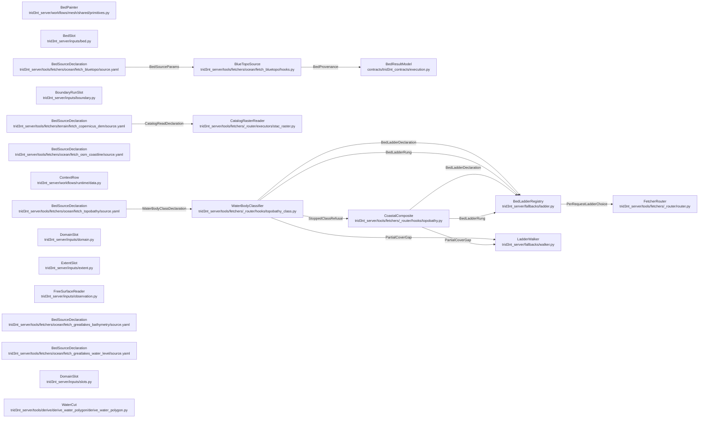

# DataSeam - derived view

GENERATED from `docs/model/data-seam.sysml` by `scripts/model_check.py --view`. Never hand-edited: regenerate it, and `tests/model/test_model_conformance.py` fails while it is stale.

Plane: **workflow**. System: **fetcher**. One seam of the system of systems indexed by [`README.md`](README.md) - never the whole picture.

## Blocks and flows

## Interface items

### `BedLadderDeclaration`

A whole ladder: which capability it governs, its ordered rungs, and the typed code its terminal refusal wears so a refusal keeps the capability's own error vocabulary.

| item | type | required |
| --- | --- | --- |
| `capability` | String | required |
| `rungs` | RungList | required |
| `refuse_error_code` | String | required |
| `coverage_exempt_params` | StringList | optional |

### `BedLadderRung`

One alternative on a bed ladder. ``consequence`` is what descending to it COSTS, and it is the only thing the loudness gate keys on, so a rung that crosses datasets must say so or the gate never asks.

| item | type | required |
| --- | --- | --- |
| `name` | String | required |
| `consequence` | String | required |
| `describes` | String | required |
| `call` | String | optional |
| `source` | String | optional |
| `params` | Map | optional |
| `supplies_param` | String | optional |

### `BedProvenance`

What a bed fetch knows and the bytes do not. The DATUM is the load- bearing one: BlueTopo is on NAVD88, an orthometric datum and explicitly not a navigational or tidal one, which is the whole reason it merges with a NAVD88 land DEM with no transformation. ``coverage_fraction`` is below 1.0 for any AOI holding land, by construction, and saying so is the honest report rather than a failure.

| item | type | required |
| --- | --- | --- |
| `vertical_datum` | String | required |
| `tile_count` | Integer | required |
| `resolution_tiers` | StringList | required |
| `coverage_fraction` | Real | required |
| `rung_coverage` | Map | optional |

### `BedSourceParams`

The request a bed source takes. ``min_pixel_m`` only COARSENS: it never invents a cell finer than the tile that was read, which is why it is the param the resolution declaration hangs off.

| item | type | required |
| --- | --- | --- |
| `bbox` | RealList | required |
| `target_crs` | String | required |
| `timeout_s` | Real | required |
| `min_pixel_m` | Real | optional |

### `CatalogReadDeclaration`

What a source row tells a catalog reader. Every key is a coordinate INTO a catalog, never a claim about the pixels: the reader can find the asset and put it on a grid, and it still cannot say which datum the numbers are on. That is why a bed source published through a catalog states its datum on its own row and the reader carries none.

| item | type | required |
| --- | --- | --- |
| `collection` | String | required |
| `data_asset` | String | required |
| `native_cell_m` | Real | required |
| `render` | String | required |
| `sign` | String | required |

### `PartialCoverGap`

A rung that served PART of the request, and how much. The walker reads both off it: the share already painted, and the note the gate shows the person being asked to accept the substitution that fills the rest.

| item | type | required |
| --- | --- | --- |
| `covered_fraction` | Real | required |
| `gap_note` | String | required |

### `PerRequestLadderChoice`

Which ladder governs ONE request. The chooser reads the request's own params; returning nothing means no per-request ladder applies and the capability's static ladder stands.

| item | type | required |
| --- | --- | --- |
| `capability` | String | required |
| `params` | Map | required |
| `selector` | Callable | optional |

### `StoppedClassRefusal`

A class whose every rung stopped, and what is missing before it can have one. It is carried as DATA so the refusal names the gap rather than saying only that there is one.

| item | type | required |
| --- | --- | --- |
| `STOPPED_CLASSES` | Map | required |
| `water_body_class` | String | required |

### `WaterBodyClassDeclaration`

The class vocabulary, declared on the row and read by the classifier. Three names and no fourth: a class the row can state is a class a ladder answers for, and the two must not drift apart.

| item | type | required |
| --- | --- | --- |
| `water_body_class` | String | required |
| `coastal_estuary` | String | required |
| `navigable_river` | String | required |
| `small_inland_stream` | String | required |

## Requirements

| requirement | satisfied by | verified by |
| --- | --- | --- |
| **ABoundaryRunIsTwoPointsAndAType** | `boundaryRunSlot`, `bedPainter` | `tests/inputs/test_slot_inputs.py::test_a_domain_producer_hands_over_the_runs_it_cut_the_polygon_between` `tests/inputs/test_slot_inputs.py::test_a_run_is_two_points_on_the_edge_and_a_type` `tests/inputs/test_slot_inputs.py::test_a_drawn_line_is_the_run_between_its_two_ends` `tests/inputs/test_slot_inputs.py::test_a_closed_body_states_no_run_and_prescribes_nothing` `tests/mesh/test_bed_sources_and_runs.py::test_boundary_runs_prescribe_the_roles_their_types_name` `tests/mesh/test_bed_sources_and_runs.py::test_a_closed_body_states_no_run_and_the_mesh_has_only_walls` `tests/runtime/test_domain_bed_and_context_slots.py::test_the_runs_slot_is_filled_by_the_domains_own_producer` `tests/runtime/test_domain_bed_and_context_slots.py::test_a_domain_that_carries_no_runs_leaves_the_slot_empty` `tests/runtime/test_domain_bed_and_context_slots.py::test_a_run_the_user_hands_over_supersedes_the_producers_own` `tests/telemac/test_telemac_open_channel.py::test_a_domain_with_no_inflow_run_has_no_channel_to_open` |
| **ABoxIsNotADomainAndIsItsOwnSlot** | `extentSlot`, `slotDoor` | `tests/inputs/test_slot_inputs.py::test_an_extent_slot_reads_a_box_however_the_caller_named_it` `tests/inputs/test_slot_inputs.py::test_only_the_slots_a_user_can_draw_are_offered_on_the_canvas` `tests/telemac/test_agitation_template.py::test_the_box_is_an_extent_slot_the_canvas_offers_a_rectangle_for` `tests/telemac/test_agitation_template.py::test_the_mesh_is_cut_from_the_domain_polygon_and_not_from_a_box` |
| **ACatalogReaderCarriesNoProvenance** | `stacRasterReader`, `copernicusDeclaration` | `tests/fetchers/test_router_stac_raster.py::test_float_render_applies_scale_offset_and_fill` `tests/fetchers/test_router_stac_raster.py::test_mosaic_fuse_is_first_valid_in_search_order` `tests/fetchers/test_bathymetry_data_seam.py::test_every_bed_capable_source_row_states_its_vertical_datum` |
| **AContextRowsAbsenceContinuesTheRun** | `contextRow` | `tests/runtime/test_domain_bed_and_context_slots.py::test_a_context_rows_absence_continues_the_run_and_says_so` `tests/runtime/test_domain_bed_and_context_slots.py::test_a_hard_producer_row_still_refuses_when_its_source_is_empty` `tests/runtime/test_domain_bed_and_context_slots.py::test_a_malformed_ask_on_a_context_row_refuses_rather_than_reading_absent` `tests/runtime/test_domain_bed_and_context_slots.py::test_a_malformed_value_handed_to_a_context_rows_slot_refuses_too` `tests/runtime/test_domain_bed_and_context_slots.py::test_context_needs_a_producer_and_optional_still_refuses_one` `tests/runtime/test_domain_bed_and_context_slots.py::test_a_context_row_states_what_the_sheet_says_when_its_source_is_empty` `tests/runtime/test_domain_bed_and_context_slots.py::test_a_tail_read_off_a_wholly_absent_row_is_nothing` `tests/runtime/test_domain_bed_and_context_slots.py::test_the_sheet_reads_a_wholly_absent_row_as_nothing` |
| **AFreeSurfaceAndABedShareOneStatedDatum** | `lakeLevelDeclaration`, `lakeDeclaration`, `freeSurfaceReader` | `tests/telemac/test_telemac3d_stratified_flow.py::test_the_level_the_free_surface_opens_at_is_one_measured_value` `tests/telemac/test_telemac3d_stratified_flow.py::test_an_ungauged_body_of_water_continues_the_run` `tests/inputs/test_slot_inputs.py::test_each_slot_reads_through_the_ingestion_its_role_names` `tests/telemac/test_open_water_domains.py::test_the_thermocline_is_stated_below_the_water_top_not_the_datum` `tests/derive/test_derive_merge_rasters.py::test_two_datums_refuse_by_name` `tests/derive/test_derive_merge_rasters.py::test_an_unstated_datum_refuses` `tests/inputs/test_vertical_datum.py::test_a_layer_states_its_own_datum_and_a_name_reads_its_source_row` |
| **AStoppedRungNeverShips** | `waterBodyClassifier`, `coastalComposite` | `tests/fetchers/test_bathymetry_data_seam.py::test_a_small_inland_stream_has_no_ladder_and_refuses_naming_both_gaps` `tests/fetchers/test_bathymetry_data_seam.py::test_a_navigable_river_has_no_ladder_and_refuses_naming_its_stopped_primary` `tests/fetchers/test_bathymetry_data_seam.py::test_no_ladder_anywhere_ships_an_ehydro_rung` `tests/fetchers/test_bathymetry_data_seam.py::test_a_stopped_class_refuses_before_the_cache_and_before_the_network` `tests/fetchers/test_bathymetry_data_seam.py::test_a_tile_row_with_no_delivered_link_is_not_data` `tests/fetchers/test_bathymetry_data_seam.py::test_an_aoi_no_delivered_tile_reaches_refuses_by_name` `tests/fetchers/test_bathymetry_data_seam.py::test_the_synthetic_slot_is_stated_as_deferred_rather_than_forgotten` |
| **BedSourceStatesItsDatum** | `blueTopoSource`, `blueTopoDeclaration`, `bedResultModel` | `tests/fetchers/test_bathymetry_data_seam.py::test_a_tile_that_states_navd88_passes_the_datum_gate` `tests/fetchers/test_bathymetry_data_seam.py::test_a_tile_that_states_no_navd88_refuses_rather_than_merging` `tests/fetchers/test_bathymetry_data_seam.py::test_the_envelope_states_the_datum_in_provenance` `tests/fetchers/test_bathymetry_data_seam.py::test_the_bluetopo_spec_declares_the_delegate_hooks_and_the_result_model` |
| **OneBedOverEverySourceAUserCanHave** | `bedSlot`, `bedPainter` | `tests/inputs/test_slot_inputs.py::test_the_bed_slot_says_which_shape_it_was_handed` `tests/mesh/test_bed_sources_and_runs.py::test_a_stated_depth_is_a_flat_bed_below_the_free_surface` `tests/mesh/test_bed_sources_and_runs.py::test_the_bed_is_one_source_and_two_are_merged_before_the_op` `tests/derive/test_derive_merge_rasters.py::test_the_primary_wins_where_it_measured_and_the_fallback_fills_the_rest` `tests/derive/test_derive_merge_rasters.py::test_the_sidecar_says_which_input_painted_each_cell` `tests/derive/test_derive_merge_rasters.py::test_an_absent_primary_passes_the_other_surface_through` `tests/mesh/test_bed_sources_and_runs.py::test_a_domain_no_source_covers_refuses_by_name` `tests/mesh/test_bed_sources_and_runs.py::test_a_layer_of_soundings_goes_through_the_derive_at_the_meshs_own_scale` `tests/mesh/test_bed_sources_and_runs.py::test_a_tree_without_the_soundings_derive_says_which_one_is_missing` `tests/telemac/test_workflow_owns_its_stages.py::test_the_bed_op_takes_the_one_row_the_merge_derive_produced` `tests/telemac/test_workflow_owns_its_stages.py::test_a_second_bed_row_refuses_by_name` |
| **OneSourceReadsOnOneStatedDatum** | `bedPainter`, `lakeDeclaration`, `coastalDeclaration`, `blueTopoDeclaration` | `tests/fetchers/test_bathymetry_data_seam.py::test_every_bed_capable_source_row_states_its_vertical_datum` `tests/fetchers/test_bathymetry_data_seam.py::test_the_lake_row_pins_one_product_of_the_mixed_mosaic` `tests/mesh/test_mesh_topology_and_bed.py::test_a_source_row_that_states_no_datum_is_not_a_bed` `tests/mesh/test_mesh_topology_and_bed.py::test_the_bed_card_states_the_datum_and_the_native_cell_of_its_source` `tests/fetchers/test_emit_on_fetch_seam.py::test_input_layer_name_shape_and_purpose` |
| **PerWaterBodyClassLadders** | `waterBodyClassifier`, `bedLadderRegistry`, `fetcherRouter` | `tests/fetchers/test_bathymetry_data_seam.py::test_the_coastal_ladder_puts_bluetopo_above_the_cudem_composite` `tests/fetchers/test_bathymetry_data_seam.py::test_every_declared_class_either_ladders_or_stops_by_name` `tests/fetchers/test_bathymetry_data_seam.py::test_an_undeclared_class_keeps_the_rows_unclassed_ladder` `tests/fetchers/test_bathymetry_data_seam.py::test_every_class_ladder_ends_at_refuse_with_the_rows_own_error_code` |
| **SubstitutionIsDeclared** | `waterBodyClassifier`, `ladderWalker`, `coastalComposite` | `tests/fetchers/test_bathymetry_data_seam.py::test_falling_from_bluetopo_to_the_cudem_composite_is_a_declared_cross_dataset_rung` `tests/fetchers/test_bathymetry_data_seam.py::test_a_partial_bluetopo_cover_is_reported_as_a_gap_not_a_whole_bed` `tests/fetchers/test_fallback_ladder.py::test_declared_rung_fills_the_gap_and_splits_coverage` |
| **ThalwegBurningIsNeverABedSource** | `blueTopoSource`, `waterBodyClassifier`, `coastalComposite` | `tests/model/test_model_conformance.py::test_the_model_conforms_to_the_tree` `tests/fetchers/test_bathymetry_data_seam.py::test_the_selected_tiles_run_coarsest_first_so_the_finest_paints_last` |
| **TheDomainIsOneSlotHoweverItIsFilled** | `domainSlot`, `slotDoor`, `contextRow` | `tests/runtime/test_domain_bed_and_context_slots.py::test_a_domain_row_is_one_slot_however_it_is_filled` `tests/inputs/test_slot_inputs.py::test_a_drawn_ring_a_geojson_polygon_and_a_collection_read_the_same` `tests/inputs/test_slot_inputs.py::test_several_polygons_are_one_domain_with_parts` `tests/inputs/test_slot_inputs.py::test_a_shape_that_is_not_closed_refuses_rather_than_being_squared_off` `tests/telemac/test_workflow_owns_its_stages.py::test_the_domain_and_the_bed_reach_the_wire_as_the_slots_they_are` `tests/inputs/test_slot_inputs.py::test_a_domain_says_its_own_name_when_it_is_read_as_text` |
| **TheShorelineIsTheDomainsOwnEdge** | `waterCut`, `coastlineDeclaration` | `tests/mesh/test_mesh_polygon_domain.py::test_the_shoreline_the_sizing_functions_measure_is_the_polygons_own_edge` `tests/mesh/test_mesh_polygon_domain.py::test_a_reach_with_two_open_runs_drops_those_stretches_from_the_shore` `tests/mesh/test_mesh_polygon_domain.py::test_an_island_ring_is_shore_too` `tests/mesh/test_mesh_polygon_domain.py::test_a_domain_whose_whole_edge_is_crossed_refuses_by_name` `tests/mesh/test_mesh_om2d.py::test_a_box_extent_refuses_and_names_the_cut_that_makes_it_a_domain` `tests/derive/test_derive_water_polygon.py::test_the_water_is_the_side_the_way_does_not_have_its_land_on` `tests/derive/test_derive_water_polygon.py::test_reversing_the_way_moves_the_water_to_the_other_side` `tests/derive/test_derive_water_polygon.py::test_a_way_that_ends_inside_the_box_divides_nothing_and_refuses` |
| **WaterBodyClassComesFromHeldData** | `waterBodyClassifier`, `coastalDeclaration` | `tests/fetchers/test_bathymetry_data_seam.py::test_a_tidal_ftype_classifies_the_reach_as_coastal_estuary` `tests/fetchers/test_bathymetry_data_seam.py::test_no_mapped_water_surface_classifies_the_reach_as_a_small_inland_stream` `tests/fetchers/test_bathymetry_data_seam.py::test_a_wide_inland_river_refuses_naming_what_would_have_decided_it` `tests/fetchers/test_bathymetry_data_seam.py::test_the_classifier_never_guesses_a_class_from_an_unknown_ftype` `tests/fetchers/test_bathymetry_data_seam.py::test_the_topobathy_row_declares_the_water_body_class_it_ladders_on` |

## What each requirement says

- **ABoundaryRunIsTwoPointsAndAType** - A run is two Points on the domain's edge and a type - wall by default, inflow, outflow, open. A template or a producer states zero or more, and STATING NONE IS AN ANSWER: a closed body has no liquid boundary and its mesh has only walls, so nothing is prescribed where nothing is named. A PRODUCER that cut its polygon between two faces returns those faces as rows of the same artifact, and the domain slot reads them off it: the producer names which row is which in its OWN vocabulary, and the slot reads that rather than asking a fetcher to speak the slot's. A row naming a stretch that prescribes nothing is the wall the edge already is, and is not a run. A template declares the slot and nothing else about it. What fills it, in order: what the caller supplied, the runs the DOMAIN row carries because its producer measured them, what the user draws under the boundary-run purpose, and then nothing - which is a closed body. A question that needs a run and was given none refuses by naming the run it lacked, never by opening on a condition nobody stated.
- **ABoxIsNotADomainAndIsItsOwnSlot** - A box has no shoreline, so it is not a domain and the mesher refuses one by name. What it IS is the window a question is asked inside, and a question that cuts its domain out of one declares that window as its own slot - which is what puts a canvas ask back where the domain's producer took it away: a slot with a producer is never drawn, so a harbour whose water is CUT would otherwise have nothing a user with nothing can fill. One role, one ingestion, one draw purpose: a rectangle picked on the canvas, four numbers, a place or a layer's bounds all read as ``.bbox`` afterwards, and the raster engines fill the same slot with the grid window they solve on.
- **ACatalogReaderCarriesNoProvenance** - The STAC rows read through a maintained catalog library rather than hand-written search-and-warp code. The library owns the socket, the grid and the pixel fuse; it owns nothing else. Provenance facts - the vertical datum, the resolution and the style row - stay on the source row whatever library performs the fetch, so a bed published through a catalog is as mergeable after the fold as before it.
- **AContextRowsAbsenceContinuesTheRun** - A producer row declared as CONTEXT continues the run when its source held nothing, and the sheet carries the sentence the row states. Every other producer row still fails typed: the difference is declared, not inferred, because a row that is load-bearing and a row that is background look identical from inside the fetch. ONLY AN EMPTY SOURCE IS AN ABSENCE. A window, a bbox or a unit the caller stated wrong is the ASK being wrong and refuses, because a run that swallowed it would report that nothing was there about a question nobody managed to put. The refusal for a producer row declared .optional() stands: absence with nothing said about it is the failure mode this row was written to end. A tail read off a row that is WHOLLY ABSENT reads as nothing, exactly as a field that is present and empty does - otherwise the keyword reading a context row refuses the very run the row was declared to let continue.
- **AFreeSurfaceAndABedShareOneStatedDatum** - A water body's LEVEL is an observation, fetched the way a river's discharge is - the nearest gauge to the AOI, at the day the run is about - and the run's free surface opens at it. Data is assumed true; nothing thresholds the reading. WHAT MAKES THE ARITHMETIC LEGAL is that both documents state their zero. The gauge row and the bed row each state a vertical datum, and the subtraction between a level and an elevation is only defined when the two statements agree. Two rows stating different zeros, with no offset stated anywhere, REFUSE BY NAME - both names and both datums - rather than adding numbers that are not on one axis. A row stating none refuses for the reason OneSourceReadsOnOneStatedDatum already gives. Left at the dictionary's own zero the free surface sits ON the chart datum, which is where the bed is counted from, so the rim of a surveyed basin carries no water at all. Clipping that rim away would be a threshold on values; giving it its real water is the observation.
- **AStoppedRungNeverShips** - SIGNED DECISION - load-bearing unverified items are verified live before any rung ships, and a dead assumption stops its rung rather than shipping it. Two rungs the methodology names stopped on measured grounds and are absent here rather than declared: eHydro, the navigable primary: its queryable surface is one layer of survey-boundary polygons carrying a horizontal projection and no vertical datum field at all, with the soundings behind per-survey bulk archives on another host. A LADDER RUNG has to state its datum on the source row, before it fetches, so it cannot be one - and what the methodology leaves under it is BlueTopo alone, which is not a degradation path either. The navigable class therefore has no ladder and refuses, naming the stopped primary. That is a statement about LADDERS, not about eHydro. A survey states its own zero on its own features - a local project datum on many rivers - and that is read where the soundings are, so eHydro is a DATA row of its own: the row states the datum per feature, the surface derived from it carries what those features stated, and the merge that places it over a terrain surface refuses two different zeros BY NAME. A per-source zero and a per-row zero are both stated; neither is ever assumed. NXSDB, the small-stream primary: its measurements carry depth below the water surface and no bed elevation and no vertical datum, published as one national GeoPackage on a host serving no range requests. That is a producer's input, not a bed anyone can fetch. So the small-stream class likewise has no rung and REFUSES, naming both gaps and the synthetic slot below them. That slot is DEFERRED, not merely unbuilt: no synthetic bathymetry is produced, the Bieger regression the methodology named as the candidate does not build, and whether a fabricated bed may ever stand in for a survey is a USER decision rather than a gap for an implementation to close. Best-case behaviour is established first and never intertwined with sad-path interpolation. The slot is therefore STATED and EMPTY - an absence somebody decided, so that a later reader finds a decision where they would otherwise find an oversight. Empty, it is a refusal, and the refusal is the honest floor working.
- **BedSourceStatesItsDatum** - SIGNED DECISION - the bed's vertical datum is stated in provenance, not assumed by a reader. BlueTopo publishes NAVD88 and says so twice in each tile; a tile that states neither is refused rather than merged, because the whole reason this source outranks the alternatives is that its datum is known. The datum, the tiles, the tiers and the measured coverage ride on the returned layer, since none of them survives in the raster bytes.
- **OneBedOverEverySourceAUserCanHave** - The bed is one seam fed by whatever the user has: a fetched DEM, a bathymetry or survey raster, a layer of soundings, or a stated depth below the free surface. The slot takes ONE source, and it is one row. A bed built from a survey over a wider surface is EXISTING COMPOSITION, not new vocabulary: a survey row declared context, a terrain row, and a merged row that is a derive over the two - primary over fallback by coverage, with a sidecar recording which input won at each cell, and the terrain passing through unchanged where no survey was published. The derive is useful outside any slot, which is why it is a tool rather than a second argument on the mesh op, and a fetcher's ladder - which is about a source being unavailable - is never spelled as one. A node the source does not cover REFUSES by name. Filling the hole with the mean of what was covered is a bed nobody measured, and it reads as data everywhere downstream.
- **OneSourceReadsOnOneStatedDatum** - Every bed source states its VERTICAL DATUM on its own source row, taken from the dataset's own documentation and never inferred from the bytes - a raster carries numbers, and what they are counted from is not among them. A row that cannot state one carries none, and a row carrying none is refused as a bed rather than painted and read later as if it were on whatever the run assumed. A mosaic that mixes datums is therefore not a bed source. The NCEI DEM_all endpoint serves the lake-datum bathymetry, the NAVD88 coastal tiles, the same tiles on MHW and the EGM2008 global bases merged under one name, so the row that reads it as a bed pins the ONE product it means and states that product's datum. The stated datum is the WHOLE guard. A post-paint population test over the elevations is not one: real terrain puts an outlier as far from its neighbours as a datum offset does, so such a test reads the shape of the ground rather than the reference it is counted from. The datum rides onto the layer's provenance card beside the acquisition instant and the native cell, since a bed the user is shown to refine is a bed they may stitch another source onto, and that is the metadata the two have to be compared on.
- **PerWaterBodyClassLadders** - SIGNED DECISION - per-class ladders on the topobathy row (bathymetry methodology, M1). A bed source fits one KIND of water and not another, so the row has one ladder per class rather than one ladder: coastal or estuary takes BlueTopo above the CUDEM composite, and the other two classes take none - each stopped for a measured reason recorded under AStoppedRungNeverShips. Which ladder governs a request is resolved from the request itself, before the walk. A row that declares no class keeps the unclassed ladder. A class nobody declared is not a class anybody may assume, so the per-class ladders govern the row that states which water it is and nothing else.
- **SubstitutionIsDeclared** - SIGNED DECISION - a cross-dataset substitution is a DECLARED rung taken loudly through the gate, never a fill a fetch performs on its own. Falling from BlueTopo to the CUDEM composite crosses datasets and wears that consequence, so the gate asks before it happens and the activation records which rung painted what share. A rung that served only part of the request says so as a gap carrying the measured share, which is what lets the next rung fill the rest under the gate instead of the first rung returning a half-painted bed as a whole one.
- **ThalwegBurningIsNeverABedSource** - SIGNED DECISION - thalweg and stream burning stay REJECTED as a bed source. Burning lowers DEM cells along a mapped network so flow routing honours it: the depth is chosen for ROUTING reasons and bears no relation to true bathymetry, and a burned surface is unsuited even for measuring local slope. It enforces direction and connectivity and says nothing about cross-sectional conveyance. Reading a routing offset as a channel depth is precisely the confusion the correct-data-class law forbids. The rule is written as a dependency: no module on this bed seam may reach for the hydrologic-conditioning family, which is where fill, resolve-flats and stream-network conditioning live. A bed source that imported them would be conditioning terrain and calling the result a survey.
- **TheDomainIsOneSlotHoweverItIsFilled** - A template solves over any body of water: drawn, picked, fetched, or purely surveyed. The DOMAIN is one row - a closed polygon, geometry only - and nothing downstream branches on where it came from, because the moment a consumer can tell, half the ways of filling it stop working. A slot that names a producer is still on the WIRE: what the user hands in supersedes the source the template preferred, and that is the whole of how a body of water no fetcher knows gets modelled. Fetchers are one way to fill a slot, never the linchpin. A domain read as TEXT is the name it was given, else the word: the mesh session, the layer titles and the run's own name are all written from it, so a domain that read as its geometry named every one of them after its coordinates.
- **TheShorelineIsTheDomainsOwnEdge** - A shoreline is where the water meets land. The DOMAIN is the closed polygon the equations are solved over, so its own boundary - islands included - is that shoreline, minus the stretches a run of type inflow, outflow, open or rating_curve names, which are the edge the water CROSSES. Every sizing function measures what is left, on any domain: a drawn pond, a reach section, a harbour basin. There is therefore ONE mesher path and no box extent: a box is not a domain, and cutting the water out of one is a derive over that box and a mapped coastline, useful on its own and written as a DATA row by the template that wants it. A domain whose whole edge is crossed has no shore for a sizing function to measure and is refused by name.
- **WaterBodyClassComesFromHeldData** - SIGNED DECISION - the class comes from data the chain already holds (the reach, water and waterbody rows), never from a guess. A tidal FType among the mapped water makes the reach coastal; no mapped water surface at all makes it a small inland stream, because a channel too narrow to be mapped as an area is a flowline only and that absence is a real answer about the channel. Where the held rows CANNOT decide, the classifier REFUSES and names what was missing rather than falling to a conservative default. A mapped inland channel surface says the river is wide; the navigable class means a federally maintained navigation channel, and no row this chain holds says whether this one is - so it refuses and names that.
