# EmissionSeam - derived view

GENERATED from `docs/model/emission-seam.sysml` by `scripts/model_check.py --view`. Never hand-edited: regenerate it, and `tests/test_model_conformance.py` fails while it is stale.

Plane: **workflow**. System: **fetcher -> products -> the user plane's canvas**. One seam of the system of systems indexed by [`README.md`](README.md) - never the whole picture.

## Blocks and flows

```mermaid
flowchart LR
    emissionSeamPoint["EmissionSeamPoint<br/>trid3nt_server/emission/layer_uri_emit.py"]
    fetcherRouter["FetcherRouter<br/>trid3nt_server/tools/fetchers/_router/router.py"]
    layerMaterializer["LayerMaterializer<br/>plugin/render/layers.py"]
    layerRecord["LayerRecord<br/>trid3nt_server/emission/uri_registry.py"]
    manifestRegistrar["ManifestRegistrar<br/>trid3nt_server/workflows/shared/register_published_manifest.py"]
    outputsSeamPoint["OutputsSeamPoint<br/>trid3nt_server/emission/outputs_seam.py"]
    pipelineEmitter["PipelineEmitter<br/>trid3nt_server/emission/pipeline_emitter.py"]
    presetFamily["PresetFamily<br/>trid3nt_server/emission/presets.py"]
    publishPath["PublishPath<br/>trid3nt_server/emission/publish.py"]
    restyleSurface["RestyleSurface<br/>trid3nt_server/emission/restyle.py"]
    restyleTool["RestyleTool<br/>trid3nt_server/tools/display/restyle_layer/restyle_layer.py"]
    styleDeclaration["StyleDeclaration<br/>trid3nt_server/tools/fetchers/weather/fetch_mrms_qpe/source.yaml"]
    styleRowSchema["StyleRowSchema<br/>contracts/trid3nt_contracts/source_spec.py"]
    styleRowSchema -- "PresetKindVocabulary" --> presetFamily
    pipelineEmitter -- "SessionLayerRow" --> layerMaterializer
    fetcherRouter -- "EmittedLayer" --> emissionSeamPoint
    emissionSeamPoint -- "EmittedLayer" --> pipelineEmitter
    pipelineEmitter -- "ResolvedStyle (pipelineEmitter pass through)" --> layerMaterializer
    publishPath -- "LegendStash" --> pipelineEmitter
    publishPath -- "LayerRecordEntry" --> layerRecord
    outputsSeamPoint -- "LayerRecordEntry" --> layerRecord
    manifestRegistrar -- "LayerRecordEntry" --> layerRecord
    restyleTool -- "RestyleAsk" --> restyleSurface
    restyleSurface -- "DeclaredStyleRow" --> publishPath
    publishPath -- "DeclaredStyleRow" --> presetFamily
    outputsSeamPoint -- "EmittedLayer" --> pipelineEmitter
    styleDeclaration -- "DeclaredStyleRow (fetcherRouter pass through)" --> fetcherRouter
    emissionSeamPoint -- "DeclaredStyleRow (emissionSeamPoint pass through)" --> publishPath
    presetFamily -- "ResolvedStyle" --> publishPath
```

## Interface items

### `DeclaredStyleRow`

How a layer draws, declared with the DATA and never with the run. The row picks one of the four shapes and parameterises it: which ramp, what the numbers mean, what the legend calls them, and the one scale they are read on. A row is optional in the tree and total here: an absent row is the kind's bare default, which is a complete answer rather than a gap. Nothing in it changes a simulation, which is exactly why it is declared beside the source instead of inside a workflow. ``scale`` carries the policy and, under a fixed policy, its range; ``classes`` are the declared breaks that make a classed row classed; ``geometry`` is the symbol shape a reference layer needs, and getting it wrong loads cleanly and then draws nothing.

| item | type | required |
| --- | --- | --- |
| `kind` | String | required |
| `ramp` | String | required |
| `units` | String | required |
| `label` | String | required |
| `scale` | Map | required |
| `classes` | Map | optional |
| `geometry` | String | optional |
| `color` | String | optional |

### `EmittedLayer`

A produced layer, as the record of it. There is no ``emit`` verb anywhere: a tool that produced something renderable has produced a layer, and this is what it produced. ``uri`` is the ONE reference - a single object in a single store, which is what makes remote parity an endpoint value rather than a second code path. ``role`` separates what was asked for from what was read on the way; ``bbox`` is what the camera flies to. ``style`` rides here as the producer DECLARED it, unresolved: the resolution happens once, on the publish path, against the layer's own bytes. ``legend`` is that resolution once it exists.

| item | type | required |
| --- | --- | --- |
| `layer_id` | String | required |
| `name` | String | required |
| `layer_type` | String | required |
| `uri` | String | required |
| `role` | String | required |
| `bbox` | RealList | required |
| `style` | Map | optional |
| `legend` | Map | optional |
| `units` | String | optional |
| `crs_authid` | String | optional |
| `reference_time` | String | optional |

### `LayerRecordEntry`

The whole store record: an id, and the object it names. One store and one scheme leave nothing to translate - no display face to unwrap back into a data uri, no second scheme to accept beside this one - so what used to be a translation layer is this.

| item | type | required |
| --- | --- | --- |
| `layer_id` | String | required |
| `uri` | String | required |

### `LegendStash`

The resolved style, keyed by the uri it was resolved for. An atomic publish returns a bare uri and no envelope, so the resolution reaches the emit record by the ONE thing both ends agree on. A key that did not match would lose the legend silently and paint an unstyled layer that looks like a styled one.

| item | type | required |
| --- | --- | --- |
| `uri` | String | required |
| `legend` | Map | required |

### `PresetKindVocabulary`

The four kinds, named identically where they are validated and where they are drawn. Four names and no fifth: a kind the schema admits is a kind the writer has a renderer for, and the two must not drift apart - a row that passed registration and then found no shape would fail at the one moment a reader is waiting. The closure is the point. Presets keyed by QUANTITY multiply without limit and mislabel each other; keyed by DATA KIND there are four, and everything a quantity contributes is a parameter of one of them.

| item | type | required |
| --- | --- | --- |
| `kind` | String | required |
| `continuous` | String | required |
| `classed` | String | required |
| `reference` | String | required |
| `mesh` | String | required |

### `ResolvedStyle`

One preset resolved against one layer: the concrete range, what the legend says about it, and the style document that paints it. The colourbar and the raster come from THIS resolution, both of them, so there is no second range to drift. ``qml`` is the resolved preset in QGIS's own format and it is what the map loads; it is absent for a layer whose file already carries its colours, because nothing may override those. ``colormap`` is optional precisely because the paint travels IN the document - the canvas needs no ramp table of its own to draw what it was handed.

| item | type | required |
| --- | --- | --- |
| `kind` | String | required |
| `vmin` | Real | required |
| `vmax` | Real | required |
| `label` | String | required |
| `qml` | String | required |
| `colormap` | String | optional |
| `units` | String | optional |
| `classes` | Map | optional |
| `value_field` | String | optional |

### `RestyleAsk`

What a reader wants changed about a layer already on the map. Every field is an OVERRIDE laid over what the data declared, and a field nobody asked about is left alone rather than re-asserted as a default - which is what makes a user's choice beat the preset instead of racing it. ``hidden`` is the un-emit and its inverse: taking a layer off the canvas is a presentation act like any other, so it lives here rather than as a second emission verb. ``shared`` is the comparison case - one range resolved across several layers at once, because two layers a reader is comparing on two ranges is a picture of two colour maps rather than of a difference.

| item | type | required |
| --- | --- | --- |
| `layer_id` | String | required |
| `hidden` | Boolean | required |
| `kind` | String | required |
| `ramp` | String | required |
| `label` | String | required |
| `units` | String | required |
| `policy` | String | required |
| `value_range` | RealList | required |
| `transform` | String | required |
| `clip` | RealList | required |
| `shared` | RealList | required |

### `SessionLayerRow`

One row of the session's layer state, which is what the canvas is rebuilt from on every emit. ``uri`` is the same single store reference the producer wrote - the client opens it natively, so no publish ever mints a second face for the same bytes. ``visible`` is where the un-emit lands: a row the canvas has already seen arriving with it flipped takes the layer off the map and back on. ``reference_time`` is the mesh clock's origin. A SELAFIN records the offsets and not the instant they count from, so without this the scrubber plays the run in 1900; the row states when zero was.

| item | type | required |
| --- | --- | --- |
| `layer_id` | String | required |
| `name` | String | required |
| `layer_type` | String | required |
| `uri` | String | required |
| `visible` | Boolean | required |
| `legend` | Map | required |
| `temporal` | Boolean | required |
| `crs_authid` | String | required |
| `reference_time` | String | required |

## Requirements

| requirement | satisfied by | verified by |
| --- | --- | --- |
| **EmissionIsAutomatic** | `emissionSeamPoint`, `outputsSeamPoint`, `pipelineEmitter`, `restyleSurface` | `tests/test_auto_publish_droppable_raster.py::test_intermediate_publishes_too_there_is_no_opt_out` `tests/test_auto_publish_droppable_raster.py::test_publish_for_emission_is_the_only_seam` `tests/test_restyle_surface.py::test_hiding_a_layer_is_the_un_emit_and_unhiding_puts_it_back` `tests/test_restyle_surface.py::test_hiding_a_layer_nobody_published_refuses_rather_than_creating_one` `plugin/tests/test_raster_render.py::test_a_visibility_flip_on_a_row_already_seen_reaches_the_layer_tree` |
| **OneScalePerQuantity** | `presetFamily`, `publishPath` | `tests/test_presets.py::test_one_range_spans_a_compared_set` `tests/test_presets.py::test_a_shared_range_beats_a_read_and_the_legend_stops_naming_percentiles` `tests/test_presets.py::test_a_data_policy_reads_the_range_off_the_layer_and_says_so` `tests/test_animation_legend_stability.py::test_the_scale_is_resolved_over_the_whole_run_never_one_frame` `tests/test_animation_legend_stability.py::test_the_animation_paints_what_the_published_raster_of_that_quantity_paints` `tests/test_publish_layer_legend.py::test_the_layer_ships_the_qml_the_map_loads_over_that_same_range` `tests/test_outputs_seam.py::test_a_mesh_entry_paints_the_group_it_declares_on_the_published_range` `tests/test_animation_legend_stability.py::test_the_published_range_is_found_by_quantity_not_by_the_title_it_was_painted_under` |
| **PresentationNeverInDeclarations** | `styleDeclaration`, `fetcherRouter`, `restyleSurface`, `restyleTool` | `tests/test_declarative_library.py::test_a_declaration_carries_no_presentation_vocabulary` `tests/test_router_hrrr.py::test_units_and_style_by_param` `tests/test_model_conformance.py::test_the_model_conforms_to_the_tree` |
| **StyleIsDeclaredOrKindDefault** | `styleDeclaration`, `styleRowSchema`, `presetFamily`, `publishPath`, `layerMaterializer` | `tests/test_presets.py::test_the_family_is_four_kinds_and_every_one_of_them_writes_a_document` `tests/test_presets.py::test_a_declaration_that_names_no_parameters_gets_its_kinds_bare_default` `tests/test_presets.py::test_a_quantity_parameterises_the_preset_it_never_mints_one` `tests/test_router_spec_loader.py::test_a_style_row_naming_a_kind_outside_the_family_is_refused_at_registration` `tests/test_router_spec_loader.py::test_a_style_row_naming_a_geometry_outside_the_family_is_refused` `plugin/tests/test_raster_render.py::test_the_legends_qml_reaches_load_named_style` `tests/test_publish_layer_legend.py::test_a_vector_row_resolves_through_the_same_seam_without_reading_the_object` `tests/test_publish_layer_legend.py::test_a_mesh_row_resolves_bound_to_the_group_it_declares` `tests/test_publish_layer_legend.py::test_the_emission_seam_stamps_the_resolved_row_on_a_vector_it_passes` `tests/test_model_conformance.py::test_the_model_conforms_to_the_tree` |
| **UserChoiceBeatsPreset** | `presetFamily`, `restyleSurface`, `restyleTool` | `tests/test_presets.py::test_the_override_wins_field_by_field_over_the_declaration` `tests/test_restyle_surface.py::test_the_ask_beats_the_declared_row_field_by_field` `tests/test_restyle_surface.py::test_an_ask_nobody_made_leaves_the_declaration_alone` `tests/test_restyle_surface.py::test_a_comparison_paints_every_layer_on_the_one_range` `plugin/tests/test_raster_render.py::test_a_case_reopen_adopts_its_own_layers_and_loads_no_style_over_them` `plugin/tests/test_raster_render.py::test_a_different_case_sweeps_the_group_it_did_not_open` |

## What each requirement says

- **EmissionIsAutomatic** - A produced layer appears. There is no verb for showing one, on either arm - a fetch emits what it fetched, a solve emits every entry its outputs manifest names - and there is no opt-out, so an intermediate is a layer too and the reader hides what they did not want to see. This is why there is no way to produce a layer and forget to display it: the display is not a second step somebody has to remember. The un-emit is the same surface running the other way: a visibility flip on a row the canvas already holds, not a second emission verb. A layer nobody published refuses rather than being quietly created.
- **OneScalePerQuantity** - A quantity is read on ONE scale for the length of a packet. The range is resolved once, over the whole run, and every frame, plane and legend uses that one range - resolved per frame, the same colour means a different number in the next one, and an animation of a receding flood looks identical to an advancing one. A comparison set is the same rule across layers instead of across time: several layers a reader asked to compare resolve their range TOGETHER, and the legend says a shared range produced it rather than naming percentiles nobody read. The legend states the policy as well as the range, because a fixed domain scale and one read off this run's own values look the same on the canvas and mean different things.
- **PresentationNeverInDeclarations** - A workflow declaration carries no presentation. A ramp, a range, a title and a visibility change nothing a solver computes, so a plan that stated them would be describing the picture instead of the run - and the picture would then be frozen at authoring time, where the reader who wants it different is not. A DATASET declaring how it draws is the opposite case and is allowed for the same reason: that a curve number is classed and an elevation is a ramp over metres is a fact about the DATA, true before any run, and it belongs beside the source's endpoints and units rather than in a mapping table somebody has to keep in step. The ad hoc case lives at runtime on the restyle surface, where it costs nothing and can be undone. The preset family knowing nothing about workflows is the structural half: a style writer that could reach the declaration machinery is one import away from a plan that styles.
- **StyleIsDeclaredOrKindDefault** - Every emitted layer ships styled - by the row its data declared, or by its kind's bare default. There is no third case and no unstyled one: an unknown quantity gets ONE ramp over its own range, never the colours of a quantity somebody assumed it was. The kind vocabulary is closed at registration, so a row naming a fifth shape is a refused source rather than a layer that reaches the canvas with nothing to draw it. The document that paints it is QGIS's own format, written by us and validated by QGIS: the canvas loads it and does not compute colours of its own, which is what keeps one style writer instead of two that disagree.
- **UserChoiceBeatsPreset** - What a reader chose outranks what the data declared. The override wins FIELD BY FIELD, so asking for a range does not silently re-assert a default ramp, and an ask nobody made leaves the declaration untouched rather than merging an empty one over it. The same rule holds outside this code entirely: a reader restyles a layer natively in QGIS, and per-case durability keeps that rather than repainting it from the preset on reopen.
