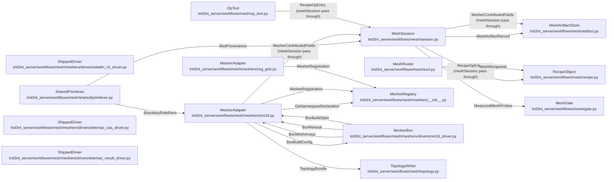

# MeshSeam - derived view

GENERATED from `docs/model/mesh-seam.sysml` by `scripts/model_check.py --view`. Never hand-edited: regenerate it, and `tests/test_model_conformance.py` fails while it is stale.

Plane: **workflow**. System: **mesher**. One seam of the system of systems indexed by [`README.md`](README.md) - never the whole picture.

## Blocks and flows

## Interface items

### `BedProvenance`

What ACTUALLY painted the bed, carried back on the mesh so the journal and the artifact can both say it: the ladder rung that served, never the row the recipe asked for. A reader downstream tells coarse global relief from surveyed topobathy by this and nothing else. ``bed_fallback_note`` is the narration a SUBSTITUTION carried, so a bed painted from the row that was asked for states none.

| item | type | required |
| --- | --- | --- |
| `bed_source` | String | required |
| `bed_fallback_note` | String | optional |
| `synthetic_inputs` | RowList | required |

### `BoundaryRoleRuns`

Which boundary nodes carry which role, and how many contiguous RUNS each role landed as. The count is the number the solver's own liquid-boundary numbering has to agree with: a role declared across two sections is two boundaries, and a role that could name only one face made the second mouth a wall.

| item | type | required |
| --- | --- | --- |
| `boundary_roles` | RoleMap | required |
| `boundary_role_runs` | CountMap | required |

### `BoxBuildConfig`

The whole ask the box is handed: the domain to cut from, the edge band in metres, the numbers that make a rebuild reproduce, and the ops as data. Exactly one domain is stated - a shoreline to cut the water side from, or a polygon to mesh the interior of. The op names travel VERBATIM and the driver calls them verbatim: their kwargs bind in the box, against the real signature, because the library is installed only where this process cannot import it.

| item | type | required |
| --- | --- | --- |
| `bbox` | RealList | required |
| `min_edge_length_m` | Real | required |
| `max_edge_length_m` | Real | required |
| `seed` | Integer | required |
| `max_iter` | Integer | required |
| `pre_ops` | OpList | required |
| `post_ops` | OpList | required |
| `shoreline_shp` | FileName | optional |
| `domain_geojson` | FileName | optional |

### `BoxBuildStats`

What the box MEASURED about its own build, which nothing on this side can recompute: how far the rim ran from the ask, which library version ran, which sizing functions were actually active, and what its clean passes had to say.

| item | type | required |
| --- | --- | --- |
| `rim_edge_length_m` | Band | required |
| `engine` | String | required |
| `sizing_functions` | StringList | required |
| `clean_notes` | StringList | required |

### `BoxMeshArrays`

What the box built, as arrays: the nodes in lon/lat, the 0-based triangles, and the outline vertices the generator was constrained to. ``pfix`` comes back so the conformal offset is measured against the points the box actually locked rather than the ones the ask named.

| item | type | required |
| --- | --- | --- |
| `points` | RealArray | required |
| `cells` | IntTable | required |
| `pfix` | RealArray | required |

### `BoxRefusal`

The box refusing in its own words. The refusals about the DOMAIN are only knowable where the library is, so they come back as a document and reach the caller as a typed refusal rather than as a return code wrapped in a stack trace - carrying, where there is one, the call that DOES what the refused ask could not.

| item | type | required |
| --- | --- | --- |
| `code` | String | required |
| `message` | String | required |
| `escalation` | Map | optional |

### `MeasuredMeshProbes`

The numeric facts a human or an agent judges the mesh on, measured on the topology that EXISTS rather than quoted back off the ask. A mesh whose cells the engine realizes says so and reports no edge or angle, which is the honest answer rather than a zero.

| item | type | required |
| --- | --- | --- |
| `node_count` | Integer | required |
| `element_count` | Integer | required |
| `crs_authid` | String | required |
| `has_bed` | Boolean | required |
| `edge_length_m` | Band | required |
| `min_angle_deg` | Real | required |
| `boundary_edges` | Integer | required |
| `boundary_loops` | Integer | required |
| `cells_realized_by_engine` | Boolean | optional |
| `ops` | StringList | required |

### `MeshArtifactRecord`

The accepted mesh's record - what a run needs to decide "can I solve on this?" and, once accepted, to point a solver at it. The RECIPE is frozen into ``provenance``, which is what makes the artifact replayable rather than merely described.

| item | type | required |
| --- | --- | --- |
| `mesh_id` | String | required |
| `name` | String | required |
| `mode` | String | required |
| `display_uri` | Uri | required |
| `crs_authid` | String | required |
| `has_bathymetry` | Boolean | required |
| `node_count` | Integer | required |
| `element_count` | Integer | required |
| `bbox` | RealList | required |
| `probes` | Map | required |
| `provenance` | Map | required |
| `utm_epsg` | Integer | optional |
| `recipe_uri` | Uri | optional |
| `case_id` | String | optional |

### `MeshRecipeAsk`

THE RECIPE: three mesher-agnostic params - the domain, the one size word, the shape - plus the ordered ops list that is the program. Engine vocabulary is never a param of the generalization, so a bed and a boundary role are entries in ``ops`` and nothing here. ``extent`` and ``resolution_m`` are optional because a declared ask carries a late-bound read until the interpreter binds it, and the mesher's own visible default answers for an ask that never states one.

| item | type | required |
| --- | --- | --- |
| `mesher` | String | required |
| `kind` | String | required |
| `extent` | Domain | optional |
| `resolution_m` | Real | optional |
| `ops` | OpList | required |

### `MesherContributedFields`

The artifact fields only the MESHER can state: the per-solver files it wrote from its own boundary numbering, and what it segmented that boundary into. They ride on the mesh's own meta and the session stages them without opinion, so it names none of them.

| item | type | required |
| --- | --- | --- |
| `slf_uri` | Uri | required |
| `cli_uri` | Uri | required |
| `topology_uri` | Uri | required |
| `open_boundary_info` | Map | required |

### `MesherRegistration`

What a mesher registers, and the whole of it. A new mesher is these three answers and no router grows; ``deterministic`` is a MEASURED claim about the library rather than a hope, so it is stated only where a measurement stands behind it.

| item | type | required |
| --- | --- | --- |
| `build` | Callable | required |
| `kinds` | StringList | required |
| `default_ops` | OpList | required |
| `namespaces` | NamespaceList | optional |
| `deterministic` | Boolean | optional |

### `OpNamespaceDeclaration`

A set of callables a recipe's ops may name, and WHEN they run. The phase is DERIVED from the namespace an op was registered in, so it is declared here and never by the caller. ``module`` is the real module when THIS process can import it - which is what lets the signature be the schema - and ``names`` is the declared roster for a library that lives where this process cannot import from. Exactly one of them is stated, so neither is required here.

| item | type | required |
| --- | --- | --- |
| `origin` | String | required |
| `phase` | String | required |
| `module` | Module | optional |
| `names` | StringList | optional |

### `RecipeOpEntry`

One entry of the ops list: a function NAME and its kwargs. The name is VERBATIM - the wrapped library's own spelling, or a primitive under its real def name - because an alias is a word that implies.

| item | type | required |
| --- | --- | --- |
| `fn` | String | required |
| `kwargs` | Map | required |

### `TopologyBundle`

The mesher's answers a SELAFIN cannot hold. A bundle naming no liquid boundary refuses, because a steering file cannot be authored against a boundary with no role on it.

| item | type | required |
| --- | --- | --- |
| `roles` | RoleMap | required |
| `liquid_boundary_order` | StringList | required |
| `liquid_boundary_prescribes` | StringList | required |

## Requirements

| requirement | satisfied by | verified by |
| --- | --- | --- |
| **BoundaryRolesAreContiguousRuns** | `sharedPrimitives`, `om2dAdapter` | `tests/test_mesh_topology_and_bed.py::test_a_scattered_candidate_boundary_resolves_into_two_contiguous_runs` `tests/test_mesh_topology_and_bed.py::test_a_run_that_wraps_the_contours_origin_stays_one_run` `tests/test_mesh_topology_and_bed.py::test_one_role_declared_across_two_faces_lands_as_two_sections` `tests/test_mesh_topology_and_bed.py::test_a_node_two_declared_faces_both_claim_refuses` `tests/test_mesh_topology_and_bed.py::test_a_face_the_mesh_never_reaches_refuses_rather_than_going_unprescribed` |
| **CorrectDataClassAtSetBed** | `sharedPrimitives` | `tests/test_mesh_topology_and_bed.py::test_the_bed_op_permits_no_ladder_rung_on_the_authors_behalf` `tests/test_mesh_topology_and_bed.py::test_a_source_naming_nothing_refuses_rather_than_leaving_a_bedless_mesh` `tests/test_mesh_topology_and_bed.py::test_a_conditioning_this_primitive_does_not_perform_refuses` `tests/test_mesh_topology_and_bed.py::test_the_interpolation_is_a_visible_default_off_a_declared_roster` `tests/test_mesh_topology_and_bed.py::test_the_journal_names_the_rung_that_ACTUALLY_painted_the_bed` |
| **ModelShrinksWithTheTree** | `om2dAdapter`, `regGridAdapter`, `om2dBox` | `tests/test_mesh_meshers.py::test_the_roster_is_the_meshers_the_tree_carries` `tests/test_mesh_om2d.py::test_the_roster_is_the_two_meshers_and_nothing_else` `tests/test_model_conformance.py::test_the_model_conforms_to_the_tree` |
| **RecipeIsTheOneMeshDefiningObject** | `recipeObject`, `meshRouter`, `meshSession` | `tests/test_build_mesh_tool.py::test_a_recipe_builds_nothing` `tests/test_build_mesh_tool.py::test_editing_a_recipe_returns_a_new_frozen_one` `tests/test_build_mesh_tool.py::test_engine_vocabulary_is_not_a_param_of_the_generalization` `tests/test_build_mesh_tool.py::test_accept_freezes_the_recipe_as_the_artifacts_provenance` `tests/test_mesh_declaration_travel.py::test_the_mesh_step_carries_the_recipe_whole` |
| **RegenerationIsWholesale** | `meshSession`, `opTool` | `tests/test_build_mesh_tool.py::test_the_same_recipe_builds_the_same_mesh_twice` `tests/test_build_mesh_tool.py::test_reset_puts_the_recipe_back_to_the_declaration` `tests/test_build_mesh_tool.py::test_the_journal_replays_to_an_identical_mesh` `tests/test_build_mesh_tool.py::test_a_recipe_edit_after_a_hand_edit_refuses_rather_than_discarding_it` `tests/test_mesh_gate_loop.py::test_mesh_op_appends_regenerates_and_re_presents` |
| **SignatureIsTheSchema** | `mesherRegistry`, `om2dAdapter` | `tests/test_mesh_meshers.py::test_an_op_a_mesher_never_registered_is_refused_by_name` `tests/test_mesh_om2d.py::test_an_unknown_op_refuses_with_the_nearest_names` `tests/test_mesh_om2d.py::test_the_wrapper_registers_the_librarys_own_names_tagged_by_phase` `tests/test_mesh_om2d.py::test_a_library_op_records_the_note_that_its_kwargs_bound_elsewhere` `tests/test_mesh_om2d.py::test_a_required_parameter_the_domain_cannot_supply_refuses_by_name` |
| **TheBoxNeverImportsTheServer** | `om2dBox`, `selafinCliDriver`, `telemacCasDriver`, `telemacResultDriver` | `tests/test_model_conformance.py::test_the_model_conforms_to_the_tree` `tests/test_mesh_om2d.py::test_the_drivers_live_in_the_product_tree_beside_their_callers` |
| **TheMeshFrontIsEngineAgnostic** | `meshRouter`, `meshGate`, `mesherRegistry` | `tests/test_model_conformance.py::test_the_model_conforms_to_the_tree` `tests/test_mesh_gate_loop.py::test_no_mesher_has_card_code_of_its_own` `tests/test_build_mesh_tool.py::test_reg_grid_conforms_with_a_near_empty_default_recipe` |

## What each requirement says

- **BoundaryRolesAreContiguousRuns** - A role is a RUN, not a node set: a liquid boundary is numbered by walking the boundary, so a scatter of nodes near a face is not a boundary. One role may land several runs - a two-mouth estuary has one open boundary in two sections - and a node two faces both claim refuses, because it carries one boundary condition and picking silently would put a flowrate on a stretch meant to hold at a level.
- **CorrectDataClassAtSetBed** - A bed is TOPOBATHY, and the primitive takes the data class it is defined over. Acquiring that class is the DATA row's problem: no ladder rung is permitted here on the author's behalf, because a rung this op allowed would be a cross-dataset bed nobody wrote down. A domain the primary does not cover refuses in the fetcher's own words, and what ACTUALLY painted the bed rides back rather than what was asked for.
- **ModelShrinksWithTheTree** - A removal deletes the component's model elements - blocks, hops, items, verifies - in the SAME commit. A modeled element whose module or test is gone fails the checker loudly for exactly one commit's worth of attention, and that loud moment IS the guidance; it is never a preservation order. The meshers are where this bites: a library that leaves takes its block, its hops and its verifies with it, and the roster the tree carries is the roster the model states.
- **RecipeIsTheOneMeshDefiningObject** - A mesh is not a spec plus a history of edits: it is the current PROGRAM that produces it. There is no record object and no edit chain - the journal is audit, undo is editing the recipe back, and the one structured revert is reset-to-declaration. The recipe is a VALUE, so it reaches for nothing that holds it: a recipe that could see its session or its gate would be state with a program beside it, which is the shape this law replaced.
- **RegenerationIsWholesale** - Every change swaps the recipe and rebuilds the WHOLE mesh. Nothing is patched incrementally, because a mesh patched from a program that no longer describes it is a mesh nobody can rebuild. The one thing no recipe produces - a hand-edit - is adopted and FLAGGED rather than pretended into the recipe, and a later recipe edit refuses instead of discarding it.
- **SignatureIsTheSchema** - An op's name must exist in the registering mesher's namespaces and its kwargs must bind to the REAL callable's signature. There is no schema of ours beside the library's: a function this process cannot import has no signature to bind against here, so it passes through with a journaled note and the driver that runs it binds against the real one. An unknown name is refused with the nearest matches rather than ignored.
- **TheBoxNeverImportsTheServer** - The mesh library runs in a GPL-isolated image with no network and nothing of this server in it. A driver that reached into the server package would be running our defaults, our fetches and our opinions inside a box whose whole point is that it holds only the library. The rule is written over the DIRECTORY every shipped driver lives in, so it holds for the engine drivers beside the mesh box for the same reason: each one is executed inside an image where nothing of this server exists to import.
- **TheMeshFrontIsEngineAgnostic** - A mesh is a mesh. The three params every mesher means the same thing by are the whole of the generalization, and an engine's vocabulary enters only as an op. A mesh module that imported an engine's workflows would be a second place a mesh gets built, and the mesh a human approved and the mesh a solver ran on would be two objects that happen to agree.
