# SolveSeam - derived view

GENERATED from `docs/model/solve-seam.sysml` by `scripts/model_check.py --view`. Never hand-edited: regenerate it, and `tests/test_model_conformance.py` fails while it is stale.

Plane: **workflow**. System: **assembler -> solver -> products**. One seam of the system of systems indexed by [`README.md`](README.md) - never the whole picture.

## Blocks and flows

```mermaid
flowchart LR
    assembler["Assembler<br/>trid3nt_server/workflows/telemac/authoring/assembler.py"]
    diagnosticsReader["DiagnosticsReader<br/>trid3nt_server/workflows/solver/diagnostics/telemac.py"]
    launcherArm["LauncherArm<br/>trid3nt_server/workflows/telemac/run_telemac.py"]
    manifestStager["ManifestStager<br/>trid3nt_server/workflows/telemac/authoring/open_water.py"]
    meshAcceptance["MeshAcceptance<br/>trid3nt_server/workflows/mesh/step.py"]
    packetAssembler["PacketAssembler<br/>scripts/assemble_proof_packet.py"]
    resultPostprocess["ResultPostprocess<br/>trid3nt_server/workflows/telemac/products/postprocess_telemac.py"]
    resultReader["ResultReader<br/>trid3nt_server/workflows/telemac/result_reader.py"]
    runReader["RunReader<br/>trid3nt_server/workflows/telemac/products/run_reads.py"]
    solveStep["SolveStep<br/>trid3nt_server/workflows/telemac/solving/solve.py"]
    steeringStatements["SteeringAuthor<br/>trid3nt_server/workflows/telemac/authoring/author.py"]
    supervisor["Supervisor<br/>trid3nt_server/workflows/solver/solver.py"]
    telapyChild["TelapyChild<br/>workers/telemac/entrypoint.py"]
    topologyWriter["TopologyWriter<br/>trid3nt_server/workflows/mesh/topology.py"]
    workerEntrypoint["WorkerEntrypoint<br/>workers/telemac/entrypoint.py"]
    assembler -- "ManifestCaseSection" --> manifestStager
    manifestStager -- "ManifestCaseSection" --> workerEntrypoint
    supervisor -- "FrameCountCrossCheck (supervisor pass through)" --> packetAssembler
    supervisor -- "FoldedRunPhysics (supervisor pass through)" --> diagnosticsReader
    launcherArm -- "FoldedRunPhysics (supervisor pass through)" --> supervisor
    supervisor -- "RunTerminalSignal" --> solveStep
    resultReader -- "SolvedResultFields" --> resultPostprocess
    launcherArm -- "FrameCountCrossCheck (supervisor pass through)" --> supervisor
    workerEntrypoint -- "SolverListing" --> diagnosticsReader
    telapyChild -- "SolverListing" --> workerEntrypoint
    meshAcceptance -- "AcceptedMeshRecord" --> assembler
    workerEntrypoint -- "WorkerRunReport" --> launcherArm
    workerEntrypoint -- "ServerFacts (workerEntrypoint pass through)" --> launcherArm
    assembler -- "ServerFacts (workerEntrypoint pass through)" --> workerEntrypoint
    topologyWriter -- "TopologyBundle" --> assembler
```

## Interface items

### `AcceptedMeshRecord`

The recipe-frozen artifact's fields the authoring consumes. The granularity the run records is the one the ACCEPTED mesh was built at, measured on its own cells - never the edge that was asked for.

| item | type | required |
| --- | --- | --- |
| `artifact` | MeshArtifact | required |
| `mesh_id` | String | required |
| `slf_uri` | Uri | required |
| `cli_uri` | Uri | required |
| `topology_uri` | Uri | required |
| `display_uri` | Uri | required |
| `node_count` | Integer | required |
| `element_count` | Integer | required |
| `min_edge_m` | Real | required |
| `provenance` | Map | required |

### `FoldedRunPhysics`

The declared metrics subset the launcher arm folds into the run's completion, so the diagnostics face carries the physics without a second object read. The failure path adds the listing excerpt, which is the only listing a reader has when the run died before its listing file was uploaded. It is optional because a run that reached a correct end carries no tail.

| item | type | required |
| --- | --- | --- |
| `correct_end` | Boolean | required |
| `wall_s` | Real | required |
| `listing_tail` | String | optional |

### `FrameCountCrossCheck`

The frame count the worker recorded, beside the file it measured it on, so the packet can open that file and disagree. One reader is never the only reader of a number a delivery rests on. The disagreement is only worth having between INDEPENDENT readers, so the packet's own count is header arithmetic over a range read rather than the engine's reader over a full download. That independence is the exception NoSecondParserOfTheFormat's scope carves out: a cross-check sharing the reader it checks would only agree with itself.

| item | type | required |
| --- | --- | --- |
| `result_slf` | FileName | required |
| `ntimestep` | Integer | required |

### `ManifestCaseSection`

The CASE a worker runs: which engine, which steering file it reads, and which files must exist for the run to have happened. The section key is what the entrypoint dispatches on, and the strict gate refuses any key outside this list.

| item | type | required |
| --- | --- | --- |
| `module` | String | required |
| `steering` | FileName | required |
| `results` | FileNameList | required |
| `server_facts` | ServerFactsMap | required |
| `user_fortran` | DirName | optional |
| `coupling` | String | optional |
| `continue_from` | FileName | optional |

### `RunTerminalSignal`

The terminal object the poller is waiting on. The supervisor writes it whatever the container did, and it is the run's identity and verdict - never its physics.

| item | type | required |
| --- | --- | --- |
| `run_id` | String | required |
| `status` | String | required |

### `ServerFacts`

What the SERVER already knows and the container cannot learn from the files it is handed. The worker copies it into its report VERBATIM: a fact re-derived in the container is a second answer free to disagree with the first.

| item | type | required |
| --- | --- | --- |
| `utm_epsg` | Integer | required |
| `bbox` | RealList | required |
| `npoin` | Integer | required |
| `nelem` | Integer | required |
| `mesh_size_m` | Real | required |
| `bed_source` | String | required |
| `result_slf` | FileName | required |

### `SolvedResultFields`

What the engine's reader says a solved result holds: the mesh it was computed on, the instants it was written at, and one field per variable shaped (frames, nodes). The variable names are the engine's OWN names, with no unit glued to them - the record stores the two together and splitting them is the format knowledge that stays on the engine's side. The origins are REPORTED and not applied, and this hop does not require them: the coordinates stay as the file stores them, and every postprocess adds the origin it recovered from the domain bbox, so applying the header's would double the offset on all of them.

| item | type | required |
| --- | --- | --- |
| `varnames` | StringList | required |
| `npoin` | Integer | required |
| `nelem` | Integer | required |
| `x` | RealArray | required |
| `y` | RealArray | required |
| `ikle` | IntTable | required |
| `x_origin` | Integer | optional |
| `y_origin` | Integer | optional |
| `times` | RealArray | required |
| `data` | FieldMap | required |

### `SolverListing`

The solver's own listing, teed off the child's stdout. It is the run's evidence: every closure a run narrates is parsed out of it rather than recomputed from the fields.

| item | type | required |
| --- | --- | --- |
| `full_listing` | FileName | required |

### `TopologyBundle`

The mesher's answers a SELAFIN cannot hold. A bundle naming no liquid boundary refuses, because a steering file cannot be authored against a boundary with no role on it, and one stating no prescription per boundary refuses too: it was numbered before the numbering was the engine's own.

| item | type | required |
| --- | --- | --- |
| `roles` | RoleMap | required |
| `liquid_boundary_order` | StringList | required |
| `liquid_boundary_prescribes` | StringList | required |

### `WorkerRunReport`

The run's only report, written whatever the child did. Success is not the worker's word for it: the launcher's classifier reads the CORRECT-END flag and the exit code together, so the report states what happened and the server states what it means.

| item | type | required |
| --- | --- | --- |
| `correct_end` | Boolean | required |
| `run_id` | String | required |
| `module` | String | required |
| `wall_s` | Real | required |
| `error` | String | optional |
| `error_code` | String | optional |

## Requirements

| requirement | satisfied by | verified by |
| --- | --- | --- |
| **BoundaryCodesMatchTheSteering** | `topologyWriter`, `assembler`, `steeringStatements` | `tests/test_telemac_boundary_contract.py::test_flipping_the_strategy_moves_the_quad_and_the_keyword_together` `tests/test_telemac_boundary_contract.py::test_the_engine_numbers_from_its_own_south_west_corner_not_from_row_order` `tests/test_telemac_boundary_contract.py::test_a_liquid_run_that_straddles_the_first_row_is_ONE_boundary` `tests/test_telemac_boundary_contract.py::test_the_run_prescribes_at_the_number_whose_quad_reads_it` `tests/test_telemac_boundary_contract.py::test_a_boundary_whose_quad_prescribes_nothing_refuses_rather_than_writing` `tests/test_telemac_boundary_contract.py::test_the_free_exit_role_prescribes_nothing_as_a_stated_choice` `tests/test_mesh_topology_and_bed.py::test_a_bundle_that_states_no_prescription_per_boundary_refuses` |
| **CorrectEndIsTheSuccessConvention** | `workerEntrypoint`, `launcherArm` | `workers/telemac/test_entrypoint.py::test_a_clean_exit_that_wrote_no_result_is_not_a_solve` `tests/test_run_telemac_chain.py::test_classify_exit_clean_exit_but_no_correct_end_is_error` |
| **EmptyResultsRefuses** | `workerEntrypoint` | `workers/telemac/test_entrypoint.py::test_a_case_declaring_no_results_refuses` |
| **MetricsAlways** | `workerEntrypoint` | `workers/telemac/test_entrypoint.py::test_a_child_that_dies_still_leaves_the_metrics_written` |
| **NoSecondParserOfTheFormat** | `resultReader`, `resultPostprocess`, `runReader`, `assembler` | `tests/test_telemac_result_reader.py::test_no_reader_on_this_side_parses_the_format` `tests/test_model_conformance.py::test_the_model_conforms_to_the_tree` |
| **OutflowStageIsNormalDepth** | `steeringStatements`, `assembler` | `tests/test_telemac_outflow_stage.py::test_the_stage_is_the_depth_at_which_the_section_conveys_the_discharge` `tests/test_telemac_outflow_stage.py::test_the_friction_slope_is_the_measured_fall_over_the_measured_length` `tests/test_telemac_outflow_stage.py::test_the_outflow_face_is_measured_as_a_transect_of_the_painted_bed` `tests/test_telemac_outflow_stage.py::test_the_reach_length_is_walked_along_the_line_the_mesh_was_built_over` `tests/test_telemac_outflow_stage.py::test_a_bigger_discharge_stands_higher_in_the_same_channel` `tests/test_telemac_outflow_stage.py::test_strickler_and_its_reciprocal_manning_derive_the_same_stage` `tests/test_telemac_outflow_stage.py::test_an_input_the_stage_cannot_be_derived_from_refuses_by_name` `tests/test_telemac_outflow_stage.py::test_the_run_states_the_stage_and_every_input_it_was_derived_from` `tests/test_telemac_outflow_stage.py::test_the_run_starts_at_the_depth_its_own_outflow_stage_is_derived_as` `tests/test_telemac_outflow_stage.py::test_the_start_is_bed_parallel_rather_than_level_with_the_outlet` `tests/test_telemac_outflow_stage.py::test_a_different_friction_slope_moves_the_start_and_the_boundary_together` `tests/test_telemac_outflow_stage.py::test_the_stage_is_derived_at_the_roughness_the_run_goes_on_to_write` |
| **ReadersNeverImportTheWorker** | `runReader`, `diagnosticsReader` | `tests/test_model_conformance.py::test_the_model_conforms_to_the_tree` |
| **ServerFactsDoctrine** | `assembler`, `workerEntrypoint` | `workers/telemac/test_entrypoint.py::test_a_clean_child_that_wrote_its_results_is_the_run_succeeding` `workers/telemac/test_entrypoint.py::test_the_frame_count_is_measured_off_the_file_the_facts_name` `workers/telemac/test_entrypoint.py::test_an_unreadable_result_leaves_ntimestep_ABSENT_not_zero` |
| **SolveTimeoutTypesNotHangs** | `workerEntrypoint` | `workers/telemac/test_entrypoint.py::test_the_solve_bound_defaults_to_a_day_and_the_knob_states_it` `workers/telemac/test_entrypoint.py::test_a_child_that_outruns_the_bound_is_killed_and_still_reports` |
| **StrictGateRefusesUnknownFields** | `workerEntrypoint` | `workers/telemac/test_entrypoint.py::test_the_gate_refuses_an_unknown_key_and_names_the_parser` `workers/telemac/test_entrypoint.py::test_a_case_with_an_unknown_field_refuses` |
| **WorkersNeverImportServer** | `workerEntrypoint`, `telapyChild` | `tests/test_model_conformance.py::test_the_model_conforms_to_the_tree` |

## What each requirement says

- **BoundaryCodesMatchTheSteering** - A TELEMAC boundary states itself TWICE - as a (LIHBOR, LIUBOR, LIVBOR, LITBOR) quad on every node of its face in the boundary file, and as a value at its own number in PRESCRIBED FLOWRATES or PRESCRIBED ELEVATIONS in the steering file - and the engine reads the second only where the first says to. bord.f consumes an elevation under LIHBOR = KENT and a flowrate under LIUBOR = KENT, and nowhere else, so two files decided apart disagree in SILENCE: the number is written, never read, and the face runs on what its code alone means. ONE decision therefore owns both. The role-to-quad table in the pair writer is that decision; the quad lands in the boundary file and the steering keyword is derived from the SAME quad, carried to the author on the topology bundle. Flipping the table moves both files together. The table's FREE-EXIT row is the case where prescribing nothing is a stated answer rather than a gap: an all-KSORT quad leaves bord.f overriding neither the depth nor the velocity, so the water leaves at whatever the interior brings to the face. The steering file then writes no value there and says which number it is declining to write at. A quad that prescribes nothing under ANY OTHER role still refuses: the same word then means the two files were decided apart, and a value written into a list the engine does not read is the silence this contract exists to end. The row is vocabulary, not a recommendation, and it has no live caller. A free exit is well-posed only while the normal velocity LEAVES: propin_telemac2d.f refuses a free velocity whose normal component enters (ILL-POSED PROBLEM, ENTERING FREE VELOCITY), and a rain-fed catchment outlet reverses. Measured on the Coweeta design storm: 14 such warnings, +29,425 m3/s injected through the outlet in one printout, a domain taken from 1.90e6 to 1.50e7 m3 against a 4.41e6 m3 storm, 68.63 m depths and a runoff volume of zero - with CORRECT END OF RUN and continuity at 1e-15, because the engine conserved exactly what it wrongly did. The catchment outlet therefore keeps the prescribed-level quad, and the recipe that paints it names the zero-depth clamp that quad becomes when no value is written at its number. Which fact a subcritical outlet takes from outside - a derived stage, a stage-discharge curve - is a physics decision this model records as owed rather than as taken. The number a value is written AT is the other half of the same contract, and it is measured by the engine's own rule (bief/front2.f): each contour is walked from the south-westernmost boundary point, a segment is solid when either end is, and the run straddling that start folds back into one boundary. Numbering from file-row order agreed only by luck. On a reach whose inflow face holds the domain's south-west corner the two disagreed, and the run then stated its level at the inflow's number and its flowrate at the outflow's: the inflow supplied nothing, the outflow was clamped to elevation zero, and the run drained its initial condition while both prescribed numbers sat unread. That run reported CORRECT END OF RUN, which is why this is a modeled contract and not a comment.
- **CorrectEndIsTheSuccessConvention** - Success is a clean child exit AND every declared result file on disk. A solver that returns zero without writing its result has not solved anything, and the exit code alone never decides it - on either side of the seam.
- **EmptyResultsRefuses** - A case declaring no results collapses the success convention back to the exit code alone, which is the convention this seam retired. It refuses instead.
- **MetricsAlways** - The run report is written whatever the child does. A Fortran STOP kills the process it runs in, and the report is the only channel the server has for reading what went wrong, so the write outlives the solve.
- **NoSecondParserOfTheFormat** - A result file's byte layout is the engine's to know. The parser this side used to carry was wrong about it twice: it refused a truncated result the engine reads without complaint, and it handed every consumer a variable name with the record's unit still glued on. SCOPE: the FIELD DATA a delivery renders. One reader of the format's fields - the engine's own, inside the image that wrote them - and no second parser of fields anywhere. The packet's frame count is outside that scope and stays hand-rolled header arithmetic by design: it is the independent reader FrameCountCrossCheck exists to disagree with the worker's number, and converting it would make the cross-check agree with itself.
- **OutflowStageIsNormalDepth** - SIGNED DECISION - the reach run's outflow stage is the NORMAL DEPTH for the discharge the same run prescribes (bathymetry methodology M4, signed 2026-09-02), replacing the outflow bed plus a declared 2 m. Under the HAPPY PATH FIRST, SYNTHETIC DEFERRED amendment this is the whole of the Producer stage: it produces no bathymetry, it computes a level over bathymetry already measured, which is why it stands while the synthetic producer does not. The four inputs are the run's own. The friction slope is the fall the accepted mesh carries between its two role faces, over the length of the line that mesh was built on. The channel is the transect the outflow face cuts through the painted bed, read in boundary-walk order so the face is a section rather than a scatter. The roughness is the coefficient this run goes on to write, under the law it goes on to write. The discharge is the one it prescribes upstream. Nothing external enters - no gauge, no rating curve, no second vertical datum - which is what makes the stage internally consistent with whatever bed the ladder delivered, and is the published reason it is the community default when the bed came off a surface rather than a survey. The value it replaced was not a property of the reach: 2 m was the same number on a mountain creek and a coastal plain river, on the one boundary the run's entire water surface is anchored to. The SAME derivation is now also what a fresh run STARTS from: the normal DEPTH, laid bed-parallel, which is the uniform-flow surface the outflow stage is the downstream end of - so the initial free surface and the prescribed outflow agree by construction and the reach opens at its own equilibrium. ``init_depth_m`` had no role left once that followed: a blanket 2 m start drained into the derived boundary over the first minutes of every horizon, which was a transient the run had to spend before it was answering the question it was asked. Bed-parallel, and NOT a constant elevation at the stage. The stage is derived only where the reach falls - the derivation refuses a reach that does not - so a horizontal surface at the outlet's level leaves every node above it dry, the prescribed-flowrate face among them, and the engine refuses a discharge it has no water to impose (DEBIMP: PROBLEM ON BOUNDARY NUMBER). Measured on the flagship coarse reach: 14 of 907 nodes wet, exit code 2. The two statements carry the same number and only one of them is a river. Spin-up as REFINED-run behaviour is a separate, later choice; this is the fresh-run start. Uniform flow is a numerically convenient fiction rather than a measured boundary, so every input it cannot measure REFUSES by name: a reach with no measured fall, an outflow face with no painted section, a friction law whose coefficient no conveyance reads, a discharge or roughness that is not positive. Defaulting past any of them would put an underived level back on that boundary with nothing saying so.
- **ReadersNeverImportTheWorker** - What a solved run says is read from the artifacts the supervisor uploaded. A reader importing worker code is a second computation of the same quantity, running outside the image that produced it.
- **ServerFactsDoctrine** - Server-known facts are stated by the server, copied by the worker VERBATIM, and never re-derived in the container. Worker-measured facts are the worker's own: the frame count is measured off the file the server facts name, and an unmeasurable result is the ABSENCE of the key rather than a zero.
- **SolveTimeoutTypesNotHangs** - A wedged solver is a typed report, not a container that never exits. The bound is stated by an environment knob, and an expiry names that knob in the error it writes.
- **StrictGateRefusesUnknownFields** - A dropped key silently no-ops the knob the caller meant to set. The gate refuses instead, and names the parser stamp so a stale image reads as a drifted version rather than as a knob that did nothing.
- **WorkersNeverImportServer** - The container is the engine room: a worker that reaches into the server package has an opinion, a default or a fetch in it.
