# SolveSeam - derived view

GENERATED from `docs/model/solve-seam.sysml` by `scripts/model_check.py --view`. Never hand-edited: regenerate it, and `tests/test_model_conformance.py` fails while it is stale.

## Blocks and flows

```mermaid
flowchart LR
    deckAuthor["DeckAuthor<br/>trid3nt_server/workflows/telemac/steps/deck.py"]
    diagnosticsReader["DiagnosticsReader<br/>trid3nt_server/workflows/solver/diagnostics/telemac.py"]
    launcherArm["LauncherArm<br/>trid3nt_server/workflows/telemac/run_telemac.py"]
    manifestStager["ManifestStager<br/>trid3nt_server/workflows/telemac/steps/open_water.py"]
    meshAcceptance["MeshAcceptance<br/>trid3nt_server/workflows/mesh/step.py"]
    packetAssembler["PacketAssembler<br/>scripts/assemble_proof_packet.py"]
    rainDeckAuthor["DeckAuthor<br/>trid3nt_server/workflows/telemac/steps/rain_on_grid.py"]
    resultPostprocess["ResultPostprocess<br/>trid3nt_server/workflows/telemac/postprocess_telemac.py"]
    resultReader["ResultReader<br/>trid3nt_server/workflows/telemac/result_reader.py"]
    runReader["RunReader<br/>trid3nt_server/workflows/telemac/steps/run_reads.py"]
    solveStep["SolveStep<br/>trid3nt_server/workflows/telemac/steps/solve.py"]
    supervisor["Supervisor<br/>trid3nt_server/workflows/solver/solver.py"]
    telapyChild["TelapyChild<br/>workers/telemac/entrypoint.py"]
    topologyWriter["TopologyWriter<br/>trid3nt_server/workflows/mesh/topology.py"]
    workerEntrypoint["WorkerEntrypoint<br/>workers/telemac/entrypoint.py"]
    deckAuthor -- "ManifestCaseSection" --> manifestStager
    manifestStager -- "ManifestCaseSection" --> workerEntrypoint
    supervisor -- "FrameCountCrossCheck (supervisor pass through)" --> packetAssembler
    supervisor -- "FoldedRunPhysics (supervisor pass through)" --> diagnosticsReader
    launcherArm -- "FoldedRunPhysics (supervisor pass through)" --> supervisor
    supervisor -- "RunTerminalSignal" --> solveStep
    workerEntrypoint -- "CaseEcho (workerEntrypoint pass through)" --> launcherArm
    deckAuthor -- "CaseEcho (workerEntrypoint pass through)" --> workerEntrypoint
    resultReader -- "SolvedResultFields" --> resultPostprocess
    launcherArm -- "FrameCountCrossCheck (supervisor pass through)" --> supervisor
    workerEntrypoint -- "SolverListing" --> diagnosticsReader
    telapyChild -- "SolverListing" --> workerEntrypoint
    meshAcceptance -- "AcceptedMeshRecord" --> deckAuthor
    workerEntrypoint -- "WorkerRunReport" --> launcherArm
    rainDeckAuthor -- "ManifestCaseSection" --> manifestStager
    rainDeckAuthor -- "CaseEcho (workerEntrypoint pass through)" --> workerEntrypoint
    topologyWriter -- "TopologyBundle" --> rainDeckAuthor
    topologyWriter -- "TopologyBundle" --> deckAuthor
```

## Interface items

### `AcceptedMeshRecord`

The recipe-frozen artifact's fields the deck consumes. The granularity the deck records is the one the ACCEPTED mesh was built at, measured on its own cells - never the edge that was asked for.

| item | type | required |
| --- | --- | --- |
| `artifact` | MeshArtifact | required |
| `mesh_id` | String | required |
| `slf_uri` | Uri | required |
| `cli_uri` | Uri | required |
| `topology_uri` | Uri | required |
| `display_uri` | Uri | required |
| `node_count` | Integer | required |
| `element_count` | Integer | required |
| `min_edge_m` | Real | required |
| `provenance` | Map | required |

### `CaseEcho`

What the SERVER already knows and the container cannot learn from the files it is handed. The worker copies it into its report VERBATIM: a fact re-derived in the container is a second answer free to disagree with the first.

| item | type | required |
| --- | --- | --- |
| `utm_epsg` | Integer | required |
| `bbox` | RealList | required |
| `npoin` | Integer | required |
| `nelem` | Integer | required |
| `mesh_size_m` | Real | required |
| `bed_source` | String | required |
| `result_slf` | FileName | required |

### `FoldedRunPhysics`

The declared metrics subset the launcher arm folds into the run's completion, so the diagnostics face carries the physics without a second object read. The failure path adds the listing excerpt, which is the only listing a reader has when the run died before its listing file was uploaded. It is optional because a run that reached a correct end carries no tail.

| item | type | required |
| --- | --- | --- |
| `correct_end` | Boolean | required |
| `wall_s` | Real | required |
| `listing_tail` | String | optional |

### `FrameCountCrossCheck`

The frame count the worker recorded, beside the file it measured it on, so the packet can open that file and disagree. One reader is never the only reader of a number a delivery rests on. The disagreement is only worth having between INDEPENDENT readers, so the packet's own count is header arithmetic over a range read rather than the engine's reader over a full download. That independence is the exception NoSecondParserOfTheFormat's scope carves out: a cross-check sharing the reader it checks would only agree with itself.

| item | type | required |
| --- | --- | --- |
| `result_slf` | FileName | required |
| `ntimestep` | Integer | required |

### `ManifestCaseSection`

The CASE a worker runs: which engine, which deck it reads, and which files must exist for the run to have happened. The section key is what the entrypoint dispatches on, and the strict gate refuses any key outside this list.

| item | type | required |
| --- | --- | --- |
| `module` | String | required |
| `steering` | FileName | required |
| `results` | FileNameList | required |
| `family` | String | required |
| `echo` | EchoMap | required |
| `user_fortran` | DirName | optional |
| `coupling` | String | optional |
| `continue_from` | FileName | optional |

### `RunTerminalSignal`

The terminal object the poller is waiting on. The supervisor writes it whatever the container did, and it is the run's identity and verdict - never its physics.

| item | type | required |
| --- | --- | --- |
| `run_id` | String | required |
| `status` | String | required |

### `SolvedResultFields`

What the engine's reader says a solved result holds: the mesh it was computed on, the instants it was written at, and one field per variable shaped (frames, nodes). The variable names are the engine's OWN names, with no unit glued to them - the record stores the two together and splitting them is the format knowledge that stays on the engine's side. The origins are REPORTED and not applied, and this hop does not require them: the coordinates stay as the file stores them, and every postprocess adds the origin it recovered from the domain bbox, so applying the header's would double the offset on all of them.

| item | type | required |
| --- | --- | --- |
| `varnames` | StringList | required |
| `npoin` | Integer | required |
| `nelem` | Integer | required |
| `x` | RealArray | required |
| `y` | RealArray | required |
| `ikle` | IntTable | required |
| `x_origin` | Integer | optional |
| `y_origin` | Integer | optional |
| `times` | RealArray | required |
| `data` | FieldMap | required |

### `SolverListing`

The solver's own listing, teed off the child's stdout. It is the run's evidence: every closure a run narrates is parsed out of it rather than recomputed from the fields.

| item | type | required |
| --- | --- | --- |
| `full_listing` | FileName | required |

### `TopologyBundle`

The mesher's answers a SELAFIN cannot hold. A bundle naming no liquid boundary refuses, because a deck cannot be authored against a boundary with no role on it.

| item | type | required |
| --- | --- | --- |
| `roles` | RoleMap | required |
| `liquid_boundary_order` | StringList | required |

### `WorkerRunReport`

The run's only report, written whatever the child did. Success is not the worker's word for it: the launcher's classifier reads the CORRECT-END flag and the exit code together, so the report states what happened and the server states what it means.

| item | type | required |
| --- | --- | --- |
| `correct_end` | Boolean | required |
| `run_id` | String | required |
| `module` | String | required |
| `family` | String | required |
| `wall_s` | Real | required |
| `error` | String | optional |
| `error_code` | String | optional |

## Requirements

| requirement | satisfied by | verified by |
| --- | --- | --- |
| **CorrectEndIsTheSuccessConvention** | `workerEntrypoint`, `launcherArm` | `workers/telemac/test_entrypoint.py::test_a_clean_exit_that_wrote_no_result_is_not_a_solve` `tests/test_run_telemac_chain.py::test_classify_exit_clean_exit_but_no_correct_end_is_error` |
| **EchoDoctrine** | `deckAuthor`, `rainDeckAuthor`, `workerEntrypoint` | `workers/telemac/test_entrypoint.py::test_a_clean_child_that_wrote_its_results_is_the_run_succeeding` `workers/telemac/test_entrypoint.py::test_the_frame_count_is_measured_off_the_file_the_echo_names` `workers/telemac/test_entrypoint.py::test_an_unreadable_result_leaves_ntimestep_ABSENT_not_zero` |
| **EmptyResultsRefuses** | `workerEntrypoint` | `workers/telemac/test_entrypoint.py::test_a_case_declaring_no_results_refuses` |
| **MetricsAlways** | `workerEntrypoint` | `workers/telemac/test_entrypoint.py::test_a_child_that_dies_still_leaves_the_metrics_written` |
| **NoSecondParserOfTheFormat** | `resultReader`, `resultPostprocess`, `runReader`, `deckAuthor` | `tests/test_telemac_result_reader.py::test_no_reader_on_this_side_parses_the_format` `tests/test_model_conformance.py::test_the_model_conforms_to_the_tree` |
| **ReadersNeverImportTheWorker** | `runReader`, `diagnosticsReader` | `tests/test_model_conformance.py::test_the_model_conforms_to_the_tree` |
| **SolveTimeoutTypesNotHangs** | `workerEntrypoint` | `workers/telemac/test_entrypoint.py::test_the_solve_bound_defaults_to_a_day_and_the_knob_states_it` `workers/telemac/test_entrypoint.py::test_a_child_that_outruns_the_bound_is_killed_and_still_reports` |
| **StrictGateRefusesUnknownFields** | `workerEntrypoint` | `workers/telemac/test_entrypoint.py::test_the_gate_refuses_an_unknown_key_and_names_the_parser` `workers/telemac/test_entrypoint.py::test_a_case_with_an_unknown_field_refuses` |
| **WorkersNeverImportServer** | `workerEntrypoint`, `telapyChild` | `tests/test_model_conformance.py::test_the_model_conforms_to_the_tree` |

## What each requirement says

- **CorrectEndIsTheSuccessConvention** - Success is a clean child exit AND every declared result file on disk. A solver that returns zero without writing its result has not solved anything, and the exit code alone never decides it - on either side of the seam.
- **EchoDoctrine** - Server-known facts are stated by the deck, copied by the worker VERBATIM, and never re-derived in the container. Worker-measured facts are the worker's own: the frame count is measured off the file the echo names, and an unmeasurable result is the ABSENCE of the key rather than a zero.
- **EmptyResultsRefuses** - A case declaring no results collapses the success convention back to the exit code alone, which is the convention this seam retired. It refuses instead.
- **MetricsAlways** - The run report is written whatever the child does. A Fortran STOP kills the process it runs in, and the report is the only channel the server has for reading what went wrong, so the write outlives the solve.
- **NoSecondParserOfTheFormat** - A result file's byte layout is the engine's to know. The parser this side used to carry was wrong about it twice: it refused a truncated result the engine reads without complaint, and it handed every consumer a variable name with the record's unit still glued on. SCOPE: the FIELD DATA a delivery renders. One reader of the format's fields - the engine's own, inside the image that wrote them - and no second parser of fields anywhere. The packet's frame count is outside that scope and stays hand-rolled header arithmetic by design: it is the independent reader FrameCountCrossCheck exists to disagree with the worker's number, and converting it would make the cross-check agree with itself.
- **ReadersNeverImportTheWorker** - What a solved run says is read from the artifacts the supervisor uploaded. A reader importing worker code is a second computation of the same quantity, running outside the image that produced it.
- **SolveTimeoutTypesNotHangs** - A wedged solver is a typed report, not a container that never exits. The bound is stated by an environment knob, and an expiry names that knob in the error it writes.
- **StrictGateRefusesUnknownFields** - A dropped key silently no-ops the knob the caller meant to set. The gate refuses instead, and names the parser stamp so a stale image reads as a drifted version rather than as a knob that did nothing.
- **WorkersNeverImportServer** - The container is the engine room: a worker that reaches into the server package has an opinion, a default or a fetch in it.
