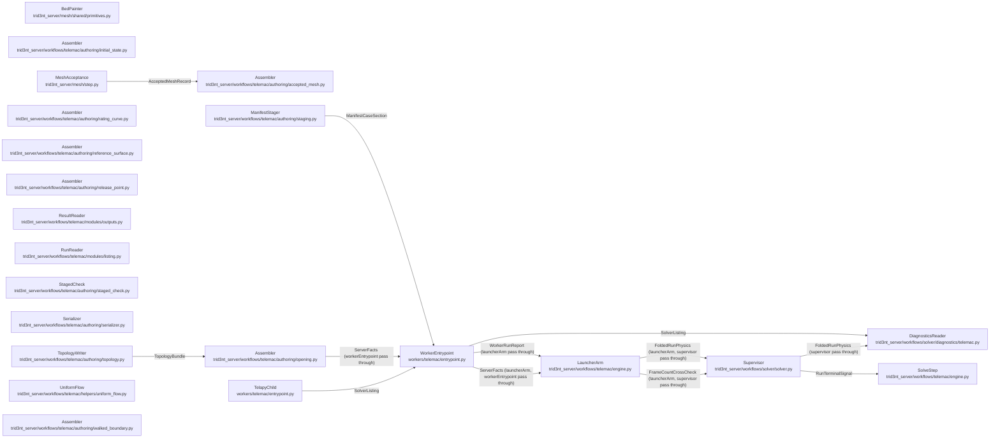

# SolveSeam - derived view

GENERATED from `docs/model/solve-seam.sysml` by `scripts/model_check.py --view`. Never hand-edited: regenerate it, and `tests/model/test_model_conformance.py` fails while it is stale.

Plane: **workflow**. System: **assembler -> solver -> products**. One seam of the system of systems indexed by [`README.md`](README.md) - never the whole picture.

## Blocks and flows

## Interface items

### `AcceptedMeshRecord`

The recipe-frozen artifact's fields the authoring consumes. The granularity the run records is the one the ACCEPTED mesh was built at, measured on its own cells - never the edge that was asked for.

| item | type | required |
| --- | --- | --- |
| `artifact` | MeshArtifact | required |
| `mesh_id` | String | required |
| `engine_files` | Map | required |
| `display_uri` | Uri | required |
| `node_count` | Integer | required |
| `element_count` | Integer | required |
| `min_edge_m` | Real | required |
| `provenance` | Map | required |

### `FoldedRunPhysics`

The declared metrics subset the launcher arm folds into the run's completion, so the diagnostics face carries the physics without a second object read. The failure path adds the listing excerpt, which is the only listing a reader has when the run died before its listing file was uploaded. It is optional because a run that reached a correct end carries no tail.

| item | type | required |
| --- | --- | --- |
| `correct_end` | Boolean | required |
| `wall_s` | Real | required |
| `listing_tail` | String | optional |

### `FrameCountCrossCheck`

The frame count the worker recorded, beside the file it measured it on, so the packet can open that file and disagree. One reader is never the only reader of a number a delivery rests on. The disagreement is only worth having between INDEPENDENT readers, so the packet's own count is header arithmetic over a range read rather than the engine's reader over a full download. That independence is the exception NoSecondParserOfTheFormat's scope carves out: a cross-check sharing the reader it checks would only agree with itself.

| item | type | required |
| --- | --- | --- |
| `result_slf` | FileName | required |
| `ntimestep` | Integer | required |

### `ManifestCaseSection`

The CASE a worker runs: which engine, which steering file it reads, and which files must exist for the run to have happened. The section key is what the entrypoint dispatches on, and the strict gate refuses any key outside this list.

| item | type | required |
| --- | --- | --- |
| `module` | String | required |
| `steering` | FileName | required |
| `results` | FileNameList | required |
| `server_facts` | ServerFactsMap | required |
| `user_fortran` | DirName | optional |
| `coupling` | String | optional |
| `continue_from` | FileName | optional |
| `cores` | Integer | optional |

### `RunTerminalSignal`

The terminal object the poller is waiting on. The supervisor writes it whatever the container did, and it is the run's identity and verdict - never its physics.

| item | type | required |
| --- | --- | --- |
| `run_id` | String | required |
| `status` | String | required |

### `ServerFacts`

What the SERVER already knows and the container cannot learn from the files it is handed. The worker copies it into its report VERBATIM: a fact re-derived in the container is a second answer free to disagree with the first.

| item | type | required |
| --- | --- | --- |
| `utm_epsg` | Integer | required |
| `bbox` | RealList | required |
| `npoin` | Integer | required |
| `nelem` | Integer | required |
| `mesh_size_m` | Real | required |
| `bed_source` | String | required |
| `result_slf` | FileName | required |

### `SolverListing`

The solver's own listing, teed off the child's stdout. It is the run's evidence: every closure a run narrates is parsed out of it rather than recomputed from the fields.

| item | type | required |
| --- | --- | --- |
| `full_listing` | FileName | required |

### `TopologyBundle`

What a SELAFIN cannot hold, measured off the accepted mesh's walk. A bundle naming no liquid boundary refuses, because a steering file cannot be authored against a boundary with no role on it, and one stating no prescription per boundary refuses too: it was numbered before the numbering was the engine's own.

| item | type | required |
| --- | --- | --- |
| `roles` | RoleMap | required |
| `liquid_boundary_order` | StringList | required |
| `liquid_boundary_prescribes` | StringList | required |

### `WorkerRunReport`

The run's only report, written whatever the child did. Success is not the worker's word for it: the launcher's classifier reads the CORRECT-END flag and the exit code together, so the report states what happened and the server states what it means.

| item | type | required |
| --- | --- | --- |
| `correct_end` | Boolean | required |
| `run_id` | String | required |
| `module` | String | required |
| `wall_s` | Real | required |
| `error` | String | optional |
| `error_code` | String | optional |

## Requirements

| requirement | satisfied by | verified by |
| --- | --- | --- |
| **AContinuationIsARerunLedgerRow** | `opening`, `initialState`, `workerEntrypoint` | `tests/runtime/test_rerun_with_overrides.py::test_the_cut_of_a_hot_start_is_the_step_that_opens_on_the_other_run` `tests/runtime/test_rerun_with_overrides.py::test_a_continuation_is_a_different_invocation_than_the_run_it_continues` `tests/runtime/test_rerun_with_overrides.py::test_a_run_with_no_solved_state_cannot_be_continued` `tests/runtime/test_rerun_with_overrides.py::test_the_record_of_a_continued_run_says_which_run_it_continued` `tests/telemac/test_telemac_reach_staged_inputs.py::test_a_continuation_is_a_rerun_row_and_no_template_declares_it` `tests/telemac/test_telemac_module_surface.py::test_a_continuation_names_the_file_and_nothing_else` |
| **ADredgeCutsOnlyWhatTheStockHolds** | `referenceSurface` | `tests/telemac/test_telemac_nestor_dredge.py::test_a_grade_the_bed_has_no_stock_to_reach_refuses_at_authoring` |
| **BoundaryCodesMatchTheSteering** | `topologyWriter`, `opening`, `steeringStatements` | `tests/telemac/test_telemac_boundary_contract.py::test_flipping_the_strategy_moves_the_quad_and_the_keyword_together` `tests/telemac/test_telemac_boundary_contract.py::test_the_engine_numbers_from_its_own_south_west_corner_not_from_row_order` `tests/telemac/test_telemac_boundary_contract.py::test_a_liquid_run_that_straddles_the_first_row_is_ONE_boundary` `tests/telemac/test_telemac_boundary_contract.py::test_the_run_prescribes_at_the_number_whose_quad_reads_it` `tests/telemac/test_telemac_boundary_contract.py::test_a_boundary_whose_quad_prescribes_nothing_refuses_rather_than_writing` `tests/telemac/test_telemac_boundary_contract.py::test_the_free_exit_role_prescribes_nothing_as_a_stated_choice` `tests/telemac/test_telemac_boundary_topology.py::test_a_walk_that_states_no_prescription_per_boundary_refuses` |
| **CatchmentOutletHoldsADerivedRatingCurve** | `ratingCurve`, `uniformFlow` | `tests/telemac/test_telemac_outflow_stage.py::test_the_rating_curve_starts_dry_and_ends_at_the_stated_ceiling` `tests/telemac/test_telemac_outflow_stage.py::test_the_curve_rises_monotonically_so_the_engine_can_interpolate_it` `tests/telemac/test_telemac_outflow_stage.py::test_every_point_is_the_normal_depth_the_reachs_own_stage_would_be` `tests/telemac/test_telemac_outflow_stage.py::test_the_curve_file_is_written_in_the_engines_own_block_format` `tests/telemac/test_telemac_outflow_stage.py::test_the_catchments_outlet_slope_is_the_bed_over_the_elements_it_touches` `tests/telemac/test_telemac_outflow_stage.py::test_a_flat_outlet_refuses_rather_than_holding_a_level_nobody_measured` `tests/telemac/test_telemac_outflow_stage.py::test_the_flow_range_is_the_gross_rain_rate_on_the_meshed_area` |
| **CorrectEndIsTheSuccessConvention** | `workerEntrypoint`, `launcherArm` | `workers/telemac/test_entrypoint.py::test_a_clean_exit_that_wrote_no_result_is_not_a_solve` `tests/telemac/test_telemac_engine.py::test_classify_exit_clean_exit_but_no_correct_end_is_error` |
| **EmptyResultsRefuses** | `workerEntrypoint` | `workers/telemac/test_entrypoint.py::test_a_case_declaring_no_results_refuses` |
| **EveryNodeCarriesAMeasuredBed** | `bedPainter` | `tests/mesh/test_bed_sources_and_runs.py::test_a_domain_no_source_covers_refuses_by_name` `tests/mesh/test_bed_sources_and_runs.py::test_the_bed_is_one_source_and_two_are_merged_before_the_op` `tests/inputs/test_bed_merge.py::test_the_primary_wins_where_it_measured_and_the_fallback_fills_the_rest` `tests/inputs/test_bed_merge.py::test_the_sidecar_says_which_input_painted_each_cell` `tests/inputs/test_bed_merge.py::test_two_datums_refuse_by_name` |
| **ExecutorKnowsNoEngine** | `supervisor`, `launcherArm` | `tests/solver/test_executor_import_graph.py::test_the_executor_imports_no_engine` `tests/model/test_model_conformance.py::test_the_model_conforms_to_the_tree` |
| **MetricsAlways** | `workerEntrypoint` | `workers/telemac/test_entrypoint.py::test_a_child_that_dies_still_leaves_the_metrics_written` |
| **NoSecondParserOfTheFormat** | `resultReader`, `runReader`, `opening`, `initialState` | `tests/telemac/test_telemac_result_reader.py::test_no_reader_on_this_side_parses_the_format` `tests/model/test_model_conformance.py::test_the_model_conforms_to_the_tree` |
| **NothingLeavesTheDaemonThatDiesInTheFirstSecond** | `stagedCheck`, `manifestStager` | `tests/telemac/test_telemac_staged_check.py::test_a_whole_staged_run_passes_every_clause` `tests/telemac/test_telemac_staged_check.py::test_a_file_the_steering_names_and_nobody_staged_refuses_by_name` `tests/telemac/test_telemac_staged_check.py::test_a_name_staged_in_another_spelling_is_named_as_that` `tests/telemac/test_telemac_staged_check.py::test_a_boundary_file_of_another_length_refuses_against_the_walk` `tests/telemac/test_telemac_staged_check.py::test_a_boundary_file_numbered_against_another_walk_refuses` `tests/telemac/test_telemac_staged_check.py::test_a_liquid_boundary_the_deck_prescribes_nothing_at_refuses` `tests/telemac/test_telemac_staged_check.py::test_one_liquid_boundary_many_faces_wide_takes_one_value` `tests/telemac/test_telemac_staged_check.py::test_a_lone_liquid_point_the_engine_cannot_number_refuses_by_name` `tests/telemac/test_telemac_staged_check.py::test_a_series_that_stops_short_of_the_window_refuses` `tests/telemac/test_telemac_staged_check.py::test_a_node_the_bed_never_painted_refuses` `tests/telemac/test_telemac_staged_check.py::test_a_clock_whose_steps_do_not_make_the_window_refuses` `tests/telemac/test_telemac_staged_check.py::test_a_partition_past_the_box_refuses_rather_than_being_cut_to_fit` |
| **OneNumberDefinesTheStructure** | `walkedBoundary` | `tests/telemac/test_open_water_domains.py::test_the_footprint_and_the_solid_faces_are_cut_at_the_same_width` `tests/telemac/test_open_water_domains.py::test_a_boundary_node_is_on_the_structure_when_it_stands_on_the_punched_outline` `tests/telemac/test_open_water_domains.py::test_a_lone_node_between_two_of_another_kind_is_not_a_face` |
| **OnePartitionStatedTwice** | `manifestStager`, `steeringStatements`, `workerEntrypoint` | `tests/telemac/test_telemac_cores.py::test_a_run_that_states_no_count_leaves_the_modules_own_keyword_standing` `tests/telemac/test_telemac_cores.py::test_a_count_past_this_box_refuses_by_name` `tests/telemac/test_telemac_cores.py::test_the_stated_count_states_the_keyword_the_engine_reads_it_under` `tests/telemac/test_telemac_cores.py::test_the_case_carries_the_same_count_the_steering_file_states` `tests/telemac/test_telemac_cores.py::test_a_module_that_spells_no_processor_keyword_says_so_on_the_card` `tests/telemac/test_telemac_cores.py::test_the_direct_solver_runs_serial_whatever_was_asked_for` `workers/telemac/test_entrypoint.py::test_a_partitioned_solve_takes_the_launcher_arm_with_the_same_count` `workers/telemac/test_entrypoint.py::test_a_serial_solve_still_runs_in_process_and_states_no_count` |
| **OutflowStageIsNormalDepth** | `uniformFlow`, `opening` | `tests/telemac/test_telemac_outflow_stage.py::test_the_stage_is_the_depth_at_which_the_section_conveys_the_discharge` `tests/telemac/test_telemac_outflow_stage.py::test_the_friction_slope_is_the_measured_fall_over_the_measured_length` `tests/telemac/test_telemac_outflow_stage.py::test_the_outflow_face_is_measured_as_a_transect_of_the_painted_bed` `tests/telemac/test_telemac_outflow_stage.py::test_the_channel_length_is_measured_between_the_two_runs_own_centres` `tests/telemac/test_telemac_outflow_stage.py::test_a_bigger_discharge_stands_higher_in_the_same_channel` `tests/telemac/test_telemac_outflow_stage.py::test_strickler_and_its_reciprocal_manning_derive_the_same_stage` `tests/telemac/test_telemac_outflow_stage.py::test_an_input_the_stage_cannot_be_derived_from_refuses_by_name` `tests/telemac/test_telemac_module_surface.py::test_the_open_channel_body_is_written_at_the_derivation_it_was_solved_for` `tests/telemac/test_telemac_outflow_stage.py::test_a_flatter_reach_stands_higher_for_the_same_flow` `tests/telemac/test_telemac_open_channel.py::test_a_reach_that_does_not_fall_holds_at_the_level_that_was_measured` `tests/telemac/test_telemac_open_channel.py::test_a_level_at_or_below_the_bed_refuses_rather_than_opening_dry` `tests/telemac/test_telemac_open_channel.py::test_a_reach_that_does_not_fall_and_has_no_level_refuses_by_name` |
| **ReadersNeverImportTheWorker** | `runReader`, `diagnosticsReader` | `tests/model/test_model_conformance.py::test_the_model_conforms_to_the_tree` |
| **ServerFactsDoctrine** | `opening`, `workerEntrypoint` | `workers/telemac/test_entrypoint.py::test_a_clean_child_that_wrote_its_results_is_the_run_succeeding` `workers/telemac/test_entrypoint.py::test_the_frame_count_is_measured_off_the_file_the_facts_name` `workers/telemac/test_entrypoint.py::test_an_unreadable_result_leaves_ntimestep_ABSENT_not_zero` |
| **SolveTimeoutTypesNotHangs** | `workerEntrypoint` | `workers/telemac/test_entrypoint.py::test_the_solve_bound_defaults_to_a_day_and_the_knob_states_it` `workers/telemac/test_entrypoint.py::test_a_child_that_outruns_the_bound_is_killed_and_still_reports` |
| **StrictGateRefusesUnknownFields** | `workerEntrypoint` | `workers/telemac/test_entrypoint.py::test_the_gate_refuses_an_unknown_key_and_names_the_parser` `workers/telemac/test_entrypoint.py::test_a_case_with_an_unknown_field_refuses` |
| **WorkersNeverImportServer** | `workerEntrypoint`, `telapyChild` | `tests/model/test_model_conformance.py::test_the_model_conforms_to_the_tree` |

## What each requirement says

- **AContinuationIsARerunLedgerRow** - A run that carries another on is a DERIVATION of it, not a value some question declares: rerun_workflow names the run whose ending state this one opens at, the ledger stages that run's own result as the previous computation, and the record says which run was continued. The cut is the step that reads the run's continuation, so a hot start re-solves while inheriting the world the parent measured. Naming the file IS the continuation: the engine reads its last record as the initial state and the deck's own initial-condition statements go unread. The staged file is the parent's result, whose format is the keyword's own default, so nothing states that. Every forcing file the child writes is read on the clock the parent ended at, because a table that does not span the run's own instants stops the reader. The state a run opens at has one reader, and each settle that places something on that state reads it there, never through another settle.
- **ADredgeCutsOnlyWhatTheStockHolds** - A dredge states a GRADE as a depth under the surface the run opens on, and a STOCK as the thickness of erodible bed under the fairway. The two are one statement: the cut the grade asks for at the shallowest node it works is material that has to come out of that stock. A grade the stock cannot reach is not caught by the engine at authoring. NESTOR digs at the stated rate until the bed under the dredger stops being one it may cut, and then abandons the solve part-way through the first pass, reporting a node number and an active layer thickness about a channel nobody meant to ask for. A stated grade and a stated stock are both known before the case is written, so the deepest cut over the dug area is measured there, against the bed the ACCEPTED mesh carries, and a conflict refuses naming the node, its bed, the grade and the stock.
- **BoundaryCodesMatchTheSteering** - A TELEMAC boundary states itself TWICE - as a (LIHBOR, LIUBOR, LIVBOR, LITBOR) quad on every node of its face in the boundary file, and as a value at its own number in PRESCRIBED FLOWRATES or PRESCRIBED ELEVATIONS in the steering file - and the engine reads the second only where the first says to. bord.f consumes an elevation under LIHBOR = KENT and a flowrate under LIUBOR = KENT, and nowhere else, so two files decided apart disagree in SILENCE: the number is written, never read, and the face runs on what its code alone means. ONE decision therefore owns both. The role-to-quad table in the pair writer is that decision; the quad lands in the boundary file and the steering keyword is derived from the SAME quad, carried to the author on the topology bundle. Flipping the table moves both files together. The table's FREE-EXIT row is the case where prescribing nothing is a stated answer rather than a gap: an all-KSORT quad leaves bord.f overriding neither the depth nor the velocity, so the water leaves at whatever the interior brings to the face. The steering file then writes no value there and says which number it is declining to write at. A quad that prescribes nothing under ANY OTHER role still refuses: the same word then means the two files were decided apart, and a value written into a list the engine does not read is the silence this contract exists to end. The row is vocabulary, not a recommendation, and it has no live caller. A free exit is well-posed only while the normal velocity LEAVES: propin_telemac2d.f refuses a free velocity whose normal component enters (ILL-POSED PROBLEM, ENTERING FREE VELOCITY), and a rain-fed catchment outlet reverses. Measured on the Coweeta design storm: 14 such warnings, +29,425 m3/s injected through the outlet in one printout, a domain taken from 1.90e6 to 1.50e7 m3 against a 4.41e6 m3 storm, 68.63 m depths and a runoff volume of zero - with CORRECT END OF RUN and continuity at 1e-15, because the engine conserved exactly what it wrongly did. The table's RATING-CURVE row is the case where the quad alone cannot say the whole condition. Its codes are the outflow's, because bord.f reads a stage-discharge curve only where the depth is prescribed, so quad-derived `prescribes` reads "elevation" for both - and the two are still different boundaries: an outflow owes a constant in PRESCRIBED ELEVATIONS, a rating curve owes STAGE-DISCHARGE CURVES = 1 at its own number and the curve file the level is interpolated out of. The ROLE is what the steering author reads to tell them apart, exactly as it reads FREE_EXIT to tell a stated silence from a disagreement. One table, two files, still. The number a value is written AT is the other half of the same contract, and it is measured by the engine's own rule (bief/front2.f): each contour is walked from the south-westernmost boundary point, a segment is solid when either end is, and the run straddling that start folds back into one boundary. Numbering from file-row order agreed only by luck. On a reach whose inflow face holds the domain's south-west corner the two disagreed, and the run then stated its level at the inflow's number and its flowrate at the outflow's: the inflow supplied nothing, the outflow was clamped to elevation zero, and the run drained its initial condition while both prescribed numbers sat unread. That run reported CORRECT END OF RUN, which is why this is a modeled contract and not a comment.
- **CatchmentOutletHoldsADerivedRatingCurve** - SIGNED DECISION - the rain-on-grid catchment outlet holds a DERIVED stage-discharge curve, which is the ONE fact a subcritical outlet takes from outside its own interior. It replaces a boundary that prescribed a level and had no value written at its number: bord.f then fell through to the boundary file's own zero, and the outlet was a hard zero-DEPTH Dirichlet on the one face the basin drains through. Measured on the Coweeta design storm: all three outlet nodes at 0.0000 m in every frame. The curve is the SAME uniform-flow derivation the reach's outflow stage is, evaluated over a range instead of at one discharge, and every input is measured on the accepted mesh: the section the outlet face cuts through the painted bed, the bed gradient over the elements that face belongs to, the roughness the run's own friction field carries there, and the bottom-friction law the deck goes on to write. Nothing external enters. A gauged curve is the calibration-era swap through this same keyword, which is why the mechanism is the curve rather than a constant. The RANGE is a bound, not a guess: every drop the run holds falls on the mesh, so the gross rain rate over the meshed area - the storm's peak intensity times the triangulation's own summed area - is a ceiling on the outlet flux, because infiltration only removes water and storage only delays it. The curve is swept from the dry section up to the stage that ceiling stands at, its points spaced uniformly in STAGE because the engine interpolates the level linearly between them. Everything it cannot measure refuses by name: a flat bed at the outlet has no uniform-flow depth, an unpainted face has no section, a friction field with no positive roughness at the outlet has no conveyance, and a storm of zero has no range. Defaulting past any of them would put the clamp back with nothing saying so.
- **CorrectEndIsTheSuccessConvention** - Success is a clean child exit AND every declared result file on disk. A solver that returns zero without writing its result has not solved anything, and the exit code alone never decides it - on either side of the seam.
- **EmptyResultsRefuses** - A case declaring no results collapses the success convention back to the exit code alone, which is the convention this seam retired. It refuses instead.
- **EveryNodeCarriesAMeasuredBed** - A domain is a polygon a question was asked over; a survey says where its floor was sounded, and the two disagree over an arm or a slip. The domain is NOT narrowed to the survey: the answer to "the survey does not reach this water" is a bed that does. So the bed slot takes ONE source and the composition is a spatial MERGE of the two available layers, done by a derive before the op: the survey wins every cell it measured, the wider surface fills the rest, and the sidecar records which input painted each cell. A ladder would pick one source for the whole domain and could not say that; this picks one per cell and writes it down. The merge lands both on the wider surface's zero - through the offset the call states, else the one the survey publishes about itself, reading a surface of DEPTHS the other way round on the way - and refuses naming both frames where neither exists, as it refuses a surface that states no zero at all: a floor whose zero nobody carried is a floor nobody can place. What survives of the clip is the REFUSAL. The painter names the count of nodes the one source did not measure rather than filling them, because a node given an elevation nobody sounded is a bed the run then answers over.
- **ExecutorKnowsNoEngine** - One executor over one file per engine: the executor stages, launches, supervises and polls, and an engine contributes its spec, its verdict on an exit and its wait. An executor that imports an engine has an engine's knowledge in it, and the next engine arrives as a branch.
- **MetricsAlways** - The run report is written whatever the child does. A Fortran STOP kills the process it runs in, and the report is the only channel the server has for reading what went wrong, so the write outlives the solve.
- **NoSecondParserOfTheFormat** - A result file's byte layout is the engine's to know. The parser this side used to carry was wrong about it twice: it refused a truncated result the engine reads without complaint, and it handed every consumer a variable name with the record's unit still glued on. SCOPE: the FIELD DATA a delivery renders. One reader of the format's fields - the SELAFIN library's, called in this process by selafin_io - and no second parser of fields anywhere. It is not the engine's reader inside the image: that one costs a container per file and cannot open a 3D result through the renderer at all. The packet's frame count is outside that scope and stays hand-rolled header arithmetic by design: it is the independent reader FrameCountCrossCheck exists to disagree with the worker's number, and converting it would make the cross-check agree with itself.
- **NothingLeavesTheDaemonThatDiesInTheFirstSecond** - One typed check stands between the authored run directory and the image, and each of its clauses refuses by name: every file the steering names is present with the module's own spelling, the boundary file's node count and numbering match the walk over the geometry's own connectivity, every liquid face the boundary file opens carries a value in the list the engine reads it from, a series covers the run's window, the bed is whole over the mesh, the clock the deck states is the window the fill states, and the partition fits the cores this box has. It reads the STAGED artifacts - the deck as written, the pair as staged, the table as written - rather than the values the authoring held, because a check that reads the author's own numbers back agrees with itself. A run that would stop inside Fortran in its first second is refused here, where the refusal can name which file disagrees with which.
- **OneNumberDefinesTheStructure** - The declared structure's HALF-WIDTH is what the mesher removes water inside and what the deck calls solid. A survey maps a breakwater as a centreline, the recipe punches the centreline buffered by half the declared width, and the water inside that footprint is gone - so a boundary node stands on the punched outline exactly when it lies within the half-width of the centreline, and there is no other way for a boundary node to be there. Two numbers let the two disagree. A band sized off the element edge ALONE was measured at 7.7 m against a 10 m cut on the om2d arm: it sat entirely inside the footprint, took ZERO boundary nodes, and the harbour solved with its breakwater as absorbing shore - the sheltering answer read off a structure the deck never stated. What a node is measured against is the outline plus the mesh's OWN edge, because a relaxation places a node on a locked outline to within the edge it was built at. Point Judith, measured: 176 boundary nodes at 9-11 m off a 20 m structure with nothing at all between 11 and 12 m, so an equality at 10.000 m cuts one population in half and alternates along the walk. And the two roles settle as RUNS, not as scatters of nodes: front2.f refuses "a solid point between two liquid points" and the reverse by name, so a lone node whose two walk neighbours agree with each other takes their role. This is the mesh seam's own BoundaryRolesAreContiguousRuns, applied where the harbour settle was deciding node by node.
- **OnePartitionStatedTwice** - A solve is sized in CORES and nothing else: one runtime lever holding the number itself, whose default is the module's own PARALLEL PROCESSORS value and which refuses by name past the cores this box has rather than being cut down to fit. The engine is told the number by that same keyword and the worker's launcher is handed it too, because a count the launcher partitions on that the steering file does not state is a run whose deck describes a partition it never had. A partitioned case therefore takes the module's own CLI launcher, which runs the partitioner and mpirun: the stepped telapy arm drives one process with no partitioner behind it, so a core count on that arm would be a number the deck states and the run never gets. One core is the keyword's own default and states nothing at all, and a module whose dictionary spells no processor keyword says on the card that it runs serial rather than leaving the lever looking like it did something.
- **OutflowStageIsNormalDepth** - The reach run's outflow stage is the NORMAL DEPTH for the discharge the same run prescribes (bathymetry methodology M4). Under the deferral of synthetic bathymetry this is the whole of the Producer stage: it produces no bathymetry, it computes a level over bathymetry already measured, which is why it stands while the synthetic producer does not. The four inputs are the run's own. The friction slope is the fall the accepted mesh carries between its two role faces, over the length of the line that mesh was built on. The channel is the transect the outflow face cuts through the painted bed, read in boundary-walk order so the face is a section rather than a scatter. The roughness is the coefficient this run goes on to write, under the law it goes on to write. The discharge is the one it prescribes upstream. Nothing external enters - no gauge, no rating curve, no second vertical datum - which is what makes the stage internally consistent with whatever bed the ladder delivered, and is the published reason it is the community default when the bed came off a surface rather than a survey. The value it replaced was not a property of the reach: 2 m was the same number on a mountain creek and a coastal plain river, on the one boundary the run's entire water surface is anchored to. The SAME derivation is now also what a fresh run STARTS from: the normal DEPTH, laid bed-parallel, which is the uniform-flow surface the outflow stage is the downstream end of - so the initial free surface and the prescribed outflow agree by construction and the reach opens at its own equilibrium. ``init_depth_m`` had no role left once that followed: a blanket 2 m start drained into the derived boundary over the first minutes of every horizon, which was a transient the run had to spend before it was answering the question it was asked. Bed-parallel, and NOT a constant elevation at the stage. The stage is derived only where the reach falls - the derivation refuses a reach that does not - so a horizontal surface at the outlet's level leaves every node above it dry, the prescribed-flowrate face among them, and the engine refuses a discharge it has no water to impose (DEBIMP: PROBLEM ON BOUNDARY NUMBER). Measured on the flagship coarse reach: 14 of 907 nodes wet, exit code 2. The two statements carry the same number and only one of them is a river. Spin-up as REFINED-run behaviour is a separate, later choice; this is the fresh-run start. Uniform flow is a numerically convenient fiction rather than a measured boundary, so every input it cannot measure REFUSES by name: a reach with no measured fall, an outflow face with no painted section, a friction law whose coefficient no conveyance reads, a discharge or roughness that is not positive. Defaulting past any of them would put an underived level back on that boundary with nothing saying so. A reach that does not fall is the one of those with a measurement for an answer. Where the two role faces sit level - a reach cut from a surface DEM, where the water top is the floor - there is no uniform-flow depth to derive at all, and the outflow HOLDS at a level that was measured instead: an ELEVATION on the datum the bed is painted on, which is what a number handed to that slot means. A level at or below the section's own deepest node refuses by naming both numbers, because a height above a gauge's own zero is a different surface and adopting one silently is the second vertical datum this derivation exists without.
- **ReadersNeverImportTheWorker** - What a solved run says is read from the artifacts the supervisor uploaded. A reader importing worker code is a second computation of the same quantity, running outside the image that produced it.
- **ServerFactsDoctrine** - Server-known facts are stated by the server, copied by the worker VERBATIM, and never re-derived in the container. Worker-measured facts are the worker's own: the frame count is measured off the file the server facts name, and an unmeasurable result is the ABSENCE of the key rather than a zero.
- **SolveTimeoutTypesNotHangs** - A wedged solver is a typed report, not a container that never exits. The bound is stated by an environment knob, and an expiry names that knob in the error it writes.
- **StrictGateRefusesUnknownFields** - A dropped key silently no-ops the knob the caller meant to set. The gate refuses instead, and names the parser stamp so a stale image reads as a drifted version rather than as a knob that did nothing.
- **WorkersNeverImportServer** - The container is the engine room: a worker that reaches into the server package has an opinion, a default or a fetch in it.
