# SteeringSurface - derived view

GENERATED from `docs/model/steering-surface.sysml` by `scripts/model_check.py --view`. Never hand-edited: regenerate it, and `tests/test_model_conformance.py` fails while it is stale.

Plane: **workflow**. System: **runtime -> assembler**. One seam of the system of systems indexed by [`README.md`](README.md) - never the whole picture.

## Blocks and flows

```mermaid
flowchart LR
    catalogExtractor["Catalog<br/>trid3nt_server/workflows/mesh/meshers/drivers/telemac_dico_driver.py"]
    composite["Composite<br/>trid3nt_server/workflows/telemac/modules/module.py"]
    output["Output<br/>trid3nt_server/workflows/telemac/modules/module.py"]
    serializer["Serializer<br/>trid3nt_server/workflows/telemac/authoring/serializer.py"]
    sheet["Sheet<br/>trid3nt_server/workflows/telemac/modules/sheet.py"]
    slot["Slot<br/>trid3nt_server/workflows/telemac/modules/module.py"]
    stager["Stager<br/>trid3nt_server/workflows/telemac/authoring/assembler.py"]
    steeringDriver["SteeringDriver<br/>trid3nt_server/workflows/mesh/meshers/drivers/telemac_cas_driver.py"]
    steeringGate["SteeringGate<br/>trid3nt_server/workflows/telemac/authoring/cas_validate.py"]
    wrapper["Module<br/>trid3nt_server/workflows/telemac/modules/module.py"]
    catalogExtractor -- "KeywordCatalog" --> slot
    catalogExtractor -- "KeywordCatalog" --> wrapper
    steeringDriver -- "SteeringParse" --> steeringGate
    sheet -- "StageRequest" --> stager
    sheet -- "ResolvedSheet" --> serializer
    wrapper -- "WrapperSurface" --> sheet
    steeringGate -- "SteeringWrite (steeringGate pass through)" --> steeringDriver
    serializer -- "SteeringWrite (steeringGate pass through)" --> steeringGate
```

## Interface items

### `KeywordCatalog`

One dictionary entry as the catalog carries it. ``keyword`` is the engine's own name and is never rewritten; ``identifier`` is the spelling a class body writes it under, taken from the map eficas ships in the image rather than from a rule guessed at outside it. ``help`` is the dictionary's own prose, de-LaTeXed, and it is what a reader and the model are given in place of a hand-written description.

| item | type | required |
| --- | --- | --- |
| `keyword` | String | required |
| `identifier` | String | required |
| `type` | String | required |
| `size` | Integer | required |
| `unbounded` | Boolean | required |
| `help` | String | required |
| `rubrique` | List | required |
| `is_file` | Boolean | required |
| `level` | Integer | optional |
| `default` | Any | optional |
| `choices` | Any | optional |
| `mnemo` | String | optional |
| `file_role` | String | optional |
| `file_mandatory` | Boolean | optional |

### `ResolvedSheet`

What the serializer receives: the module, the keywords the deck states with their values, and the files a composite named. An engine default is not among them - the dictionary already supplies it, and writing it back would make the deck claim a choice nobody made.

| item | type | required |
| --- | --- | --- |
| `module` | String | required |
| `resolved` | List | required |
| `files` | Map | required |

### `StageRequest`

What a complete sheet hands the stager. The run directory is already authored; what travels here is which engine reads which file, where the run stages, and the sheet itself as the run's record of what was asked.

| item | type | required |
| --- | --- | --- |
| `module` | String | required |
| `steering` | String | required |
| `results` | List | required |
| `outputs` | List | required |
| `mesh_inputs` | List | required |
| `prefix` | String | required |
| `sheet` | Map | required |
| `result_basename` | String | required |
| `server_facts` | Map | required |

### `SteeringParse`

The round trip back. ``ok`` is the honest terminal: a file that does not parse against its own dictionary carries the engine's own words in ``error`` rather than a message this code wrote about it. This is where a value outside a keyword's CHOIX is caught.

| item | type | required |
| --- | --- | --- |
| `steering` | Map | required |
| `module` | String | required |
| `ok` | Boolean | required |
| `keywords` | Integer | required |
| `error` | String | optional |

### `SteeringWrite`

The write the driver performs. ``values`` is keyed by the RAW keyword, because that is what the dictionary is keyed by; a string among them is spelled in the engine's own form on the way out, since Python's own repr reaches for a double-quote delimiter as soon as a value holds an apostrophe and a double-quoted value derails DAMOCLES on the first space inside it.

| item | type | required |
| --- | --- | --- |
| `write` | Map | required |
| `module` | String | required |
| `values` | Map | required |

### `WrapperSurface`

What the wrapper offers a body and a fill: the module it wraps, its whole keyword table, the composites registered on it, and what THIS body asserts - empty on the wrapper itself, by law.

| item | type | required |
| --- | --- | --- |
| `MODULE` | String | required |
| `CATALOG` | Map | required |
| `COMPOSITES` | Map | required |
| `ASSERTED` | Map | required |

## Requirements

| requirement | satisfied by | verified by |
| --- | --- | --- |
| **CatalogMatchesImage** | `catalogExtractor` | `tests/test_telemac_catalog_drift.py::test_the_committed_catalog_is_what_the_image_says_today` `tests/test_telemac_catalog_drift.py::test_every_exposed_module_has_a_committed_catalog` |
| **CompositesLiveInWrappers** | `composite`, `wrapper` | `tests/test_telemac_module_surface.py::test_a_composite_becomes_several_slots_and_the_file_they_name` `tests/test_telemac_module_surface.py::test_a_composite_lives_on_the_wrapper_and_may_not_shadow_a_keyword` `tests/test_telemac_module_surface.py::test_a_composite_the_wrapper_never_registered_refuses_by_name` |
| **EngineDefaultSurfaced** | `slot`, `sheet` | `tests/test_telemac_module_surface.py::test_the_engine_default_is_on_the_slot_or_the_slot_is_a_question` `tests/test_telemac_module_surface.py::test_an_engine_default_is_never_written_into_the_deck` `tests/test_telemac_module_surface.py::test_the_bare_sheet_asks_the_three_questions_the_engine_has_no_answer_for` |
| **EverySlotDescribed** | `catalogExtractor`, `slot` | `tests/test_telemac_module_surface.py::test_every_slot_carries_the_dictionary_s_own_name_and_help` `tests/test_telemac_catalog_drift.py::test_the_help_carries_no_markup_into_the_surface` |
| **EverythingOverridable** | `wrapper`, `sheet` | `tests/test_telemac_module_surface.py::test_resolution_order_is_engine_then_shared_body_then_template_then_fill` `tests/test_telemac_module_surface.py::test_an_inherited_slot_says_which_body_asserted_it` `tests/test_telemac_module_surface.py::test_a_fill_is_repeatable_and_the_later_one_stands` |
| **KeywordNamesAreRaw** | `catalogExtractor`, `slot` | `tests/test_telemac_module_surface.py::test_every_slot_carries_the_dictionary_s_own_name_and_help` `tests/test_telemac_module_surface.py::test_the_identifier_is_the_keyword_and_nothing_invented` `tests/test_telemac_module_surface.py::test_a_keyword_the_module_does_not_have_refuses_naming_the_nearest` |
| **RunIsHeld** | `sheet`, `serializer`, `stager` | `tests/test_telemac_module_surface.py::test_run_refuses_an_incomplete_sheet_naming_what_is_open` `tests/test_telemac_module_surface.py::test_run_serializes_then_stages_then_dispatches` `tests/test_model_conformance.py::test_the_model_conforms_to_the_tree` |
| **SharedBodyHasTwoExtenders** | `sheet` | `tests/test_telemac_module_surface.py::test_every_shared_body_has_at_least_two_extenders` |
| **WrapperHasNoOpinion** | `wrapper` | `tests/test_telemac_module_surface.py::test_a_wrapper_asserts_nothing_and_has_no_hook_to` `tests/test_telemac_module_surface.py::test_a_wrapper_is_a_declaration_and_refuses_to_be_a_value` |

## What each requirement says

- **CatalogMatchesImage** - The committed catalog is the image's dictionaries, not a copy that once was. The suite re-extracts from the image and compares, and skips saying so when the image is absent - it never passes on absence.
- **CompositesLiveInWrappers** - A composite is the MODULE's, registered on its wrapper: the sources keyword group belongs to telemac2d whichever template releases into it. It may not shadow a keyword, and a name no wrapper registered refuses at fill rather than being absorbed as something the module might mean.
- **EngineDefaultSurfaced** - An unset slot is never a black box. The dictionary's default is on the slot and can be shown; a slot the dictionary gives NO default for is a question, and it is exactly those the sheet reports as open. The deck writes neither: an engine default written back would make the file claim a choice nobody made.
- **EverySlotDescribed** - Every slot carries the dictionary's own help, rendered as plain words. The description is not decoration: it is what the model and the reader are given in place of a docstring, and 1,311 keywords cannot be described any other way. Markup surviving into it is markup in the surface, so no backslash may remain in any catalog.
- **EverythingOverridable** - Resolution runs lowest to highest - engine default, shared body, template, fill - and every layer above the engine is overridable by plain assignment. Two dye releases is a longer list, not a new template. A fill is repeatable, so an edit is another fill, and the row says which layer answered.
- **KeywordNamesAreRaw** - A slot is spelled the engine's way. The catalog carries the dictionary's own keyword verbatim, and the identifier a class body writes it under is the image's own map - which matters because a keyword can open on a digit or carry a hyphen or a parenthesis, and a spelling rule invented here would drift from the one eficas ships. The pay-off is that a template reads as the engine reads: no second vocabulary to learn, no table mapping friendly names onto real ones, and a misspelling answered at import with the nearest real keyword.
- **RunIsHeld** - Nothing executes until the user runs. Fill produces a sheet and no work beyond the producers the canvas shows; run is the separate, explicit act - and it refuses an incomplete sheet BY NAME first, because a run started on an unanswered mandatory slot fails inside Fortran minutes later, blaming a keyword rather than the gap. The module surface never reaches the writer it replaces: while both stand, the substrate is dark beside it, not entangled with it.
- **SharedBodyHasTwoExtenders** - A shared body exists because a good portion is shared, which means at least two templates extend it. One extender folds back into its template; a body with one is an indirection, not a sharing.
- **WrapperHasNoOpinion** - The wrapper asserts nothing and offers nowhere to. It is the analog of the engine's own defaults; variance lives in templates, where a person reads it. A defaults hook here would put an opinion in the one place nobody would think to look for one, and it would be inherited by every template silently.
