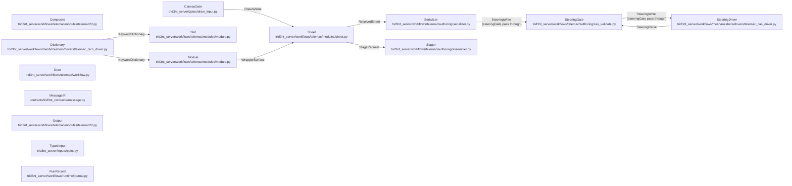

# SteeringSurface - derived view

GENERATED from `docs/model/steering-surface.sysml` by `scripts/model_check.py --view`. Never hand-edited: regenerate it, and `tests/model/test_model_conformance.py` fails while it is stale.

Plane: **workflow**. System: **runtime -> assembler**. One seam of the system of systems indexed by [`README.md`](README.md) - never the whole picture.

## Blocks and flows

## Interface items

### `DrawnValue`

What the canvas gave back. ``drawn`` is the honest terminal: no live session, a decline, or a wait that ran out all come back with a ``reason`` and no ``value``, and the sheet turns that into a refusal naming the slot that stayed empty rather than inventing a geometry.

| item | type | required |
| --- | --- | --- |
| `value` | Any | required |
| `reason` | String | optional |
| `drawn` | Boolean | required |

### `KeywordDictionary`

One dictionary entry as the dictionary carries it. ``keyword`` is the engine's own name and is never rewritten; ``identifier`` is the spelling a class body writes it under, taken from the map eficas ships in the image rather than from a rule guessed at outside it. ``help`` is the dictionary's own prose, de-LaTeXed, and it is what a reader and the model are given in place of a hand-written description.

| item | type | required |
| --- | --- | --- |
| `keyword` | String | required |
| `identifier` | String | required |
| `type` | String | required |
| `size` | Integer | required |
| `unbounded` | Boolean | required |
| `help` | String | required |
| `rubrique` | List | required |
| `is_file` | Boolean | required |
| `level` | Integer | optional |
| `default` | Any | optional |
| `choices` | Any | optional |
| `mnemo` | String | optional |
| `file_role` | String | optional |
| `file_mandatory` | Boolean | optional |

### `ResolvedSheet`

What the serializer receives: the module, the keywords the deck states with their values, and the files a composite named. An engine default is not among them - the dictionary already supplies it, and writing it back would make the deck claim a choice nobody made.

| item | type | required |
| --- | --- | --- |
| `module` | String | required |
| `resolved` | List | required |
| `files` | Map | required |

### `StageRequest`

What a complete sheet hands the stager. The run directory is already authored; what travels here is which engine reads which file, where the run stages, and the sheet itself as the run's record of what was asked.

| item | type | required |
| --- | --- | --- |
| `module` | String | required |
| `steering` | String | required |
| `results` | List | required |
| `outputs` | List | required |
| `mesh_inputs` | List | required |
| `prefix` | String | required |
| `sheet` | Map | required |
| `result_basename` | String | required |
| `server_facts` | Map | required |

### `SteeringParse`

The round trip back. ``ok`` is the honest terminal: a file that does not parse against its own dictionary carries the engine's own words in ``error`` rather than a message this code wrote about it. This is where a value outside a keyword's CHOIX is caught.

| item | type | required |
| --- | --- | --- |
| `steering` | Map | required |
| `module` | String | required |
| `ok` | Boolean | required |
| `keywords` | Integer | required |
| `error` | String | optional |

### `SteeringWrite`

The write the driver performs. ``values`` is keyed by the RAW keyword, because that is what the dictionary is keyed by; a string among them is spelled in the engine's own form on the way out, since Python's own repr reaches for a double-quote delimiter as soon as a value holds an apostrophe and a double-quoted value derails DAMOCLES on the first space inside it.

| item | type | required |
| --- | --- | --- |
| `write` | Map | required |
| `module` | String | required |
| `values` | Map | required |

### `WrapperSurface`

What the wrapper offers a body and a fill: the module it wraps, its whole keyword table, the composites registered on it, and what THIS body asserts - empty on the wrapper itself, by law.

| item | type | required |
| --- | --- | --- |
| `MODULE` | String | required |
| `MODULE_INPUT` | Map | required |
| `COMPOSITES` | Map | required |
| `ASSERTED` | Map | required |

## Requirements

| requirement | satisfied by | verified by |
| --- | --- | --- |
| **ACapabilityOnAHostDeckIsAComposite** | `composite`, `wrapper` | `tests/telemac/test_telemac_nestor_dredge.py::test_the_dredge_arms_nestor_and_names_the_files_it_wrote` `tests/telemac/test_telemac_nestor_dredge.py::test_the_carrier_deck_has_no_dredge_of_its_own` `tests/telemac/test_telemac_nestor_dredge.py::test_a_dredge_over_a_bed_with_no_stock_refuses_by_name` `tests/telemac/test_telemac_atmosphere.py::test_both_hosts_name_the_same_file_and_state_no_unit_of_their_own` `tests/telemac/test_telemac_atmosphere.py::test_each_host_writes_the_columns_its_own_source_term_reads` `tests/telemac/test_telemac_atmosphere.py::test_a_run_whose_own_terms_read_the_weather_writes_those_columns_alone` `tests/telemac/test_telemac_ice_cover.py::test_the_weather_file_carries_what_the_ice_reads_and_no_solar_column` `tests/telemac/test_telemac_micropollutant.py::test_the_body_names_the_process_and_the_carrier_states_it` `tests/telemac/test_telemac_eutrophication.py::test_the_carrier_states_the_process_and_the_steering_file` |
| **ANoDefaultKeywordIsTheTemplatesToState** | `slot`, `sheet` | `tests/telemac/test_telemac_module_surface.py::test_the_basin_states_how_its_tracer_is_carried_and_under_what_ceiling` `tests/telemac/test_telemac_module_surface.py::test_the_engine_default_is_on_the_slot_or_the_slot_is_a_question` |
| **AStepsKwargsAreItsRunnersCall** | `door`, `stager` | `tests/runtime/test_step_signatures.py::test_every_step_binds_against_its_own_runners_signature` |
| **ATemplateNumberIsMetToTheMeshsPrecision** | `door`, `sheet` | `tests/telemac/test_open_water_domains.py::test_the_footprint_and_the_solid_faces_are_cut_at_the_same_width` `tests/telemac/test_open_water_domains.py::test_a_boundary_node_is_on_the_structure_when_it_stands_on_the_punched_outline` `tests/telemac/test_open_water_domains.py::test_a_lone_node_between_two_of_another_kind_is_not_a_face` |
| **BodiesAreStatic** | `sheet` | `tests/telemac/test_telemac_module_surface.py::test_a_body_is_static_and_no_fill_changes_what_it_asserts` `tests/telemac/test_telemac_module_surface.py::test_a_param_a_body_reads_binds_from_the_sheet_the_invocation_resolved` |
| **BoundsRideBesideTheDictionaryRow** | `dictionaryExtractor`, `slot` | `tests/telemac/test_telemac_do_sag.py::test_a_keyword_outside_the_modules_own_bounds_refuses_by_its_name` |
| **CompositesLiveInWrappers** | `composite`, `wrapper` | `tests/telemac/test_telemac_module_surface.py::test_a_composite_becomes_several_slots_and_the_file_they_name` `tests/telemac/test_telemac_module_surface.py::test_a_composite_lives_on_the_wrapper_and_may_not_shadow_a_keyword` `tests/telemac/test_telemac_module_surface.py::test_a_composite_the_wrapper_never_registered_refuses_by_name` `tests/telemac/test_telemac_module_surface.py::test_the_sources_file_is_written_from_the_keywords_the_deck_states_by_name` `tests/telemac/test_telemac_module_surface.py::test_a_coupling_states_only_what_the_carrier_names_it_by` `tests/telemac/test_telemac_module_surface.py::test_a_coupled_body_is_checked_against_its_own_module_s_dictionary` `tests/telemac/test_telemac_khione.py::test_a_three_dimensional_host_couples_khione_and_states_its_column` `tests/telemac/test_telemac_ice_cover.py::test_the_ice_deck_states_the_five_keywords_this_question_has_an_opinion_on` `tests/telemac/test_telemac_tomawac.py::test_both_hosts_couple_the_waves_through_the_seam_they_share` |
| **CompositesSetOnlyPresence** | `composite`, `wrapper` | `tests/telemac/test_telemac_module_surface.py::test_a_composite_sets_only_what_its_value_s_presence_defines` `tests/telemac/test_telemac_module_surface.py::test_a_wind_from_the_north_reaches_the_engines_own_speed_and_direction_pair` `tests/telemac/test_telemac_module_surface.py::test_a_continuation_names_the_file_and_leaves_its_format_to_the_template` `tests/telemac/test_telemac_module_surface.py::test_a_curve_number_field_names_no_model_and_the_template_does` `tests/telemac/test_telemac_atmosphere.py::test_a_series_left_out_writes_no_column_and_shifts_none_of_the_others` `tests/telemac/test_telemac_atmosphere.py::test_a_host_handed_no_weather_states_no_file` `tests/telemac/test_telemac_atmosphere.py::test_the_thermal_body_states_only_the_keywords_it_was_given` `tests/telemac/test_telemac_micropollutant.py::test_a_constant_nobody_states_is_left_to_the_engine` `tests/telemac/test_telemac_eutrophication.py::test_a_body_states_only_what_it_was_handed` |
| **DictionaryMatchesImage** | `dictionaryExtractor` | `tests/scripts/test_telemac_dictionary_drift.py::test_the_committed_dictionary_is_what_the_image_says_today` `tests/scripts/test_telemac_dictionary_drift.py::test_every_exposed_module_has_a_committed_dictionary` |
| **EngineDefaultSurfaced** | `slot`, `sheet`, `door` | `tests/telemac/test_telemac_module_surface.py::test_an_open_slot_under_the_fold_says_the_dictionary_answers_it_for_nobody` `tests/telemac/test_telemac_module_surface.py::test_the_engine_default_is_on_the_slot_or_the_slot_is_a_question` `tests/telemac/test_telemac_module_surface.py::test_an_engine_default_is_never_written_into_the_deck` `tests/telemac/test_telemac_module_surface.py::test_the_bare_sheet_opens_every_keyword_the_dictionary_answers_for_nobody` |
| **EverySlotDescribed** | `dictionaryExtractor`, `slot` | `tests/telemac/test_telemac_module_surface.py::test_every_slot_carries_the_dictionary_s_own_name_and_help` `tests/scripts/test_telemac_dictionary_drift.py::test_the_help_carries_no_markup_into_the_surface` |
| **EverythingOverridable** | `runRecord`, `wrapper`, `sheet`, `canvasGate`, `door` | `tests/telemac/test_telemac_module_surface.py::test_a_raw_keyword_on_the_wire_fills_the_slot_it_names` `tests/telemac/test_telemac_module_surface.py::test_a_raw_keyword_the_module_does_not_have_refuses_naming_the_nearest` `tests/telemac/test_telemac_module_surface.py::test_a_raw_keyword_value_outside_the_choices_refuses_naming_the_choices` `tests/telemac/test_telemac_module_surface.py::test_two_sources_on_the_floor_are_two_sources_in_the_deck` `tests/telemac/test_telemac_module_surface.py::test_every_template_wire_carries_the_raw_keyword_floor` `tests/telemac/test_telemac_module_surface.py::test_a_floor_that_is_not_a_mapping_refuses_by_name` `tests/runtime/test_run_journal.py::test_the_record_carries_the_raw_keyword_floor_the_run_was_pinned_by` `tests/runtime/test_declarative_library.py::test_the_raw_keyword_floor_rides_out_on_the_runs_own_result` `tests/telemac/test_telemac_module_surface.py::test_resolution_order_is_engine_then_template_then_fill` `tests/telemac/test_telemac_module_surface.py::test_a_fill_is_repeatable_and_the_later_one_stands` `tests/telemac/test_telemac_module_surface.py::test_a_drawn_point_is_a_fill` `tests/telemac/test_telemac_module_surface.py::test_a_canvas_that_answers_nothing_refuses_and_invents_nothing` `tests/telemac/test_telemac_do_sag.py::test_a_coupled_keyword_is_stated_by_its_own_body_name` `tests/telemac/test_telemac_do_sag.py::test_a_bare_coupled_keyword_only_one_body_spells_resolves_there` `tests/telemac/test_telemac_do_sag.py::test_a_name_two_bodies_spell_refuses_naming_both_qualified_spellings` `tests/telemac/test_telemac_do_sag.py::test_a_value_the_coupled_dictionary_refuses_refuses_at_the_fill` `tests/telemac/test_telemac_do_sag.py::test_the_card_groups_the_coupled_deck_under_its_own_body` `tests/telemac/test_workflow_owns_its_stages.py::test_the_floor_is_resolved_once_before_any_stage_runs` `tests/telemac/test_workflow_owns_its_stages.py::test_the_settle_step_reads_the_files_the_deck_itself_names` `tests/telemac/test_telemac_water_temperature.py::test_a_stated_duration_sizes_the_weather_record` `tests/telemac/test_telemac_rain_on_grid_template.py::test_a_stated_friction_law_derives_the_rating_curve` `tests/telemac/test_telemac_module_surface.py::test_a_read_placed_on_a_keyword_resolves_through_the_filled_sheet` `tests/telemac/test_agitation_template.py::test_the_transect_follows_the_direction_the_run_states` `tests/telemac/test_telemac_module_surface.py::test_a_rate_stated_by_name_arms_the_term_that_reads_it` `tests/runtime/test_run_journal.py::test_the_record_carries_the_slots_the_run_was_supplied` `tests/telemac/test_telemac_khione.py::test_the_qualified_floor_reaches_the_coupled_body` `tests/telemac/test_telemac_khione.py::test_a_keyword_two_bodies_spell_names_the_body_it_belongs_to` `tests/telemac/test_telemac_tomawac.py::test_the_qualified_floor_reaches_the_coupled_body` `tests/telemac/test_telemac_tomawac.py::test_a_keyword_both_bodies_spell_names_the_body_it_belongs_to` `tests/telemac/test_telemac_tomawac.py::test_a_deck_that_states_the_switch_off_keeps_it_off` |
| **InputsAreTypedPrimitives** | `point`, `canvasGate`, `sheet` | `tests/inputs/test_point.py::test_a_pick_carries_its_coordinates_and_its_name` `tests/inputs/test_point.py::test_a_pair_is_lon_lat_with_no_name` `tests/inputs/test_point.py::test_a_selected_point_layer_gives_its_first_point_and_its_name` `tests/inputs/test_point.py::test_a_place_name_refuses_and_names_the_geocoder` `tests/inputs/test_point.py::test_a_point_outside_the_domain_is_refused_by_name_and_names_the_fix` `tests/inputs/test_point.py::test_a_point_landing_on_a_dry_node_moves_to_the_nearest_wet_one` `tests/telemac/test_telemac_module_surface.py::test_a_drawn_point_is_a_fill` |
| **KeywordNamesAreRaw** | `dictionaryExtractor`, `slot` | `tests/telemac/test_telemac_module_surface.py::test_every_slot_carries_the_dictionary_s_own_name_and_help` `tests/telemac/test_telemac_module_surface.py::test_the_identifier_is_the_keyword_and_nothing_invented` `tests/telemac/test_telemac_module_surface.py::test_a_keyword_the_module_does_not_have_refuses_naming_the_nearest` |
| **ModuleIsTheUnit** | `wrapper`, `output`, `sheet`, `door`, `runRecord`, `messageIR` | `tests/telemac/test_telemac_run_identity.py::test_every_template_is_values_over_a_module_of_the_one_engine` `tests/telemac/test_telemac_run_identity.py::test_the_run_record_carries_the_engine_and_the_module_and_no_template` `tests/telemac/test_telemac_run_identity.py::test_the_vocabulary_is_the_six_the_card_renders` `tests/telemac/test_telemac_run_identity.py::test_every_slot_of_a_template_s_default_fill_carries_one_of_the_six` `tests/telemac/test_telemac_module_surface.py::test_a_fill_with_two_tracers_is_a_two_tracer_deck` `tests/telemac/test_telemac_module_surface.py::test_every_wrapper_binds_the_primitive_set_and_nothing_question_named` `tests/adapters/test_message_ir.py::test_the_conversation_is_built_from_the_ir_alone` `tests/adapters/test_message_ir.py::test_no_provider_sdk_is_imported_for_the_ir` `tests/telemac/test_telemac_tomawac.py::test_a_standalone_deck_stands_on_the_wrapper_and_names_its_own_files` `tests/telemac/test_telemac_tomawac.py::test_the_wrapper_writes_its_own_wave_field_beside_the_host_s` `tests/telemac/test_telemac_tomawac.py::test_the_user_fortran_of_every_deck_of_the_run_is_staged` |
| **NoBodyExtendsABody** | `wrapper` | `tests/telemac/test_telemac_module_surface.py::test_a_body_extends_the_wrapper_and_never_a_body` |
| **OneTemplatePerQuestion** | `door` | `tests/telemac/test_telemac_module_surface.py::test_a_structural_fork_is_a_template_and_never_a_switch` `tests/telemac/test_telemac_module_surface.py::test_no_flipped_body_branches_on_anything` `tests/search/test_door_dissolution.py::test_all_templates_registered_and_callable` `tests/telemac/test_telemac_module_surface.py::test_a_template_reads_its_answer_through_the_primitives_its_module_binds` `tests/telemac/test_telemac_outputs.py::test_a_primitive_names_the_coupled_module_whose_result_it_reads` `tests/telemac/test_telemac_outputs.py::test_a_series_at_a_point_is_measured_at_that_point` |
| **OutputsAreTheModules** | `wrapper`, `output`, `sheet`, `serializer`, `door` | `tests/telemac/test_telemac_khione.py::test_the_table_is_written_in_the_engine_s_own_wildcard_and_fits_its_line` `tests/telemac/test_telemac_khione.py::test_a_row_under_a_keyword_is_written_unless_the_deck_switches_it_off` `tests/telemac/test_telemac_khione.py::test_one_frazil_row_per_class_the_deck_counts_on_the_host_and_the_ice_file` `tests/telemac/test_telemac_khione.py::test_the_ice_file_rows_nothing_the_budget_did_not_allocate` `tests/telemac/test_telemac_khione.py::test_the_temperature_is_appended_to_every_host_and_the_rest_ride_a_switch` `tests/telemac/test_telemac_khione.py::test_every_row_the_table_carries_is_a_mnemonic_the_dictionary_spells` `tests/telemac/test_telemac_khione.py::test_the_wrapper_writes_its_own_result_beside_the_host_s` `tests/telemac/test_telemac_ice_cover.py::test_every_answer_is_read_off_the_ice_modules_own_result` `tests/telemac/test_telemac_ice_cover.py::test_the_module_declares_the_tracers_and_the_deck_declares_none` `tests/telemac/test_telemac_tomawac.py::test_the_table_is_the_engine_s_forty_less_the_slot_it_never_writes` `tests/telemac/test_telemac_tomawac.py::test_the_table_is_written_in_the_engine_s_own_wildcard_and_fits_its_line` `tests/telemac/test_telemac_tomawac.py::test_a_deep_deck_does_not_ask_for_the_bottom_velocity_the_engine_leaves` `tests/telemac/test_telemac_tomawac.py::test_the_spectra_are_kept_as_result_files_and_never_rowed_as_a_mesh` `tests/telemac/test_telemac_tomawac.py::test_the_module_appends_no_tracer_and_arms_the_switch_it_is_felt_through` `tests/telemac/test_telemac_module_outputs.py::test_no_template_states_a_style_or_a_printout_list` `tests/telemac/test_telemac_module_outputs.py::test_the_printouts_keyword_is_the_table_and_the_run_s_own_tracers` `tests/telemac/test_telemac_module_outputs.py::test_a_token_the_keyword_does_not_spell_refuses_before_the_engine_reads_it` `tests/telemac/test_telemac_module_outputs.py::test_a_varying_row_is_one_temporal_layer_and_a_still_row_its_frame` `tests/telemac/test_telemac_module_outputs.py::test_a_temporal_layer_is_ranged_over_the_record_not_its_last_frame` `tests/telemac/test_telemac_module_outputs.py::test_a_row_the_result_does_not_carry_is_skipped_and_a_placed_read_refuses` `tests/telemac/test_telemac_module_outputs.py::test_a_coupled_module_states_the_tracers_it_appends_and_its_own_table` `tests/telemac/test_telemac_atmosphere.py::test_the_thermal_process_appends_its_temperature_to_a_carrier_with_no_tracer` `tests/telemac/test_telemac_atmosphere.py::test_a_temperature_the_carrier_declares_is_adopted_rather_than_appended` `tests/telemac/test_telemac_atmosphere.py::test_the_thermal_rows_are_declared_data_on_the_wrapper` `tests/telemac/test_telemac_micropollutant.py::test_the_rows_are_declared_data_on_the_wrapper` `tests/telemac/test_telemac_micropollutant.py::test_the_dissolved_row_a_carrier_declares_is_ADOPTED_never_appended` `tests/telemac/test_telemac_eutrophication.py::test_eutro_appends_the_eight_tracers_in_the_engines_order` `tests/telemac/test_telemac_eutrophication.py::test_biomass_appends_the_first_five` `tests/telemac/test_telemac_module_outputs.py::test_the_card_carries_every_variable_each_deck_writes` `tests/telemac/test_telemac_module_outputs.py::test_the_published_order_is_the_table_order_across_host_and_coupled` |
| **ProvenanceNamesTheLayerThatAnswered** | `sheet`, `door` | `tests/telemac/test_telemac_module_surface.py::test_a_value_the_run_measured_reads_as_derived_not_as_the_body_that_named_it` `tests/telemac/test_telemac_module_surface.py::test_a_measured_value_a_fill_overrides_still_reads_as_the_users` |
| **ReviewIsTheDoorsView** | `door` | `tests/telemac/test_telemac_module_surface.py::test_the_card_shows_what_is_set_and_open_and_folds_the_rest_by_rubrique` `tests/telemac/test_telemac_module_surface.py::test_the_fill_docstring_names_the_module_its_rubriques_and_its_open_slots` `tests/telemac/test_telemac_module_surface.py::test_the_review_is_the_doors_view_and_never_a_step_of_its_own` `tests/runtime/test_declarative_library.py::test_do_sag_declares_no_gate_in_front_of_its_self_gating_review` |
| **RunIsHeld** | `sheet`, `serializer`, `stager` | `tests/telemac/test_telemac_module_surface.py::test_run_refuses_an_incomplete_sheet_naming_the_required_file` `tests/telemac/test_telemac_module_surface.py::test_run_serializes_then_stages_then_dispatches` `tests/telemac/test_telemac_module_surface.py::test_run_refuses_a_deck_that_states_no_cadence` `tests/model/test_model_conformance.py::test_the_model_conforms_to_the_tree` |
| **TheOpenSetIsCompleteAndRequiredIsTheObligFiles** | `door`, `slot`, `sheet` | `tests/telemac/test_telemac_module_surface.py::test_every_required_file_is_the_template_s_own_statement` `tests/telemac/test_telemac_module_surface.py::test_the_artemis_forcing_composite_carries_the_file_and_not_its_name` `tests/telemac/test_telemac_module_surface.py::test_the_bare_sheet_opens_every_keyword_the_dictionary_answers_for_nobody` `tests/telemac/test_telemac_module_surface.py::test_a_defaulted_oblig_file_is_not_a_question_the_sheet_asks` `tests/telemac/test_telemac_module_surface.py::test_the_open_row_says_whether_the_run_cannot_begin_without_it` `tests/telemac/test_telemac_module_surface.py::test_run_does_not_refuse_an_open_keyword_the_engine_may_yet_default` `tests/telemac/test_telemac_run_reads.py::test_the_engine_s_own_demand_is_read_by_name_out_of_the_listing` `tests/telemac/test_telemac_engine.py::test_classify_exit_names_the_keyword_lecdon_asked_for` `tests/telemac/test_telemac_engine.py::test_classify_exit_invents_no_demand_where_the_engine_made_none` |
| **TheSteeringFormatHasOneWriter** | `serializer`, `steeringDriver` | `tests/telemac/test_telemac_module_surface.py::test_the_serializer_is_the_only_module_that_writes_a_keyword_into_a_deck` |
| **WrapperHasNoOpinion** | `wrapper` | `tests/telemac/test_telemac_module_surface.py::test_a_wrapper_asserts_nothing_and_has_no_hook_to` `tests/telemac/test_telemac_module_surface.py::test_a_wrapper_is_a_declaration_and_refuses_to_be_a_value` `tests/telemac/test_telemac_module_surface.py::test_a_coupled_body_states_only_what_its_caller_handed_it` |

## What each requirement says

- **ACapabilityOnAHostDeckIsAComposite** - A module the engine gives its own dictionary, its own deck and its own results is a WRAPPER. A capability it expresses as KEYWORDS ON A HOST'S DECK is a COMPOSITE on that host's wrapper and never a wrapper of its own: there is no dictionary for a second surface to be the keyword table of, and one written by hand would be the transcription this seam exists to stop. WHICH host, where more than one deck spells the same keywords, is the engine's to decide as well. The dredge's keywords stand on the hydrodynamic deck and on the sediment deck, and only the sediment path puts the material it moves through the per-class mass evolution the bed evolution and the sediment balance are computed from - the other adds a thickness to the bottom with no stock, no grain classes and no accounting behind it. The composite lives on the deck whose own closure carries the result, and the other path is not exposed.
- **ANoDefaultKeywordIsTheTemplatesToState** - A keyword the dictionary gives NO default for is a choice somebody makes. Left unstated it is not silence - the engine substitutes something of its own (SCHEME FOR ADVECTION OF TRACERS falls back to whatever the VELOCITIES are advected by) and the deck records no choice at all, so nobody can read what the run was solved under. Such a keyword is the TEMPLATE's to state, never the wrapper's, and it states three things with it: the value, the BASIS for the value where the LLM and the human both read it, and a way to override it on the sheet. A value the template derives rather than asserts names the producer it came from, and reuses the one that already exists.
- **AStepsKwargsAreItsRunnersCall** - A plan is built once at import and its steps are not called until a run reaches them, so a step whose kwargs the runner cannot take is a declaration that imports, registers and validates - and dies at the stage it was written for, on a live run, after the mesh was built. The kwargs a step declares ARE the call: every parameter the runner requires is among them, and nothing it does not take is.
- **ATemplateNumberIsMetToTheMeshsPrecision** - A template declares ONE number for a physical thing - the obstacle half-width says where the cut is - and the deck's own statement about that thing is read off the same number. Two numbers would let the cut and the deck disagree about where a structure is. What a node is MEASURED AGAINST is that number's outline plus the ACCEPTED MESH'S OWN EDGE. The edge is a property of the mesh - what a relaxation places a node on a locked outline to - and not a second tolerance the template gets to pick. Measured both ways on the same harbour: a band sized off the element edge ALONE sat entirely inside the cut, matched zero boundary nodes, and the run solved with its breakwater as absorbing shore; an equality at the half-width exactly halved a population sitting 9-11 m off a 20 m structure. A value derived that way is DERIVED on the sheet, not template: the template says which measurement the slot takes, and the number is the accepted artifact's.
- **BodiesAreStatic** - A body reads no value a fill produced. Its assertions are data, fixed when the module is imported - a literal the dictionary checked, or a description of a read the fill substitutes later - so two fills of the same body start from the same statement and a body cannot branch on what a run resolved.
- **BoundsRideBesideTheDictionaryRow** - A keyword's PLAUSIBILITY BOUNDS live beside its dictionary row, in a sidecar the module reads at import and the slot carries: the dictionary itself is the engine image's and is compared to it byte for byte, so nothing of ours may be written into it. The bounds are where a deleted Param's own range went - one range for the value the keyword holds, or one per element in the keyword's own order - and a value outside them REFUSES at fill by the KEYWORD's name, because that is the name the user set it under. It is the one table a calibration reads its priors and its ranges from, and a keyword with no row in it is taken at whatever the dictionary's own check allows.
- **CompositesLiveInWrappers** - A composite is the MODULE's, registered on its wrapper: the sources keyword group belongs to telemac2d whichever template releases into it. It may not shadow a keyword, and a name no wrapper registered refuses at fill rather than being absorbed as something the module might mean.
- **CompositesSetOnlyPresence** - A composite expands a value into the keywords that value IS. Two literals a presence defines: the ARMING keyword the input implies (WIND = YES when a wind is given) and the NAME of the file the composite itself writes. A CHOICE among the alternatives the dictionary offers - the restart format, the runoff model, the wind option - is not one of them: a composite picking it puts an opinion in the one place a reader of the template would not look, and inherits it into every template that ever passes the composite a value. Such a choice is the TEMPLATE's assertion where the template needs a non-default, and the engine's own default by omission where it does not. Nor may an ARGUMENT re-name a keyword the dictionary already carries: a composite takes what the dictionary LACKS - a file, a placement, a gradation, a series - and every keyword beside it is stated on the body under its own name, so a reader of the deck sees the value and a caller overrides it by the name the engine itself publishes. What survives as an argument is a COERCION the keyword's ingestion owes its reader: a common alternate unit the question is asked in - microns for a diameter, milligrams per litre for a source load, a compass bearing for a wind - converted at the line that states the engine's own.
- **DictionaryMatchesImage** - The committed dictionary is the image's dictionaries, not a copy that once was. The suite re-extracts from the image and compares, and skips saying so when the image is absent - it never passes on absence.
- **EngineDefaultSurfaced** - An unset slot is never a black box. The dictionary's default is on the slot and can be shown; a slot the dictionary gives NO default for is a question, and it is exactly those the sheet reports as open. The deck writes neither: an engine default written back would make the file claim a choice nobody made.
- **EverySlotDescribed** - Every slot carries the dictionary's own help, rendered as plain words. The description is not decoration: it is what the model and the reader are given in place of a docstring, and 1,311 keywords cannot be described any other way. Markup surviving into it is markup in the surface, so no backslash may remain in any dictionary.
- **EverythingOverridable** - Resolution runs lowest to highest - engine default, shared body, template, fill - and every layer above the engine is overridable by plain assignment. Two dye releases is a longer list, not a new template. A fill is repeatable, so an edit is another fill, and the row says which layer answered. A value drawn on the canvas is a fill like any other, reached through the same gate a typed value rides. A canvas that answers nothing refuses by name; nothing is invented from a decline. The wire half of it is the RAW KEYWORD FLOOR every template carries: a caller states the dictionary's own name and the fill sets that slot, beating the template because that is what it was stated to do. A name the module has no keyword for refuses naming the nearest one it does, and a value outside the dictionary's choices refuses naming them - both while a person can still read what they asked for. A floor name is resolved across the RUN'S BODIES in deck order, not the carrier's dictionary alone: a qualified "waqtel: K2 REAERATION COEFFICIENT" against that body, a bare name where exactly one body spells it, and a collision refuses naming both qualified spellings. A coupled value is stored on that body's own slots and checked against its own dictionary, and the card shows it under its body with its unit and its bounds - so a keyword on a coupled deck has the same user surface the carrier's own has. The floor is resolved ONCE, BEFORE any stage runs. A stage settled from the deck's class attribute would describe a different run than the deck writes, so the early readers - the settle's clock, the open channel's friction law and coefficient, the wave the boundary file is stamped at, the outlet's rating curve - read the resolved floor at run time. A read placed on a keyword INSIDE a body reads the FILLED SHEET instead, which is the same value after a revision at the gate. A value whose term the engine gates on ARMS that term where nothing has stated it: a rate reaching the engine with its switch off is a number nothing reads, and arming is the value's own ingestion rather than a second thing the caller has to know.
- **InputsAreTypedPrimitives** - Every point in the system is a Point. A slot that asks for one fills from each of its sources - the pick, a pair, a point layer - under the same ingestion, keeps the name the source carried, refuses by name a point outside the domain, and moves a dry landing to the nearest wet node. Neither the user nor the model names it twice. An ingestion RESOLVES what it was handed and never fetches: a bare place NAME is refused, retryably, naming the geocoder the model calls first, so no network call hides under a slot nobody asked to wait on.
- **KeywordNamesAreRaw** - A slot is spelled the engine's way. The dictionary carries the dictionary's own keyword verbatim, and the identifier a class body writes it under is the image's own map - which matters because a keyword can open on a digit or carry a hyphen or a parenthesis, and a spelling rule invented here would drift from the one eficas ships. The pay-off is that a template reads as the engine reads: no second vocabulary to learn, no table mapping friendly names onto real ones, and a misspelling answered at import with the nearest real keyword.
- **ModuleIsTheUnit** - The engine's module is the unit. A template is values over one module and composes nothing, so nothing is frozen: a body that states one tracer is two on the fill. A wrapper's reads are primitives named from the module's own output table and never from a question. A run is recorded under its engine and its module, with no template field; every filled slot carries one of the six origins the card renders. The adapters build a turn from the contracts IR and import no provider SDK for it. ONE wrapper serves every role its module has: a template's own steering base where the engine gives the module a deck of its own, and a coupled body where a host names it, off the same dictionary and the same output table. What a coupled module hands its host in memory rather than on the host's result is felt only under a host switch, so stating the coupling ARMS that switch the way a stated rate arms the term that reads it, and a host deck that states the switch itself keeps what it said. The user code each deck of a run names is staged off that deck, never off the host's alone.
- **NoBodyExtendsABody** - A body extends its module's wrapper and nothing else. A value two templates share is restated in each, under the template that states it, so a keyword that means something else in a new setting is seen rather than inherited into silence.
- **OneTemplatePerQuestion** - A structural fork of the deck is a TEMPLATE, never a switch on a param. A tracer, an oil slick, a moving bed and a settling class fill DIFFERENT slots, and the arity of the carrier's own tracer surface moves with the fork - so each body states that surface itself rather than letting a composite own a carrier slot out of sight. What varies WITHIN one question is a composite that states nothing when it is given nothing. The rule holds on the READING side too. Each template LISTS the reads its question PLACES, off the module's own READS registry and, for a coupled module's own result, through that module's wrapper; a single publisher branching on a substance-class string put the fork back in the products, one level down from where a person reads it.
- **OutputsAreTheModules** - What a run writes, how each variable is drawn and what it is called are the MODULE's, stated once in its output table and never by the template that asked the question. The printouts keyword is generated from that table as the deck is serialized - for the host and for every coupled module - with each token checked against the keyword's own choices; a template restating it, or naming a style of its own, is refused. Everything the table rows and the result carries is published as ONE layer styled from the row: the TEMPORAL layer where the row varies in time, the final frame where it does not. A still beside a time series would be a copy of a frame that layer already carries, so a picture of one instant is a render of the temporal layer rather than a second product. That layer's legend is ranged over EVERY frame of the record, never over the last frame alone - a variable that peaks and flushes would otherwise be ranged on an empty field and paint blank while the run's own data reached the top of its scale. There is no leading layer and no ranking among the rows, because every group rides the one mesh the run solved on and the camera takes its extent; the order is the dictionary's. A row the result does not carry is skipped rather than refused, and a row a module prints in its listing or derives over its own variables is read or published but never asked of the engine. A row may exist only UNDER a keyword: the engine allocates the variable with that keyword true and stops the solve on a request for one it did not allocate, so the generated table carries the row where the deck states its keyword and nowhere else. Nothing arms it - a deck that says nothing about the keyword is a deck the row is not written for. The SPELLING of the generated value is the engine's own. A table longer than the line the engine's parser reads is truncated by the engine, so past that column it is written in the wildcard the engine's own variable matching answers to, over prefixes that reach exactly the rows the table carries and no other variable the keyword spells; a table no wildcard can shorten enough refuses by name. A module may write a result NO primitive reads: one over a grid that is not the domain, such as a spectrum over frequency and direction. It is not a row and nothing paints it, and it is not thrown away either - a deck that names one has the run declare it, check it landed and keep it for download, which is the whole of what the module states about it until a question asks for a read over its own grid. What a template keeps is the QUESTION: the keywords, the reads that need a place the user gives, the answer, and the captions for those.
- **ProvenanceNamesTheLayerThatAnswered** - A filled slot says which of the six layers answered it. Engine default is ABSENCE - the slot is not on the sheet at all and the card badges it under the advanced fold. The other five are on the row: a template names itself, a fill names the user, a composite names the producer that expanded it, and a value the RUN MEASURED reads DERIVED. Derived is not the same statement as template. A body states WHICH measurement a slot takes - the boundary walk the accepted mesh reported, the normal depth of the reach, the time step the mesh's own CFL allows, the stage-discharge curve fitted to the outlet - and the number itself is the artifact's. Badging it template would say an author wrote a value nobody wrote down. A declared PARAM is the invocation's own answer and stays the template's.
- **ReviewIsTheDoorsView** - The sheet is STATE. The review is how the door renders what fill returned - the set slots with their provenance and the mandatory ones still open - and it HOLDS there until the user runs; an edit is another fill. No gate concept survives in the plan: a card in front of the door would revise a sheet the door never reads. What is SET and what is OPEN AND MANDATORY are the review; the whole rest of the module folds under advanced, grouped by the dictionary's own rubrique and carrying the engine default it would otherwise run on. The same declaration is what the tool's own docstring names - the module, the rubriques the body touches, the mandatory slots it leaves open - so the prose and the card cannot claim a surface the body does not state.
- **RunIsHeld** - Nothing executes until the user runs. Fill produces a sheet and no work beyond the producers the canvas shows; run is the separate, explicit act - and it refuses a sheet whose REQUIRED slots are unanswered BY NAME first, because a run started without the files the dictionary marks OBLIG fails inside Fortran minutes later, blaming a keyword rather than the gap. It refuses the same way on the CADENCE: a module that marches in time names the keyword saying how often its output table is written, and the dictionary's own default for that keyword is every step. A deck stating none would inherit an animation nobody sized, so each states its own period in steps as its opinion, and the user overrides it by the keyword's name.
- **TheOpenSetIsCompleteAndRequiredIsTheObligFiles** - The sheet states two different things and never conflates them. OPEN is every keyword the dictionary gives no default for and nothing has set - LISTS INCLUDED. A list the dictionary writes no DEFAUT for is empty until something states it, and an emptiness the engine substitutes for is exactly what a reader has to be able to see. The set is informational and COMPLETE; it refuses nothing. REQUIRED is the dictionary's own OBLIG files, and it is the only thing a run refuses on. Which OTHER keyword a particular deck cannot run without is the engine's to say: LECDON demands it by name in the listing, and that sentence is carried out to the caller. A required set invented here would refuse runs the engine would have taken, and inventing one is the thing this requirement forbids.
- **TheSteeringFormatHasOneWriter** - telapy writes the steering file and the serializer is the only thing that hands it a sheet. A keyword spelled and assigned in a string anywhere else is a second author of the format, and a second author is what the surface replaced: the hand-written one wrote the deck line by line and its comments were the only description a keyword had. The gate is over the dictionary's own names, so a new writer is caught by what it spells rather than by a list of files somebody keeps.
- **WrapperHasNoOpinion** - The wrapper asserts nothing and offers nowhere to. It is the analog of the engine's own defaults; variance lives in templates, where a person reads it. A defaults hook here would put an opinion in the one place nobody would think to look for one, and it would be inherited by every template silently. A COUPLED BODY is on the wrapper too, and a constant inside one is the same opinion by a longer route: it is not a class body, so the frozen ASSERTED never sees it, and every template that names the body inherits it. What a coupled body states is what its caller handed in. The only values it may repeat across two calls sharing no argument are the file the wrapper names, the transport mode the body IS, a slot the dictionary states no default for, and the dictionary's own default at this body's own class count.
