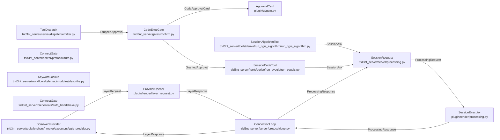

# ToolPlane - derived view

GENERATED from `docs/model/tool-plane.sysml` by `scripts/model_check.py --view`. Never hand-edited: regenerate it, and `tests/model/test_model_conformance.py` fails while it is stale.

Plane: **tool**. System: **session-code**. One seam of the system of systems indexed by [`README.md`](README.md) - never the whole picture.

## Blocks and flows

## Interface items

### `CodeApprovalCard`

The card the user reads: the id the decision is keyed by, the exact code, and its caption. No layer list: the session's own project is the surface, and the user is looking at it.

| item | type | required |
| --- | --- | --- |
| `code_exec_id` | String | required |
| `python_code` | String | required |
| `rationale` | String | optional |

### `GrantedApproval`

What the gate injects on the user's ``proceed``: the approval and the id of the card it was given on, which the tool carries to the session so the outcome joins that card.

| item | type | required |
| --- | --- | --- |
| `confirmed` | Boolean | required |
| `code_exec_id` | String | required |

### `LayerRequest`

The envelope on the wire: one provider layer for the session to open, keyed by the row's own cache key, which the answer echoes.

| item | type | required |
| --- | --- | --- |
| `key` | String | required |
| `provider` | String | required |
| `uri` | String | required |
| `name` | String | required |
| `bbox` | Sequence | required |
| `mode` | String | required |

### `LayerResponse`

What the session did with it: the staged object a materialised row was uploaded to, unset for an overlay, or the provider's own error text.

| item | type | required |
| --- | --- | --- |
| `key` | String | required |
| `uri` | String | optional |
| `error` | String | optional |

### `ProcessingRequest`

The envelope on the wire: one request the session runs, keyed by an unguessable id the answer echoes.

| item | type | required |
| --- | --- | --- |
| `request_id` | String | required |
| `kind` | String | required |
| `algorithm` | String | optional |
| `params` | Map | required |
| `code` | String | optional |
| `code_exec_id` | String | optional |

### `ProcessingResponse`

What the session produced. ``status`` is the honest terminal outcome; an ``error`` is the session's own traceback, never a message this side wrote about it.

| item | type | required |
| --- | --- | --- |
| `request_id` | String | required |
| `status` | String | required |
| `result` | Map | optional |
| `error` | String | optional |
| `stdout` | String | optional |

### `SessionAsk`

What a tool hands the request seam: the kind of thing to run and its body - an algorithm id with its params, or the approved code.

| item | type | required |
| --- | --- | --- |
| `kind` | String | required |
| `algorithm` | String | optional |
| `params` | Map | optional |
| `code` | String | optional |
| `code_exec_id` | String | optional |

### `StrippedApproval`

What the dispatch removes from a model-issued call before the gate sees it: the approval flag and the card id, so only the gate can put them back.

| item | type | required |
| --- | --- | --- |
| `confirmed` | Boolean | required |
| `code_exec_id` | String | required |

## Requirements

| requirement | satisfied by | verified by |
| --- | --- | --- |
| **ADeriveToolNeverFetches** | `runPyqgis`, `runQgisAlgorithm` | `tests/derive/test_probe_point.py::test_outside_bounds_is_honest_null` `tests/model/test_model_conformance.py::test_the_model_conforms_to_the_tree` |
| **ASessionAnswersOrRefuses** | `sessionRequest`, `connectionLoop` | `tests/derive/test_session_tools.py::test_no_session_is_a_typed_refusal` `tests/derive/test_session_tools.py::test_a_wait_that_runs_out_is_typed_and_cleans_up` `tests/derive/test_session_tools.py::test_an_error_reply_is_the_sessions_own_message` `tests/derive/test_session_tools.py::test_a_cross_session_reply_is_refused` |
| **ASurfaceTooLargeToCarryIsReached** | `keywordLookup` | `tests/search/test_describe_keywords.py::test_a_question_in_words_reaches_the_keyword_that_answers_it` `tests/search/test_describe_keywords.py::test_a_match_carries_the_dictionary_s_own_help_choices_and_default` `tests/search/test_describe_keywords.py::test_the_same_question_is_answered_the_same_way_twice` `tests/search/test_describe_keywords.py::test_a_module_with_no_catalog_refuses_naming_the_ones_there_are` `tests/search/test_describe_keywords.py::test_every_corpus_phrasing_surfaces_the_tool_model_free` |
| **AnOverlayIsNeverAnInput** | `borrowedProvider`, `providerOpener` | `tests/fetchers/test_router_qgis_provider.py::test_mode_open_returns_the_record_and_never_the_store` `tests/fetchers/test_router_qgis_provider.py::test_mode_open_on_a_layer_row_refuses_rather_than_publish_a_packet_row` `tests/fetchers/test_router_qgis_provider.py::test_mode_materialise_lands_the_export_under_the_row_key` `tests/server/test_layer_request_seam.py::test_a_foreign_session_cannot_answer_it` |
| **ConsequentialCodeIsUserGated** | `runPyqgis`, `codeExecGate`, `toolDispatch` | `tests/derive/test_session_tools.py::test_run_pyqgis_refuses_without_the_card` `tests/gates/test_code_exec_gate.py::test_dispatch_strips_a_model_supplied_approval` `tests/gates/test_code_exec_gate.py::test_approve_injects_confirmed_and_the_card_carries_the_code` `tests/gates/test_code_exec_gate.py::test_cancel_blocks_dispatch_and_leaks_nothing` `tests/gates/test_code_exec_gate.py::test_an_unanswered_card_expires_typed` `tests/gates/test_code_exec_gate.py::test_a_cancelled_wait_drops_its_entry` `tests/gates/test_gate_timeout_local.py::test_local_timeout_is_finite` |
| **TheConnectGateIsAlwaysOn** | `connectGate`, `mintedToken`, `connectionLoop` | `tests/credentials/test_auth_handshake.py::test_mints_token_once_into_the_config_file` `tests/credentials/test_auth_handshake.py::test_env_override_mints_nothing` `tests/credentials/test_remote_daemon_access.py::test_verify_access_token_fails_closed_without_a_token` `tests/credentials/test_remote_daemon_access.py::test_correct_token_binds` `tests/credentials/test_remote_daemon_access.py::test_wrong_token_typed_close` `tests/credentials/test_remote_daemon_access.py::test_token_less_auth_envelope_typed_close` `tests/credentials/test_remote_daemon_access.py::test_pre_handshake_envelope_is_refused` |
| **TheSessionIsTheOneCodePath** | `runPyqgis`, `sessionRequest`, `sessionExecutor` | `tests/derive/test_session_tools.py::test_confirmed_code_request_rides_the_wire` `tests/derive/test_session_tools.py::test_algorithm_request_rides_the_wire_and_returns_the_summary` `tests/model/test_model_conformance.py::test_the_model_conforms_to_the_tree` |

## What each requirement says

- **ADeriveToolNeverFetches** - A derive tool takes a layer and returns a layer or a value. The layer it needs is fetched first by the fetch tool that declares it, and the tool refuses, naming that fetch, when the layer was not given - it never reaches the registry for a fetcher, the cache shim's read-through, or a fetch tool module. The session tools take canvas layers by name for the same reason: the model fetches, and when the layer exists, runs.
- **ASessionAnswersOrRefuses** - A session request resolves in one of four ways and fabricates in none: the session's answer; no live session, a typed refusal before anything is sent; no answer within the window, a typed refusal with the pending entry dropped; an error answer, the session's own message raised as the tool's error. A reply from a session that is not the owner is refused.
- **ASurfaceTooLargeToCarryIsReached** - A tool docstring is truncated at a thousand characters and the engine's keyword surface is more than a thousand KEYWORDS, so the surface is reached rather than carried: a read-only tool answers a question in words out of the module's own dictionary - the keyword, its help, its labeled choices, the default it has when nobody states it, its level and whether it names a file - and what a caller does with what it learns is state it on a fill through the raw keyword floor. The read decides nothing and runs nothing. Its ranking is model-free and deterministic, so the same question is answered the same way twice and an index nobody can rebuild is never between the caller and the dictionary. A module with no dictionary refuses naming the ones there are.
- **AnOverlayIsNeverAnInput** - A borrowed provider layer opened in mode open is context on the user's map: it writes one journal line, enters no store and publishes no packet row, because nothing downstream can read features QGIS draws from a service. A row that wants to be an input is materialised - the session exports it and the read-through lands it under the row-shaped cache key, so the next call is a hit that never asks the session again.
- **ConsequentialCodeIsUserGated** - The session runs code nobody reviewed in advance, so the person whose project it touches is the one who lets it run. The tool body REFUSES an unconfirmed call outright, and the confirmation is the SERVER's to grant: a model-supplied approval flag is stripped before the gate is reached, so asking for consent and answering for it cannot be the same act. The wait is BOUNDED. A gate nobody answers expires into a typed refusal and drops its pending entry, because a turn held open forever is a turn the user cannot see failing - and the same expiry runs when the waiting task is cancelled, so a dropped connection leaves no entry behind. The approval card states the code verbatim; the surface it can reach is the project the user is looking at.
- **TheConnectGateIsAlwaysOn** - One token is the one user, and presenting it is the whole of becoming that user. The daemon mints the token at first start into its own config, prints it once, and from then on verifies what a connection presents against it; nothing about the socket's origin substitutes for the string, because a process on this machine is not the person. A connection presenting nothing, or the wrong token, is refused typed and closed, and an envelope arriving before the handshake gets the same refusal rather than the turn loop. The gate fails CLOSED: a daemon holding no token matches nothing. Nothing here mints an identity - the session it binds is the one user the token stands for.
- **TheSessionIsTheOneCodePath** - Nothing on the daemon executes what the model wrote. The daemon holds no container and no interpreter for a snippet: the request leaves for the session, and only the session's own Python and Processing framework run it. The modules that carry a request may not spawn a process of their own.
