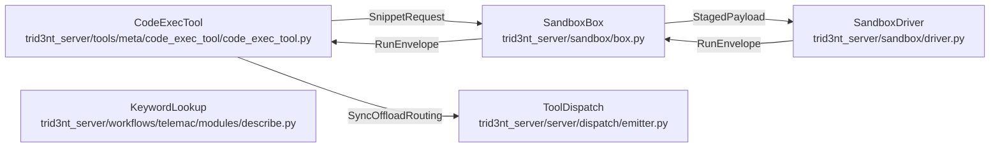

# ToolPlane - derived view

GENERATED from `docs/model/tool-plane.sysml` by `scripts/instruments/model_check.py --view`. Never hand-edited: regenerate it, and `tests/model/test_model_conformance.py` fails while it is stale.

Plane: **tool**. System: **code-exec**. One seam of the system of systems indexed by [`README.md`](README.md) - never the whole picture.

## Blocks and flows

## Interface items

### `RunEnvelope`

What one run produced. ``status`` is the terminal honesty: a snippet that hit the network boundary comes back ``blocked`` and one that ran past its cap comes back ``timeout``, never dressed up as a result. The truncation flags are the other half of that - a bounded stream says it was bounded rather than presenting a head as the whole. ``layer_errors`` names each ref that could not be staged or opened, so a missing layer is a stated gap the snippet and the narration can both see rather than a silent empty handle.

| item | type | required |
| --- | --- | --- |
| `status` | String | required |
| `stdout` | String | required |
| `stderr` | String | required |
| `result` | Map | required |
| `error` | String | required |
| `stdout_truncated` | Boolean | required |
| `stderr_truncated` | Boolean | required |
| `layer_errors` | Map | optional |
| `duration_s` | Real | optional |
| `wallclock_cap_seconds` | Integer | optional |

### `SnippetRequest`

What the tool hands the box: the exact code the user approved, and the layers it may touch. ``layer_refs`` is the whole data surface - a snippet reads what is named here and has no other way to reach anything, which is what makes the approval card an honest account of what the code can see.

| item | type | required |
| --- | --- | --- |
| `python_code` | String | required |
| `layer_refs` | Map | required |
| `timeout_seconds` | Integer | optional |

### `StagedPayload`

The run directory's own payload, written before the container starts. Its ``layer_refs`` are BOX-SIDE paths under the staged directory, not the URIs the tool passed: by the time the driver reads this, every byte it names is already on local disk.

| item | type | required |
| --- | --- | --- |
| `python_code` | String | required |
| `layer_refs` | Map | required |

### `SyncOffloadRouting`

The tool name the dispatch routes off the loop unconditionally. It is declared as data on the dispatch side and satisfied by the tool body being emit-free, which is what makes running it in a worker thread safe.

| item | type | required |
| --- | --- | --- |
| `code_exec_request` | String | required |

## Requirements

| requirement | satisfied by | verified by |
| --- | --- | --- |
| **ASurfaceTooLargeToCarryIsReached** | `keywordLookup` | `tests/search/test_describe_keywords.py::test_a_question_in_words_reaches_the_keyword_that_answers_it` `tests/search/test_describe_keywords.py::test_a_match_carries_the_dictionary_s_own_help_choices_and_default` `tests/search/test_describe_keywords.py::test_the_same_question_is_answered_the_same_way_twice` `tests/search/test_describe_keywords.py::test_a_module_with_no_catalog_refuses_naming_the_ones_there_are` `tests/search/test_describe_keywords.py::test_every_corpus_phrasing_surfaces_the_tool_model_free` |
| **DataEntersStaged** | `sandboxBox`, `sandboxDriver` | `tests/sandbox/test_sandbox_box.py::test_a_local_raster_is_staged_and_opens_as_a_handle` `tests/sandbox/test_sandbox_box.py::test_a_remote_ref_is_fetched_by_the_host_before_the_box_starts` `tests/sandbox/test_sandbox_box.py::test_frames_stage_as_an_ordered_list` `tests/sandbox/test_sandbox_box.py::test_a_ref_that_cannot_be_staged_is_named_rather_than_crashing_the_run` `tests/sandbox/test_sandbox_box.py::test_the_box_reaches_for_nothing_from_the_inside` |
| **OffloadKeepsTheLoopUnblocked** | `codeExecTool`, `toolDispatch` | `tests/sandbox/test_sandbox_box.py::test_the_tool_that_drives_the_box_is_always_offloaded` `tests/sandbox/test_sandbox_box.py::test_the_offload_keeps_the_loop_unblocked` `tests/tools/test_sync_tool_offload_stage0.py::test_gate_refuses_emitting_sync_tool` |
| **SandboxIsNetworkNone** | `sandboxBox`, `sandboxDriver` | `tests/sandbox/test_sandbox_box.py::test_the_box_runs_with_the_network_off` `tests/sandbox/test_sandbox_box.py::test_a_snippet_cannot_reach_the_network` `tests/sandbox/test_sandbox_box.py::test_a_denied_egress_is_reported_as_blocked_rather_than_as_a_bug` `tests/model/test_model_conformance.py::test_the_model_conforms_to_the_tree` |

## What each requirement says

- **ASurfaceTooLargeToCarryIsReached** - A tool docstring is truncated at a thousand characters and the engine's keyword surface is more than a thousand KEYWORDS, so the surface is reached rather than carried: a read-only tool answers a question in words out of the module's own dictionary - the keyword, its help, its labeled choices, the default it has when nobody states it, its level and whether it names a file - and what a caller does with what it learns is state it on a fill through the raw keyword floor. The read decides nothing and runs nothing. Its ranking is model-free and deterministic, so the same question is answered the same way twice and an index nobody can rebuild is never between the caller and the dictionary. A module with no catalog refuses naming the ones there are.
- **DataEntersStaged** - The box takes files and values HANDED to it and fetches nothing. Every ref is materialized into the run directory by the host - the process that holds the credentials and answers to the gates - and the payload the driver reads names local paths only. This is the same rule the substrate keeps everywhere: a world-read happens on the fetch path where it is visible, cached and gated, and never as a side effect of some other operation. A snippet that could open a URI would be a second, unwatched fetcher inside the one place that is meant to compute. A ref that cannot be staged is NAMED rather than silently dropped: the original string is handed through and the reason rides in ``layer_errors``, so the snippet fails on a stated absence.
- **OffloadKeepsTheLoopUnblocked** - The tool that drives the box is off-loaded unconditionally. One run is a container start, a staging fetch and seconds of compute, all synchronous; run on the event loop it starves the heartbeat and the client reconnects mid-analysis. The off-load is safe because the tool body is emit-free - the confirm card is emitted on the loop before dispatch and the result envelope after it - so no worker thread ever touches the loop.
- **SandboxIsNetworkNone** - The box runs with the network OFF, declared on the launch line. A snippet is code nobody reviewed, so containment cannot be a guard the same interpreter runs: a monkeypatched socket is rebindable and a credential-scrubbed environment is only as good as its allowlist. A container with no interfaces is neither - the kernel refuses the packet whether it came from urllib, ctypes or a shelled-out binary. The denial being structural is what lets the seam be honest about it: a snippet that reaches for the world comes back ``blocked``, carrying the failure exactly as the box met it rather than a message this code wrote about it. The driver enforces the other half by depending on nothing: a module inside the box that could import the server package could import its fetchers, and the boundary would be one edge away from gone.
