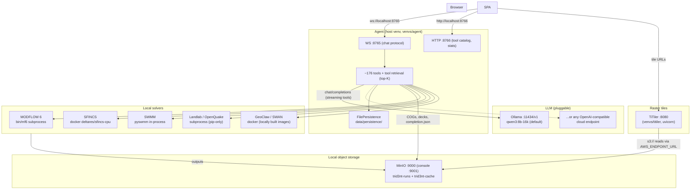

# TRID3NT Local -- Overview

**TRID3NT Local** is the offline / local-first build of TRID3NT: the same AI workbench for
multi-hazard geospatial modeling -- same React/MapLibre web UI, same agent, same ~176-tool
catalog, same engines -- running entirely on one machine. No AWS account, no cloud dependency
for the core loop. The LLM is pluggable: a local model served by Ollama (or vLLM, llama.cpp,
LM Studio) or any cloud OpenAI-compatible API, through one provider seam.

Repo: `trid3nt-local` (standalone, publishable; the web + cloud products live in a separate repo).

---

!!! note "Where this section is edited"
    The canonical source for these pages is `trid3nt-local/docs/site/`. They are copied into
    the cloud repo's docs site (`docs-site/docs/local/`) by its docs-sync step
    and rebuild -- do not edit those copies directly.
    The tool-support page is generated -- see [Tool Support Matrix](tool-support.md).

---

## What is swapped relative to the cloud build

Every cloud dependency has a local counterpart behind an existing, env-gated seam. The entire
cloud-to-local rewiring is environment variables -- no fork of the agent code.

| Concern | Cloud (TRID3NT) | Local (TRID3NT Local) | Seam |
|---------|-----------------|----------------------|------|
| LLM | AWS Bedrock (Sonnet default) | Ollama `qwen3:8b-16k` (or any OpenAI-compatible endpoint) | `MODEL_PROVIDER=openai` + `openai_adapter.py` |
| Object storage | S3 runs + cache buckets | MinIO on `:9000` (S3-compatible, zero code change) | `AWS_ENDPOINT_URL` |
| Persistence | DynamoDB (`trid3nt_*` tables) | FilePersistence -- JSON store on disk | `GRACE2_DEV_PERSISTENCE_DIR` |
| Raster tiles | TiTiler EC2 (always-on) | TiTiler in a local venv on `:8080` | `GRACE2_TILE_SERVER_BASE` |
| Solvers | AWS Batch (Spot, scale-to-zero) | Local subprocess / local docker per engine | `GRACE2_SOLVER_BACKEND`, per-engine gates |

Data fetchers need internet (USGS/NOAA/OSM/etc. are public HTTPS or anonymous public S3) but
no cloud account. "Offline" means no-cloud-ACCOUNT, not air-gapped.

---

## Architecture

The flow is identical to the cloud build: prompt -> LLM tool selection -> fetch/compute tools ->
solver dispatch -> COG outputs in the runs bucket -> `publish_layer` emits TiTiler tile templates ->
map layers render. Only the substrate under each seam changes.

---

## Relationship to the other TRID3NT products

This repo is the standalone QGIS product: plugin + server + engine workers,
first-class, no upstream sync. The separate web and cloud products live in
their own upstream repo; until 2026-07-21 the server code here was a vendored
copy synced from it.

## Section map

| Page | Contents |
|------|----------|
| [Install](install.md) | From-scratch setup: binaries, venvs, docker images, MinIO, Ollama, start scripts, ports |
| [Configuration](configuration.md) | The full `.env.local` reference -- every variable, default, and why it matters |
| [Models](models.md) | Local model matrix, tool retrieval top-K, routing benchmark results |
| [Engines](engines.md) | Per-engine local execution matrix (binary / docker / subprocess) + runtimes |
| [Tool Support Matrix](tool-support.md) | Generated sweep status for all tools (PASS/KEY/FAIL/TIMEOUT/SKIP-ARGS) |
| [Troubleshooting](troubleshooting.md) | The greatest hits: symptoms, root causes, fixes |
