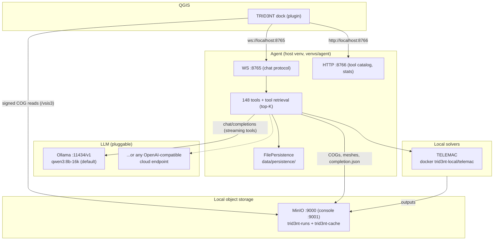

# TRID3NT Local -- Overview

**TRID3NT Local** is the QGIS product: a QGIS plugin plus a local daemon, running entirely
on one machine. The dock is the client -- there is no web UI in this repo. No AWS account, no
cloud dependency for the core loop. The LLM is pluggable: a local model served by Ollama (or
vLLM, llama.cpp, LM Studio) or any cloud OpenAI-compatible API, through one provider seam.

Repo: `trid3nt-local`, standalone and publishable: plugin, server and engine workers, with no
upstream sync.

---

!!! note "Where this section is edited"
    The canonical source for these pages is `trid3nt-local/docs/site/`.
    The tool-support page is generated -- see [Tool Support Matrix](tool-support.md).

---

## Where each concern runs

Every substrate is local and sits behind an env-gated seam, so pointing one somewhere else is
an environment value rather than a code path.

| Concern | Local substrate | Seam |
|---------|-----------------|------|
| LLM | Ollama `qwen3:8b-16k`, or any OpenAI-compatible endpoint | `MODEL_PROVIDER=openai` + `openai_adapter.py` |
| Object storage | MinIO on `:9000` (S3-compatible) | `AWS_ENDPOINT_URL` |
| Persistence | FilePersistence -- JSON store on disk | `TRID3NT_DEV_PERSISTENCE_DIR` |
| Raster rendering | the QGIS plugin opens COGs from MinIO natively via GDAL `/vsis3` and styles them client-side | `publish_layer` emits the `s3://` COG URI |
| Solvers | local docker per engine | `TRID3NT_SOLVER_BACKEND`, per-engine gates |

Data fetchers need internet (USGS/NOAA/OSM/etc. are public HTTPS or anonymous public S3) but
no cloud account. "Offline" means no-cloud-ACCOUNT, not air-gapped.

---

## Architecture

```mermaid
graph TD
    subgraph Client["QGIS"]
        Dock["TRID3NT dock (plugin)"]
    end

    subgraph Agent["Agent (host venv, venvs/agent)"]
        WS["WS :8765 (chat protocol)"]
        HTTP["HTTP :8766 (tool catalog, stats)"]
        Tools["148 tools + tool retrieval (top-K)"]
        FP["FilePersistence\ndata/persistence/"]
    end

    subgraph LLM["LLM (pluggable)"]
        Ollama["Ollama :11434/v1\nqwen3:8b-16k (default)"]
        CloudAPI["...or any OpenAI-compatible\ncloud endpoint"]
    end

    subgraph Storage["Local object storage"]
        MinIO["MinIO :9000 (console :9001)\ntrid3nt-runs + trid3nt-cache"]
    end

    subgraph Solvers["Local solvers"]
        TELEMAC["TELEMAC\ndocker trid3nt-local/telemac"]
    end

    Dock -- "ws://localhost:8765" --> WS
    Dock -- "http://localhost:8766" --> HTTP
    Dock -- "signed COG reads (/vsis3)" --> MinIO
    WS --> Tools
    Tools -- "chat/completions (streaming tools)" --> Ollama
    Tools -.-> CloudAPI
    Tools --> FP
    Tools -- "COGs, meshes, completion.json" --> MinIO
    Tools --> TELEMAC
    Solvers -- "outputs" --> MinIO
```

The flow: prompt -> LLM tool selection -> fetch/compute tools ->
solver dispatch -> COG outputs in the runs bucket -> `publish_layer` emits the `s3://` COG URI ->
the QGIS plugin opens it via GDAL `/vsis3` and applies the envelope's legend/style client-side.
One store, one scheme: the buckets are private, the read is signed, and the store's endpoint is
GDAL configuration the plugin sets once - so a remote store is an endpoint value, not a code path.
Only the substrate under each seam changes.

---

## Section map

| Page | Contents |
|------|----------|
| [Install](install.md) | From-scratch setup: binaries, venvs, docker images, MinIO, Ollama, start scripts, ports |
| [Configuration](configuration.md) | The full `.env.local` reference -- every variable, default, and why it matters |
| [Models](models.md) | Local model matrix, tool retrieval top-K, routing benchmark results |
| [Engines](engines.md) | Per-engine local execution matrix (binary / docker / subprocess) + runtimes |
| [Tool Support Matrix](tool-support.md) | Generated sweep status for all tools (PASS/KEY/FAIL/TIMEOUT/SKIP-ARGS) |
| [Troubleshooting](troubleshooting.md) | The greatest hits: symptoms, root causes, fixes |
