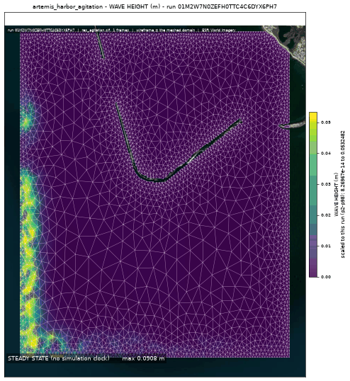
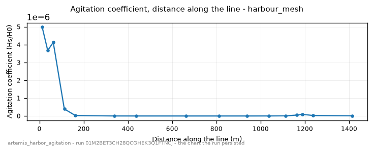

<!-- GENERATED by dev/instruments/gen_template_docs.py. Edit the declaration, not this file. -->

# `artemis_harbor_agitation`

The WAVE AGITATION (Kd = Hs/H0) a declared structure leaves inside a harbour, marina or sheltered basin.

|  |  |
|---|---|
| module | `artemis` - 118 keywords in its dictionary, of which this template states 9 |
| solves | `trid3nt_server.workflows.telemac.engine.solve_case` |
| engine defaults | every keyword this template does not state keeps the engine's own default; `describe_keywords` names it with that default, and `keywords={...}` sets it |

## The data it consumes

| row | produced by | what it is | datum |
|---|---|---|---|
| `box` | supplied by the caller | a rectangle layer you supply, as a uri or a layer name; required - the template names no source for it. | - |
| `coast` | `fetch_osm_coastline` | The land-water EDGE at survey resolution: OpenStreetMap coastline ways as LineStrings. | - |
| `domain` | `derive_water_polygon` | Cut the WATER out of a box with a mapped coastline -> one polygon layer. | - |
| `seafloor` | `fetch_topobathy` | Fetch a SEAMLESS coastal topo-bathymetry DEM (land + sea floor) for a bbox. | NAVD88 (metres, positive up) |
| `terrain` | `fetch_dem` | Fetch a digital elevation model (DEM) / terrain elevation for a bounding box (USGS 3DEP US lidar; on a 3DEP outage the default path STOPS and asks before any Copernicus GLO-30 swap; either source pinnable). | NAVD88 (metres, positive up) |
| `bed` | `derive_merge_rasters` | MERGE two overlapping surfaces into one, the PRIMARY winning where it measured. | - |
| `structure` | supplied by the caller | a polyline layer you supply, as a uri or a layer name; required - the template names no source for it. | - |
| `transect` | `derive_transect` | Lay ONE straight line through the centroid of a shape, along a bearing -> a line layer. | - |
| `mesh` | supplied by the caller | a mesh layer you supply, as a uri or a layer name; absent is legal and the run reports it. | - |

## The sheet

The values the template declares. `desc` is what the model reads when it fills one.

| param | door | units | default | desc |
|---|---|---|---|---|
| `wave_height_m` | scenario | m | 1.0 | Incident wave height H0 on the designated liquid boundary; Kd is measured against it, so it sets the scale of every narrated height |
| `reflection_coef` | scenario | - | 0.5 | The declared structure's reflection coefficient: 1 fully reflecting (a vertical quay), 0 fully absorbing (a rubble slope). Every other solid face is the absorbing shore |
| `mesh_resolution_m` | scenario | m | 8.0 | Finest triangle edge, used at the shoreline and around the structure. THE granularity lever: a phase-resolving solve needs several nodes per WAVELENGTH and Kd peaks inside a diffraction fringe, so a coarse mesh reads the peaks low |
| `mesh_grade` | constant | - | 0.2 | Mesh gradation: how fast the edge may grow from the structure band out to the open approach |
| `barrier_width_m` | scenario | m | 20.0 | The width the mapped structure centreline is cut at; a survey maps a mound as a line and a line removes no water from the domain |
| `transect_length_m` | scenario | m | 1500.0 | The whole length of the transect the agitation is read along: a straight line through the structure's centroid along the incident wave direction, half of it on the exposed side and half in the lee |
| `open_depth_threshold_m` | scenario | m | -12.0 | How deep a boundary stretch must reach for it to be designated the OPEN edge the incident wave enters through; every stretch that reaches it opens |
| `compute_class` | constant | - | medium | Solve sizing class - how many cores the solve is partitioned across. An engine that runs on one core says so on the card |

## What it answers

| field | the proving run's value |
|---|---|
| `kd_max` | 0.09084709733724594 |
| `kd_transect_min` | 8.637458559805286e-14 |
| `kd_transect_max` | 9.001717415912935e-08 |
| `hs_max_m` | 0.09084709733724594 |
| `mesh_size_m` | 6.593208586451455 |

It publishes these layers onto the canvas:

- Input: osm coastline (osm_coastline)
- Input: topobathy (topobathy, CUDEM 1/9" ~3 m nearshore; ETOPO 2022 15" ~450 m offshore fallback; 3DEP 10 m land, datum NAVD88 (metres, positive up))
- Input: bed elevation (dem, 3DEP 1-10 m US lidar (default 10 m); Copernicus GLO-30 30 m global via source=copernicus, datum NAVD88 (metres, positive up))
- Wave height (m) at t = 8 s (water_inside_the_box_mesh)
- Wave phase (rad) at t = 8 s (water_inside_the_box_mesh)
- Free surface (m) at t = 8 s (water_inside_the_box_mesh)
- Bottom (m) at t = 8 s (water_inside_the_box_mesh)
- Kd (Hs/H0) at t = 8 s (water_inside_the_box_mesh)
- water_inside_the_box_mesh

## The proving run

Run `01M2W7N0ZEFH0TTC4C6DYX6PH7`, 2026-09-19T07:04:07.578407+00:00, 28.63 s, at commit `8bcc5407309e3f52868fe2532f555f6228dc8262-dirty`.


*Every layer the run published, stacked and framed on the result (run 01M2W7N0ZEFH0TTC4C6DYX6PH7)*



*peak frame (run 01M2W7N0ZEFH0TTC4C6DYX6PH7)*



*agitation coefficient - the chart the run persisted (run 01M2W7N0ZEFH0TTC4C6DYX6PH7)*

### The sheet it filled

Every slot the run resolved, with where the value came from. The engine's own defaults are folded: what is not here, the engine chose.

| param | value | units | basis | provenance |
|---|---|---|---|---|
| `wave_height_m` | 1.0 | m | user | supplied on this invocation |
| `reflection_coef` | 0.3 | - | user | supplied on this invocation |
| `mesh_resolution_m` | 25.0 | m | user | supplied on this invocation |
| `mesh_grade` | 0.2 | - | default_demo | declared constant default |
| `barrier_width_m` | 20.0 | m | default_demo | declared scenario default |
| `transect_length_m` | 1500.0 | m | default_demo | declared scenario default |
| `open_depth_threshold_m` | -12.0 | m | default_demo | declared scenario default |
| `compute_class` | medium | - | default_demo | declared constant default |

### Reproduce

```python
from trid3nt_server.tools import TOOL_REGISTRY

await TOOL_REGISTRY['artemis_harbor_agitation'].fn(
    mesh_resolution_m=25.0,
    reflection_coef=0.3,
    wave_height_m=1.0,
    box="{'bbox': [-71.525, 41.338, -71.492, 41.368], 'name': 'Point Judith Harbor'}",
    structure=[{'length': 42, 'head': [[-71.48868, 41.36073], [-71.4885, 41.36065], [-71.4888, 41.36034], [-71.48908, 41.36007], [-71.48934, 41.35984], [-71.48958, 41.35967], [-71.48995, 41.35947], [-71.49028, 41.35936]], 'truncated': True}, [[-71.51466, 41.37429], [-71.51471, 41.37424], [-71.51627, 41.37261], [-71.51623, 41.3707], [-71.51618, 41.36983], [-71.51467, 41.3656], [-71.51471, 41.36549], [-71.51484, 41.36556], [-71.51639, 41.3696], [-71.51649, 41.37019], [-71.51652, 41.37268], [-71.51486, 41.37432], [-71.51466, 41.37429]], [[-71.50831, 41.35412], [-71.50726, 41.35414], [-71.49785, 41.35975], [-71.49801, 41.35998], [-71.50387, 41.3566], [-71.50434, 41.35618], [-71.50668, 41.35494], [-71.50741, 41.35436], [-71.50833, 41.35445], [-71.50942, 41.35457], [-71.5098, 41.35467], [-71.51022, 41.35484], [-71.51073, 41.35535], [-71.51145, 41.35717], [-71.51312, 41.36141], [-71.51325, 41.36145], [-71.51329, 41.36135], [-71.51109, 41.35532], [-71.51038, 41.35462], [-71.50948, 41.3543], [-71.50831, 41.35412]]],
    keywords={'DIRECTION OF WAVE PROPAGATION': 160.0},
)
```

That is the invocation this run came from; the figures above are stamped with run `01M2W7N0ZEFH0TTC4C6DYX6PH7` and commit `8bcc5407309e3f52868fe2532f555f6228dc8262-dirty`. The full argument record is [`artemis_harbor_agitation/run.json`](artemis_harbor_agitation/run.json).

