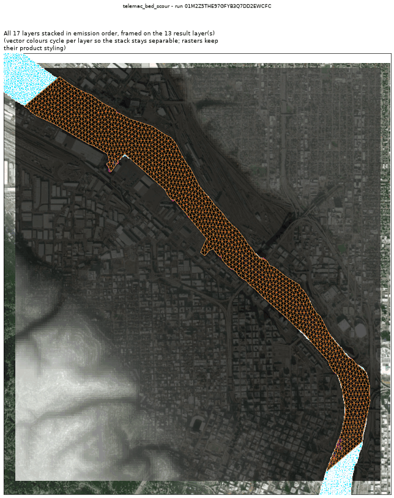
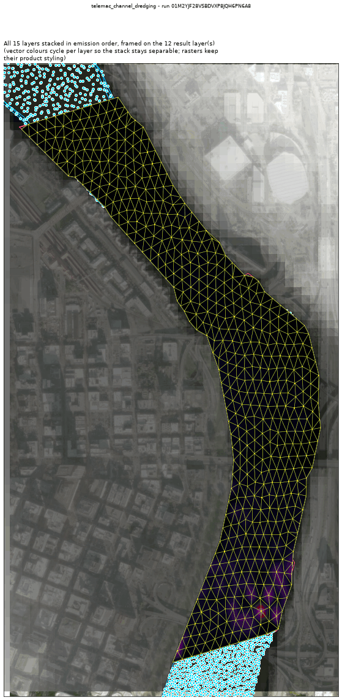
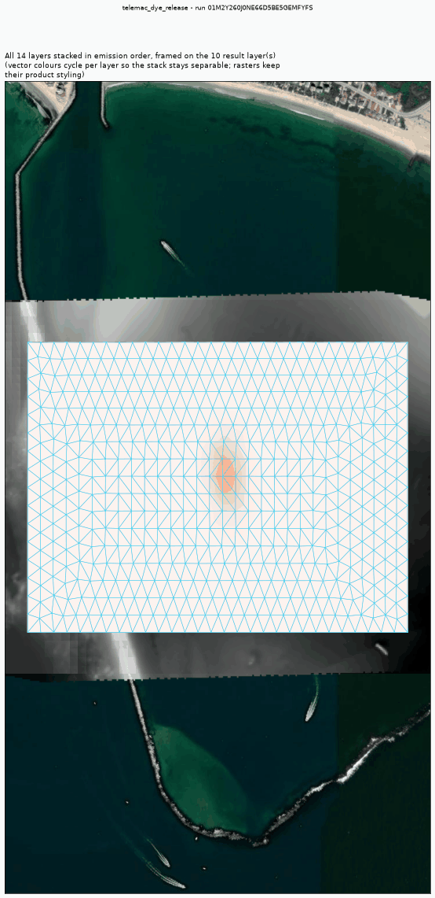
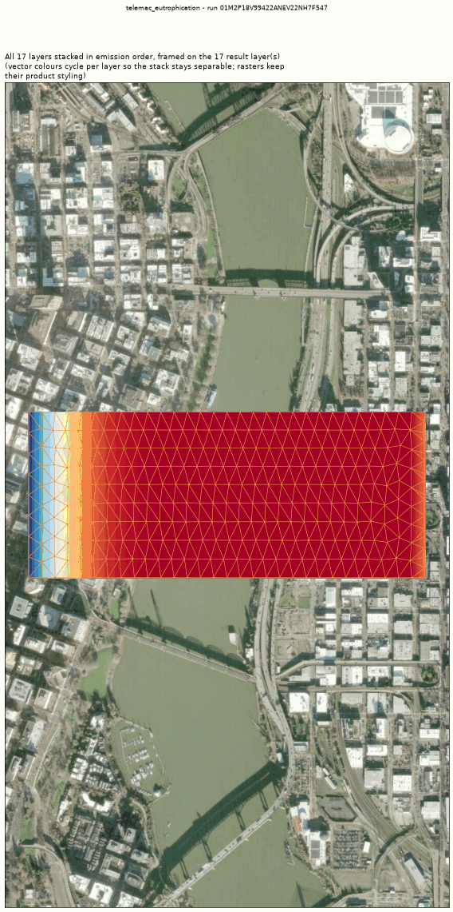
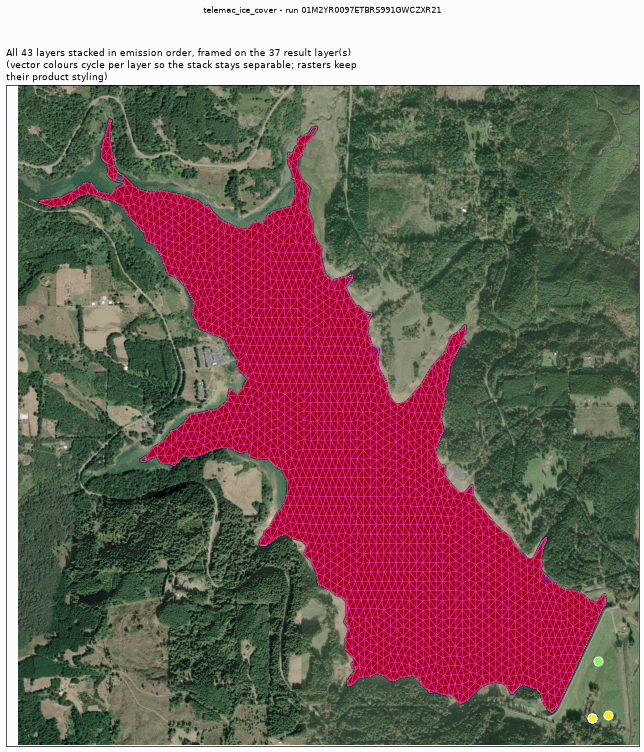
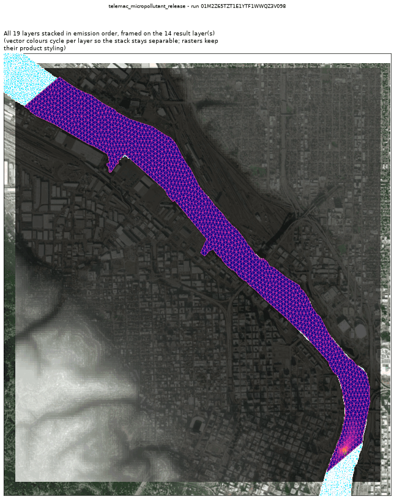
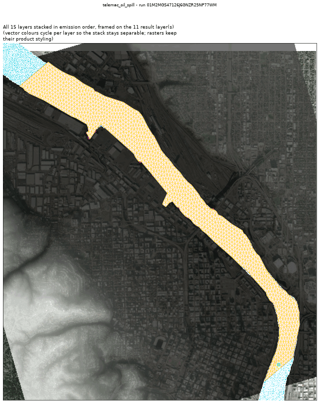
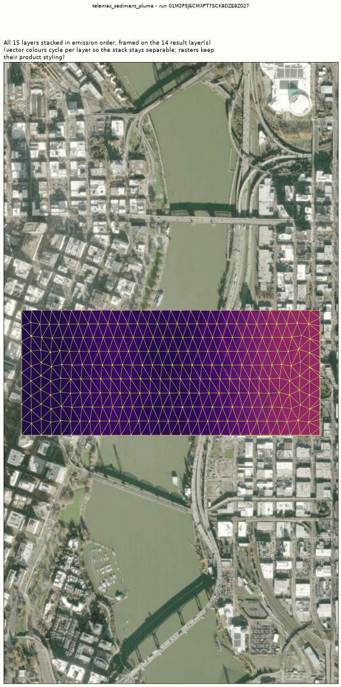
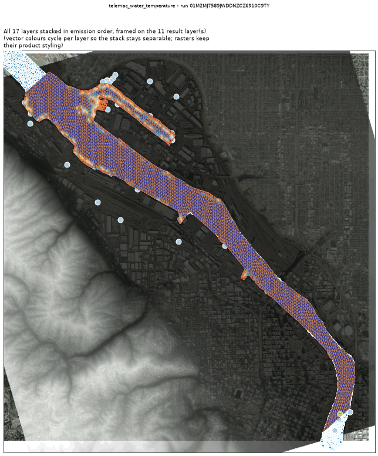

<!-- GENERATED by dev/instruments/gen_template_docs.py. Edit the declaration, not this file. -->

# Templates

15 registered templates, one per question. A template declares raw engine keywords over a module wrapper; `fill` sets the sheet and `run` solves it. The wrappers are in [`../modules.md`](../modules.md).

## [`artemis_harbor_agitation`](artemis_harbor_agitation.md)

The WAVE AGITATION (Kd = Hs/H0) a declared structure leaves inside a harbour, marina or sheltered basin.

Module `artemis`, proving run `01M2Z08QBE143NVJTDAG9523G0`.

## [`telemac3d_stratified_flow`](telemac3d_stratified_flow.md)

The 3D VERTICAL STRUCTURE of a body of water a 2D depth-averaged model cannot resolve.

Module `telemac3d`, proving run `01M2Z58EWXKBFQ7ZE2FZGF1VVT`.

## [`telemac_bed_scour`](telemac_bed_scour.md)

Bed SCOUR and DEPOSITION: a mobile bed under moving water.

Module `telemac2d`, proving run `01M2Z5THE97GFYB3Q7DD2EWCFC`.

## [`telemac_channel_dredging`](telemac_channel_dredging.md)

MAINTENANCE DREDGING of a navigation channel: how much comes out, and what the bed does.

Module `telemac2d`, proving run `01M2ZA2BXD0MYW6FMXQR9WK861`.

## [`telemac_do_sag`](telemac_do_sag.md)

DISSOLVED-OXYGEN SAG below a discharge (US TMDL / permit question).

Module `telemac2d`, proving run `01M2Z5T8D37A014SW9BS42SN1J`.

## [`telemac_dye_release`](telemac_dye_release.md)

A DYE / TRACER / CONTAMINANT plume released into a body of surface water and carried by its flow.

Module `telemac2d`, proving run `01M2Z8WJKKJRQ29PJXMCN8516G`.

## [`telemac_eutrophication`](telemac_eutrophication.md)

NUTRIENT ENRICHMENT in a body of water: algal growth, nutrient drawdown and the oxygen response over one pass through it.

Module `telemac2d`, proving run `01M2Z8WFFF7P4DR7RE0CJWRB1T`.

## [`telemac_ice_cover`](telemac_ice_cover.md)

ICE COVER under a cold snap: when water freezes over, and how thick.

Module `telemac2d`, proving run `01M2ZBPTGNGQXG8T1W4E4PG980`.

## [`telemac_micropollutant_release`](telemac_micropollutant_release.md)

A SORBING substance released into water: how much stays DISSOLVED and how much ends up ON THE BED.

Module `telemac2d`, proving run `01M2Z65TZT1E1YTF1WWQZ3V098`.

## [`telemac_oil_spill`](telemac_oil_spill.md)

An OIL SLICK released onto a body of surface water: floating particles plus the dissolved fraction.

Module `telemac2d`, proving run `01M2Z6RGYRX61C6RFPRMN7KF1M`.

## [`telemac_rain_on_grid`](telemac_rain_on_grid.md)

How much RUNOFF a storm produces from the catchment a point drains, as an outlet hydrograph and a flood-depth map.

Module `telemac2d`, proving run `01M2Z28K3DVHSQ1AXENC4F3SAG`.

## [`telemac_sediment_plume`](telemac_sediment_plume.md)

A SUSPENDED SEDIMENT plume in a body of water: it settles and deposits on the bed.

Module `telemac2d`, proving run `01M2Z58GD0T0D3YQ91WKPRRCCS`.

## [`telemac_water_temperature`](telemac_water_temperature.md)

WATER TEMPERATURE over a body of water under a week of real weather.

Module `telemac2d`, proving run `01M2ZCK2Z4BK96T1CN2AA7W5GH`.

## [`tomawac_nearshore_waves`](tomawac_nearshore_waves.md)

NEARSHORE WAVES: what the offshore swell becomes at the shore - how high, how long, which way, and where it breaks.

Module `tomawac`.

## [`tomawac_wave_driven_currents`](tomawac_wave_driven_currents.md)

WAVE-DRIVEN CURRENTS: the current breaking waves drive along the shore - how fast and which way.

Module `telemac2d`.

