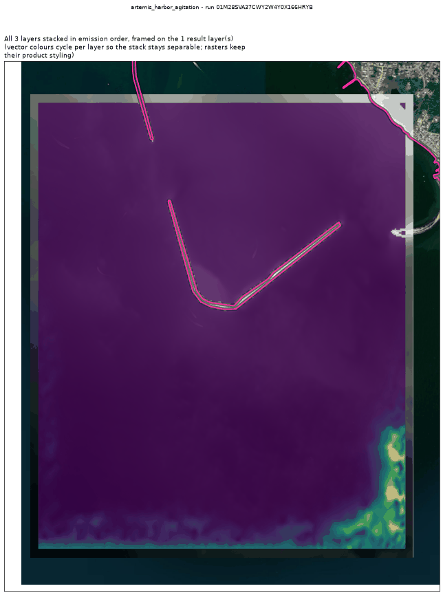
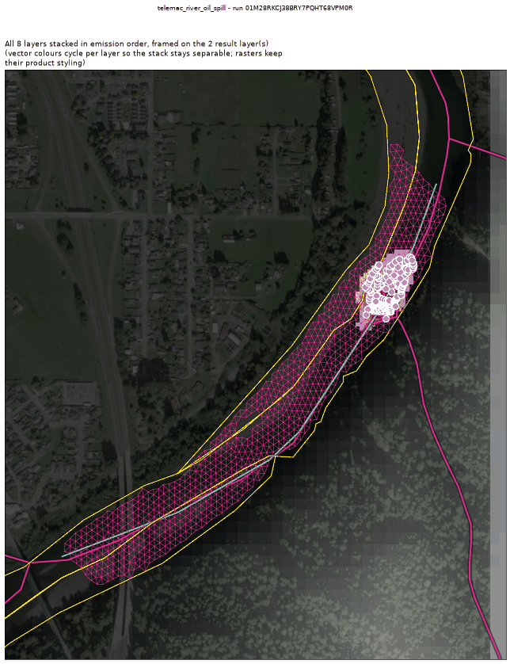

<!-- GENERATED by dev/instruments/gen_template_docs.py. Edit the declaration, not this file. -->

# Templates

8 registered templates, one per question. A template declares raw engine keywords over a module wrapper; `fill` sets the sheet and `run` solves it. The wrappers are in [`../modules.md`](../modules.md).

## [`artemis_harbor_agitation`](artemis_harbor_agitation.md)

The WAVE AGITATION (Kd = Hs/H0) a declared structure leaves inside a harbour.

Module `artemis`, proving run `01M28SVA37CWY2W4Y0X166HRYB`.

## [`telemac3d_stratified_flow`](telemac3d_stratified_flow.md)

The 3D VERTICAL STRUCTURE of a water body a 2D depth-averaged model cannot resolve.

Module `telemac3d`, proving run `01M28SNME4TPQGFNDQNA27WC99`.

## [`telemac_do_sag`](telemac_do_sag.md)

DISSOLVED-OXYGEN SAG below a discharge in a river (US TMDL / permit question).

Module `telemac2d`, proving run `01M28RZW1P4K64EKMJVJ2J2SD3`.

## [`telemac_rain_on_grid`](telemac_rain_on_grid.md)

How much RUNOFF a storm produces from this WATERSHED, as an outlet hydrograph and a flood-depth map.

Module `telemac2d`, proving run `01M28S5FHQS78XNTR8JHBM9F0P`.

## [`telemac_river_dye`](telemac_river_dye.md)

A DYE / TRACER / CONTAMINANT plume that TRAVELS DOWNSTREAM in a RIVER (surface water).

Module `telemac2d`, proving run `01M28RFK72DXH8Y8FMGSE3KY77`.

## [`telemac_river_oil_spill`](telemac_river_oil_spill.md)

An OIL SLICK released into a RIVER: floating particles plus the dissolved fraction.

Module `telemac2d`, proving run `01M28RKCJ38BRY7PQHT68VPM0R`.

## [`telemac_river_scour`](telemac_river_scour.md)

Bed SCOUR and DEPOSITION in a river reach: a mobile bed under a flow.

Module `telemac2d`, proving run `01M28N9SJQYMZDWEN49WMQWFX0`.

## [`telemac_river_sediment_plume`](telemac_river_sediment_plume.md)

A SUSPENDED SEDIMENT plume in a RIVER: it settles and deposits on the bed.

Module `telemac2d`, proving run `01M28RVXXZW8AS9TMD6X0NBBX4`.

