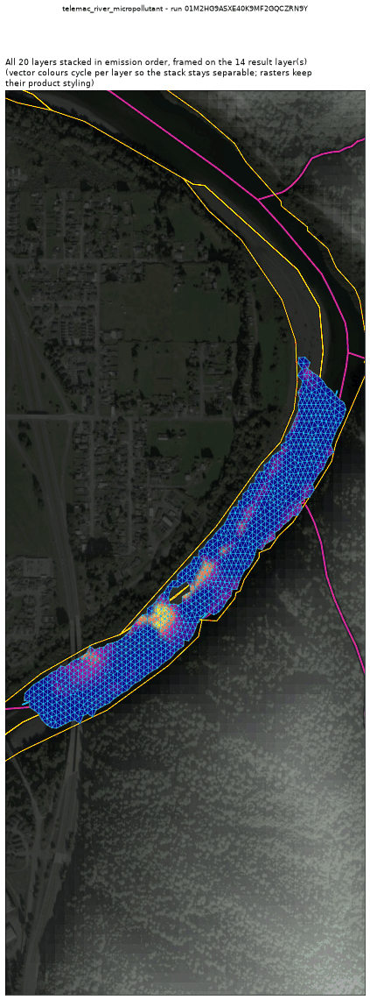

<!-- GENERATED by dev/instruments/gen_template_docs.py. Edit the declaration, not this file. -->

# Templates

12 registered templates, one per question. A template declares raw engine keywords over a module wrapper; `fill` sets the sheet and `run` solves it. The wrappers are in [`../modules.md`](../modules.md).

## [`artemis_harbor_agitation`](artemis_harbor_agitation.md)

The WAVE AGITATION (Kd = Hs/H0) a declared structure leaves inside a harbour.

Module `artemis`, proving run `01M2GPSF8H698ETFJMMRXTNZ8K`.

## [`telemac3d_stratified_flow`](telemac3d_stratified_flow.md)

The 3D VERTICAL STRUCTURE of a water body a 2D depth-averaged model cannot resolve.

Module `telemac3d`, proving run `01M2GPX6APX8R0R0PESGVWQA6J`.

## [`telemac_do_sag`](telemac_do_sag.md)

DISSOLVED-OXYGEN SAG below a discharge in a river (US TMDL / permit question).

Module `telemac2d`, proving run `01M2HH0XSVVXHH2NFT4F8ETMAW`.

## [`telemac_rain_on_grid`](telemac_rain_on_grid.md)

How much RUNOFF a storm produces from this WATERSHED, as an outlet hydrograph and a flood-depth map.

Module `telemac2d`, proving run `01M2GP3XQJENSXTD763387Z9TN`.

## [`telemac_river_dredging`](telemac_river_dredging.md)

MAINTENANCE DREDGING of a navigation channel: how much comes out, and what the bed does.

Module `telemac2d`, proving run `01M2GMW1YTJ5MS4MZV5S7Q2WSK`.

## [`telemac_river_dye`](telemac_river_dye.md)

A DYE / TRACER / CONTAMINANT plume that TRAVELS DOWNSTREAM in a RIVER (surface water).

Module `telemac2d`, proving run `01M2GNPFQ2077S20779R8FWZNH`.

## [`telemac_river_eutrophication`](telemac_river_eutrophication.md)

NUTRIENT ENRICHMENT down a river reach: algal growth, nutrient drawdown and the oxygen response over one pass.

Module `telemac2d`, proving run `01M2HGPJGC50366310WC8ZAMH7`.

## [`telemac_river_micropollutant`](telemac_river_micropollutant.md)

A SORBING substance in a RIVER: how much stays DISSOLVED and how much ends up ON THE BED.

Module `telemac2d`, proving run `01M2HG9ASXE40K9MF2GQCZRN9Y`.

## [`telemac_river_oil_spill`](telemac_river_oil_spill.md)

An OIL SLICK released into a RIVER: floating particles plus the dissolved fraction.

Module `telemac2d`, proving run `01M2GNW5YZVT75K4S0G5VMAXA0`.

## [`telemac_river_scour`](telemac_river_scour.md)

Bed SCOUR and DEPOSITION in a river reach: a mobile bed under a flow.

Module `telemac2d`, proving run `01M2GN2534D6GMNFVJ89C3SGHS`.

## [`telemac_river_sediment_plume`](telemac_river_sediment_plume.md)

A SUSPENDED SEDIMENT plume in a RIVER: it settles and deposits on the bed.

Module `telemac2d`, proving run `01M2GNFGG431SX89YQ0YMD8PPF`.

## [`telemac_river_temperature`](telemac_river_temperature.md)

WATER TEMPERATURE down a river reach under a week of real weather.

Module `telemac2d`, proving run `01M2HG0Z5RFAHPMYWJG862SQJM`.

