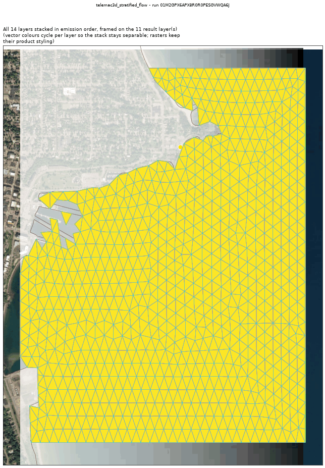
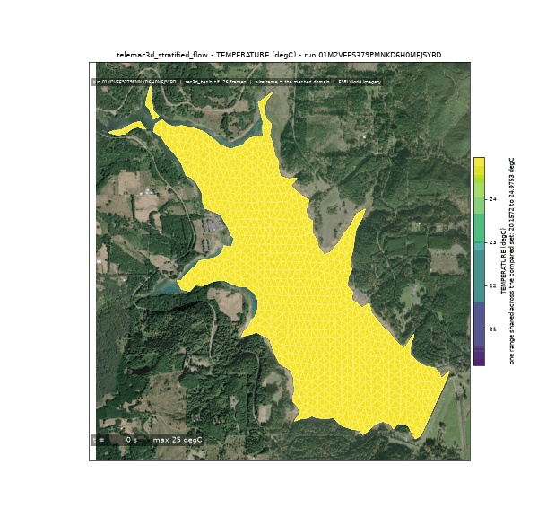
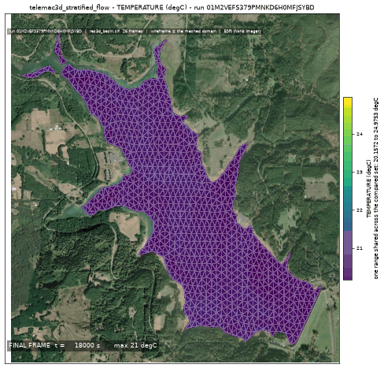
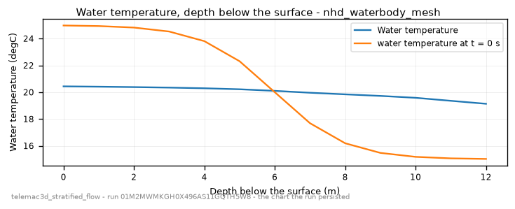

<!-- GENERATED by dev/instruments/gen_template_docs.py. Edit the declaration, not this file. -->

# `telemac3d_stratified_flow`

The 3D VERTICAL STRUCTURE of a water body a 2D depth-averaged model cannot resolve.

|  |  |
|---|---|
| module | `telemac3d` - 355 keywords in its dictionary, of which this template states 32 |
| solves | `trid3nt_server.workflows.telemac.engine.solve_case` |
| engine defaults | every keyword this template does not state keeps the engine's own default; `describe_keywords` names it with that default, and `keywords={...}` sets it |

## The data it consumes

| row | produced by | what it is | datum |
|---|---|---|---|
| `water` | `fetch_nhd_waterbodies` | USGS NHD waterbody polygons (lakes / ponds / reservoirs) as a vector layer. | - |
| `mapped` | `section` | Cut a POLYGON LAYER down to the part between two points, or inside an extent -> a polygon layer. | - |
| `bed` | `fetch_greatlakes_bathymetry` | Fetch the NOAA NCEI Great Lakes lake-datum BATHYMETRY over a bbox as a float32 GeoTIFF. | each Great Lake's own Low Water Datum (metres, positive up) |
| `day` | `trid3nt_server.workflows.telemac.templates.stratified_flow.lake_level.reading_day` | The DAY the gauge is read over, as the window the fetch asks for. | - |
| `level` | `fetch_greatlakes_water_level` | Fetch the OBSERVED Great Lakes water level at NOAA CO-OPS gauges as a FlatGeobuf. | each Great Lake's own Low Water Datum (metres, positive up) |

## The sheet

The values the template declares. `desc` is what the model reads when it fills one.

| param | door | units | default | desc |
|---|---|---|---|---|
| `location` | question | - | optional | Lake or basin place near the AOI (e.g. 'Marquette, Michigan'), geocoded |
| `bbox` | user | - | optional | Explicit AOI (min_lon,min_lat,max_lon,max_lat) EPSG:4326 - the stretch of the water body the column is solved over |
| `warm_temp_c` | scenario | C | 25.0 | Epilimnion (warm surface layer) temperature - a PRESCRIBED demo column, since no met-forcing fetcher exists yet |
| `cold_temp_c` | scenario | C | 15.0 | Hypolimnion (cold bottom layer) temperature; the initial top-to-bottom difference is what the run either keeps or mixes away |
| `thermocline_depth_m` | scenario | m | 8.0 | Depth of the thermocline below the surface. The vertical grid is planned to HOLD it and REFUSES when no admissible sigma stretch over the basin's deepest column can |
| `wind_speed_mps` | scenario | m/s | 0.0 | Sustained wind speed; 0 is CALM - the half of the pair in which the thermocline persists - and a nonzero value both mixes the column and drives the surface-downwind / return-flow-at-depth circulation reported beside the temperature |
| `wind_direction_deg` | scenario | deg | 270.0 | Compass bearing the wind blows FROM (0=N, 90=E, 270=W) |
| `levels` | scenario | - | 13 | Number of vertical sigma levels - the degree of freedom a 2D model does not have, so it is THE resolution lever here; too few for the declared thermocline is a refusal, not a coarser answer |
| `mesh_min_edge_m` | scenario | m | 120.0 | Triangle edge the basin interior is meshed at; the 3D node count is this mesh's nodes times the sigma levels |
| `event_time` | question | - | optional | The day the basin's OBSERVED lake level is read at the nearest CO-OPS gauge - from phrasing like 'during last Tuesday's blow'; an ISO date (e.g. '2026-09-05'). The run opens at the level that day closed on, so this is what makes a past event replayable |
| `sim_duration_hours` | constant | h | 5.0 | Simulated duration - long enough for the column to settle or mix |
| `time_step_s` | user | s | optional | Solver time step; unset derives it from the accepted mesh |
| `tracer_advection_scheme` | constant | - | 13 | SCHEME FOR ADVECTION OF TRACERS - the NERD family (13, 14), which is the distributive scheme the iteration ceiling below governs and the only one that is monotone across a thermocline. 13 is the value the engine's own telemac2d dictionary defaults this same keyword to; the dictionary gives the 3D one no default at all, so unstated it falls back to the VELOCITIES scheme (5, MURD PSI), which is what stopped a baroclinic basin at its first tracer step |
| `max_advection_iterations` | constant | - | 50 | MAXIMUM NUMBER OF ITERATIONS FOR ADVECTION SCHEMES - the ceiling the distributive schemes 13 and 14 sub-iterate under. Stated rather than defaulted because it is the number a run that stops on 'ITERATION NO. REACHED' is bounded by, and a reader of the deck cannot see a ceiling the deck does not write |
| `output_interval_min` | user | min | optional | Result-writing cadence; the profile is read off the last frame, so this decides how much of the column's history is animatable |
| `compute_class` | constant | - | medium | Solve sizing class |

## What it answers

| field | the proving run's value |
|---|---|
| `stratification_dt` | 2.684396743774414 |
| `stratification_dt_init` | 7.566164016723633 |
| `column_mean_final_c` | 23.967838529076406 |
| `column_mean_init_c` | 23.809924790897927 |
| `column_depth_m` | 8.834509253501892 |
| `u_surface` | -0.008700128644704819 |
| `u_bottom` | -0.023495305329561234 |
| `depth_avg_u` | -3.180281136734688e-05 |
| `planes` | 13 |
| `mesh_size_m` | 32.9447594688078 |

It publishes these layers onto the canvas:

- Input: nhd waterbodies (nhd_waterbodies)
- Input: greatlakes bathymetry (greatlakes_bathymetry, NCEI Great Lakes bathymetry is gridded at 3 arc-seconds (~90 m); 1800 px/deg is ~62 m, datum each Great Lake's own Low Water Datum (metres, positive up))
- Input: greatlakes water level (greatlakes_water_level, datum each Great Lake's own Low Water Datum (metres, positive up))
- Water temperature (degC) at t = 3600 s, bottom plane (basin_mesh)
- Water temperature (degC) at t = 3600 s, surface plane (basin_mesh)

## The proving run

Run `01M28SNME4TPQGFNDQNA27WC99`, 2026-09-11T17:55:22.880474+00:00, 102.03 s, at commit `e5e0a4bf6ebb05cc1a870257ce21ca118bb4ede4-dirty`.



*Every layer the run published, stacked and framed on the result (run 01M28SNME4TPQGFNDQNA27WC99)*



*The solve, frame by frame (run 01M28SNME4TPQGFNDQNA27WC99)*



*final frame (run 01M28SNME4TPQGFNDQNA27WC99)*



*water temperature - the chart the run persisted (run 01M28SNME4TPQGFNDQNA27WC99)*

### The sheet it filled

Every slot the run resolved, with where the value came from. The engine's own defaults are folded: what is not here, the engine chose.

| param | value | units | basis | provenance |
|---|---|---|---|---|
| `bbox` | [-87.39234, 46.52812, -87.36788, 46.55021] | - | user | supplied on this invocation |
| `warm_temp_c` | 25.0 | C | user | supplied on this invocation |
| `cold_temp_c` | 15.0 | C | user | supplied on this invocation |
| `thermocline_depth_m` | 8.0 | m | user | supplied on this invocation |
| `wind_speed_mps` | 0.0 | m/s | user | supplied on this invocation |
| `wind_direction_deg` | 270.0 | deg | user | supplied on this invocation |
| `levels` | 13 | - | user | supplied on this invocation |
| `mesh_min_edge_m` | 60.0 | m | user | supplied on this invocation |
| `sim_duration_hours` | 1.0 | h | user | supplied on this invocation |
| `compute_class` | medium | - | user | supplied on this invocation |
| `tracer_advection_scheme` | 13 | - | default_demo | declared constant default |
| `max_advection_iterations` | 50 | - | default_demo | declared constant default |
| `location` | - | - | prompt_interpreted | not supplied (declared optional) |
| `event_time` | - | - | prompt_interpreted | not supplied (declared optional) |
| `time_step_s` | - | s | user | not supplied (declared optional) |
| `output_interval_min` | - | min | user | not supplied (declared optional) |

### Reproduce

```python
from trid3nt_server.tools import TOOL_REGISTRY

await TOOL_REGISTRY['telemac3d_stratified_flow'].fn(
    bbox=[-87.39234, 46.52812, -87.36788, 46.55021],
    cold_temp_c=15.0,
    compute_class='medium',
    levels=13,
    mesh_min_edge_m=60.0,
    sim_duration_hours=1.0,
    thermocline_depth_m=8.0,
    warm_temp_c=25.0,
    wind_direction_deg=270.0,
    wind_speed_mps=0.0,
)
```

That is the invocation this run came from; the figures above are stamped with run `01M28SNME4TPQGFNDQNA27WC99` and commit `e5e0a4bf6ebb05cc1a870257ce21ca118bb4ede4-dirty`. The full argument record is [`telemac3d_stratified_flow/run.json`](telemac3d_stratified_flow/run.json).

