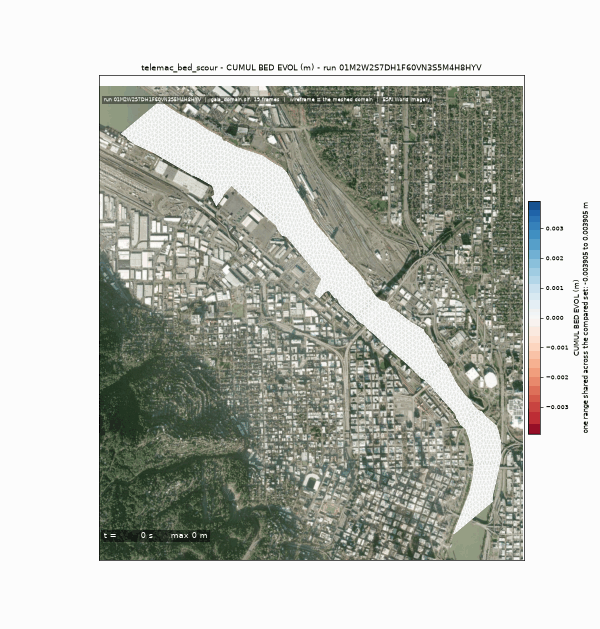
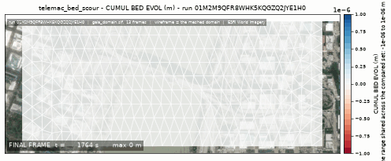
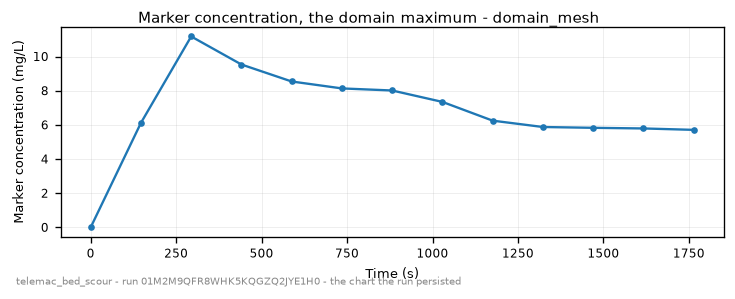

<!-- GENERATED by dev/instruments/gen_template_docs.py. Edit the declaration, not this file. -->

# `telemac_bed_scour`

Bed SCOUR and DEPOSITION under a body of water: a mobile bed under a flow.

|  |  |
|---|---|
| module | `telemac2d` - 376 keywords in its dictionary, of which this template states 30 |
| solves | `trid3nt_server.workflows.telemac.engine.solve_case` |
| engine defaults | every keyword this template does not state keeps the engine's own default; `describe_keywords` names it with that default, and `keywords={...}` sets it |

## The data it consumes

| row | produced by | what it is | datum |
|---|---|---|---|
| `domain` | `fetch_river_reach` | Build a RIVER REACH DOMAIN from one seed point -> the reach polygon, its inflow and outflow boundary runs, and the centerline. | - |
| `runs` | supplied by the caller | the stretches of the domain's edge that carry a boundary condition - each two points on the edge and a type (inflow, outflow, open); a closed body states none | - |
| `survey` | `fetch_ehydro_surveys` | Fetch USACE eHydro CHANNEL SURVEY soundings + the survey footprint for a bbox -> the measured bed. | - |
| `surveyed_bed` | `derive_survey_surface` | Interpolate a POINT layer of measurements onto a raster surface -> a continuous grid. | - |
| `terrain` | `fetch_copernicus_dem` | Internal seam -- NOT a model-facing tool (tier="internal"). | EGM2008 geoid (metres, positive up) |
| `bed` | `derive_merge_rasters` | MERGE two overlapping surfaces into one, the PRIMARY winning where it measured. | - |
| `carrier` | `fetch_noaa_nwm_streamflow` | Fetch NOAA National Water Model streamflow as a point FlatGeobuf. | - |
| `stage` | supplied by the caller | a water-surface elevation this run opens on: a layer of sites that report it, or the number itself in m. | - |

## The sheet

The values the template declares. `desc` is what the model reads when it fills one.

| param | door | units | default | desc |
|---|---|---|---|---|
| `release` | user | - | optional | Where the marker enters the water, as a Point: the pick's {coordinates, name} verbatim, a (lon, lat) pair, 'lat,lon', a point layer, or a place name. Its name becomes the marker's name, and on a river with no domain supplied it is also the seed the reach is walked downstream from |
| `spill_fraction` | scenario | - | 0.25 | Along-domain release position, 0=inflow..1=outflow; the source must sit strictly INSIDE the domain, never on a boundary |
| `spill_duration_s` | scenario | s | 300.0 | Finite pulse injection window |
| `source_q_m3s` | scenario | m^3/s | 8.0 | Point-source discharge of the release itself, small against the carrier flow |
| `tracer_concentration_mgl` | scenario | mg/L | 100.0 | Concentration of the marker tracer released at the source, which is what the deposited fraction is measured against |
| `wind_speed_mps` | scenario | m/s | 0.0 | Sustained wind driving a surface wind-stress term; 0 = no wind |
| `wind_direction_deg` | scenario | deg | 0.0 | Compass bearing the wind blows FROM (0=N, 90=E); only read when wind_speed_mps > 0 |
| `rainfall_mm_per_day` | user | mm/day | optional | NET distributed rainfall applied at every wet node, independent of the inflow hydrograph; negative is evaporation |
| `grain_size_um` | scenario | um | 200.0 | Median grain diameter d50 of the bed - ~200 um fine sand, ~20 um silt, ~8 um mud (all modeled non-cohesive); read only when no gradation is given |
| `bed_thickness_m` | scenario | m | 5.0 | Depth of the erodible sediment stock the bed can scour into |
| `bedload_formula` | scenario | - | 1 | GAIA bed-load law: 1=Meyer-Peter-Mueller, 2=Einstein-Brown, 7=van Rijn |
| `morphological_factor` | scenario | - | 10.0 | Amplifies bed change per hydraulic step so a short hydrograph yields a readable depth; a speed-up lever, not a rate |
| `sediment_gradation` | user | - | optional | Multi-class GRADED sediment: a preset name (graded_sand \| poorly_sorted \| sand_gravel_bimodal \| fine_coarse_sand) or a list of [d50_um, fraction] pairs; a mixture sorts under a hiding factor |
| `sim_duration_s` | scenario | s | 3600.0 | Simulated physical time; the morphological factor is what makes a short window produce a readable bed change |
| `mesh_resolution_m` | scenario | m | 14.0 | Target element edge or cell length the domain is resolved at. The granularity is the USER's lever: no sizing rung derives an edge from a channel nobody surveyed, so the number the run meshes at is either yours or this labeled default |
| `event_time` | question | - | optional | The moment the scenario is read at - an ISO date or datetime ('2026-08-20' or '2026-08-20T06:00:00Z'), from phrasing like 'during last Tuesday's storm'. Each source keeps its own retention, and a request deeper than one refuses typed |
| `compute_class` | constant | - | medium | Solve sizing class |

## What it answers

| field | the proving run's value |
|---|---|
| `bed_evolution_max_m` | 0.0 |
| `bed_evolution_min_m` | 0.0 |
| `net_bed_mass_kg` | 0.0 |
| `surface_d50_spread_m` | 0.0 |
| `marker_cmax_mgl` | 11.17357349395752 |
| `active_frames` | 12 |
| `mesh_size_m` | 14.704 |

It publishes these layers onto the canvas:

- Release point (user) - 01m2m9q5vkt26f81kymmcjygrc
- Velocity u over time (domain_mesh)
- Velocity v over time (domain_mesh)
- Water depth over time (domain_mesh)
- Free surface over time (domain_mesh)
- Bottom (m) at t = 1764 s (domain_mesh)
- Froude number over time (domain_mesh)
- Scalar flowrate over time (domain_mesh)
- Scalar velocity over time (domain_mesh)
- Marker over time (domain_mesh)
- Cumul bed evol over time (domain_mesh)
- Mean diameter m over time (domain_mesh)
- Bed shear stress over time (domain_mesh)
- domain_mesh

## The proving run

Run `01M2M9QFR8WHK5KQGZQ2JYE1H0`, 2026-09-16T05:06:30.806324+00:00, 26.538 s, at commit `f261dca1458988817e7433530a9a7e0e755c3960-dirty`.


*Every layer the run published, stacked and framed on the result (run 01M2M9QFR8WHK5KQGZQ2JYE1H0)*



*The solve, frame by frame (run 01M2M9QFR8WHK5KQGZQ2JYE1H0)*



*final frame (run 01M2M9QFR8WHK5KQGZQ2JYE1H0)*



*marker concentration - the chart the run persisted (run 01M2M9QFR8WHK5KQGZQ2JYE1H0)*

### The sheet it filled

Every slot the run resolved, with where the value came from. The engine's own defaults are folded: what is not here, the engine chose.

| param | value | units | basis | provenance |
|---|---|---|---|---|
| `release` | Point(lon=-122.6691667, lat=45.5175, name=None) | - | user | supplied on this invocation |
| `spill_duration_s` | 300.0 | s | user | supplied on this invocation |
| `source_q_m3s` | 8.0 | m^3/s | user | supplied on this invocation |
| `tracer_concentration_mgl` | 100.0 | mg/L | user | supplied on this invocation |
| `grain_size_um` | 200.0 | um | user | supplied on this invocation |
| `sim_duration_s` | 1800.0 | s | user | supplied on this invocation |
| `mesh_resolution_m` | 40.0 | m | user | supplied on this invocation |
| `spill_fraction` | 0.25 | - | default_demo | declared scenario default |
| `wind_speed_mps` | 0.0 | m/s | default_demo | declared scenario default |
| `wind_direction_deg` | 0.0 | deg | default_demo | declared scenario default |
| `bed_thickness_m` | 5.0 | m | default_demo | declared scenario default |
| `bedload_formula` | 1 | - | default_demo | declared scenario default |
| `morphological_factor` | 10.0 | - | default_demo | declared scenario default |
| `compute_class` | medium | - | default_demo | declared constant default |
| `rainfall_mm_per_day` | - | mm/day | user | not supplied (declared optional) |
| `sediment_gradation` | - | - | user | not supplied (declared optional) |
| `event_time` | - | - | prompt_interpreted | not supplied (declared optional) |

### Reproduce

```python
from trid3nt_server.tools import TOOL_REGISTRY

await TOOL_REGISTRY['telemac_bed_scour'].fn(
    grain_size_um=200.0,
    mesh_resolution_m=40.0,
    release='Point(lon=-122.6691667, lat=45.5175, name=None)',
    sim_duration_s=1800.0,
    source_q_m3s=8.0,
    spill_duration_s=300.0,
    tracer_concentration_mgl=100.0,
)
```

That is the invocation this run came from; the figures above are stamped with run `01M2M9QFR8WHK5KQGZQ2JYE1H0` and commit `f261dca1458988817e7433530a9a7e0e755c3960-dirty`. The full argument record is [`telemac_bed_scour/run.json`](telemac_bed_scour/run.json).

