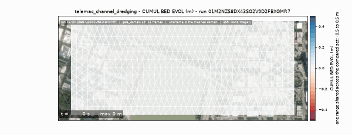
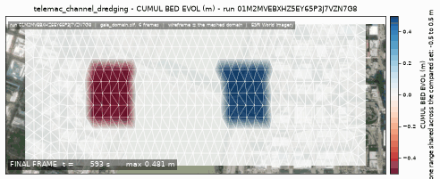

<!-- GENERATED by dev/instruments/gen_template_docs.py. Edit the declaration, not this file. -->

# `telemac_channel_dredging`

MAINTENANCE DREDGING of a navigation channel: how much comes out, and what the bed does.

|  |  |
|---|---|
| module | `telemac2d` - 376 keywords in its dictionary, of which this template states 26 |
| solves | `trid3nt_server.workflows.telemac.engine.solve_case` |
| engine defaults | every keyword this template does not state keeps the engine's own default; `describe_keywords` names it with that default, and `keywords={...}` sets it |

## The data it consumes

| row | produced by | what it is | datum |
|---|---|---|---|
| `domain` | `fetch_river_reach` | Build a RIVER REACH DOMAIN from one seed point -> the reach polygon, its inflow and outflow boundary runs, and the centerline. | - |
| `runs` | supplied by the caller | the stretches of the domain's edge that carry a boundary condition - each two points on the edge and a type (inflow, outflow, open); a closed body states none | - |
| `line` | supplied by the caller | a polyline layer you supply, as a uri or a layer name; required - the template names no source for it. | - |
| `survey` | `fetch_ehydro_surveys` | Fetch USACE eHydro CHANNEL SURVEY soundings + the survey footprint for a bbox -> the measured bed. | - |
| `surveyed_bed` | `derive_survey_surface` | Interpolate a POINT layer of measurements onto a raster surface -> a continuous grid. | - |
| `terrain` | `fetch_dem` | Fetch a digital elevation model (DEM) / terrain elevation for a bounding box (USGS 3DEP US lidar; on a 3DEP outage the default path STOPS and asks before any Copernicus GLO-30 swap; either source pinnable). | NAVD88 (metres, positive up) |
| `bed` | `derive_merge_rasters` | MERGE two overlapping surfaces into one, the PRIMARY winning where it measured. | - |
| `carrier` | `fetch_noaa_nwm_streamflow` | Fetch NOAA National Water Model streamflow as a point FlatGeobuf. | - |
| `dredge_area` | supplied by the caller | a polygon layer you supply, as a uri or a layer name; required - the template names no source for it. | - |
| `dump_area` | supplied by the caller | a polygon layer you supply, as a uri or a layer name; required - the template names no source for it. | - |
| `stage` | supplied by the caller | a layer you supply, as a uri or a layer name; absent is legal and the run reports it. | - |

## The sheet

The values the template declares. `desc` is what the model reads when it fills one.

| param | door | units | default | desc |
|---|---|---|---|---|
| `seed_point` | question | - | optional | A point ON the channel the dredge works in, as the pick's {coordinates, name} verbatim, a (lon, lat) pair, 'lat,lon' or a point layer. Geocode a place name first; the channel is fetched downstream of it and the levels every dredging action reads are stationed along the centerline that comes back with it |
| `sim_duration_s` | scenario | s | 3600.0 | Simulated physical time the dredge campaign runs over; the morphological factor is what makes a short window produce a readable bed change |
| `time_origin` | scenario | - | [2000, 1, 1, 0, 0, 0] | The calendar instant the run's clock starts at, as [year, month, day, hour, minute, second] - the origin every dredge schedule is dated against and the one the deck states |
| `design_depth_m` | scenario | m | 3.0 | Depth the fairway is dredged TO, under the reference water surface the run opens at - the design draught plus its overdepth |
| `trigger_depth_m` | scenario | m | 3.0 | Depth at which a node is dredged: the bed is worked wherever it sits shallower than this under the reference surface. Equal to design_depth_m keeps the channel exactly at grade; SMALLER than it lets the channel shoal before the dredger returns, and a trigger DEEPER than the grade would mark a node for a cut that is above its own bed |
| `dredge_start_s` | scenario | s | 0.0 | When the first dredging pass begins, in seconds of the BED's own clock - the run's morphological time, sim_duration_s x morphological_factor |
| `dredge_end_s` | scenario | s | 3000.0 | When the campaign stops, on the same bed clock: no further pass begins after it, and a pass already cutting runs on until it reaches grade |
| `dredge_repeat_s` | scenario | s | 1800.0 | Maintenance interval on the bed clock: how long after a pass starts the next one begins, if the channel has shoaled past trigger_depth_m again |
| `dig_rate_m_per_s` | scenario | m/s | 0.002 | How fast the dredger lowers the bed, as metres of bed per second of SOLVER time at a working node - the plant's capacity, not a physical rate. A pass reports its volume only once it has reached grade, so this and the cut it has to make are what decide whether the run sees a completed pass at all |
| `dump_rate_m_per_s` | scenario | m/s | 0.002 | How fast the spoil is laid into the dump area, as metres of bed per second of solver time at a receiving node; a pass is not finished until its spoil is placed |
| `min_volume_m3` | scenario | m^3 | 0.0 | Least volume worth moving around a node before it is dredged at all; 0 works every node past the trigger |
| `grain_size_um` | scenario | um | 200.0 | Median grain diameter d50 of the bed the channel shoals with - ~200 um fine sand, ~20 um silt (all modeled non-cohesive) |
| `bed_thickness_m` | scenario | m | 5.0 | Depth of the erodible sediment stock the dredger can cut into |
| `bedload_formula` | scenario | - | 1 | GAIA bed-load law: 1=Meyer-Peter-Mueller, 2=Einstein-Brown, 7=van Rijn |
| `morphological_factor` | scenario | - | 10.0 | Amplifies bed change per hydraulic step so a short campaign yields a readable depth; a speed-up lever, not a rate |
| `mesh_resolution_m` | scenario | m | 14.0 | Target element edge or cell length the domain is resolved at. The granularity is the USER's lever: no sizing rung derives an edge from a channel nobody surveyed, so the number the run meshes at is either yours or this labeled default |
| `event_time` | question | - | optional | The moment the scenario is read at - an ISO date or datetime ('2026-08-20' or '2026-08-20T06:00:00Z'), from phrasing like 'during last Tuesday's storm'. Each source keeps its own retention, and a request deeper than one refuses typed |
| `compute_class` | constant | - | medium | Solve sizing class |
| `vertical_frame` | constant | - | NAVD88 | Vertical datum this run counts every elevation from - the bed under it and the level over it. A source published on another frame reaches this one through a measured offset, and a pair nobody publishes an offset between refuses by name |

## What it answers

| field | the proving run's value |
|---|---|
| `dug_volume_m3` | 15771.846558 |
| `dumped_volume_m3` | 15771.846558 |
| `dredge_report` | the volumes are the engine's own report lines, summed over the passes that finished inside the run's clock |
| `dredged_bed_change_m` | -0.5 |
| `dumped_bed_change_m` | 0.4807279109954834 |
| `net_bed_mass_kg` | -0.714373 |
| `mesh_size_m` | 11.857 |

It publishes these layers onto the canvas:

- Velocity u over time (domain_mesh)
- Velocity v over time (domain_mesh)
- Water depth over time (domain_mesh)
- Free surface over time (domain_mesh)
- Bottom (m) at t = 593 s (domain_mesh)
- Froude number over time (domain_mesh)
- Scalar flowrate over time (domain_mesh)
- Scalar velocity over time (domain_mesh)
- Cumul bed evol over time (domain_mesh)
- Mean diameter m over time (domain_mesh)
- Bed shear stress over time (domain_mesh)
- domain_mesh

## The proving run

Run `01M2MVEBXHZ5EY65P3J7VZN7G8`, 2026-09-16T10:16:06.126197+00:00, 25.585 s, at commit `6d4a8675695837fac08133baa3c42ed4c30ee559-dirty`.


*Every layer the run published, stacked and framed on the result (run 01M2MVEBXHZ5EY65P3J7VZN7G8)*



*The solve, frame by frame (run 01M2MVEBXHZ5EY65P3J7VZN7G8)*



*final frame (run 01M2MVEBXHZ5EY65P3J7VZN7G8)*

### The sheet it filled

Every slot the run resolved, with where the value came from. The engine's own defaults are folded: what is not here, the engine chose.

| param | value | units | basis | provenance |
|---|---|---|---|---|
| `sim_duration_s` | 600.0 | s | user | supplied on this invocation |
| `design_depth_m` | 4.5 | m | user | supplied on this invocation |
| `trigger_depth_m` | 4.3 | m | user | supplied on this invocation |
| `dredge_start_s` | 600.0 | s | user | supplied on this invocation |
| `dredge_end_s` | 3600.0 | s | user | supplied on this invocation |
| `dredge_repeat_s` | 1800.0 | s | user | supplied on this invocation |
| `dig_rate_m_per_s` | 0.02 | m/s | user | supplied on this invocation |
| `dump_rate_m_per_s` | 0.02 | m/s | user | supplied on this invocation |
| `grain_size_um` | 200.0 | um | user | supplied on this invocation |
| `bed_thickness_m` | 5.0 | m | user | supplied on this invocation |
| `mesh_resolution_m` | 30.0 | m | user | supplied on this invocation |
| `time_origin` | [2000, 1, 1, 0, 0, 0] | - | default_demo | declared scenario default |
| `min_volume_m3` | 0.0 | m^3 | default_demo | declared scenario default |
| `bedload_formula` | 1 | - | default_demo | declared scenario default |
| `morphological_factor` | 10.0 | - | default_demo | declared scenario default |
| `compute_class` | medium | - | default_demo | declared constant default |
| `vertical_frame` | NAVD88 | - | default_demo | declared constant default |
| `seed_point` | - | - | prompt_interpreted | not supplied (declared optional) |
| `event_time` | - | - | prompt_interpreted | not supplied (declared optional) |

### Reproduce

```python
from trid3nt_server.tools import TOOL_REGISTRY

await TOOL_REGISTRY['telemac_channel_dredging'].fn(
    bed_thickness_m=5.0,
    design_depth_m=4.5,
    dig_rate_m_per_s=0.02,
    dredge_end_s=3600.0,
    dredge_repeat_s=1800.0,
    dredge_start_s=600.0,
    dump_rate_m_per_s=0.02,
    grain_size_um=200.0,
    mesh_resolution_m=30.0,
    sim_duration_s=600.0,
    trigger_depth_m=4.3,
)
```

That is the invocation this run came from; the figures above are stamped with run `01M2MVEBXHZ5EY65P3J7VZN7G8` and commit `6d4a8675695837fac08133baa3c42ed4c30ee559-dirty`. The full argument record is [`telemac_channel_dredging/run.json`](telemac_channel_dredging/run.json).

