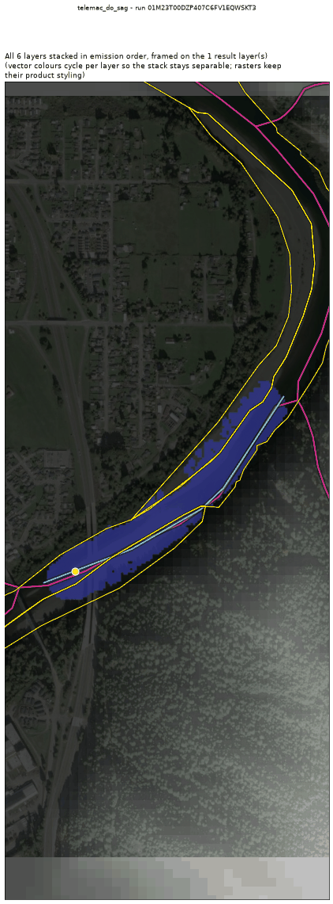
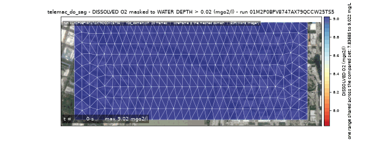
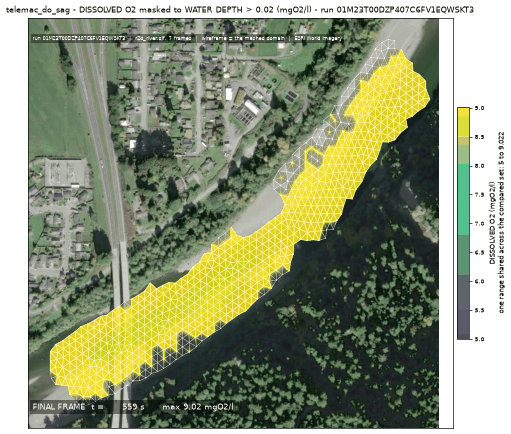
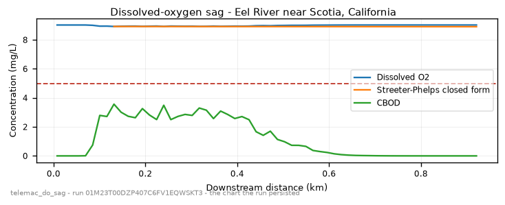

<!-- GENERATED by scripts/instruments/gen_template_docs.py. Edit the declaration, not this file. -->

# `telemac_do_sag`

DISSOLVED-OXYGEN SAG below a discharge in a river (US TMDL / permit question).

|  |  |
|---|---|
| module | `telemac2d` - 376 keywords in its dictionary, of which this template states 32 |
| parts | `RIVER` |
| solves | `trid3nt_server.workflows.telemac.solving.solve.solve_reach` |
| engine defaults | every keyword this template does not state keeps the engine's own default; `describe_keywords` names it with that default, and `keywords={...}` sets it |

## The data it consumes

| row | produced by | what it is | datum |
|---|---|---|---|
| `rivers` | `trid3nt_server.workflows.telemac.helpers.reach.fetch_reach_flowline` | The reach flowline FlatGeobuf over the CURRENT DOMAIN. Reference data. | - |
| `centerline` | `fetch_nhdplus_nldi_navigate` | Walk the NHDPlus stream network from a seed in the requested direction. | - |
| `ends` | `endpoints` | Take the TWO END POINTS of a line layer -> a point layer plus the pair itself. | - |
| `window` | `compute_layer_bounds` | Get a layer's geographic extent AND fit/zoom/resize the map to it. | - |
| `water` | `fetch_nhd_area_water` | Fetch NHD water-surface polygons (the two BANKS of a wide river, an estuary, a canal) inside a bounding box. | - |
| `mapped_water` | `trid3nt_server.workflows.telemac.helpers.reach.measure_water_coverage` | MEASURE how much of the reach the fetched water polygons map -> the water. | - |
| `reach_polygon` | `section` | Cut a POLYGON LAYER down to the part between two points, or inside an extent -> a polygon layer. | - |
| `dem` | `fetch_copernicus_dem` | Internal seam -- NOT a model-facing tool (tier="internal"). | EGM2008 geoid (metres, positive up) |

## The sheet

The values the template declares. `desc` is what the model reads when it fills one.

| param | door | units | default | desc |
|---|---|---|---|---|
| `river_geometry_uri` | user | - | optional | Reuse an already-fetched river flowline for this reach instead of re-fetching it |
| `friction_coefficient` | user | - | optional | Bed roughness under friction_law |
| `friction_law` | user | - | optional | Law interpreting friction_coefficient: 2=Chezy, 3=Strickler, 4=Manning |
| `location` | question | - | optional | Place name on the river, geocoded to the reach |
| `bbox` | user | - | optional | Explicit AOI (min_lon,min_lat,max_lon,max_lat) EPSG:4326, instead of a place |
| `discharge_m3s` | user | m^3/s | optional | Steady upstream CARRIER discharge - the river flow that dilutes and transports the release |
| `event_time` | question | - | optional | The storm/event moment to read the carrier discharge cycle at - from phrasing like 'during last Tuesday's storm'; an ISO date or datetime (e.g. '2026-08-20' or '2026-08-20T06:00:00Z'). Unset reads the most recent published NWM cycle. The NWM PDS bucket retains only the last ~30 days of history; a deeper request refuses typed rather than silently reading a different cycle. |
| `output_interval_min` | user | min | optional | Result-writing cadence; unset keeps the steering file's own period |
| `compute_class` | constant | - | medium | Solve sizing class |
| `outfall_coords` | user | - | optional | Where the discharge enters the water, (lon, lat); unset seeds the reach at the derived reach point |
| `effluent_bod_mgl` | scenario | mg/L | 250.0 | Ultimate carbonaceous BOD IN THE DISCHARGE ITSELF - what leaves the outfall pipe, before any dilution; the reach's mixed load is what the solve computes from this and the carrier flow |
| `effluent_q_m3s` | scenario | m^3/s | 1.0 | Discharge rate at the outfall - with the carrier flow this sets the dilution, and so how much of the effluent load the river carries |
| `effluent_do_mgl` | scenario | mg/L | 2.0 | Dissolved oxygen in the discharge itself; a treated effluent arrives oxygen-poor, which is the initial deficit the sag starts from |
| `water_temp_c` | scenario | C | 20.0 | Water temperature, which sets the DO saturation the deficit is measured against; 20 C is the standard Streeter-Phelps condition |
| `do_standard_mgl` | scenario | mg/L | 5.0 | The DO water-quality standard the sag is judged against; 5 is a common warm-water aquatic-life criterion |
| `k1_per_day` | scenario | 1/day | 0.3 | CBOD deoxygenation rate - a documented rate coefficient |
| `k2_per_day` | scenario | 1/day | 0.9 | Surface reaeration rate - a documented rate coefficient |
| `reach_length_km` | scenario | km | 12.0 | Modeled reach length downstream of the discharge; the sag critical point is often several km down |
| `do_saturation_mgl` | derived | mg/L | - | DO saturation Cs; derived from water temperature unless supplied |
| `upstream_do_mgl` | derived | mg/L | - | DO carried in at the top of the reach; derived as saturation unless supplied |
| `sim_duration_s` | scenario | s | 172800.0 | Simulated time. A sag is a STEADY-STATE answer, so this has to cover several travel times through the reach AND be long against 1/k1 - a window shorter than that reports a sag that has not developed yet |
| `mesh_resolution_m` | scenario | m | 14.0 | Target element edge length the reach is triangulated at; where the sag bottoms out is a local feature and moves with the element that resolves it |

## What it answers

| field | the proving run's value |
|---|---|
| `do_min_mgl` | 8.9209 |
| `do_min_distance_m` | 131.5 |
| `do_standard_mgl` | 5.0 |
| `do_violates_standard` | False |
| `do_upstream_mgl` | 9.022 |
| `do_saturation_mgl` | 9.022 |
| `bod_mixed_mgl` | 3.565 |
| `mean_velocity_mps` | 0.60974 |
| `sag_curve_distance_m` | {'length': 60, 'head': [7.7, 23.2, 38.7, 54.2, 69.6, 85.1, 100.6, 116.1], 'truncated': True} |
| `sag_curve_do_mgl` | {'length': 60, 'head': [9.022, 9.022, 9.022, 9.022, 9.0218, 9.0009, 8.9433, 8.9452], 'truncated': True} |
| `sag_curve_bod_mgl` | {'length': 60, 'head': [0.0, 0.0, 0.0, 0.0001, 0.0082, 0.7486, 2.7902, 2.7162], 'truncated': True} |
| `sp_curve_distance_m` | {'length': 52, 'head': [131.5, 147.0, 162.5, 178.0, 193.4, 208.9, 224.4, 239.9], 'truncated': True} |
| `sp_curve_do_mgl` | {'length': 52, 'head': [8.9209, 8.9206, 8.9203, 8.92, 8.9197, 8.9194, 8.9191, 8.9188], 'truncated': True} |
| `sp_rms_mgl` | 0.0822 |
| `sp_sag_deviation_mgl` | 0.0145 |
| `sp_note` | Streeter-Phelps closed form from the modeled mix point (132 m downstream, CBOD 3.56 mg/L, DO 8.92 mg/L) at the solved mean along-reach velocity 0.610 m/s |
| `mesh_size_m` | 9.323 |

It publishes these layers onto the canvas:

- Input: OSM waterways (map context; the modeled river is the NLDI centerline) (river_geometry)
- Input: nhdplus nldi (nhdplus_nldi)
- Input: nhd area water (nhd_area_water)
- Input: river bed elevation (copernicus_dem, datum EGM2008 geoid (metres, positive up))
- Outfall (user) - scotia_humboldt_county_california_95562_united_s
- Dissolved oxygen sag (scotia_humboldt_county_california_95562_united_s)

## The proving run

Run `01M23T00DZP407C6FV1EQWSKT3`, 2026-09-09T19:23:38.965417+00:00, 26.293 s, at commit `1f0ccc3188561e84f5f977f0d0d6c54e08c9adb1`.



*Every layer the run published, stacked and framed on the result (run 01M23T00DZP407C6FV1EQWSKT3)*



*The solve, frame by frame (run 01M23T00DZP407C6FV1EQWSKT3)*



*final frame (run 01M23T00DZP407C6FV1EQWSKT3)*



*do sag curve - the chart the run persisted (run 01M23T00DZP407C6FV1EQWSKT3)*

### The sheet it filled

Every slot the run resolved, with where the value came from. The engine's own defaults are folded: what is not here, the engine chose.

| param | value | units | basis | provenance |
|---|---|---|---|---|
| `location` | Eel River near Scotia, California | - | user | supplied on this invocation |
| `discharge_m3s` | 60.0 | m^3/s | user | supplied on this invocation |
| `outfall_coords` | [-124.0983, 40.4921] | - | user | supplied on this invocation |
| `effluent_bod_mgl` | 250.0 | mg/L | user | supplied on this invocation |
| `effluent_q_m3s` | 1.0 | m^3/s | user | supplied on this invocation |
| `water_temp_c` | 20.0 | C | user | supplied on this invocation |
| `do_standard_mgl` | 5.0 | mg/L | user | supplied on this invocation |
| `k1_per_day` | 0.3 | 1/day | user | supplied on this invocation |
| `k2_per_day` | 0.9 | 1/day | user | supplied on this invocation |
| `reach_length_km` | 0.5 | km | user | supplied on this invocation |
| `sim_duration_s` | 600.0 | s | user | supplied on this invocation |
| `mesh_resolution_m` | 12.0 | m | user | supplied on this invocation |
| `compute_class` | medium | - | default_demo | declared constant default |
| `effluent_do_mgl` | 2.0 | mg/L | default_demo | declared scenario default |
| `do_saturation_mgl` | 9.022 | mg/L | derived | derived by trid3nt_server.workflows.telemac.helpers.water_quality.do_saturation_mgl |
| `upstream_do_mgl` | 9.022 | mg/L | derived | derived by trid3nt_server.workflows.telemac.helpers.water_quality.upstream_do_mgl |
| `river_geometry_uri` | - | - | user | not supplied (declared optional) |
| `friction_coefficient` | - | - | user | not supplied (declared optional) |
| `friction_law` | - | - | user | not supplied (declared optional) |
| `bbox` | - | - | user | not supplied (declared optional) |
| `event_time` | - | - | prompt_interpreted | not supplied (declared optional) |
| `output_interval_min` | - | min | user | not supplied (declared optional) |

### Reproduce

```python
from trid3nt_server.tools import TOOL_REGISTRY

await TOOL_REGISTRY['telemac_do_sag'].fn(
    discharge_m3s=60.0,
    do_standard_mgl=5.0,
    effluent_bod_mgl=250.0,
    effluent_q_m3s=1.0,
    k1_per_day=0.3,
    k2_per_day=0.9,
    location='Eel River near Scotia, California',
    mesh_resolution_m=12.0,
    outfall_coords=[-124.0983, 40.4921],
    reach_length_km=0.5,
    sim_duration_s=600.0,
    water_temp_c=20.0,
)
```

That is the invocation this run came from; the figures above are stamped with run `01M23T00DZP407C6FV1EQWSKT3` and commit `1f0ccc3188561e84f5f977f0d0d6c54e08c9adb1`. The full argument record is [`telemac_do_sag/run.json`](telemac_do_sag/run.json).

