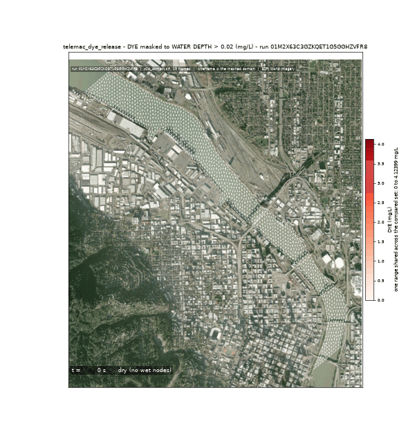
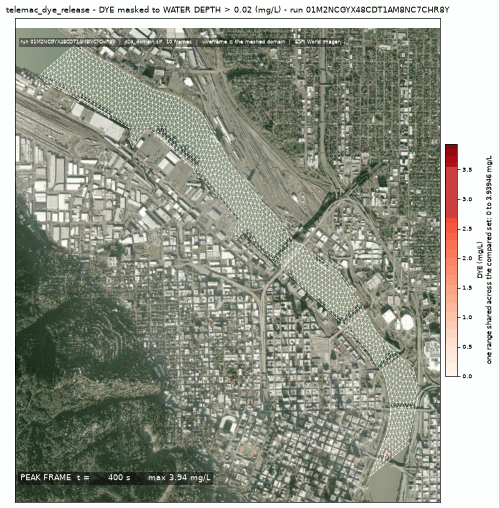
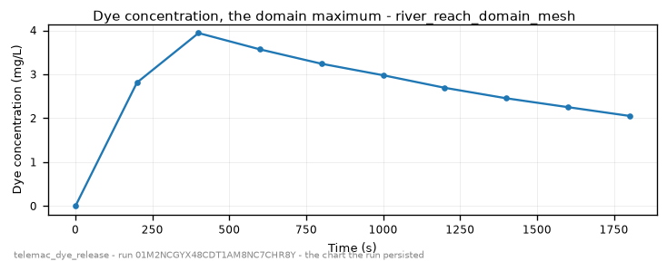

<!-- GENERATED by dev/instruments/gen_template_docs.py. Edit the declaration, not this file. -->

# `telemac_dye_release`

A DYE / TRACER / CONTAMINANT plume released into a body of surface water and carried by its flow.

|  |  |
|---|---|
| module | `telemac2d` - 376 keywords in its dictionary, of which this template states 34 |
| solves | `trid3nt_server.workflows.telemac.engine.solve_case` |
| engine defaults | every keyword this template does not state keeps the engine's own default; `describe_keywords` names it with that default, and `keywords={...}` sets it |

## The data it consumes

| row | produced by | what it is | datum |
|---|---|---|---|
| `domain` | `fetch_river_reach` | Build a RIVER REACH DOMAIN from one seed point -> the reach polygon, its inflow and outflow boundary runs, and the centerline. | - |
| `runs` | supplied by the caller | the stretches of the domain's edge that carry a boundary condition - each two points on the edge and a type (inflow, outflow, open); a closed body states none | - |
| `survey` | `fetch_ehydro_surveys` | Fetch USACE eHydro CHANNEL SURVEY soundings + the survey footprint for a bbox -> the measured bed. | - |
| `surveyed_bed` | `derive_survey_surface` | Interpolate a POINT layer of measurements onto a raster surface -> a continuous grid. | - |
| `terrain` | `fetch_dem` | Fetch a digital elevation model (DEM) / terrain elevation for a bounding box (USGS 3DEP US lidar; on a 3DEP outage the default path STOPS and asks before any Copernicus GLO-30 swap; either source pinnable). | NAVD88 (metres, positive up) |
| `bed` | `derive_merge_rasters` | MERGE two overlapping surfaces into one, the PRIMARY winning where it measured. | - |
| `carrier` | `fetch_noaa_nwm_streamflow` | Fetch NOAA National Water Model streamflow as a point FlatGeobuf. | - |
| `stage` | supplied by the caller | a layer you supply, as a uri or a layer name; absent is legal and the run reports it. | - |

## The sheet

The values the template declares. `desc` is what the model reads when it fills one.

| param | door | units | default | desc |
|---|---|---|---|---|
| `release` | user | - | optional | Where the substance enters the water, as a Point: the pick's {coordinates, name} verbatim, a (lon, lat) pair, 'lat,lon', a point layer, or a place name. Its name becomes the tracer's name, and on a river with no domain supplied it is also the seed the reach is walked downstream from |
| `spill_fraction` | scenario | - | 0.25 | Along-domain release position, 0=inflow..1=outflow; the source must sit strictly INSIDE the domain, never on a boundary |
| `spill_duration_s` | scenario | s | 300.0 | Finite pulse injection window |
| `source_q_m3s` | scenario | m^3/s | 8.0 | Point-source discharge of the release itself, small against the carrier flow |
| `dye_concentration_mgl` | scenario | mg/L | 100.0 | Source concentration of the released substance |
| `wind_speed_mps` | scenario | m/s | 0.0 | Sustained wind driving a surface wind-stress term; 0 = no wind |
| `wind_direction_deg` | scenario | deg | 0.0 | Compass bearing the wind blows FROM (0=N, 90=E); only read when wind_speed_mps > 0 |
| `rainfall_mm_per_day` | user | mm/day | optional | NET distributed rainfall applied at every wet node, independent of the inflow hydrograph; negative is evaporation |
| `decaying_substance` | question | - | optional | Name a substance whose tracer DECAYS - sewage \| E. coli \| coliform \| bacteria \| effluent \| wastewater - and its narrated literature die-off is applied as a first-order sink on the plume |
| `decay_half_life_hours` | user | h | optional | First-order half-life of the released substance; unset uses the narrated literature default for decaying_substance, and neither leaves the tracer conservative |
| `decay_rate_per_day` | user | 1/day | optional | Decay rate per day, as an alternative to the half-life |
| `sim_duration_s` | scenario | s | 3600.0 | Simulated physical time the run covers. The clock the run is settled on, so the deck's DURATION and every window read off it are this one number; what is long enough is the question's, and a question that knows states its own |
| `continue_from` | user | - | optional | Continue a previous run: the URI of its restart_domain.slf, the state at its last instant, which becomes this run's initial state - so sim_duration_s is the time added ON TOP of it and the same declared scenario carries on over the longer horizon (a release whose spill_duration_s has elapsed stays finished). The mesh must be the same one, and a run that couples WAQTEL refuses |
| `mesh_resolution_m` | scenario | m | 14.0 | Target element edge or cell length the domain is resolved at. The granularity is the USER's lever: no sizing rung derives an edge from a channel nobody surveyed, so the number the run meshes at is either yours or this labeled default |
| `event_time` | question | - | optional | The moment the scenario is read at - an ISO date or datetime ('2026-08-20' or '2026-08-20T06:00:00Z'), from phrasing like 'during last Tuesday's storm'. Each source keeps its own retention, and a request deeper than one refuses typed |
| `compute_class` | constant | - | medium | Solve sizing class |
| `vertical_frame` | constant | - | NAVD88 | Vertical datum this run counts every elevation from - the bed under it and the level over it. A source published on another frame reaches this one through a measured offset, and a pair nobody publishes an offset between refuses by name |

## What it answers

| field | the proving run's value |
|---|---|
| `dye_cmax_mgl` | 3.9394562244415283 |
| `dye_peak_time_s` | 400.0 |
| `plume_reach_m` | 21.3 |
| `active_frames` | 9 |
| `mesh_size_m` | 20.888 |

It publishes these layers onto the canvas:

- Input: river reach (river_reach)
- Input: ehydro surveys (ehydro_surveys)
- Input: bed elevation (dem, 3DEP 1-10 m US lidar (default 10 m); Copernicus GLO-30 30 m global via source=copernicus, datum NAVD88 (metres, positive up))
- Release point (user) - river_reach_domain
- Velocity u over time (river_reach_domain_mesh)
- Velocity v over time (river_reach_domain_mesh)
- Water depth over time (river_reach_domain_mesh)
- Free surface over time (river_reach_domain_mesh)
- Bottom (m) at t = 1800 s (river_reach_domain_mesh)
- Froude number over time (river_reach_domain_mesh)
- Scalar flowrate over time (river_reach_domain_mesh)
- Scalar velocity over time (river_reach_domain_mesh)
- Dye over time (river_reach_domain_mesh)
- river_reach_domain_mesh

## The proving run

Run `01M2NCGYX48CDT1AM8NC7CHR8Y`, 2026-09-16T15:14:35.351431+00:00, 27.197 s, at commit `9ed0d08f4fe78cc3984c7efe2aa099ddc5f936e3-dirty`.


*Every layer the run published, stacked and framed on the result (run 01M2NCGYX48CDT1AM8NC7CHR8Y)*



*The solve, frame by frame (run 01M2NCGYX48CDT1AM8NC7CHR8Y)*



*peak frame (run 01M2NCGYX48CDT1AM8NC7CHR8Y)*



*dye concentration - the chart the run persisted (run 01M2NCGYX48CDT1AM8NC7CHR8Y)*

### The sheet it filled

Every slot the run resolved, with where the value came from. The engine's own defaults are folded: what is not here, the engine chose.

| param | value | units | basis | provenance |
|---|---|---|---|---|
| `release` | Point(lon=-122.669784, lat=45.518485, name=None) | - | user | supplied on this invocation |
| `spill_fraction` | 0.25 | - | user | supplied on this invocation |
| `spill_duration_s` | 300.0 | s | user | supplied on this invocation |
| `source_q_m3s` | 8.0 | m^3/s | user | supplied on this invocation |
| `dye_concentration_mgl` | 100.0 | mg/L | user | supplied on this invocation |
| `sim_duration_s` | 1800.0 | s | user | supplied on this invocation |
| `mesh_resolution_m` | 40.0 | m | user | supplied on this invocation |
| `wind_speed_mps` | 0.0 | m/s | default_demo | declared scenario default |
| `wind_direction_deg` | 0.0 | deg | default_demo | declared scenario default |
| `compute_class` | medium | - | default_demo | declared constant default |
| `vertical_frame` | NAVD88 | - | default_demo | declared constant default |
| `rainfall_mm_per_day` | - | mm/day | user | not supplied (declared optional) |
| `decaying_substance` | - | - | prompt_interpreted | not supplied (declared optional) |
| `decay_half_life_hours` | - | h | user | not supplied (declared optional) |
| `decay_rate_per_day` | - | 1/day | user | not supplied (declared optional) |
| `continue_from` | - | - | user | not supplied (declared optional) |
| `event_time` | - | - | prompt_interpreted | not supplied (declared optional) |

### Reproduce

```python
from trid3nt_server.tools import TOOL_REGISTRY

await TOOL_REGISTRY['telemac_dye_release'].fn(
    dye_concentration_mgl=100.0,
    mesh_resolution_m=40.0,
    release='Point(lon=-122.669784, lat=45.518485, name=None)',
    sim_duration_s=1800.0,
    source_q_m3s=8.0,
    spill_duration_s=300.0,
    spill_fraction=0.25,
)
```

That is the invocation this run came from; the figures above are stamped with run `01M2NCGYX48CDT1AM8NC7CHR8Y` and commit `9ed0d08f4fe78cc3984c7efe2aa099ddc5f936e3-dirty`. The full argument record is [`telemac_dye_release/run.json`](telemac_dye_release/run.json).

