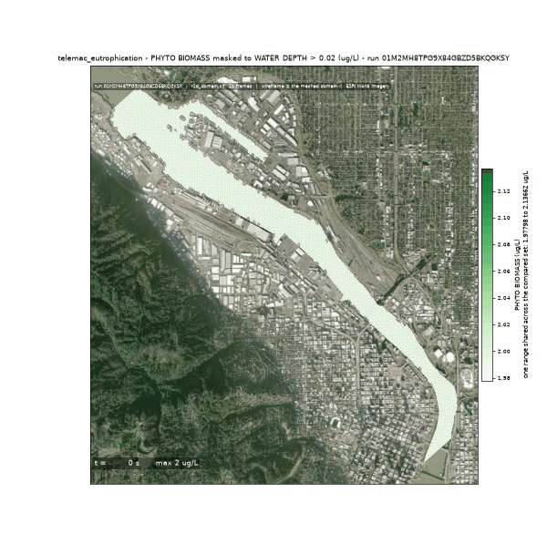
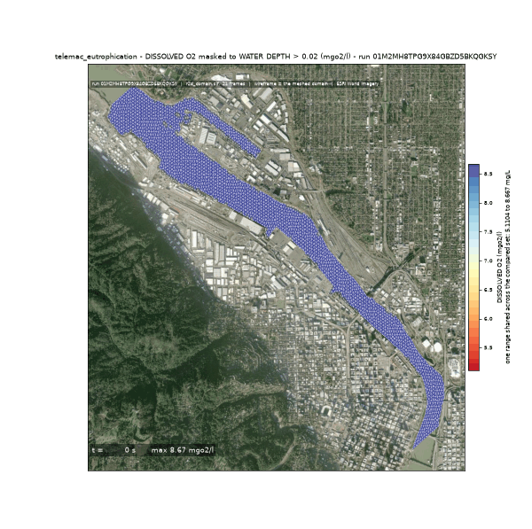
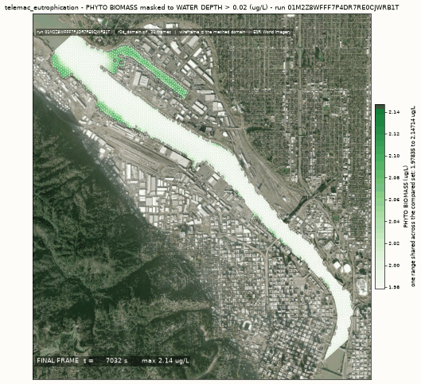
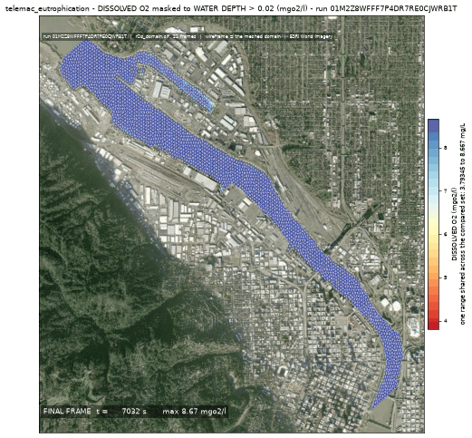
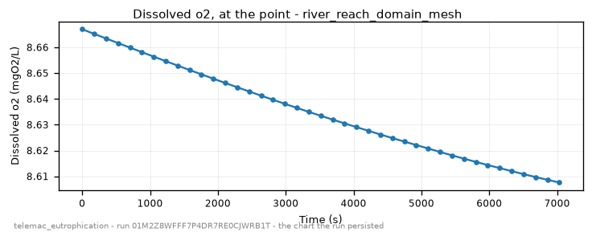
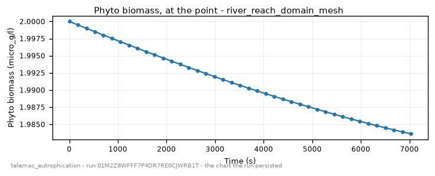

<!-- GENERATED by dev/instruments/gen_template_docs.py. Edit the declaration, not this file. -->

# `telemac_eutrophication`

NUTRIENT ENRICHMENT in a body of water: algal growth, nutrient drawdown and the oxygen response over one pass through it.

|  |  |
|---|---|
| module | `telemac2d` - 376 keywords in its dictionary, of which this template states 26 |
| solves | `trid3nt_server.workflows.telemac.engine.solve_case` |
| engine defaults | every keyword this template does not state keeps the engine's own default; `describe_keywords` names it with that default, and `keywords={...}` sets it |

## The data it consumes

| row | produced by | what it is | datum |
|---|---|---|---|
| `domain` | matched on a need for hydrography | the closed polygon this run solves over, as a uri, a layer name or a drawn shape; unfilled, the run matches a source of hydrography. | - |
| `line` | supplied by the caller | a polyline layer you supply, as a uri or a layer name; required - the template names no source for it. | - |
| `bed` | matched on a need for bathymetry | what the domain's nodes carry for elevation: a DEM, a bathymetry or survey raster, a layer of soundings, or a depth in metres below the free surface; unfilled, the run matches a source of bathymetry. | - |
| `discharge` | matched on a need for discharge series | the discharge series this run opens on: a layer of sites that report it, or the number itself; unfilled, the run matches a source of discharge series. | - |
| `observe` | matched on a need for water quality sample | the water quality sample this run opens on: a layer of sites that report it, or the number itself; unfilled, the run matches a source of water quality sample. | - |
| `level` | matched on a need for water level series | the water level series this run opens on: a layer of sites that report it, or the number itself; unfilled, the run matches a source of water level series. | - |

## The sheet

The values the template declares. `desc` is what the model reads when it fills one.

| param | door | units | default | desc |
|---|---|---|---|---|
| `seed` | user | - | optional | Where on the channel the modelled stretch STARTS, as a Point: the pick's {coordinates, name} verbatim, a (lon, lat) pair, 'lat,lon', a point layer. Geocode a place name first. The stretch walked downstream of it is the water one pass is measured over; supply the domain polygon instead and this is not read |
| `station` | user | - | optional | Where to watch the biomass and the oxygen over time, as a Point: the pick's {coordinates, name} verbatim, a (lon, lat) pair, 'lat,lon' or a point layer (geocode a place name first). The answers are all longitudinal and do not move with it |
| `do_standard_mgl` | scenario | mg/L | 5.0 | The DO water-quality standard the water is judged against; 5 is a common warm-water aquatic-life criterion. It never reaches the deck: no keyword names a standard, and the answer carries the verdict |
| `mesh_resolution_m` | scenario | m | 25.0 | Target element edge length the domain is triangulated at; it also sets the CFL time step, so it is what decides whether a long window finishes |
| `event_time` | question | - | optional | The moment the scenario is read at - an ISO date or datetime ('2026-08-20' or '2026-08-20T06:00:00Z'), from phrasing like 'during last Tuesday's storm'. Each source keeps its own retention, and a request deeper than one refuses typed |
| `compute_class` | constant | - | medium | Solve sizing class - how many cores the solve is partitioned across. An engine that runs on one core says so on the card |
| `vertical_frame` | constant | - | NAVD88 | Vertical datum this run counts every elevation from - the bed under it and the level over it. A source published on another frame reaches this one through a measured offset, and a pair nobody publishes an offset between refuses by name |

## What it answers

| field | the proving run's value |
|---|---|
| `phyto_max_ug_l` | 1.9969120786154106 |
| `phyto_max_distance_m` | 7490.067773293982 |
| `phyto_growth_ratio` | 0.9984560393077053 |
| `no3_remaining_ratio` | 1.0007473611333486 |
| `po4_remaining_ratio` | 0.9998398305059408 |
| `do_min_mgl` | 8.55793665597367 |
| `do_min_distance_m` | 5950.0538385980235 |
| `do_below_standard` | False |
| `pass_velocity_mps` | 0.013575788811176328 |
| `mesh_size_m` | 11.711 |

It publishes these layers onto the canvas:

- Input: domain (river_reach)
- Input: bed (ehydro_surveys)
- Input: bed (dem, 3DEP 1-10 m US lidar (default 10 m); Copernicus GLO-30 30 m global via source=copernicus, datum NAVD88 (metres, positive up))
- Velocity u over time (river_reach_domain_mesh)
- Velocity v over time (river_reach_domain_mesh)
- Water depth over time (river_reach_domain_mesh)
- Free surface over time (river_reach_domain_mesh)
- Bottom (m) at t = 7032 s (river_reach_domain_mesh)
- Froude number over time (river_reach_domain_mesh)
- Scalar flowrate over time (river_reach_domain_mesh)
- Scalar velocity over time (river_reach_domain_mesh)
- Phyto biomass over time (river_reach_domain_mesh)
- Dissolved po4 over time (river_reach_domain_mesh)
- Por non assimil over time (river_reach_domain_mesh)
- Dissolved no3 over time (river_reach_domain_mesh)
- Nor non assim over time (river_reach_domain_mesh)
- Nh4 load over time (river_reach_domain_mesh)
- Organic load over time (river_reach_domain_mesh)
- Dissolved o2 over time (river_reach_domain_mesh)
- river_reach_domain_mesh

## The proving run

Run `01M2Z8WFFF7P4DR7RE0CJWRB1T`, 2026-09-20T11:23:57.208227+00:00, 74.333 s, at commit `83b0ccdca28a643f3c2d888de7d1d18c660c5486-dirty`.


*Every layer the run published, stacked and framed on the result (run 01M2Z8WFFF7P4DR7RE0CJWRB1T)*



*The solve, frame by frame - biomass (run 01M2Z8WFFF7P4DR7RE0CJWRB1T)*



*The solve, frame by frame - oxygen (run 01M2Z8WFFF7P4DR7RE0CJWRB1T)*



*biomass final frame (run 01M2Z8WFFF7P4DR7RE0CJWRB1T)*



*oxygen final frame (run 01M2Z8WFFF7P4DR7RE0CJWRB1T)*



*dissolved o2 - the chart the run persisted (run 01M2Z8WFFF7P4DR7RE0CJWRB1T)*



*phyto biomass - the chart the run persisted (run 01M2Z8WFFF7P4DR7RE0CJWRB1T)*

### The sheet it filled

Every slot the run resolved, with where the value came from. The engine's own defaults are folded: what is not here, the engine chose.

| param | value | units | basis | provenance |
|---|---|---|---|---|
| `seed` | {'lon': -122.6691667, 'lat': 45.5175, 'name': None} | - | user | supplied on this invocation |
| `station` | {'lon': -122.669784, 'lat': 45.518485, 'name': None} | - | user | supplied on this invocation |
| `mesh_resolution_m` | 40.0 | m | user | supplied on this invocation |
| `do_standard_mgl` | 5.0 | mg/L | default_demo | declared scenario default |
| `compute_class` | medium | - | default_demo | declared constant default |
| `vertical_frame` | NAVD88 | - | default_demo | declared constant default |
| `event_time` | - | - | prompt_interpreted | not supplied (declared optional) |

### Reproduce

```python
from trid3nt_server.tools import TOOL_REGISTRY

await TOOL_REGISTRY['telemac_eutrophication'].fn(
    mesh_resolution_m=40.0,
    seed={'lon': -122.6691667, 'lat': 45.5175, 'name': None},
    station={'lon': -122.669784, 'lat': 45.518485, 'name': None},
    discharge=56.6,
    level=2.776,
    keywords={'DURATION': 7200.0, 'GRAPHIC PRINTOUT PERIOD': 300},
)
```

That is the invocation this run came from; the figures above are stamped with run `01M2Z8WFFF7P4DR7RE0CJWRB1T` and commit `83b0ccdca28a643f3c2d888de7d1d18c660c5486-dirty`. The full argument record is [`telemac_eutrophication/run.json`](telemac_eutrophication/run.json).

