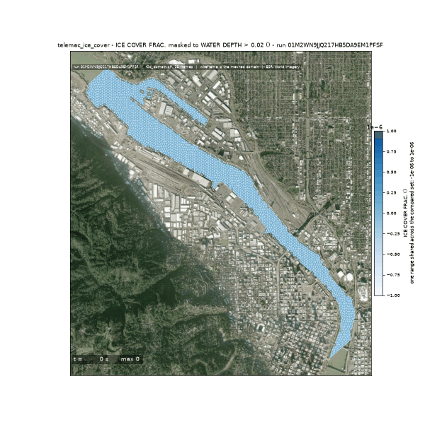
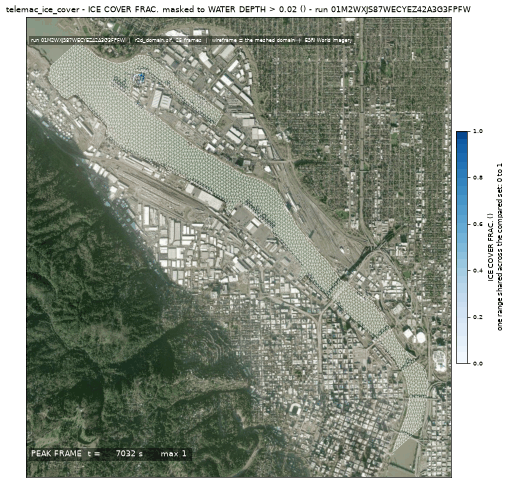
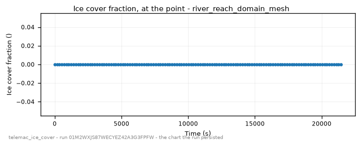
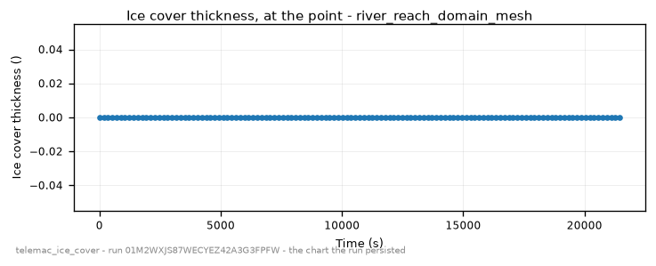

<!-- GENERATED by dev/instruments/gen_template_docs.py. Edit the declaration, not this file. -->

# `telemac_ice_cover`

ICE COVER under a cold snap: when water freezes over, and how thick.

|  |  |
|---|---|
| module | `telemac2d` - 376 keywords in its dictionary, of which this template states 27 |
| solves | `trid3nt_server.workflows.telemac.engine.solve_case` |
| engine defaults | every keyword this template does not state keeps the engine's own default; `describe_keywords` names it with that default, and `keywords={...}` sets it |

## The data it consumes

| row | produced by | what it is | datum |
|---|---|---|---|
| `domain` | matched on a need for hydrography | the closed polygon this run solves over, as a uri, a layer name or a drawn shape; unfilled, the run matches a source of hydrography. | - |
| `bed` | matched on a need for bathymetry | what the domain's nodes carry for elevation: a DEM, a bathymetry or survey raster, a layer of soundings, or a depth in metres below the free surface; unfilled, the run matches a source of bathymetry. | - |
| `discharge` | matched on a need for discharge series | the discharge series this run opens on: a layer of sites that report it, or the number itself; unfilled, the run matches a source of discharge series. | - |
| `level` | matched on a need for water level series | the water level series this run opens on: a layer of sites that report it, or the number itself; unfilled, the run matches a source of water level series. | - |
| `weather` | matched on a need for weather forcing | the weather forcing this run reads, as a uri or a layer name; unfilled, the run matches a source of weather forcing. | - |
| `observe` | matched on a need for water quality sample | the water quality sample this run opens on: a layer of sites that report it, or the number itself; unfilled, the run matches a source of water quality sample. | - |

## The sheet

The values the template declares. `desc` is what the model reads when it fills one.

| param | door | units | default | desc |
|---|---|---|---|---|
| `seed` | user | - | optional | Where on the water the modelled stretch STARTS, as a Point: the pick's {coordinates, name} verbatim, a (lon, lat) pair, 'lat,lon', a point layer. Geocode a place name first. It seeds the reach the domain is cut from; supply the domain polygon - a lake, a pond, a reservoir - instead and this is not read |
| `body` | question | - | optional | Which kind of water the seed is on: 'reach' (default) cuts a stretch of river from the mapped channel; 'waterbody' takes the lake, pond or reservoir the seed stands in. Read only when no domain polygon is supplied |
| `station` | user | - | optional | Where the ice cover and its thickness are read over time, as a Point: the pick's {coordinates, name} verbatim, a (lon, lat) pair, 'lat,lon' or a point layer. Geocode a place name first |
| `cover_threshold` | question | - | optional | Fraction of the surface under ice, 0 to 1, that counts as frozen over - the answer reports the first moment the cover exceeds it, at the point and anywhere in the domain. A reporting threshold, not a physical constant: half the surface by default |
| `mesh_resolution_m` | scenario | m | 20.0 | Target element edge length the domain is triangulated at; the budget that makes the ice is divided by the local DEPTH, and the border ice grows from the BANK, so what this has to resolve is how deep the water is and where its edge runs |
| `event_time` | question | - | optional | The moment the scenario is read at - an ISO date or datetime (YYYY-MM-DD or YYYY-MM-DDTHH:MM:SSZ), from phrasing like 'during last Tuesday's storm'. Each source keeps its own retention, and a request deeper than one refuses typed |
| `compute_class` | constant | - | medium | Solve sizing class - how many cores the solve is partitioned across. An engine that runs on one core says so on the card |
| `vertical_frame` | constant | - | NAVD88 | Vertical datum this run counts every elevation from - the bed under it and the level over it. A source published on another frame reaches this one through a measured offset, and a pair nobody publishes an offset between refuses by name |

## What it answers

| field | the proving run's value |
|---|---|
| `freeze_time_s` | not asked: the cover at the point did not freeze within the window |
| `domain_freeze_time_s` | not asked: no node in the domain froze within the window |
| `peak_ice_thickness_m` | 0.009277565404772758 |
| `final_cover_fraction` | 0.0 |
| `mesh_size_m` | 20.438 |

It publishes these layers onto the canvas:

- Input: domain (nhd_waterbody_at_point)
- Input: discharge (usgs_nwis_gauges)
- Input: discharge (nws_nwps_river_forecast)
- Input: level (usbr_hydromet)
- Ice station (user) - nhd_waterbody
- Input: weather (asos_metar)
- Velocity u over time (nhd_waterbody_mesh)
- Velocity v over time (nhd_waterbody_mesh)
- Water depth over time (nhd_waterbody_mesh)
- Free surface over time (nhd_waterbody_mesh)
- Bottom (m) at t = 21600 s (nhd_waterbody_mesh)
- Froude number over time (nhd_waterbody_mesh)
- Scalar flowrate over time (nhd_waterbody_mesh)
- Scalar velocity over time (nhd_waterbody_mesh)
- Temperature over time (nhd_waterbody_mesh)
- Frazil over time (nhd_waterbody_mesh)
- Ice cover frac. over time (nhd_waterbody_mesh)
- Ice cover thick. over time (nhd_waterbody_mesh)
- Solrad clear sky over time (nhd_waterbody_mesh)
- Solrad cloudy over time (nhd_waterbody_mesh)
- Net solrad over time (nhd_waterbody_mesh)
- Effective solrad over time (nhd_waterbody_mesh)
- Evapo heat flux over time (nhd_waterbody_mesh)
- Conduc heat flux over time (nhd_waterbody_mesh)
- Precip heat flux over time (nhd_waterbody_mesh)
- Frazil theta0 over time (nhd_waterbody_mesh)
- Frazil theta1 over time (nhd_waterbody_mesh)
- Reentrainment over time (nhd_waterbody_mesh)
- Settling vel. over time (nhd_waterbody_mesh)
- Solid ice conc. over time (nhd_waterbody_mesh)
- Solid ice thick. over time (nhd_waterbody_mesh)
- Equiv. surface over time (nhd_waterbody_mesh)
- Top ice cover over time (nhd_waterbody_mesh)
- Bottom ice cover over time (nhd_waterbody_mesh)
- Total ice thick. over time (nhd_waterbody_mesh)
- Characteristics over time (nhd_waterbody_mesh)
- Particles number over time (nhd_waterbody_mesh)
- Total concentrat over time (nhd_waterbody_mesh)
- Nb particle over time (nhd_waterbody_mesh)
- Frazil s over time (nhd_waterbody_mesh)
- Nb particle s over time (nhd_waterbody_mesh)
- Temperature s over time (nhd_waterbody_mesh)
- nhd_waterbody_mesh

## The proving run

Run `01M2ZBPTGNGQXG8T1W4E4PG980`, 2026-09-20T12:13:29.455152+00:00, 147.041 s, at commit `059515c4ed98a69d92b3e08b66d7e8e8fc1df514-dirty`.


*Every layer the run published, stacked and framed on the result (run 01M2ZBPTGNGQXG8T1W4E4PG980)*



*The solve, frame by frame (run 01M2ZBPTGNGQXG8T1W4E4PG980)*



*peak frame (run 01M2ZBPTGNGQXG8T1W4E4PG980)*



*ice cover fraction - the chart the run persisted (run 01M2ZBPTGNGQXG8T1W4E4PG980)*



*ice cover thickness - the chart the run persisted (run 01M2ZBPTGNGQXG8T1W4E4PG980)*

### The sheet it filled

Every slot the run resolved, with where the value came from. The engine's own defaults are folded: what is not here, the engine chose.

| param | value | units | basis | provenance |
|---|---|---|---|---|
| `seed` | {'lon': -123.221649, 'lat': 45.485595, 'name': None} | - | user | supplied on this invocation |
| `body` | waterbody | - | user | supplied on this invocation |
| `station` | {'lon': -123.221649, 'lat': 45.485595, 'name': None} | - | user | supplied on this invocation |
| `cover_threshold` | 0.5 | - | user | supplied on this invocation |
| `mesh_resolution_m` | 40.0 | m | user | supplied on this invocation |
| `event_time` | 2024-01-14T12:00:00+00:00 | - | user | supplied on this invocation |
| `vertical_frame` | NGVD29 | - | user | supplied on this invocation |
| `compute_class` | medium | - | default_demo | declared constant default |

### Reproduce

```python
from trid3nt_server.tools import TOOL_REGISTRY

await TOOL_REGISTRY['telemac_ice_cover'].fn(
    body='waterbody',
    cover_threshold=0.5,
    event_time='2024-01-14T12:00:00+00:00',
    mesh_resolution_m=40.0,
    seed={'lon': -123.221649, 'lat': 45.485595, 'name': None},
    station={'lon': -123.221649, 'lat': 45.485595, 'name': None},
    vertical_frame='NGVD29',
    bed='/home/nate/Documents/trid3nt-local/dev/testing/fixtures/hagg_lake/hagg_lake_topobathy_20m_ngvd29_m.tif',
    observe=4.0,
    keywords={'DURATION': 21600.0, 'khione: GRAPHIC PRINTOUT PERIOD': 300, 'telemac2d: GRAPHIC PRINTOUT PERIOD': 300},
)
```

That is the invocation this run came from; the figures above are stamped with run `01M2ZBPTGNGQXG8T1W4E4PG980` and commit `059515c4ed98a69d92b3e08b66d7e8e8fc1df514-dirty`. The full argument record is [`telemac_ice_cover/run.json`](telemac_ice_cover/run.json).

