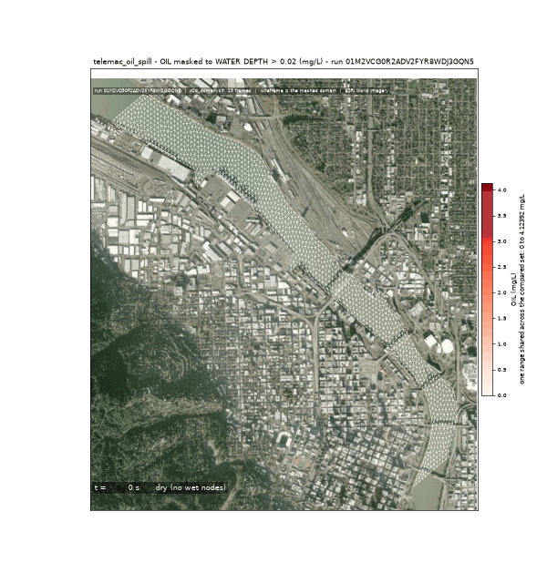
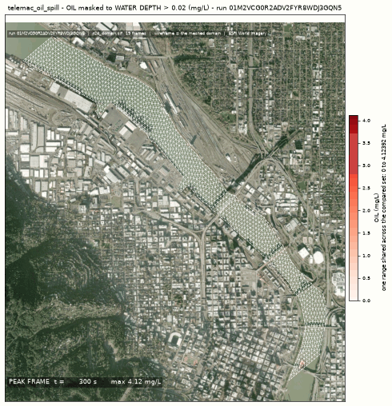
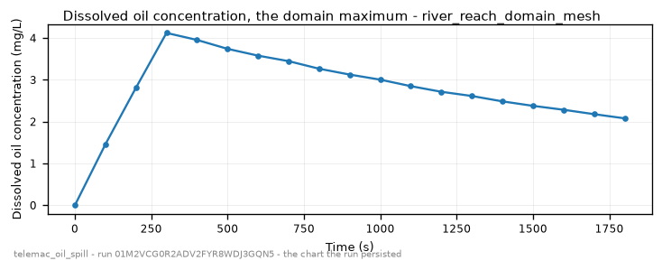

<!-- GENERATED by dev/instruments/gen_template_docs.py. Edit the declaration, not this file. -->

# `telemac_oil_spill`

An OIL SLICK released onto a body of surface water: floating particles plus the dissolved fraction.

|  |  |
|---|---|
| module | `telemac2d` - 376 keywords in its dictionary, of which this template states 39 |
| solves | `trid3nt_server.workflows.telemac.engine.solve_case` |
| engine defaults | every keyword this template does not state keeps the engine's own default; `describe_keywords` names it with that default, and `keywords={...}` sets it |

## The data it consumes

| row | produced by | what it is | datum |
|---|---|---|---|
| `domain` | `fetch_river_reach` | Build a RIVER REACH DOMAIN from one seed point -> the reach polygon, its inflow and outflow boundary runs, and the centerline. | - |
| `runs` | supplied by the caller | the stretches of the domain's edge that carry a boundary condition - each two points on the edge and a type (inflow, outflow, open); a closed body states none | - |
| `survey` | `fetch_ehydro_surveys` | Fetch USACE eHydro CHANNEL SURVEY soundings + the survey footprint for a bbox -> the measured bed. | - |
| `surveyed_bed` | `derive_survey_surface` | Interpolate a POINT layer of measurements onto a raster surface -> a continuous grid. | - |
| `terrain` | `fetch_dem` | Fetch a digital elevation model (DEM) / terrain elevation for a bounding box (USGS 3DEP US lidar; on a 3DEP outage the default path STOPS and asks before any Copernicus GLO-30 swap; either source pinnable). | NAVD88 (metres, positive up) |
| `bed` | `derive_merge_rasters` | MERGE two overlapping surfaces into one, the PRIMARY winning where it measured. | - |
| `carrier` | `fetch_noaa_nwm_streamflow` | Fetch NOAA National Water Model streamflow as a point FlatGeobuf. | - |
| `stage` | supplied by the caller | a layer you supply, as a uri or a layer name; absent is legal and the run reports it. | - |

## The sheet

The values the template declares. `desc` is what the model reads when it fills one.

| param | door | units | default | desc |
|---|---|---|---|---|
| `release` | user | - | optional | Where the oil enters the water, as a Point: the pick's {coordinates, name} verbatim, a (lon, lat) pair, 'lat,lon', a point layer. Geocode a place name first. Its name becomes the tracer's name, and on a river with no domain supplied it is also the seed the reach is walked downstream from |
| `spill_fraction` | scenario | - | 0.25 | Along-domain release position, 0=inflow..1=outflow; the source must sit strictly INSIDE the domain, never on a boundary |
| `spill_duration_s` | scenario | s | 300.0 | Finite pulse injection window |
| `oil_type` | question | - | light_crude | Which preset was spilled: light_crude \| diesel \| heavy_fuel - the module's own composition, density and viscosity. Crude runs as light_crude, gasoline and petrol as diesel, bunker as heavy_fuel |
| `oil_release_step` | scenario | - | 600 | The solver step the floats are released at, compiled into the module's own release routine; it lets the flow field establish before the slick is put on it |
| `mesh_resolution_m` | scenario | m | 14.0 | Target element edge or cell length the domain is resolved at. The granularity is the USER's lever: no sizing rung derives an edge from a channel nobody surveyed, so the number the run meshes at is either yours or this labeled default |
| `event_time` | question | - | optional | The moment the scenario is read at - an ISO date or datetime ('2026-08-20' or '2026-08-20T06:00:00Z'), from phrasing like 'during last Tuesday's storm'. Each source keeps its own retention, and a request deeper than one refuses typed |
| `compute_class` | constant | - | medium | Solve sizing class - how many cores the solve is partitioned across. An engine that runs on one core says so on the card |
| `vertical_frame` | constant | - | NAVD88 | Vertical datum this run counts every elevation from - the bed under it and the level over it. A source published on another frame reaches this one through a measured offset, and a pair nobody publishes an offset between refuses by name |

## What it answers

| field | the proving run's value |
|---|---|
| `oil_cmax_mgl` | 4.12391996383667 |
| `oil_peak_time_s` | 300.0 |
| `plume_reach_m` | 16.4 |
| `active_frames` | 18 |
| `slick_drift_m` | 38.1 |
| `floats_released` | 100 |
| `floats_remaining` | 100 |
| `mesh_size_m` | 20.888 |

It publishes these layers onto the canvas:

- Input: river reach (river_reach)
- Input: ehydro surveys (ehydro_surveys)
- Input: bed elevation (dem, 3DEP 1-10 m US lidar (default 10 m); Copernicus GLO-30 30 m global via source=copernicus, datum NAVD88 (metres, positive up))
- Release point (user) - river_reach_domain
- Velocity u over time (river_reach_domain_mesh)
- Velocity v over time (river_reach_domain_mesh)
- Water depth over time (river_reach_domain_mesh)
- Free surface over time (river_reach_domain_mesh)
- Bottom (m) at t = 1800 s (river_reach_domain_mesh)
- Froude number over time (river_reach_domain_mesh)
- Scalar flowrate over time (river_reach_domain_mesh)
- Scalar velocity over time (river_reach_domain_mesh)
- Oil over time (river_reach_domain_mesh)
- Oil slick track (river_reach_domain_mesh)
- river_reach_domain_mesh

## The proving run

Run `01M2W9C74TS7WFJQK5E4C8M0VF`, 2026-09-19T07:34:17.648855+00:00, 30.52 s, at commit `18a51447da6de03c30d14f6fce6df01200ab74ab-dirty`.


*Every layer the run published, stacked and framed on the result (run 01M2W9C74TS7WFJQK5E4C8M0VF)*



*The solve, frame by frame (run 01M2W9C74TS7WFJQK5E4C8M0VF)*



*peak frame (run 01M2W9C74TS7WFJQK5E4C8M0VF)*



*dissolved oil concentration - the chart the run persisted (run 01M2W9C74TS7WFJQK5E4C8M0VF)*

### The sheet it filled

Every slot the run resolved, with where the value came from. The engine's own defaults are folded: what is not here, the engine chose.

| param | value | units | basis | provenance |
|---|---|---|---|---|
| `release` | {'lon': -122.669784, 'lat': 45.518485, 'name': None} | - | user | supplied on this invocation |
| `spill_duration_s` | 300.0 | s | user | supplied on this invocation |
| `oil_type` | light_crude | - | user | supplied on this invocation |
| `oil_release_step` | 60 | - | user | supplied on this invocation |
| `mesh_resolution_m` | 40.0 | m | user | supplied on this invocation |
| `spill_fraction` | 0.25 | - | default_demo | declared scenario default |
| `compute_class` | medium | - | default_demo | declared constant default |
| `vertical_frame` | NAVD88 | - | default_demo | declared constant default |
| `event_time` | - | - | prompt_interpreted | not supplied (declared optional) |

### Reproduce

```python
from trid3nt_server.tools import TOOL_REGISTRY

await TOOL_REGISTRY['telemac_oil_spill'].fn(
    mesh_resolution_m=40.0,
    oil_release_step=60,
    oil_type='light_crude',
    release={'lon': -122.669784, 'lat': 45.518485, 'name': None},
    spill_duration_s=300.0,
    carrier=56.6,
    stage=2.776,
    keywords={'DURATION': 1800.0},
)
```

That is the invocation this run came from; the figures above are stamped with run `01M2W9C74TS7WFJQK5E4C8M0VF` and commit `18a51447da6de03c30d14f6fce6df01200ab74ab-dirty`. The full argument record is [`telemac_oil_spill/run.json`](telemac_oil_spill/run.json).

