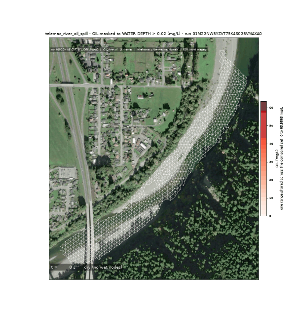
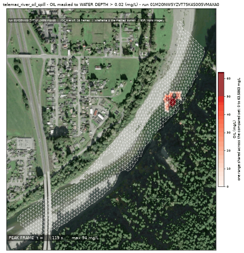
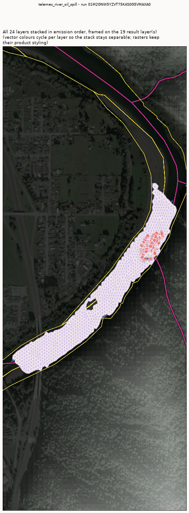

<!-- GENERATED by dev/instruments/gen_template_docs.py. Edit the declaration, not this file. -->

# `telemac_oil_spill`

An OIL SLICK released onto a body of surface water: floating particles plus the dissolved fraction.

|  |  |
|---|---|
| module | `telemac2d` - 376 keywords in its dictionary, of which this template states 32 |
| solves | `trid3nt_server.workflows.telemac.engine.solve_case` |
| engine defaults | every keyword this template does not state keeps the engine's own default; `describe_keywords` names it with that default, and `keywords={...}` sets it |

## The data it consumes

| row | produced by | what it is | datum |
|---|---|---|---|
| `domain` | `fetch_river_reach` | Build a RIVER REACH DOMAIN from one seed point -> the reach polygon, its inflow and outflow boundary runs, and the centerline. | - |
| `runs` | supplied by the caller | the stretches of the domain's edge that carry a boundary condition - each two points on the edge and a type (inflow, outflow, open); a closed body states none | - |
| `survey` | `fetch_ehydro_surveys` | Fetch USACE eHydro CHANNEL SURVEY soundings + the survey footprint for a bbox -> the measured bed. | - |
| `surveyed_bed` | `derive_survey_surface` | Interpolate a POINT layer of measurements onto a raster surface -> a continuous grid. | - |
| `terrain` | `fetch_copernicus_dem` | Internal seam -- NOT a model-facing tool (tier="internal"). | EGM2008 geoid (metres, positive up) |
| `bed` | `derive_merge_rasters` | MERGE two overlapping surfaces into one, the PRIMARY winning where it measured. | - |
| `carrier` | `fetch_noaa_nwm_streamflow` | Fetch NOAA National Water Model streamflow as a point FlatGeobuf. | - |

## The sheet

The values the template declares. `desc` is what the model reads when it fills one.

| param | door | units | default | desc |
|---|---|---|---|---|
| `release` | user | - | optional | Where the oil enters the water, as a Point: the pick's {coordinates, name} verbatim, a (lon, lat) pair, 'lat,lon', a point layer, or a place name. Its name becomes the tracer's name, and on a river with no domain supplied it is also the seed the reach is walked downstream from |
| `spill_fraction` | scenario | - | 0.25 | Along-domain release position, 0=inflow..1=outflow; the source must sit strictly INSIDE the domain, never on a boundary |
| `spill_duration_s` | scenario | s | 300.0 | Finite pulse injection window |
| `source_q_m3s` | scenario | m^3/s | 8.0 | Point-source discharge of the release itself, small against the carrier flow |
| `oil_concentration_mgl` | scenario | mg/L | 100.0 | Concentration of the DISSOLVED fraction released with the slick, carried as the water's tracer |
| `oil_type` | question | - | light_crude | Which preset was spilled: light_crude \| diesel \| heavy_fuel - the module's own composition, density and viscosity. Crude runs as light_crude, gasoline and petrol as diesel, bunker as heavy_fuel |
| `n_drogues` | scenario | - | 100 | How many floating particles the module tracks; the slick is drawn from their positions, so a coarse count draws a coarse slick |
| `drogues_period_s` | scenario | s | 60.0 | How often the particle positions are written; it converts to a count of solver steps at the run's own timestep |
| `oil_release_step` | scenario | - | 600 | The solver step the floats are released at, compiled into the module's own release routine; it lets the flow field establish before the slick is put on it |
| `wind_speed_mps` | scenario | m/s | 0.0 | Sustained wind driving a surface wind-stress term; 0 = no wind |
| `wind_direction_deg` | scenario | deg | 0.0 | Compass bearing the wind blows FROM (0=N, 90=E); only read when wind_speed_mps > 0 |
| `rainfall_mm_per_day` | user | mm/day | optional | NET distributed rainfall applied at every wet node, independent of the inflow hydrograph; negative is evaporation |
| `sim_duration_s` | scenario | s | 3600.0 | Simulated physical time the run covers. The clock the run is settled on, so the deck's DURATION and every window read off it are this one number; what is long enough is the question's, and a question that knows states its own |
| `mesh_resolution_m` | scenario | m | 14.0 | Target element edge or cell length the domain is resolved at. The granularity is the USER's lever: no sizing rung derives an edge from a channel nobody surveyed, so the number the run meshes at is either yours or this labeled default |
| `event_time` | question | - | optional | The moment the scenario is read at - an ISO date or datetime ('2026-08-20' or '2026-08-20T06:00:00Z'), from phrasing like 'during last Tuesday's storm'. Each source keeps its own retention, and a request deeper than one refuses typed |
| `compute_class` | constant | - | medium | Solve sizing class |

## What it answers

| field | the proving run's value |
|---|---|
| `oil_cmax_mgl` | 94.02247619628906 |
| `oil_peak_time_s` | 118.78800201416016 |
| `plume_reach_m` | 54.1 |
| `active_frames` | 30 |
| `slick_drift_m` | 85.5 |
| `floats_released` | 100 |
| `floats_remaining` | 100 |
| `mesh_size_m` | 10.415 |

It publishes these layers onto the canvas:

- Input: OSM waterways (map context; the modeled river is the NLDI centerline) (river_geometry)
- Input: nhdplus nldi (nhdplus_nldi)
- Input: nhd area water (nhd_area_water)
- Input: river bed elevation (copernicus_dem, datum EGM2008 geoid (metres, positive up))
- Release point (derived) - scotia_humboldt_county_california_95562_united_s
- Velocity u (m/s) at t = 593.94 s (scotia_humboldt_county_california_95562_united_s)
- Velocity u over time (scotia_humboldt_county_california_95562_united_s)
- Velocity v (m/s) at t = 593.94 s (scotia_humboldt_county_california_95562_united_s)
- Velocity v over time (scotia_humboldt_county_california_95562_united_s)
- Water depth (m) at t = 593.94 s (scotia_humboldt_county_california_95562_united_s)
- Water depth over time (scotia_humboldt_county_california_95562_united_s)
- Free surface (m) at t = 593.94 s (scotia_humboldt_county_california_95562_united_s)
- Free surface over time (scotia_humboldt_county_california_95562_united_s)
- Bottom (m) at t = 593.94 s (scotia_humboldt_county_california_95562_united_s)
- Froude number at t = 593.94 s (scotia_humboldt_county_california_95562_united_s)
- Froude number over time (scotia_humboldt_county_california_95562_united_s)
- Scalar flowrate (m2/s) at t = 593.94 s (scotia_humboldt_county_california_95562_united_s)
- Scalar flowrate over time (scotia_humboldt_county_california_95562_united_s)
- Scalar velocity (m/s) at t = 593.94 s (scotia_humboldt_county_california_95562_united_s)
- Scalar velocity over time (scotia_humboldt_county_california_95562_united_s)
- Oil (mg/L) at t = 593.94 s (scotia_humboldt_county_california_95562_united_s)
- Oil over time (scotia_humboldt_county_california_95562_united_s)
- Oil slick track (scotia_humboldt_county_california_95562_united_s)
- scotia_humboldt_county_california_95562_united_s

## The proving run

Run `01M2GNW5YZVT75K4S0G5VMAXA0`, 2026-09-14T19:21:47.481845+00:00, 24.536 s, at commit `c06075fe30c18c4bf3619f40299b09edffefc4c0-dirty`.



*The solve, frame by frame - spill_animation (run 01M2GNW5YZVT75K4S0G5VMAXA0)*



*spill peak frame (run 01M2GNW5YZVT75K4S0G5VMAXA0)*


*dissolved oil concentration - the chart the run persisted (run 01M2GNW5YZVT75K4S0G5VMAXA0)*



*spill (run 01M2GNW5YZVT75K4S0G5VMAXA0)*

### The sheet it filled

Every slot the run resolved, with where the value came from. The engine's own defaults are folded: what is not here, the engine chose.

| param | value | units | basis | provenance |
|---|---|---|---|---|
| `location` | Eel River near Scotia, California | - | user | supplied on this invocation |
| `discharge_m3s` | 2.2 | m^3/s | user | supplied on this invocation |
| `output_interval_min` | 0.333 | min | user | supplied on this invocation |
| `spill_duration_s` | 120.0 | s | user | supplied on this invocation |
| `source_q_m3s` | 8.0 | m^3/s | user | supplied on this invocation |
| `oil_type` | light_crude | - | user | supplied on this invocation |
| `oil_concentration_mgl` | 100.0 | mg/L | user | supplied on this invocation |
| `reach_length_km` | 1.0 | km | user | supplied on this invocation |
| `sim_duration_s` | 600.0 | s | user | supplied on this invocation |
| `n_drogues` | 100 | - | user | supplied on this invocation |
| `oil_release_step` | 60 | - | user | supplied on this invocation |
| `mesh_resolution_m` | 12.0 | m | user | supplied on this invocation |
| `compute_class` | medium | - | default_demo | declared constant default |
| `spill_fraction` | 0.25 | - | default_demo | declared scenario default |
| `wind_speed_mps` | 0.0 | m/s | default_demo | declared scenario default |
| `wind_direction_deg` | 0.0 | deg | default_demo | declared scenario default |
| `drogues_period_s` | 60.0 | s | default_demo | declared scenario default |
| `bbox` | - | - | user | not supplied (declared optional) |
| `river_geometry_uri` | - | - | user | not supplied (declared optional) |
| `event_time` | - | - | prompt_interpreted | not supplied (declared optional) |
| `friction_coefficient` | - | - | user | not supplied (declared optional) |
| `friction_law` | - | - | user | not supplied (declared optional) |
| `rainfall_mm_per_day` | - | mm/day | user | not supplied (declared optional) |
| `evaporation_mm_per_day` | - | mm/day | user | not supplied (declared optional) |
| `rainfall_gridmet_window` | - | - | user | not supplied (declared optional) |
| `release` | - | - | user | not supplied (declared optional) |

### Reproduce

```python
from trid3nt_server.tools import TOOL_REGISTRY

await TOOL_REGISTRY['telemac_oil_spill'].fn(
    discharge_m3s=2.2,
    location='Eel River near Scotia, California',
    mesh_resolution_m=12.0,
    n_drogues=100,
    oil_concentration_mgl=100.0,
    oil_release_step=60,
    oil_type='light_crude',
    output_interval_min=0.333,
    reach_length_km=1.0,
    sim_duration_s=600.0,
    source_q_m3s=8.0,
    spill_duration_s=120.0,
)
```

That is the invocation this run came from; the figures above are stamped with run `01M2GNW5YZVT75K4S0G5VMAXA0` and commit `c06075fe30c18c4bf3619f40299b09edffefc4c0-dirty`. The full argument record is [`telemac_oil_spill/run.json`](telemac_oil_spill/run.json).

