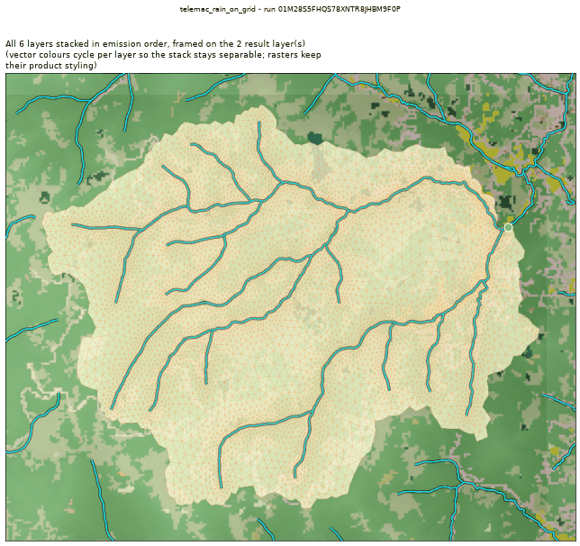
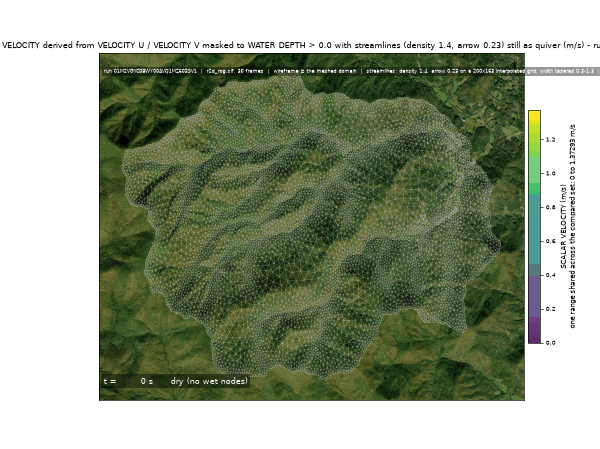
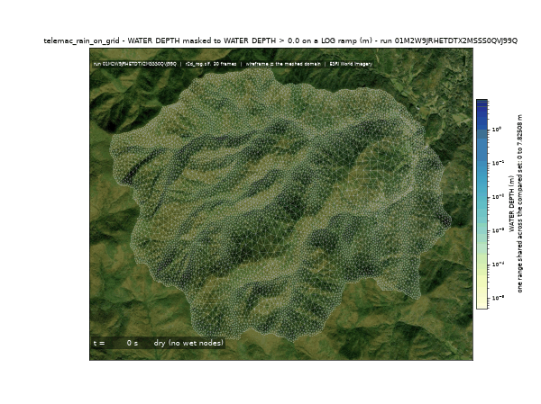
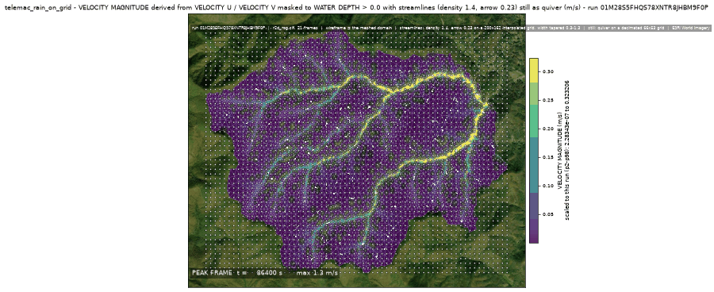
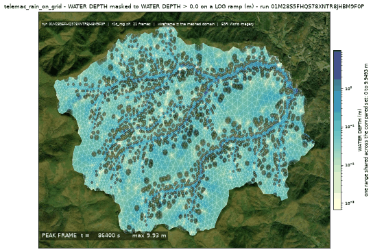
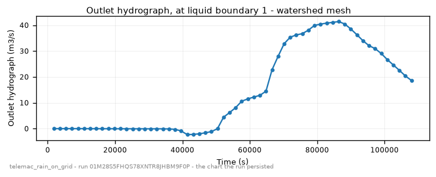

<!-- GENERATED by dev/instruments/gen_template_docs.py. Edit the declaration, not this file. -->

# `telemac_rain_on_grid`

How much RUNOFF a storm produces from this WATERSHED, as an outlet hydrograph and a flood-depth map.

|  |  |
|---|---|
| module | `telemac2d` - 376 keywords in its dictionary, of which this template states 25 |
| solves | `trid3nt_server.workflows.telemac.solving.solve.solve_case` |
| engine defaults | every keyword this template does not state keeps the engine's own default; `describe_keywords` names it with that default, and `keywords={...}` sets it |

## The data it consumes

| row | produced by | what it is | datum |
|---|---|---|---|
| `dem` | `fetch_dem` | Fetch a digital elevation model (DEM) / terrain elevation for a bounding box (USGS 3DEP US lidar; on a 3DEP outage the default path STOPS and asks before any Copernicus GLO-30 swap; either source pinnable). | NAVD88 (metres, positive up) |
| `rivers` | `fetch_river_geometry` | Fetch river and stream flowline geometry for a bbox (OSM Overpass waterways). | - |
| `landcover` | `fetch_landcover` | Fetch landcover classification raster (NLCD or ESA WorldCover) for a bbox. | - |
| `rain` | `trid3nt_server.workflows.telemac.templates.rain_on_grid.storm.resolve_rain_event` | The storm, as either a real hourly hyetograph or a constant design rate. | - |
| `basin` | `delineate_watershed` | Delineate the watershed (drainage basin) upstream of a pour point (D8 flow analysis via pysheds). | - |

## The sheet

The values the template declares. `desc` is what the model reads when it fills one.

| param | door | units | default | desc |
|---|---|---|---|---|
| `pour_point` | user | - | - | The catchment OUTLET, as a Point: the pick's {coordinates, name} verbatim, a (lon, lat) pair, 'lat,lon', a point layer, or a place name - the point the runoff drains to. It decides which basin is modelled at all, so it is asked for (picked on the canvas or passed explicitly) and NEVER invented |
| `location` | question | - | optional | Place naming the catchment. It names the run and the published layers; the basin's SHAPE is the terrain's answer at the pour point, never the geocoder's bbox |
| `bbox` | user | - | optional | Explicit analysis AOI (min_lon,min_lat,max_lon,max_lat) EPSG:4326 the catchment is delineated INSIDE; it must contain the whole upstream basin, because delineation truncates at its edge |
| `rain_window` | question | - | optional | A REAL storm window as 'YYYY-MM-DD/YYYY-MM-DD'. Drives the run with the hourly AORC hyetograph over the catchment - the true intensity structure, which is what resolves the hydrograph SHAPE. AORC rather than MRMS because MRMS only covers ~2020-10 onward |
| `design_storm_mm_per_hr` | scenario | mm/h | 25.0 | Constant design-storm intensity, used when no rain_window names a real event. A hypothetical storm, labeled as one |
| `storm_duration_hr` | scenario | h | 6.0 | How long the design storm rains for |
| `sim_duration_hr` | scenario | h | optional | Total simulated window; longer than the rain to watch the recession |
| `antecedent_moisture` | scenario | - | normal | How wet the catchment already is: dry (SCS AMC I) \| normal (AMC II) \| wet (AMC III). The dominant infiltration lever - a wet basin absorbs far less and the hydrograph peaks higher and sooner |
| `curve_number` | user | - | optional | A UNIFORM SCS curve number over the whole catchment, overriding the land-cover-distributed field. Roughness stays per-node either way - Manning n is a separate physical property, not the CN knob |
| `steep_slope_correction` | scenario | - | False | Apply the Huang (2006) steep-slope correction to the curve numbers using the mesh's own bed gradients. The engine's native branch is compiled off in the installed 9.0.0 build, so the correction is applied to the CN field before it is written |
| `landcover_dataset` | constant | - | nlcd_2021 | Land-cover product the per-node curve numbers and Manning n are keyed to |
| `mesh_min_edge_m` | scenario | m | 40.0 | Finest triangle edge, used where the mesh refines toward the channel network. THE granularity lever: peak depth and flooded extent are resolution-bound classes and a coarse mesh reads both low |
| `mesh_max_edge_m` | scenario | m | 300.0 | Coarsest triangle edge, reached far from the channels on the hillslopes |
| `mesh_grade` | constant | - | 0.2 | Mesh gradation: how fast the edge length may grow between the channel band and the hillslopes |
| `bed_dem_resolution_m` | constant | m | 10 | Ground resolution the BARE-EARTH bed is sampled at the mesh nodes from; a surface model would put the bed on the forest canopy |
| `river_source` | constant | - | nhdplus_hr | Channel network the mesh refinement is sized by distance to |
| `time_step_s` | constant | s | 3.0 | Solver time step. Overland sheet flow on a fine catchment mesh is CFL-tight, which is why it is seconds rather than tens of seconds |
| `output_interval_min` | user | min | optional | Result-writing cadence; a hydrograph resolved in six frames cannot be spot-checked against, so a short window wants a short interval |
| `compute_class` | constant | - | medium | Solve sizing class |

## What it answers

| field | the proving run's value |
|---|---|
| `catchment_area_km2` | 28.1361 |
| `peak_discharge_m3s` | 41.40334 |
| `peak_discharge_time_s` | 86400.0 |
| `peak_is_window_truncated` | False |
| `rainfall_volume_m3` | 4409487.258 |
| `runoff_volume_m3` | 1564079.0 |
| `runoff_coefficient` | 0.354708 |
| `max_depth_peak_m` | 9.949299812316895 |
| `max_depth_p99_m` | 1.2588693523406922 |
| `continuity_rel_error` | -2.405208e-15 |
| `n_frames` | 61 |
| `mesh_size_m` | 26.76898646896342 |
| `mesh_node_count` | 6615 |
| `mesh_element_count` | 12974 |
| `domain_bbox` | [-83.47785741613603, 35.02084328984999, -83.39843378895853, 35.073572656237715] |

It publishes these layers onto the canvas:

- Input: mesh bed (dem, 3DEP 1-10 m US lidar (default 10 m); Copernicus GLO-30 30 m global via source=copernicus, datum NAVD88 (metres, positive up))
- Input: river geometry (river_geometry)
- Input: land cover (landcover)
- Outlet hydrograph (watershed mesh)
- Model results (time series): watershed mesh
- Peak water depth (watershed mesh)

## The proving run

Run `01M28S5FHQS78XNTR8JHBM9F0P`, 2026-09-11T17:48:03.860203+00:00, 250.184 s, at commit `212b02a5a902fd904fca41bc5939d0dd0abec820-dirty`.



*Every layer the run published, stacked and framed on the result (run 01M28S5FHQS78XNTR8JHBM9F0P)*



*The solve, frame by frame - flow_dynamics (run 01M28S5FHQS78XNTR8JHBM9F0P)*



*The solve, frame by frame - inundation_depth (run 01M28S5FHQS78XNTR8JHBM9F0P)*



*flow dynamics peak frame (run 01M28S5FHQS78XNTR8JHBM9F0P)*



*inundation depth peak frame (run 01M28S5FHQS78XNTR8JHBM9F0P)*



*outlet hydrograph - the chart the run persisted (run 01M28S5FHQS78XNTR8JHBM9F0P)*

### The sheet it filled

Every slot the run resolved, with where the value came from. The engine's own defaults are folded: what is not here, the engine chose.

| param | value | units | basis | provenance |
|---|---|---|---|---|
| `pour_point` | Point(lon=-83.40402, lat=35.05746, name=None) | - | user | supplied on this invocation |
| `design_storm_mm_per_hr` | 6.53 | mm/h | user | supplied on this invocation |
| `storm_duration_hr` | 24.0 | h | user | supplied on this invocation |
| `sim_duration_hr` | 30.0 | h | user | supplied on this invocation |
| `antecedent_moisture` | normal | - | user | supplied on this invocation |
| `output_interval_min` | 30.0 | min | user | supplied on this invocation |
| `compute_class` | medium | - | user | supplied on this invocation |
| `steep_slope_correction` | False | - | default_demo | declared scenario default |
| `landcover_dataset` | nlcd_2021 | - | default_demo | declared constant default |
| `mesh_min_edge_m` | 40.0 | m | default_demo | declared scenario default |
| `mesh_max_edge_m` | 300.0 | m | default_demo | declared scenario default |
| `mesh_grade` | 0.2 | - | default_demo | declared constant default |
| `bed_dem_resolution_m` | 10 | m | default_demo | declared constant default |
| `river_source` | nhdplus_hr | - | default_demo | declared constant default |
| `time_step_s` | 3.0 | s | default_demo | declared constant default |
| `location` | - | - | prompt_interpreted | not supplied (declared optional) |
| `bbox` | - | - | user | not supplied (declared optional) |
| `rain_window` | - | - | prompt_interpreted | not supplied (declared optional) |
| `curve_number` | - | - | user | not supplied (declared optional) |

### Reproduce

```python
from trid3nt_server.tools import TOOL_REGISTRY

await TOOL_REGISTRY['telemac_rain_on_grid'].fn(
    antecedent_moisture='normal',
    compute_class='medium',
    design_storm_mm_per_hr=6.53,
    output_interval_min=30.0,
    pour_point='Point(lon=-83.40402, lat=35.05746, name=None)',
    sim_duration_hr=30.0,
    storm_duration_hr=24.0,
)
```

That is the invocation this run came from; the figures above are stamped with run `01M28S5FHQS78XNTR8JHBM9F0P` and commit `212b02a5a902fd904fca41bc5939d0dd0abec820-dirty`. The full argument record is [`telemac_rain_on_grid/run.json`](telemac_rain_on_grid/run.json).

