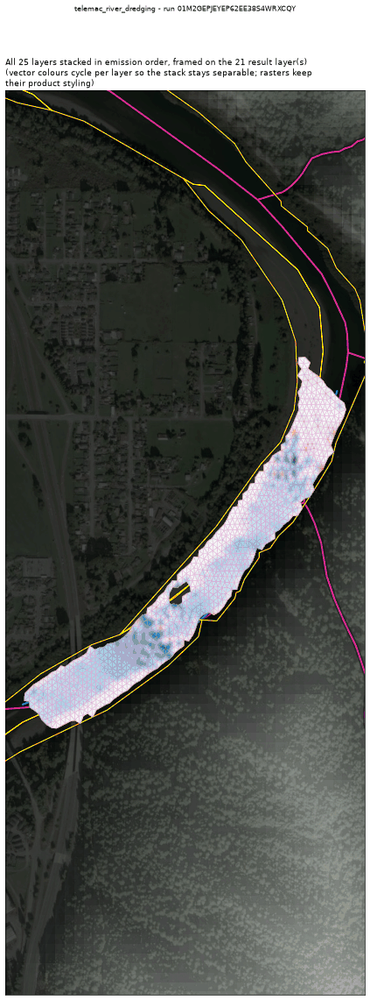
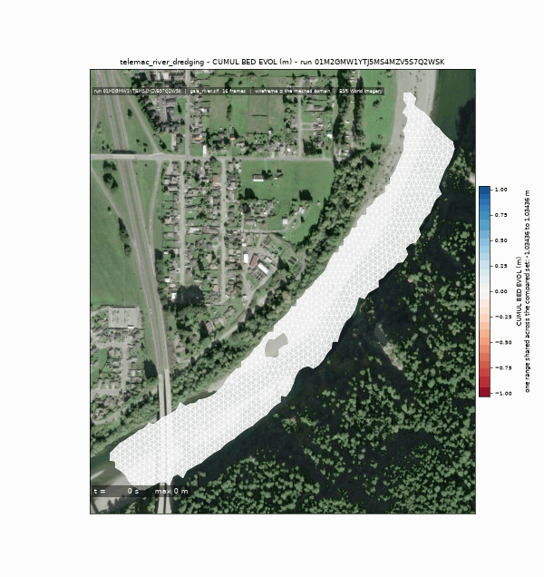
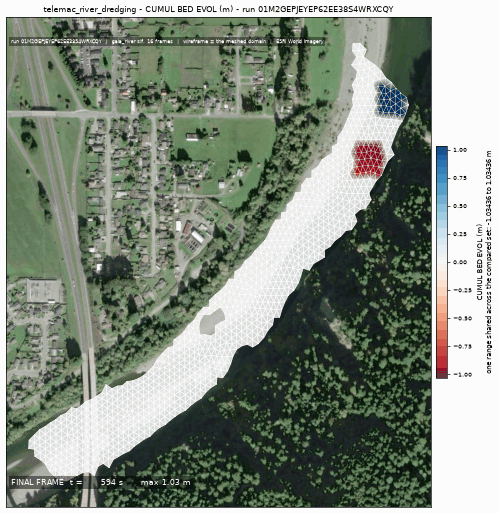

<!-- GENERATED by dev/instruments/gen_template_docs.py. Edit the declaration, not this file. -->

# `telemac_river_dredging`

MAINTENANCE DREDGING of a navigation channel: how much comes out, and what the bed does.

|  |  |
|---|---|
| module | `telemac2d` - 376 keywords in its dictionary, of which this template states 25 |
| solves | `trid3nt_server.workflows.telemac.engine.solve_case` |
| engine defaults | every keyword this template does not state keeps the engine's own default; `describe_keywords` names it with that default, and `keywords={...}` sets it |

## The data it consumes

| row | produced by | what it is | datum |
|---|---|---|---|
| `rivers` | `trid3nt_server.workflows.telemac.templates.reach.fetch_reach_flowline` | The reach flowline FlatGeobuf over the CURRENT DOMAIN. Reference data. | - |
| `centerline` | `fetch_nhdplus_nldi_navigate` | Walk the NHDPlus stream network from a seed in the requested direction. | - |
| `ends` | `endpoints` | Take the TWO END POINTS of a line layer -> a point layer plus the pair itself. | - |
| `window` | `compute_layer_bounds` | Get a layer's geographic extent AND fit/zoom/resize the map to it. | - |
| `water` | `fetch_nhd_area_water` | Fetch NHD water-surface polygons (the two BANKS of a wide river, an estuary, a canal) inside a bounding box. | - |
| `mapped_water` | `trid3nt_server.workflows.telemac.templates.reach.measure_water_coverage` | MEASURE how much of the reach the fetched water polygons map -> the water. | - |
| `reach_polygon` | `section` | Cut a POLYGON LAYER down to the part between two points, or inside an extent -> a polygon layer. | - |
| `dem` | `fetch_copernicus_dem` | Internal seam -- NOT a model-facing tool (tier="internal"). | EGM2008 geoid (metres, positive up) |
| `dredge_area` | supplied by the caller | a polygon layer you supply, as a uri or a layer name; required - the template names no source for it. | - |
| `dump_area` | supplied by the caller | a polygon layer you supply, as a uri or a layer name; required - the template names no source for it. | - |

## The sheet

The values the template declares. `desc` is what the model reads when it fills one.

| param | door | units | default | desc |
|---|---|---|---|---|
| `location` | question | - | optional | Place name on the river, geocoded to the reach |
| `bbox` | user | - | optional | Explicit AOI (min_lon,min_lat,max_lon,max_lat) EPSG:4326, instead of a place |
| `river_geometry_uri` | user | - | optional | Reuse an already-fetched river flowline for this reach instead of re-fetching it |
| `discharge_m3s` | user | m^3/s | optional | Steady upstream discharge the reach is dredged under - the flow that shoals the channel and carries the disturbed material |
| `event_time` | question | - | optional | The moment to read the discharge cycle at - from phrasing like 'at last week's flow'; an ISO date or datetime. The NWM PDS bucket retains only the last ~30 days of history; a deeper request refuses typed rather than silently reading a different cycle. |
| `friction_coefficient` | user | - | optional | Bed roughness under friction_law |
| `friction_law` | user | - | optional | Law interpreting friction_coefficient: 2=Chezy, 3=Strickler, 4=Manning |
| `output_interval_min` | user | min | optional | Result-writing cadence; unset keeps the steering file's own period |
| `compute_class` | constant | - | medium | Solve sizing class |
| `reach_length_km` | scenario | km | 2.0 | Modeled reach length downstream of the seed; a longer reach is coarsened under the mesh node budget |
| `sim_duration_s` | scenario | s | 3600.0 | Simulated physical time the dredge campaign runs over; the morphological factor is what makes a short window produce a readable bed change |
| `mesh_resolution_m` | scenario | m | 14.0 | Target element edge length the reach is triangulated at; the dredged volume is the sum over the nodes inside the field, so a coarse mesh resolves a narrow fairway badly |
| `time_origin` | scenario | - | [2000, 1, 1, 0, 0, 0] | The calendar instant the run's clock starts at, as [year, month, day, hour, minute, second] - the origin every dredge schedule is dated against and the one the deck states |
| `design_depth_m` | scenario | m | 3.0 | Depth the fairway is dredged TO, under the reference water surface the run opens at - the design draught plus its overdepth |
| `trigger_depth_m` | scenario | m | 3.0 | Depth at which a node is dredged: the bed is worked wherever it sits shallower than this under the reference surface. Equal to design_depth_m keeps the channel exactly at grade; SMALLER than it lets the channel shoal before the dredger returns, and a trigger DEEPER than the grade would mark a node for a cut that is above its own bed |
| `dredge_start_s` | scenario | s | 0.0 | When the first dredging pass begins, in seconds of the BED's own clock - the run's morphological time, sim_duration_s x morphological_factor |
| `dredge_end_s` | scenario | s | 3000.0 | When the campaign stops, on the same bed clock: no further pass begins after it, and a pass already cutting runs on until it reaches grade |
| `dredge_repeat_s` | scenario | s | 1800.0 | Maintenance interval on the bed clock: how long after a pass starts the next one begins, if the channel has shoaled past trigger_depth_m again |
| `dig_rate_m_per_s` | scenario | m/s | 0.002 | How fast the dredger lowers the bed, as metres of bed per second of SOLVER time at a working node - the plant's capacity, not a physical rate. A pass reports its volume only once it has reached grade, so this and the cut it has to make are what decide whether the run sees a completed pass at all |
| `dump_rate_m_per_s` | scenario | m/s | 0.002 | How fast the spoil is laid into the dump area, as metres of bed per second of solver time at a receiving node; a pass is not finished until its spoil is placed |
| `min_volume_m3` | scenario | m^3 | 0.0 | Least volume worth moving around a node before it is dredged at all; 0 works every node past the trigger |
| `grain_size_um` | scenario | um | 200.0 | Median grain diameter d50 of the bed the channel shoals with - ~200 um fine sand, ~20 um silt (all modeled non-cohesive) |
| `bed_thickness_m` | scenario | m | 5.0 | Depth of the erodible sediment stock the dredger can cut into |
| `bedload_formula` | scenario | - | 1 | GAIA bed-load law: 1=Meyer-Peter-Mueller, 2=Einstein-Brown, 7=van Rijn |
| `morphological_factor` | scenario | - | 10.0 | Amplifies bed change per hydraulic step so a short campaign yields a readable depth; a speed-up lever, not a rate |

## What it answers

| field | the proving run's value |
|---|---|
| `dug_volume_m3` | 4709.386117 |
| `dumped_volume_m3` | 4709.386117 |
| `dredge_report` | the volumes are the engine's own report lines, summed over the passes that finished inside the run's clock |
| `dredged_bed_change_m` | -0.9470365047454834 |
| `dumped_bed_change_m` | 1.034358263015747 |
| `net_bed_mass_kg` | -728.4404 |
| `mesh_size_m` | 10.415 |

It publishes these layers onto the canvas:

- Input: OSM waterways (map context; the modeled river is the NLDI centerline) (river_geometry)
- Input: nhdplus nldi (nhdplus_nldi)
- Input: nhd area water (nhd_area_water)
- Input: river bed elevation (copernicus_dem, datum EGM2008 geoid (metres, positive up))
- Velocity u over time (scotia_humboldt_county_california_95562_united_s)
- Velocity v (m/s) at t = 593.94 s (scotia_humboldt_county_california_95562_united_s)
- Velocity v over time (scotia_humboldt_county_california_95562_united_s)
- Water depth (m) at t = 593.94 s (scotia_humboldt_county_california_95562_united_s)
- Water depth over time (scotia_humboldt_county_california_95562_united_s)
- Free surface (m) at t = 593.94 s (scotia_humboldt_county_california_95562_united_s)
- Free surface over time (scotia_humboldt_county_california_95562_united_s)
- Bottom (m) at t = 593.94 s (scotia_humboldt_county_california_95562_united_s)
- Froude number at t = 593.94 s (scotia_humboldt_county_california_95562_united_s)
- Froude number over time (scotia_humboldt_county_california_95562_united_s)
- Scalar flowrate (m2/s) at t = 593.94 s (scotia_humboldt_county_california_95562_united_s)
- Scalar flowrate over time (scotia_humboldt_county_california_95562_united_s)
- Scalar velocity (m/s) at t = 593.94 s (scotia_humboldt_county_california_95562_united_s)
- Scalar velocity over time (scotia_humboldt_county_california_95562_united_s)
- Cumul bed evol (m) at t = 593.94 s (scotia_humboldt_county_california_95562_united_s)
- Cumul bed evol over time (scotia_humboldt_county_california_95562_united_s)
- Mean diameter m at t = 593.94 s (scotia_humboldt_county_california_95562_united_s)
- Mean diameter m over time (scotia_humboldt_county_california_95562_united_s)
- Bed shear stress (n/m2) at t = 593.94 s (scotia_humboldt_county_california_95562_united_s)
- Bed shear stress over time (scotia_humboldt_county_california_95562_united_s)
- Velocity u (m/s) at t = 593.94 s (scotia_humboldt_county_california_95562_united_s)

## The proving run

Run `01M2GEPJEYEP62EE38S4WRXCQY`, 2026-09-14T17:16:24.653254+00:00, 29.348 s, at commit `e766867a5a6296cb173fa756d162fe5cc15ba2d8-dirty`.



*Every layer the run published, stacked and framed on the result (run 01M2GEPJEYEP62EE38S4WRXCQY)*



*The solve, frame by frame (run 01M2GEPJEYEP62EE38S4WRXCQY)*



*final frame (run 01M2GEPJEYEP62EE38S4WRXCQY)*

### The sheet it filled

Every slot the run resolved, with where the value came from. The engine's own defaults are folded: what is not here, the engine chose.

| param | value | units | basis | provenance |
|---|---|---|---|---|
| `location` | Eel River near Scotia, California | - | user | supplied on this invocation |
| `discharge_m3s` | 2.2 | m^3/s | user | supplied on this invocation |
| `output_interval_min` | 0.333 | min | user | supplied on this invocation |
| `reach_length_km` | 1.0 | km | user | supplied on this invocation |
| `sim_duration_s` | 600.0 | s | user | supplied on this invocation |
| `mesh_resolution_m` | 12.0 | m | user | supplied on this invocation |
| `design_depth_m` | 1.0 | m | user | supplied on this invocation |
| `trigger_depth_m` | 1.0 | m | user | supplied on this invocation |
| `dredge_start_s` | 600.0 | s | user | supplied on this invocation |
| `dredge_end_s` | 3600.0 | s | user | supplied on this invocation |
| `dredge_repeat_s` | 1800.0 | s | user | supplied on this invocation |
| `dig_rate_m_per_s` | 0.02 | m/s | user | supplied on this invocation |
| `dump_rate_m_per_s` | 0.02 | m/s | user | supplied on this invocation |
| `grain_size_um` | 200.0 | um | user | supplied on this invocation |
| `bed_thickness_m` | 5.0 | m | user | supplied on this invocation |
| `compute_class` | medium | - | default_demo | declared constant default |
| `time_origin` | [2000, 1, 1, 0, 0, 0] | - | default_demo | declared scenario default |
| `min_volume_m3` | 0.0 | m^3 | default_demo | declared scenario default |
| `bedload_formula` | 1 | - | default_demo | declared scenario default |
| `morphological_factor` | 10.0 | - | default_demo | declared scenario default |
| `bbox` | - | - | user | not supplied (declared optional) |
| `river_geometry_uri` | - | - | user | not supplied (declared optional) |
| `event_time` | - | - | prompt_interpreted | not supplied (declared optional) |
| `friction_coefficient` | - | - | user | not supplied (declared optional) |
| `friction_law` | - | - | user | not supplied (declared optional) |

### Reproduce

```python
from trid3nt_server.tools import TOOL_REGISTRY

await TOOL_REGISTRY['telemac_river_dredging'].fn(
    bed_thickness_m=5.0,
    design_depth_m=1.0,
    dig_rate_m_per_s=0.02,
    discharge_m3s=2.2,
    dredge_end_s=3600.0,
    dredge_repeat_s=1800.0,
    dredge_start_s=600.0,
    dump_rate_m_per_s=0.02,
    grain_size_um=200.0,
    location='Eel River near Scotia, California',
    mesh_resolution_m=12.0,
    output_interval_min=0.333,
    reach_length_km=1.0,
    sim_duration_s=600.0,
    trigger_depth_m=1.0,
)
```

That is the invocation this run came from; the figures above are stamped with run `01M2GEPJEYEP62EE38S4WRXCQY` and commit `e766867a5a6296cb173fa756d162fe5cc15ba2d8-dirty`. The full argument record is [`telemac_river_dredging/run.json`](telemac_river_dredging/run.json).

