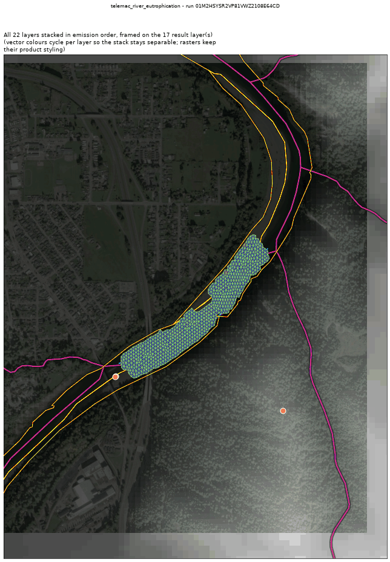
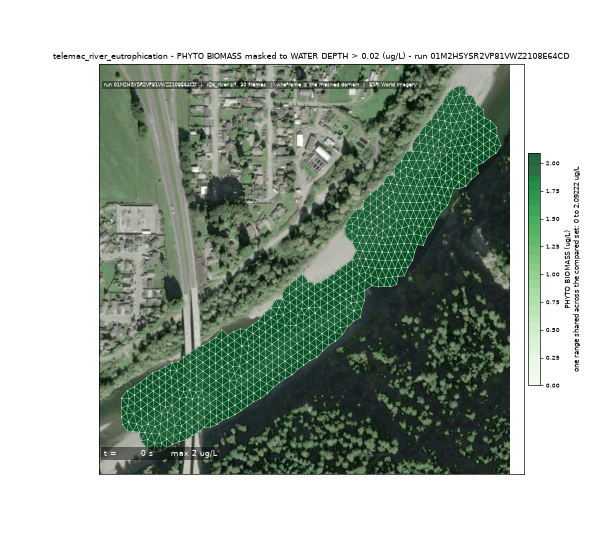
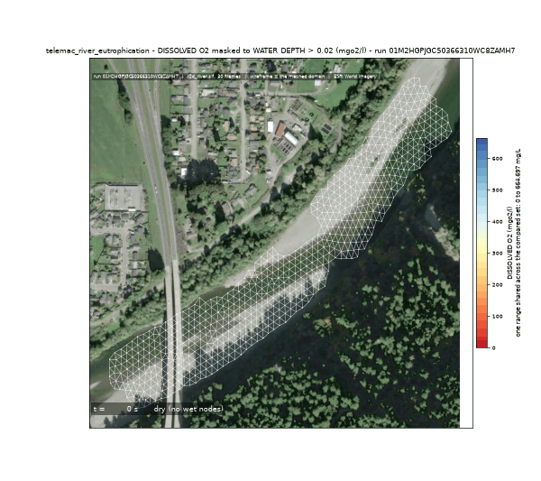
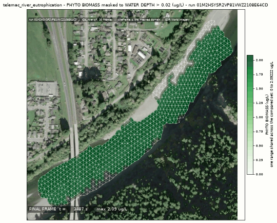
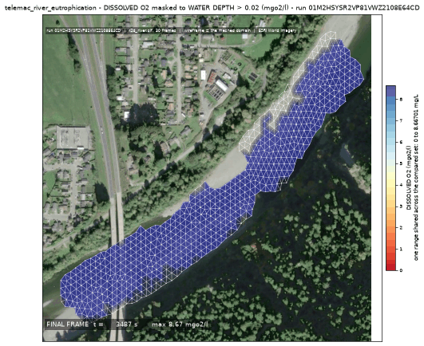
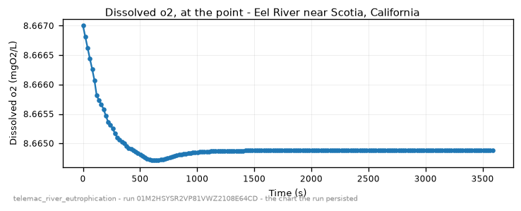
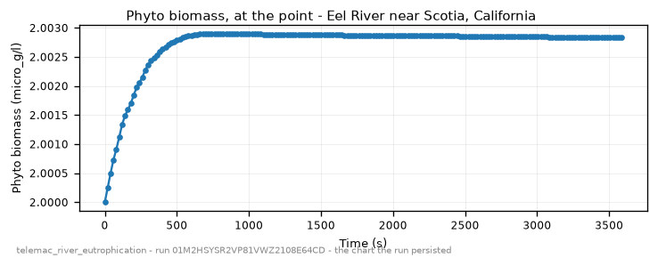

<!-- GENERATED by dev/instruments/gen_template_docs.py. Edit the declaration, not this file. -->

# `telemac_river_eutrophication`

NUTRIENT ENRICHMENT down a river reach: algal growth, nutrient drawdown and the oxygen response over one pass.

|  |  |
|---|---|
| module | `telemac2d` - 376 keywords in its dictionary, of which this template states 25 |
| solves | `trid3nt_server.workflows.telemac.engine.solve_case` |
| engine defaults | every keyword this template does not state keeps the engine's own default; `describe_keywords` names it with that default, and `keywords={...}` sets it |

## The data it consumes

| row | produced by | what it is | datum |
|---|---|---|---|
| `rivers` | `trid3nt_server.workflows.telemac.templates.reach.fetch_reach_flowline` | The reach flowline FlatGeobuf over the CURRENT DOMAIN. Reference data. | - |
| `centerline` | `fetch_nhdplus_nldi_navigate` | Walk the NHDPlus stream network from a seed in the requested direction. | - |
| `ends` | `endpoints` | Take the TWO END POINTS of a line layer -> a point layer plus the pair itself. | - |
| `window` | `compute_layer_bounds` | Get a layer's geographic extent AND fit/zoom/resize the map to it. | - |
| `water` | `fetch_nhd_area_water` | Fetch NHD water-surface polygons (the two BANKS of a wide river, an estuary, a canal) inside a bounding box. | - |
| `mapped_water` | `trid3nt_server.workflows.telemac.templates.reach.measure_water_coverage` | MEASURE how much of the reach the fetched water polygons map -> the water. | - |
| `reach_polygon` | `section` | Cut a POLYGON LAYER down to the part between two points, or inside an extent -> a polygon layer. | - |
| `dem` | `fetch_copernicus_dem` | Internal seam -- NOT a model-facing tool (tier="internal"). | EGM2008 geoid (metres, positive up) |
| `water_temperature` | `fetch_usgs_water_quality` | Fetch REAL, OBSERVED water-quality sample sites as a point FlatGeobuf. | - |

## The sheet

The values the template declares. `desc` is what the model reads when it fills one.

| param | door | units | default | desc |
|---|---|---|---|---|
| `location` | question | - | optional | Place name on the river, geocoded to the reach |
| `bbox` | user | - | optional | Explicit AOI (min_lon,min_lat,max_lon,max_lat) EPSG:4326, instead of a place |
| `river_geometry_uri` | user | - | optional | Reuse an already-fetched river flowline for this reach instead of re-fetching it |
| `discharge_m3s` | user | m^3/s | optional | Steady upstream discharge - the flow that carries the nutrients through the reach and sets how long the water has to grow algae in |
| `event_time` | question | - | optional | The moment to read the carrier discharge cycle at - from phrasing like 'during last week's low flow'; an ISO date or datetime. The NWM PDS bucket retains only the last ~30 days of history; a deeper request refuses typed rather than silently reading a different cycle. |
| `friction_coefficient` | user | - | optional | Bed roughness under friction_law |
| `friction_law` | user | - | optional | Law interpreting friction_coefficient: 2=Chezy, 3=Strickler, 4=Manning |
| `output_interval_min` | user | min | optional | Result-writing cadence; unset keeps the steering file's own period |
| `compute_class` | constant | - | medium | Solve sizing class |
| `station` | user | - | optional | Where on the reach to watch the biomass and the oxygen over time, as a Point: the pick's {coordinates, name} verbatim, a (lon, lat) pair, 'lat,lon', a point layer, or a place name. The answers are all along-reach and do not move with it |
| `reach_length_km` | scenario | km | 12.0 | Modeled reach length downstream of the seed. It is also the LENGTH OF ONE PASS: the water grows algae for as long as it takes to travel this far, so a longer reach is a longer growing time |
| `initial_phyto_ug_l` | scenario | ug/L | 2.0 | Phytoplankton biomass in the water entering and filling the reach - the standing crop the pass grows FROM, and what the growth ratio in the answer is held to. Stated, not fetched: `fetch_usgs_water_quality` returns chlorophyll and nutrient sample SITES, and turning scattered sites into a reach-wide field is not a step this template takes on its own |
| `initial_po4_mgl` | scenario | mg/L | 0.05 | Dissolved orthophosphate entering and filling the reach - with nitrate this is what limits how much grows over the pass. Stated against the observed record from `fetch_usgs_water_quality` (characteristic 'Phosphorus'), never fetched into the deck |
| `initial_por_mgl` | scenario | mg/L | 0.02 | Non-assimilable organic phosphorus - the phosphorus locked in dead material, released back to phosphate as it breaks down. Stated |
| `initial_no3_mgl` | scenario | mg/L | 1.0 | Dissolved nitrate entering and filling the reach - the other nutrient the growth is limited by. Stated against the observed record from `fetch_usgs_water_quality` (characteristic 'Nitrate') |
| `initial_nor_mgl` | scenario | mg/L | 0.5 | Non-assimilable organic nitrogen - the nitrogen locked in dead material, released back to nitrate as it breaks down. Stated |
| `initial_nh4_mgl` | scenario | mg/L | 0.05 | Ammonium entering and filling the reach; nitrifying it is one of the things that consumes oxygen. Stated |
| `initial_organic_load_mgl` | scenario | mg/L | 2.0 | Carbonaceous organic load (BOD) entering and filling the reach - the oxygen demand the water arrives with, before any the bloom creates for itself. Stated |
| `water_temp_c` | scenario | C | 22.0 | Water temperature over the window. It sets the growth, mortality and nitrification rates AND the oxygen saturation the reach is measured against, so it is the single strongest lever here. Stated against the observed record from `fetch_usgs_water_quality` (characteristic 'Temperature, water'), which this run fetches over the reach and publishes beside the answer; a run coupled to the thermal process reads a computed temperature field instead and ignores this number |
| `sunshine_w_m2` | scenario | W/m^2 | 100.0 | Solar flux at the water surface, averaged over the window. Light is what drives the growth: at zero nothing grows at all. Stated, because the engine reads this from its own keyword and from nowhere else - the atmospheric data file's radiation columns feed the thermal heat budget and never this term |
| `secchi_depth_m` | user | m | optional | Secchi depth - how far light reaches down the water column. A turbid reach shades its own algae and blooms less |
| `do_saturation_mgl` | derived | mg/L | - | DO saturation Cs at the stated water temperature; the ceiling the oxygen is measured against |
| `initial_do_mgl` | derived | mg/L | - | Dissolved oxygen in the water entering and filling the reach; derived as saturation unless supplied |
| `do_standard_mgl` | scenario | mg/L | 5.0 | The DO water-quality standard the reach is judged against; 5 is a common warm-water aquatic-life criterion |
| `sim_duration_s` | scenario | s | 172800.0 | Simulated time. It has to cover several travel times through the reach before the along-reach answer has settled - the default is two days against a pass measured in hours. A river flushes far too fast to hold a seasonal bloom; ask a lake for that |
| `mesh_resolution_m` | scenario | m | 25.0 | Target element edge length the reach is triangulated at; it also sets the CFL time step, so it is what decides whether a long window finishes |

## What it answers

| field | the proving run's value |
|---|---|
| `phyto_max_ug_l` | 2.0218540807656553 |
| `phyto_max_distance_m` | 844.9147639906623 |
| `phyto_growth_ratio` | 1.0109270403828277 |
| `no3_remaining_ratio` | 1.0 |
| `po4_remaining_ratio` | 0.9987961295423312 |
| `do_min_mgl` | 8.619856902108166 |
| `do_min_distance_m` | 828.8211494384593 |
| `do_below_standard` | False |
| `pass_velocity_mps` | 0.5902704316965222 |
| `mesh_size_m` | 9.323 |

It publishes these layers onto the canvas:

- Input: OSM waterways (map context; the modeled river is the NLDI centerline) (river_geometry)
- Input: nhdplus nldi (nhdplus_nldi)
- Input: nhd area water (nhd_area_water)
- Input: river bed elevation (copernicus_dem, datum EGM2008 geoid (metres, positive up))
- Input: observed water temperature (usgs_water_quality)
- Velocity u over time (scotia_humboldt_county_california_95562_united_s)
- Velocity v over time (scotia_humboldt_county_california_95562_united_s)
- Water depth over time (scotia_humboldt_county_california_95562_united_s)
- Free surface over time (scotia_humboldt_county_california_95562_united_s)
- Bottom (m) at t = 3586.8 s (scotia_humboldt_county_california_95562_united_s)
- Froude number over time (scotia_humboldt_county_california_95562_united_s)
- Scalar flowrate over time (scotia_humboldt_county_california_95562_united_s)
- Scalar velocity over time (scotia_humboldt_county_california_95562_united_s)
- Phyto biomass over time (scotia_humboldt_county_california_95562_united_s)
- Dissolved po4 over time (scotia_humboldt_county_california_95562_united_s)
- Por non assimil over time (scotia_humboldt_county_california_95562_united_s)
- Dissolved no3 over time (scotia_humboldt_county_california_95562_united_s)
- Nor non assim over time (scotia_humboldt_county_california_95562_united_s)
- Nh4 load over time (scotia_humboldt_county_california_95562_united_s)
- Organic load over time (scotia_humboldt_county_california_95562_united_s)
- Dissolved o2 over time (scotia_humboldt_county_california_95562_united_s)
- scotia_humboldt_county_california_95562_united_s

## The proving run

Run `01M2HSYSR2VP81VWZ2108E64CD`, 2026-09-15T05:52:34.584626+00:00, 39.942 s, at commit `ad80fc708f8e79070559d6e31e57162ed83008e2`.



*Every layer the run published, stacked and framed on the result (run 01M2HSYSR2VP81VWZ2108E64CD)*



*The solve, frame by frame - biomass (run 01M2HSYSR2VP81VWZ2108E64CD)*



*The solve, frame by frame - oxygen (run 01M2HSYSR2VP81VWZ2108E64CD)*



*biomass final frame (run 01M2HSYSR2VP81VWZ2108E64CD)*



*oxygen final frame (run 01M2HSYSR2VP81VWZ2108E64CD)*



*dissolved o2 - the chart the run persisted (run 01M2HSYSR2VP81VWZ2108E64CD)*



*phyto biomass - the chart the run persisted (run 01M2HSYSR2VP81VWZ2108E64CD)*

### The sheet it filled

Every slot the run resolved, with where the value came from. The engine's own defaults are folded: what is not here, the engine chose.

| param | value | units | basis | provenance |
|---|---|---|---|---|
| `location` | Eel River near Scotia, California | - | user | supplied on this invocation |
| `discharge_m3s` | 60.0 | m^3/s | user | supplied on this invocation |
| `output_interval_min` | 0.333 | min | user | supplied on this invocation |
| `station` | Point(lon=-124.0983, lat=40.4921, name=None) | - | user | supplied on this invocation |
| `reach_length_km` | 0.5 | km | user | supplied on this invocation |
| `sim_duration_s` | 3600.0 | s | user | supplied on this invocation |
| `mesh_resolution_m` | 12.0 | m | user | supplied on this invocation |
| `compute_class` | medium | - | default_demo | declared constant default |
| `initial_phyto_ug_l` | 2.0 | ug/L | default_demo | declared scenario default |
| `initial_po4_mgl` | 0.05 | mg/L | default_demo | declared scenario default |
| `initial_por_mgl` | 0.02 | mg/L | default_demo | declared scenario default |
| `initial_no3_mgl` | 1.0 | mg/L | default_demo | declared scenario default |
| `initial_nor_mgl` | 0.5 | mg/L | default_demo | declared scenario default |
| `initial_nh4_mgl` | 0.05 | mg/L | default_demo | declared scenario default |
| `initial_organic_load_mgl` | 2.0 | mg/L | default_demo | declared scenario default |
| `water_temp_c` | 22.0 | C | default_demo | declared scenario default |
| `sunshine_w_m2` | 100.0 | W/m^2 | default_demo | declared scenario default |
| `do_standard_mgl` | 5.0 | mg/L | default_demo | declared scenario default |
| `do_saturation_mgl` | 8.667 | mg/L | derived | derived by trid3nt_server.workflows.telemac.helpers.water_quality.do_saturation_mgl |
| `initial_do_mgl` | 8.667 | mg/L | derived | derived by trid3nt_server.workflows.telemac.helpers.water_quality.upstream_do_mgl |
| `bbox` | - | - | user | not supplied (declared optional) |
| `river_geometry_uri` | - | - | user | not supplied (declared optional) |
| `event_time` | - | - | prompt_interpreted | not supplied (declared optional) |
| `friction_coefficient` | - | - | user | not supplied (declared optional) |
| `friction_law` | - | - | user | not supplied (declared optional) |
| `secchi_depth_m` | - | m | user | not supplied (declared optional) |

### Reproduce

```python
from trid3nt_server.tools import TOOL_REGISTRY

await TOOL_REGISTRY['telemac_river_eutrophication'].fn(
    discharge_m3s=60.0,
    location='Eel River near Scotia, California',
    mesh_resolution_m=12.0,
    output_interval_min=0.333,
    reach_length_km=0.5,
    sim_duration_s=3600.0,
    station='Point(lon=-124.0983, lat=40.4921, name=None)',
)
```

That is the invocation this run came from; the figures above are stamped with run `01M2HSYSR2VP81VWZ2108E64CD` and commit `ad80fc708f8e79070559d6e31e57162ed83008e2`. The full argument record is [`telemac_river_eutrophication/run.json`](telemac_river_eutrophication/run.json).

