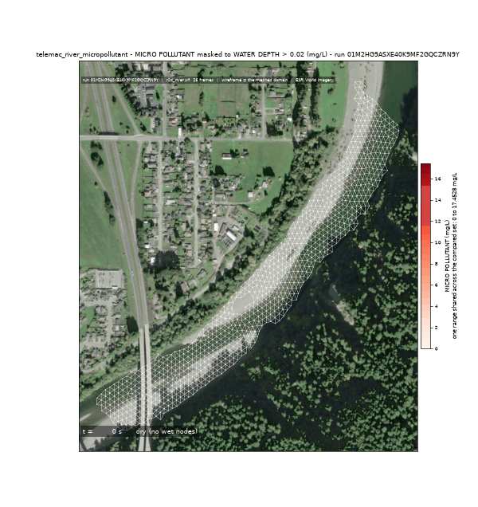
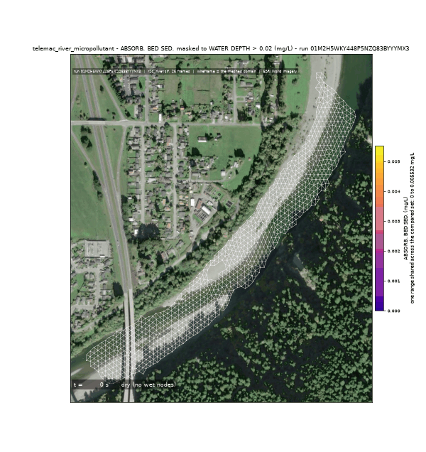
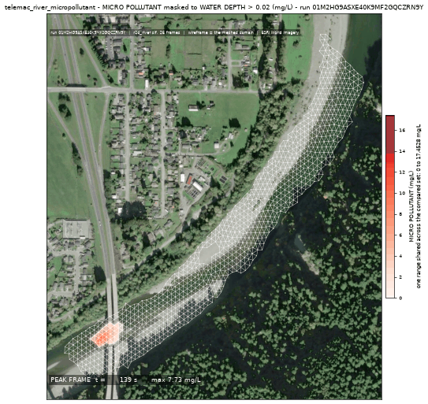
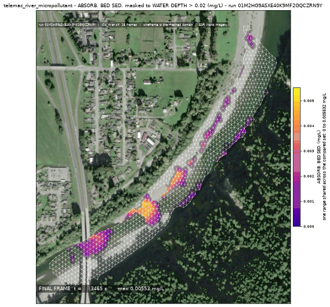
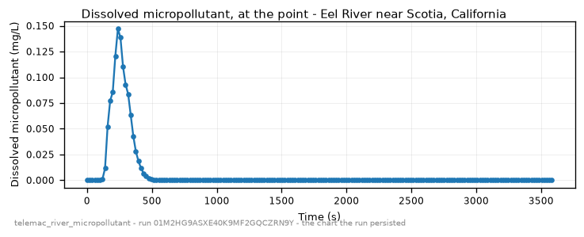

<!-- GENERATED by dev/instruments/gen_template_docs.py. Edit the declaration, not this file. -->

# `telemac_river_micropollutant`

A SORBING substance in a RIVER: how much stays DISSOLVED and how much ends up ON THE BED.

|  |  |
|---|---|
| module | `telemac2d` - 376 keywords in its dictionary, of which this template states 28 |
| solves | `trid3nt_server.workflows.telemac.engine.solve_case` |
| engine defaults | every keyword this template does not state keeps the engine's own default; `describe_keywords` names it with that default, and `keywords={...}` sets it |

## The data it consumes

| row | produced by | what it is | datum |
|---|---|---|---|
| `rivers` | `trid3nt_server.workflows.telemac.templates.reach.fetch_reach_flowline` | The reach flowline FlatGeobuf over the CURRENT DOMAIN. Reference data. | - |
| `centerline` | `fetch_nhdplus_nldi_navigate` | Walk the NHDPlus stream network from a seed in the requested direction. | - |
| `ends` | `endpoints` | Take the TWO END POINTS of a line layer -> a point layer plus the pair itself. | - |
| `window` | `compute_layer_bounds` | Get a layer's geographic extent AND fit/zoom/resize the map to it. | - |
| `water` | `fetch_nhd_area_water` | Fetch NHD water-surface polygons (the two BANKS of a wide river, an estuary, a canal) inside a bounding box. | - |
| `mapped_water` | `trid3nt_server.workflows.telemac.templates.reach.measure_water_coverage` | MEASURE how much of the reach the fetched water polygons map -> the water. | - |
| `reach_polygon` | `section` | Cut a POLYGON LAYER down to the part between two points, or inside an extent -> a polygon layer. | - |
| `dem` | `fetch_copernicus_dem` | Internal seam -- NOT a model-facing tool (tier="internal"). | EGM2008 geoid (metres, positive up) |

## The sheet

The values the template declares. `desc` is what the model reads when it fills one.

| param | door | units | default | desc |
|---|---|---|---|---|
| `location` | question | - | optional | Place name on the river, geocoded to the reach |
| `bbox` | user | - | optional | Explicit AOI (min_lon,min_lat,max_lon,max_lat) EPSG:4326, instead of a place |
| `river_geometry_uri` | user | - | optional | Reuse an already-fetched river flowline for this reach instead of re-fetching it |
| `discharge_m3s` | user | m^3/s | optional | Steady upstream CARRIER discharge - the river flow that dilutes and transports the release |
| `event_time` | question | - | optional | The storm/event moment to read the carrier discharge cycle at - from phrasing like 'during last Tuesday's storm'; an ISO date or datetime (e.g. '2026-08-20' or '2026-08-20T06:00:00Z'). Unset reads the most recent published NWM cycle. The NWM PDS bucket retains only the last ~30 days of history; a deeper request refuses typed rather than silently reading a different cycle. |
| `friction_coefficient` | user | - | optional | Bed roughness under friction_law |
| `friction_law` | user | - | optional | Law interpreting friction_coefficient: 2=Chezy, 3=Strickler, 4=Manning |
| `output_interval_min` | user | min | optional | Result-writing cadence; unset keeps the steering file's own period |
| `compute_class` | constant | - | medium | Solve sizing class |
| `reach_length_km` | scenario | km | 6.0 | Modeled reach length downstream of the release; a longer reach is coarsened under the mesh node budget |
| `release` | user | - | optional | Where the substance enters the water, as a Point: the pick's {coordinates, name} verbatim, a (lon, lat) pair, 'lat,lon', a point layer, or a place name |
| `release_fraction` | scenario | - | 0.1 | Along-reach release position, 0=upstream..1=downstream; the source must sit strictly INSIDE the reach, never on a boundary. It sits near the top so the substance has reach left to sorb and settle in |
| `release_duration_s` | scenario | s | 3600.0 | Finite injection window; the substance is released over it and the rest of the run is what happens to what was released |
| `source_q_m3s` | scenario | m^3/s | 1.0 | Discharge of the release itself - with the carrier flow this sets the dilution the reach receives |
| `source_concentration_mgl` | scenario | mg/L | 100.0 | DISSOLVED concentration of the substance in the release itself, before any dilution; everything that ends up on sediment gets there by sorption during the run |
| `ambient_spm_mgl` | scenario | mg/L | 30.0 | Suspended sediment the river already carries, in and at the top of the reach. It is the SORBENT: with none, the substance stays dissolved and nothing reaches the bed. Nothing fetches suspended sediment for a reach, so this is a STATED condition, not a measured one - state the gauged value if the reach has one |
| `decay_constant_per_s` | user | 1/s | optional | First-order decay constant of the substance, applied at the same rate to all three of its phases - dissolved, on suspended sediment and on bed sediment. A half-life h in days is ln(2)/(86400 h) |
| `settling_velocity_mps` | user | m/s | optional | Settling velocity of the suspended sediment - what carries the sorbed substance down onto the bed |
| `distribution_coefficient_m3kg` | user | m^3/kg | optional | Kd, the sorption equilibrium: how strongly the substance partitions onto sediment rather than staying dissolved. A larger Kd puts more of it on the bed |
| `desorption_constant_per_s` | user | 1/s | optional | How fast the substance comes back off the sediment - with Kd it sets how quickly the partition reaches equilibrium |
| `monitoring_point` | user | - | optional | Where downstream the dissolved history is read, as a Point: the pick's {coordinates, name} verbatim, a (lon, lat) pair, 'lat,lon', a point layer, or a place name |
| `monitoring_fraction` | scenario | - | 0.85 | Along-reach position the history is read at when no point was given, 0=upstream..1=downstream |
| `sim_duration_s` | scenario | s | 172800.0 | Simulated time. Sorption equilibrates in hours and settling takes longer than that, so a window of a few hours reports a partition that has not happened yet; two days is what the default covers |
| `mesh_resolution_m` | scenario | m | 14.0 | Target element edge length the reach is triangulated at; peak concentration is a resolution-bound class and a coarse mesh reads it low |

## What it answers

| field | the proving run's value |
|---|---|
| `dissolved_cmax_mgl` | 0.14700832962989807 |
| `dissolved_peak_time_s` | 237.5760040283203 |
| `dissolved_travel_m` | 97.3 |
| `dissolved_final_mean_mgl` | 1.0891394268762244e-07 |
| `suspended_sorbed_final_mean_mgl` | 0.004868683330623938 |
| `bed_sorbed_final_mean_mgl` | 0.0005755947248232069 |
| `bed_over_dissolved` | 5284.858032126134 |
| `mesh_size_m` | 10.415 |

It publishes these layers onto the canvas:

- Input: OSM waterways (map context; the modeled river is the NLDI centerline) (river_geometry)
- Input: nhdplus nldi (nhdplus_nldi)
- Input: nhd area water (nhd_area_water)
- Input: river bed elevation (copernicus_dem, datum EGM2008 geoid (metres, positive up))
- Release point (user) - scotia_humboldt_county_california_95562_united_s
- Monitoring point (derived) - scotia_humboldt_county_california_95562_united_s
- Velocity u over time (scotia_humboldt_county_california_95562_united_s)
- Velocity v over time (scotia_humboldt_county_california_95562_united_s)
- Water depth over time (scotia_humboldt_county_california_95562_united_s)
- Free surface over time (scotia_humboldt_county_california_95562_united_s)
- Bottom (m) at t = 3583.44 s (scotia_humboldt_county_california_95562_united_s)
- Froude number over time (scotia_humboldt_county_california_95562_united_s)
- Scalar flowrate over time (scotia_humboldt_county_california_95562_united_s)
- Scalar velocity over time (scotia_humboldt_county_california_95562_united_s)
- Micro pollutant over time (scotia_humboldt_county_california_95562_united_s)
- Suspended load over time (scotia_humboldt_county_california_95562_united_s)
- Bed sediments over time (scotia_humboldt_county_california_95562_united_s)
- Abs. susp. load. over time (scotia_humboldt_county_california_95562_united_s)
- Absorb. bed sed. over time (scotia_humboldt_county_california_95562_united_s)
- scotia_humboldt_county_california_95562_united_s

## The proving run

Run `01M2HG9ASXE40K9MF2GQCZRN9Y`, 2026-09-15T03:04:01.681727+00:00, 96.419 s, at commit `80e141fee6381b28cbe4f48992ba63bf480c0c55-dirty`.


*Every layer the run published, stacked and framed on the result (run 01M2HG9ASXE40K9MF2GQCZRN9Y)*



*The solve, frame by frame - dissolved (run 01M2HG9ASXE40K9MF2GQCZRN9Y)*



*The solve, frame by frame - on_the_bed (run 01M2HG9ASXE40K9MF2GQCZRN9Y)*



*dissolved peak frame (run 01M2HG9ASXE40K9MF2GQCZRN9Y)*



*on the bed final frame (run 01M2HG9ASXE40K9MF2GQCZRN9Y)*



*dissolved micropollutant - the chart the run persisted (run 01M2HG9ASXE40K9MF2GQCZRN9Y)*

### The sheet it filled

Every slot the run resolved, with where the value came from. The engine's own defaults are folded: what is not here, the engine chose.

| param | value | units | basis | provenance |
|---|---|---|---|---|
| `location` | Eel River near Scotia, California | - | user | supplied on this invocation |
| `discharge_m3s` | 60.0 | m^3/s | user | supplied on this invocation |
| `output_interval_min` | 0.333 | min | user | supplied on this invocation |
| `reach_length_km` | 1.0 | km | user | supplied on this invocation |
| `release` | Point(lon=-124.0983, lat=40.4921, name=None) | - | user | supplied on this invocation |
| `release_duration_s` | 120.0 | s | user | supplied on this invocation |
| `source_q_m3s` | 1.0 | m^3/s | user | supplied on this invocation |
| `source_concentration_mgl` | 500.0 | mg/L | user | supplied on this invocation |
| `ambient_spm_mgl` | 30.0 | mg/L | user | supplied on this invocation |
| `monitoring_fraction` | 0.2 | - | user | supplied on this invocation |
| `sim_duration_s` | 3600.0 | s | user | supplied on this invocation |
| `mesh_resolution_m` | 12.0 | m | user | supplied on this invocation |
| `compute_class` | medium | - | default_demo | declared constant default |
| `release_fraction` | 0.1 | - | default_demo | declared scenario default |
| `bbox` | - | - | user | not supplied (declared optional) |
| `river_geometry_uri` | - | - | user | not supplied (declared optional) |
| `event_time` | - | - | prompt_interpreted | not supplied (declared optional) |
| `friction_coefficient` | - | - | user | not supplied (declared optional) |
| `friction_law` | - | - | user | not supplied (declared optional) |
| `decay_constant_per_s` | - | 1/s | user | not supplied (declared optional) |
| `settling_velocity_mps` | - | m/s | user | not supplied (declared optional) |
| `distribution_coefficient_m3kg` | - | m^3/kg | user | not supplied (declared optional) |
| `desorption_constant_per_s` | - | 1/s | user | not supplied (declared optional) |
| `monitoring_point` | - | - | user | not supplied (declared optional) |

### Reproduce

```python
from trid3nt_server.tools import TOOL_REGISTRY

await TOOL_REGISTRY['telemac_river_micropollutant'].fn(
    ambient_spm_mgl=30.0,
    discharge_m3s=60.0,
    location='Eel River near Scotia, California',
    mesh_resolution_m=12.0,
    monitoring_fraction=0.2,
    output_interval_min=0.333,
    reach_length_km=1.0,
    release='Point(lon=-124.0983, lat=40.4921, name=None)',
    release_duration_s=120.0,
    sim_duration_s=3600.0,
    source_concentration_mgl=500.0,
    source_q_m3s=1.0,
)
```

That is the invocation this run came from; the figures above are stamped with run `01M2HG9ASXE40K9MF2GQCZRN9Y` and commit `80e141fee6381b28cbe4f48992ba63bf480c0c55-dirty`. The full argument record is [`telemac_river_micropollutant/run.json`](telemac_river_micropollutant/run.json).

