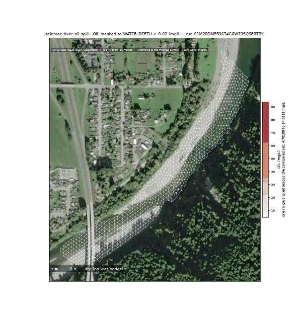
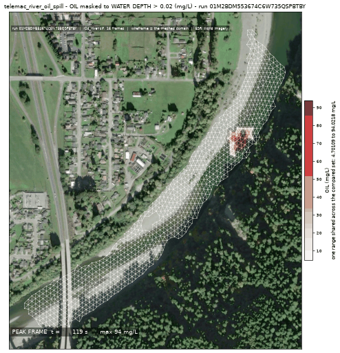
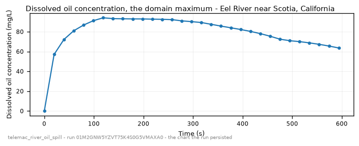

<!-- GENERATED by dev/instruments/gen_template_docs.py. Edit the declaration, not this file. -->

# `telemac_river_oil_spill`

An OIL SLICK released into a RIVER: floating particles plus the dissolved fraction.

|  |  |
|---|---|
| module | `telemac2d` - 376 keywords in its dictionary, of which this template states 35 |
| parts | `RIVER` |
| solves | `trid3nt_server.workflows.telemac.solving.solve.solve_reach` |
| engine defaults | every keyword this template does not state keeps the engine's own default; `describe_keywords` names it with that default, and `keywords={...}` sets it |

## The data it consumes

| row | produced by | what it is | datum |
|---|---|---|---|
| `rivers` | `trid3nt_server.workflows.telemac.helpers.reach.fetch_reach_flowline` | The reach flowline FlatGeobuf over the CURRENT DOMAIN. Reference data. | - |
| `centerline` | `fetch_nhdplus_nldi_navigate` | Walk the NHDPlus stream network from a seed in the requested direction. | - |
| `ends` | `endpoints` | Take the TWO END POINTS of a line layer -> a point layer plus the pair itself. | - |
| `window` | `compute_layer_bounds` | Get a layer's geographic extent AND fit/zoom/resize the map to it. | - |
| `water` | `fetch_nhd_area_water` | Fetch NHD water-surface polygons (the two BANKS of a wide river, an estuary, a canal) inside a bounding box. | - |
| `mapped_water` | `trid3nt_server.workflows.telemac.helpers.reach.measure_water_coverage` | MEASURE how much of the reach the fetched water polygons map -> the water. | - |
| `reach_polygon` | `section` | Cut a POLYGON LAYER down to the part between two points, or inside an extent -> a polygon layer. | - |
| `dem` | `fetch_copernicus_dem` | Internal seam -- NOT a model-facing tool (tier="internal"). | EGM2008 geoid (metres, positive up) |
| `rain` | `trid3nt_server.workflows.telemac.helpers.forcing.resolve_rain_forcing` | The SIGNED net rain-or-evaporation rate (mm/day) the sheet carries. | - |

## The sheet

The values the template declares. `desc` is what the model reads when it fills one.

| param | door | units | default | desc |
|---|---|---|---|---|
| `river_geometry_uri` | user | - | optional | Reuse an already-fetched river flowline for this reach instead of re-fetching it |
| `friction_coefficient` | user | - | optional | Bed roughness under friction_law |
| `friction_law` | user | - | optional | Law interpreting friction_coefficient: 2=Chezy, 3=Strickler, 4=Manning |
| `location` | question | - | optional | Place name on the river, geocoded to the reach |
| `bbox` | user | - | optional | Explicit AOI (min_lon,min_lat,max_lon,max_lat) EPSG:4326, instead of a place |
| `discharge_m3s` | user | m^3/s | optional | Steady upstream CARRIER discharge - the river flow that dilutes and transports the release |
| `event_time` | question | - | optional | The storm/event moment to read the carrier discharge cycle at - from phrasing like 'during last Tuesday's storm'; an ISO date or datetime (e.g. '2026-08-20' or '2026-08-20T06:00:00Z'). Unset reads the most recent published NWM cycle. The NWM PDS bucket retains only the last ~30 days of history; a deeper request refuses typed rather than silently reading a different cycle. |
| `output_interval_min` | user | min | optional | Result-writing cadence; unset keeps the steering file's own period |
| `compute_class` | constant | - | medium | Solve sizing class |
| `release_coords` | user | - | optional | Where the substance enters the water, (lon, lat) EPSG:4326 |
| `spill_fraction` | scenario | - | 0.25 | Along-reach release position, 0=upstream..1=downstream; the source must sit strictly INSIDE the reach, never on a boundary |
| `spill_duration_s` | scenario | s | 300.0 | Finite pulse injection window |
| `source_q_m3s` | scenario | m^3/s | 8.0 | Point-source discharge of the release itself, small against the river's carrier flow |
| `wind_speed_mps` | scenario | m/s | 0.0 | Sustained wind driving a surface wind-stress term; 0 = no wind |
| `wind_direction_deg` | scenario | deg | 0.0 | Compass bearing the wind blows FROM (0=N, 90=E); only read when wind_speed_mps > 0 |
| `rainfall_mm_per_day` | user | mm/day | optional | Distributed ON-MESH rainfall applied at every wet node, independent of the inflow hydrograph |
| `evaporation_mm_per_day` | user | mm/day | optional | Distributed evaporation, subtracted from the net rain flux |
| `rainfall_gridmet_window` | user | - | optional | Real-storm source: an ISO window 'YYYY-MM-DD:YYYY-MM-DD' whose gridMET domain-mean daily precipitation supersedes rainfall_mm_per_day |
| `velocity_diffusivity` | user | m^2/s | optional | Turbulent momentum diffusivity |
| `tracer_diffusivity` | user | m^2/s | optional | Tracer diffusivity, which sets lateral plume spread |
| `reach_seed_coords` | user | - | optional | The point the reach centerline is navigated from, (lon, lat); set when the release must pin which water body is meshed |
| `oil_type` | question | - | crude | What was spilled - crude \| diesel \| gasoline \| heavy fuel \| bunker - which picks the module's own composition, density and viscosity preset |
| `oil_concentration_mgl` | scenario | mg/L | 100.0 | Concentration of the DISSOLVED fraction released with the slick, carried as the reach's tracer |
| `reach_length_km` | scenario | km | 6.0 | Modeled reach length downstream of the release; a longer reach is coarsened under the mesh node budget |
| `sim_duration_s` | scenario | s | 3600.0 | Simulated physical time |
| `n_drogues` | scenario | - | 100 | How many floating particles the module tracks; the slick is drawn from their positions, so a coarse count draws a coarse slick |
| `drogues_period_s` | scenario | s | 60.0 | How often the particle positions are written; it converts to a count of solver steps at the run's own timestep |
| `oil_release_step` | scenario | - | 600 | The solver step the floats are released at, compiled into the module's own release routine; it lets the flow field establish before the slick is put on it |
| `mesh_resolution_m` | scenario | m | 14.0 | Target element edge length the reach is triangulated at; where the slick reaches is a front location and moves with the elements that carry it |

## What it answers

| field | the proving run's value |
|---|---|
| `dye_cmax_mgl` | 90.79682159423828 |
| `dye_peak_time_s` | 104.19999694824219 |
| `plume_reach_m` | 40.2 |
| `active_frames` | 5 |
| `mesh_size_m` | 10.415 |

It publishes these layers onto the canvas:

- Input: OSM waterways (map context; the modeled river is the NLDI centerline) (river_geometry)
- Input: nhdplus nldi (nhdplus_nldi)
- Input: nhd area water (nhd_area_water)
- Input: river bed elevation (copernicus_dem, datum EGM2008 geoid (metres, positive up))
- Release point (derived) - scotia_humboldt_county_california_95562_united_s
- Model results (time series): scotia_humboldt_county_california_95562_united_s
- Oil slick track (light_crude, scotia_humboldt_county_california_95562_united_s)
- Peak oil tracer concentration (scotia_humboldt_county_california_95562_united_s)

## The proving run

Run `01M1X9EER6X9PV8D1M9HT511F3`, 2026-09-07T06:39:00.532728+00:00, 25.848 s, at commit `1f0ccc3188561e84f5f977f0d0d6c54e08c9adb1`.


*Every layer the run published, stacked and framed on the result (run 01M1X9EER6X9PV8D1M9HT511F3)*



*The solve, frame by frame (run 01M1X9EER6X9PV8D1M9HT511F3)*



*peak frame (run 01M1X9EER6X9PV8D1M9HT511F3)*



*dissolved oil concentration - the chart the run persisted (run 01M1X9EER6X9PV8D1M9HT511F3)*

### The sheet it filled

Every slot the run resolved, with where the value came from. The engine's own defaults are folded: what is not here, the engine chose.

| param | value | units | basis | provenance |
|---|---|---|---|---|
| `location` | Eel River near Scotia, California | - | user | supplied on this invocation |
| `discharge_m3s` | 2.2 | m^3/s | user | supplied on this invocation |
| `spill_duration_s` | 120.0 | s | user | supplied on this invocation |
| `source_q_m3s` | 8.0 | m^3/s | user | supplied on this invocation |
| `oil_type` | crude | - | user | supplied on this invocation |
| `oil_concentration_mgl` | 100.0 | mg/L | user | supplied on this invocation |
| `reach_length_km` | 1.0 | km | user | supplied on this invocation |
| `sim_duration_s` | 600.0 | s | user | supplied on this invocation |
| `n_drogues` | 100 | - | user | supplied on this invocation |
| `oil_release_step` | 60 | - | user | supplied on this invocation |
| `mesh_resolution_m` | 12.0 | m | user | supplied on this invocation |
| `compute_class` | medium | - | default_demo | declared constant default |
| `spill_fraction` | 0.25 | - | default_demo | declared scenario default |
| `wind_speed_mps` | 0.0 | m/s | default_demo | declared scenario default |
| `wind_direction_deg` | 0.0 | deg | default_demo | declared scenario default |
| `drogues_period_s` | 60.0 | s | default_demo | declared scenario default |
| `river_geometry_uri` | - | - | user | not supplied (declared optional) |
| `friction_coefficient` | - | - | user | not supplied (declared optional) |
| `friction_law` | - | - | user | not supplied (declared optional) |
| `bbox` | - | - | user | not supplied (declared optional) |
| `event_time` | - | - | prompt_interpreted | not supplied (declared optional) |
| `output_interval_min` | - | min | user | not supplied (declared optional) |
| `release_coords` | - | - | user | not supplied (declared optional) |
| `rainfall_mm_per_day` | - | mm/day | user | not supplied (declared optional) |
| `evaporation_mm_per_day` | - | mm/day | user | not supplied (declared optional) |
| `rainfall_gridmet_window` | - | - | user | not supplied (declared optional) |
| `velocity_diffusivity` | - | m^2/s | user | not supplied (declared optional) |
| `tracer_diffusivity` | - | m^2/s | user | not supplied (declared optional) |
| `reach_seed_coords` | - | - | user | not supplied (declared optional) |

### Reproduce

```python
from trid3nt_server.tools import TOOL_REGISTRY

await TOOL_REGISTRY['telemac_river_oil_spill'].fn(
    discharge_m3s=2.2,
    location='Eel River near Scotia, California',
    mesh_resolution_m=12.0,
    n_drogues=100,
    oil_concentration_mgl=100.0,
    oil_release_step=60,
    oil_type='crude',
    reach_length_km=1.0,
    sim_duration_s=600.0,
    source_q_m3s=8.0,
    spill_duration_s=120.0,
)
```

That is the invocation this run came from; the figures above are stamped with run `01M1X9EER6X9PV8D1M9HT511F3` and commit `1f0ccc3188561e84f5f977f0d0d6c54e08c9adb1`. The full argument record is [`telemac_river_oil_spill/run.json`](telemac_river_oil_spill/run.json).

