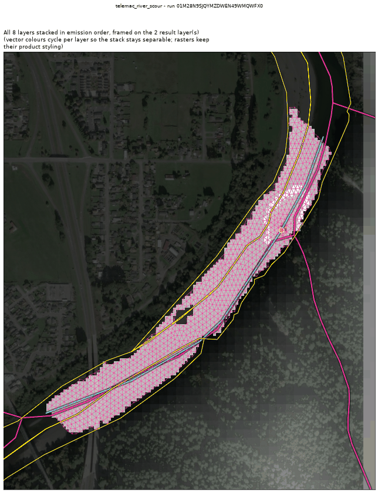
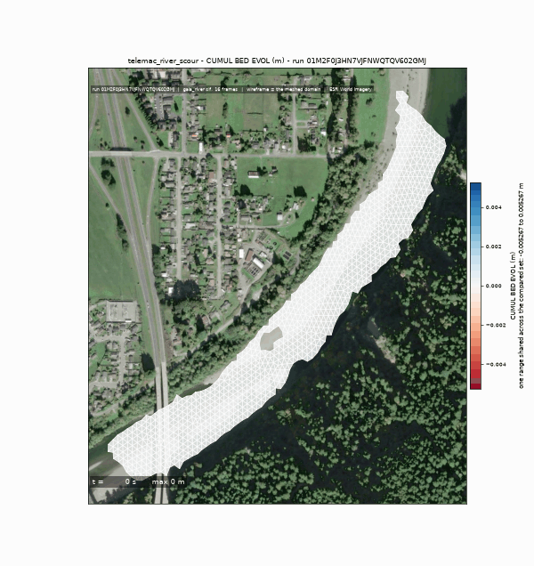
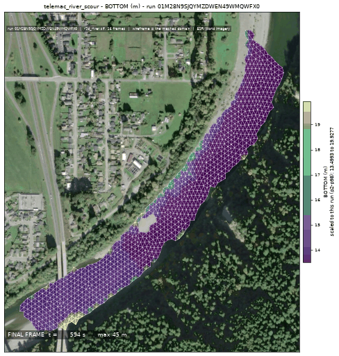
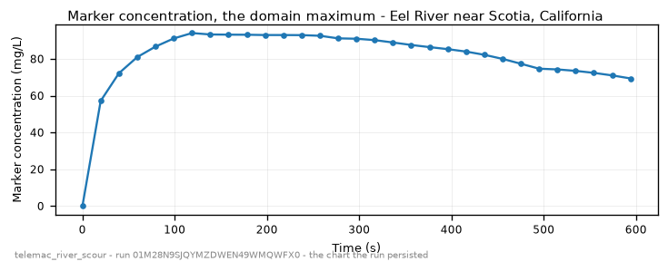

<!-- GENERATED by dev/instruments/gen_template_docs.py. Edit the declaration, not this file. -->

# `telemac_river_scour`

Bed SCOUR and DEPOSITION in a river reach: a mobile bed under a flow.

|  |  |
|---|---|
| module | `telemac2d` - 376 keywords in its dictionary, of which this template states 32 |
| solves | `trid3nt_server.workflows.telemac.solving.solve.solve_reach` |
| engine defaults | every keyword this template does not state keeps the engine's own default; `describe_keywords` names it with that default, and `keywords={...}` sets it |

## The data it consumes

| row | produced by | what it is | datum |
|---|---|---|---|
| `rivers` | `trid3nt_server.workflows.telemac.templates.reach.fetch_reach_flowline` | The reach flowline FlatGeobuf over the CURRENT DOMAIN. Reference data. | - |
| `centerline` | `fetch_nhdplus_nldi_navigate` | Walk the NHDPlus stream network from a seed in the requested direction. | - |
| `ends` | `endpoints` | Take the TWO END POINTS of a line layer -> a point layer plus the pair itself. | - |
| `window` | `compute_layer_bounds` | Get a layer's geographic extent AND fit/zoom/resize the map to it. | - |
| `water` | `fetch_nhd_area_water` | Fetch NHD water-surface polygons (the two BANKS of a wide river, an estuary, a canal) inside a bounding box. | - |
| `mapped_water` | `trid3nt_server.workflows.telemac.templates.reach.measure_water_coverage` | MEASURE how much of the reach the fetched water polygons map -> the water. | - |
| `reach_polygon` | `section` | Cut a POLYGON LAYER down to the part between two points, or inside an extent -> a polygon layer. | - |
| `dem` | `fetch_copernicus_dem` | Internal seam -- NOT a model-facing tool (tier="internal"). | EGM2008 geoid (metres, positive up) |
| `rain` | `trid3nt_server.workflows.telemac.templates.reach.resolve_rain_forcing` | The SIGNED net rain-or-evaporation rate (mm/day) the sheet carries. | - |

## The sheet

The values the template declares. `desc` is what the model reads when it fills one.

| param | door | units | default | desc |
|---|---|---|---|---|
| `location` | question | - | optional | Place name on the river, geocoded to the reach |
| `bbox` | user | - | optional | Explicit AOI (min_lon,min_lat,max_lon,max_lat) EPSG:4326, instead of a place |
| `river_geometry_uri` | user | - | optional | Reuse an already-fetched river flowline for this reach instead of re-fetching it |
| `discharge_m3s` | user | m^3/s | optional | Steady upstream CARRIER discharge - the river flow that dilutes and transports the release |
| `event_time` | question | - | optional | The storm/event moment to read the carrier discharge cycle at - from phrasing like 'during last Tuesday's storm'; an ISO date or datetime (e.g. '2026-08-20' or '2026-08-20T06:00:00Z'). Unset reads the most recent published NWM cycle. The NWM PDS bucket retains only the last ~30 days of history; a deeper request refuses typed rather than silently reading a different cycle. |
| `friction_coefficient` | user | - | optional | Bed roughness under friction_law |
| `friction_law` | user | - | optional | Law interpreting friction_coefficient: 2=Chezy, 3=Strickler, 4=Manning |
| `output_interval_min` | user | min | optional | Result-writing cadence; unset keeps the steering file's own period |
| `compute_class` | constant | - | medium | Solve sizing class |
| `spill_fraction` | scenario | - | 0.25 | Along-reach release position, 0=upstream..1=downstream; the source must sit strictly INSIDE the reach, never on a boundary |
| `spill_duration_s` | scenario | s | 300.0 | Finite pulse injection window |
| `source_q_m3s` | scenario | m^3/s | 8.0 | Point-source discharge of the release itself, small against the river's carrier flow |
| `wind_speed_mps` | scenario | m/s | 0.0 | Sustained wind driving a surface wind-stress term; 0 = no wind |
| `wind_direction_deg` | scenario | deg | 0.0 | Compass bearing the wind blows FROM (0=N, 90=E); only read when wind_speed_mps > 0 |
| `rainfall_mm_per_day` | user | mm/day | optional | Distributed ON-MESH rainfall applied at every wet node, independent of the inflow hydrograph |
| `evaporation_mm_per_day` | user | mm/day | optional | Distributed evaporation, subtracted from the net rain flux |
| `rainfall_gridmet_window` | user | - | optional | Real-storm source: an ISO window 'YYYY-MM-DD:YYYY-MM-DD' whose gridMET domain-mean daily precipitation supersedes rainfall_mm_per_day |
| `release` | user | - | optional | Where the substance enters the water, as a Point: the pick's {coordinates, name} verbatim, a (lon, lat) pair, 'lat,lon', a point layer, or a place name |
| `grain_size_um` | scenario | um | 200.0 | Median grain diameter d50 of the bed - ~200 um fine sand, ~20 um silt, ~8 um mud (all modeled non-cohesive); read only when no gradation is given |
| `bed_thickness_m` | scenario | m | 5.0 | Depth of the erodible sediment stock the bed can scour into |
| `bedload_formula` | scenario | - | 1 | GAIA bed-load law: 1=Meyer-Peter-Mueller, 2=Einstein-Brown, 7=van Rijn |
| `morphological_factor` | scenario | - | 10.0 | Amplifies bed change per hydraulic step so a short hydrograph yields a readable depth; a speed-up lever, not a rate |
| `sediment_gradation` | user | - | optional | Multi-class GRADED sediment: a preset name (graded_sand \| poorly_sorted \| sand_gravel_bimodal \| fine_coarse_sand) or a list of [d50_um, fraction] pairs; a mixture sorts under a hiding factor |
| `tracer_concentration_mgl` | scenario | mg/L | 100.0 | Concentration of the marker tracer released at the source, which is what the deposited fraction is measured against |
| `reach_length_km` | scenario | km | 6.0 | Modeled reach length downstream of the release; a longer reach is coarsened under the mesh node budget |
| `sim_duration_s` | scenario | s | 3600.0 | Simulated physical time; the morphological factor is what makes a short window produce a readable bed change |
| `dredging` | scenario | - | False | Arm the NESTOR channel-maintenance dig/dump rule on top of the mobile bed |
| `dredge_mode` | scenario | - | scheduled | Dredging rule: scheduled (remove a target volume over a window) \| criterion (dig only where the bed silts within tolerance of grade) |
| `dredge_volume_m3` | scenario | m^3 | 4000.0 | Scheduled-mode target dredged volume |
| `dredge_crit_depth_m` | scenario | m | 0.3 | Criterion-mode siltation tolerance above the design grade |
| `dredge_dig_depth_m` | scenario | m | 1.5 | Criterion-mode dig target below the design grade |
| `dredge_disposal` | scenario | - | False | Also place the dug spoil in a downstream disposal zone |
| `dredge_bank_offset_m` | scenario | m | 5.0 | Bank setback the dig field is held back from the mapped water's edge, so the cut does not undercut the bank it is dug beside. It is also what excludes a stretch too narrow to dredge: narrower than twice the setback and no field survives there |
| `mesh_resolution_m` | scenario | m | 14.0 | Target element edge length the reach is triangulated at; scour depth is a resolution-bound class and a coarse mesh reads it low |

## What it answers

| field | the proving run's value |
|---|---|
| `bed_evolution_max_m` | 0.0016452783020213246 |
| `bed_evolution_min_m` | -0.005266561172902584 |
| `net_bed_mass_kg` | -746.0278 |
| `surface_d50_spread_m` | - |
| `marker_cmax_mgl` | 94.071044921875 |
| `active_frames` | 30 |
| `mesh_size_m` | 10.415 |

It publishes these layers onto the canvas:

- Input: OSM waterways (map context; the modeled river is the NLDI centerline) (river_geometry)
- Input: nhdplus nldi (nhdplus_nldi)
- Input: nhd area water (nhd_area_water)
- Input: river bed elevation (copernicus_dem, datum EGM2008 geoid (metres, positive up))
- Release point (derived) - scotia_humboldt_county_california_95562_united_s
- Peak marker concentration (scotia_humboldt_county_california_95562_united_s)
- Model results (time series): scotia_humboldt_county_california_95562_united_s
- Bed evolution (m) at t = 593.94 s (scotia_humboldt_county_california_95562_united_s)

## The proving run

Run `01M28N9SJQYMZDWEN49WMQWFX0`, 2026-09-11T16:37:50.757710+00:00, 26.657 s, at commit `2fba21a6f70cf14ec7820930e71f1314673f20e8-dirty`.



*Every layer the run published, stacked and framed on the result (run 01M28N9SJQYMZDWEN49WMQWFX0)*



*The solve, frame by frame (run 01M28N9SJQYMZDWEN49WMQWFX0)*



*final frame (run 01M28N9SJQYMZDWEN49WMQWFX0)*



*marker concentration - the chart the run persisted (run 01M28N9SJQYMZDWEN49WMQWFX0)*

### The sheet it filled

Every slot the run resolved, with where the value came from. The engine's own defaults are folded: what is not here, the engine chose.

| param | value | units | basis | provenance |
|---|---|---|---|---|
| `location` | Eel River near Scotia, California | - | user | supplied on this invocation |
| `discharge_m3s` | 2.2 | m^3/s | user | supplied on this invocation |
| `output_interval_min` | 0.333 | min | user | supplied on this invocation |
| `spill_duration_s` | 120.0 | s | user | supplied on this invocation |
| `source_q_m3s` | 8.0 | m^3/s | user | supplied on this invocation |
| `grain_size_um` | 200.0 | um | user | supplied on this invocation |
| `tracer_concentration_mgl` | 100.0 | mg/L | user | supplied on this invocation |
| `reach_length_km` | 1.0 | km | user | supplied on this invocation |
| `sim_duration_s` | 600.0 | s | user | supplied on this invocation |
| `mesh_resolution_m` | 12.0 | m | user | supplied on this invocation |
| `compute_class` | medium | - | default_demo | declared constant default |
| `spill_fraction` | 0.25 | - | default_demo | declared scenario default |
| `wind_speed_mps` | 0.0 | m/s | default_demo | declared scenario default |
| `wind_direction_deg` | 0.0 | deg | default_demo | declared scenario default |
| `bed_thickness_m` | 5.0 | m | default_demo | declared scenario default |
| `bedload_formula` | 1 | - | default_demo | declared scenario default |
| `morphological_factor` | 10.0 | - | default_demo | declared scenario default |
| `dredging` | False | - | default_demo | declared scenario default |
| `dredge_mode` | scheduled | - | default_demo | declared scenario default |
| `dredge_volume_m3` | 4000.0 | m^3 | default_demo | declared scenario default |
| `dredge_crit_depth_m` | 0.3 | m | default_demo | declared scenario default |
| `dredge_dig_depth_m` | 1.5 | m | default_demo | declared scenario default |
| `dredge_disposal` | False | - | default_demo | declared scenario default |
| `dredge_bank_offset_m` | 5.0 | m | default_demo | declared scenario default |
| `bbox` | - | - | user | not supplied (declared optional) |
| `river_geometry_uri` | - | - | user | not supplied (declared optional) |
| `event_time` | - | - | prompt_interpreted | not supplied (declared optional) |
| `friction_coefficient` | - | - | user | not supplied (declared optional) |
| `friction_law` | - | - | user | not supplied (declared optional) |
| `rainfall_mm_per_day` | - | mm/day | user | not supplied (declared optional) |
| `evaporation_mm_per_day` | - | mm/day | user | not supplied (declared optional) |
| `rainfall_gridmet_window` | - | - | user | not supplied (declared optional) |
| `release` | - | - | user | not supplied (declared optional) |
| `sediment_gradation` | - | - | user | not supplied (declared optional) |

### Reproduce

```python
from trid3nt_server.tools import TOOL_REGISTRY

await TOOL_REGISTRY['telemac_river_scour'].fn(
    discharge_m3s=2.2,
    grain_size_um=200.0,
    location='Eel River near Scotia, California',
    mesh_resolution_m=12.0,
    output_interval_min=0.333,
    reach_length_km=1.0,
    sim_duration_s=600.0,
    source_q_m3s=8.0,
    spill_duration_s=120.0,
    tracer_concentration_mgl=100.0,
)
```

That is the invocation this run came from; the figures above are stamped with run `01M28N9SJQYMZDWEN49WMQWFX0` and commit `2fba21a6f70cf14ec7820930e71f1314673f20e8-dirty`. The full argument record is [`telemac_river_scour/run.json`](telemac_river_scour/run.json).

