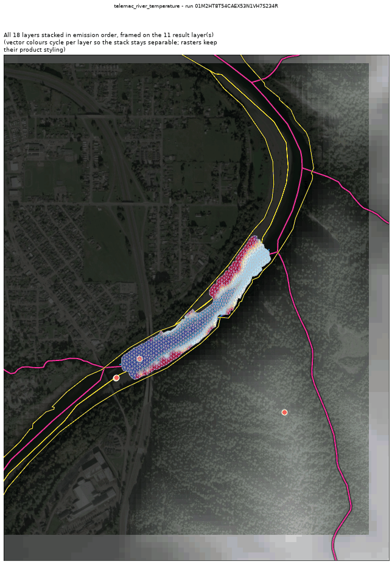
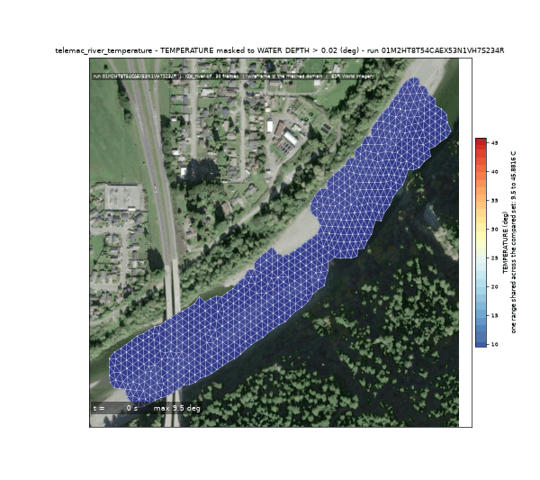
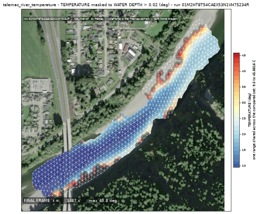
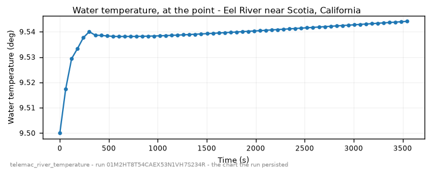

<!-- GENERATED by dev/instruments/gen_template_docs.py. Edit the declaration, not this file. -->

# `telemac_river_temperature`

WATER TEMPERATURE down a river reach under a week of real weather.

|  |  |
|---|---|
| module | `telemac2d` - 376 keywords in its dictionary, of which this template states 28 |
| solves | `trid3nt_server.workflows.telemac.engine.solve_case` |
| engine defaults | every keyword this template does not state keeps the engine's own default; `describe_keywords` names it with that default, and `keywords={...}` sets it |

## The data it consumes

| row | produced by | what it is | datum |
|---|---|---|---|
| `rivers` | `trid3nt_server.workflows.telemac.templates.reach.fetch_reach_flowline` | The reach flowline FlatGeobuf over the CURRENT DOMAIN. Reference data. | - |
| `centerline` | `fetch_nhdplus_nldi_navigate` | Walk the NHDPlus stream network from a seed in the requested direction. | - |
| `ends` | `endpoints` | Take the TWO END POINTS of a line layer -> a point layer plus the pair itself. | - |
| `window` | `compute_layer_bounds` | Get a layer's geographic extent AND fit/zoom/resize the map to it. | - |
| `water` | `fetch_nhd_area_water` | Fetch NHD water-surface polygons (the two BANKS of a wide river, an estuary, a canal) inside a bounding box. | - |
| `mapped_water` | `trid3nt_server.workflows.telemac.templates.reach.measure_water_coverage` | MEASURE how much of the reach the fetched water polygons map -> the water. | - |
| `reach_polygon` | `section` | Cut a POLYGON LAYER down to the part between two points, or inside an extent -> a polygon layer. | - |
| `dem` | `fetch_copernicus_dem` | Internal seam -- NOT a model-facing tool (tier="internal"). | EGM2008 geoid (metres, positive up) |
| `weather_box` | `compute_layer_bounds` | Get a layer's geographic extent AND fit/zoom/resize the map to it. | - |
| `sample_box` | `compute_layer_bounds` | Get a layer's geographic extent AND fit/zoom/resize the map to it. | - |
| `weather` | `fetch_raws_weather` | Fetch RAWS fire-weather station observations as a point FlatGeobuf. | - |
| `water_sample` | `fetch_usgs_water_quality` | Fetch REAL, OBSERVED water-quality sample sites as a point FlatGeobuf. | - |

## The sheet

The values the template declares. `desc` is what the model reads when it fills one.

| param | door | units | default | desc |
|---|---|---|---|---|
| `location` | question | - | optional | Place name on the river, geocoded to the reach |
| `bbox` | user | - | optional | Explicit AOI (min_lon,min_lat,max_lon,max_lat) EPSG:4326, instead of a place |
| `river_geometry_uri` | user | - | optional | Reuse an already-fetched river flowline for this reach instead of re-fetching it |
| `discharge_m3s` | user | m^3/s | optional | Steady upstream discharge - the flow whose depth and travel time set how much heat the reach picks up per kilometre |
| `event_time` | question | - | optional | The moment to read the carrier discharge cycle at - an ISO date or datetime. The NWM PDS bucket retains only the last ~30 days of history; a deeper request refuses typed. |
| `weather_start` | question | - | - | First day of the observed weather the reach is driven over, 'YYYY-MM-DD' - from phrasing like 'last week' or 'the first week of August'. The station record is hourly and the network holds the last two weeks, so an earlier day refuses typed |
| `weather_end` | question | - | - | Last day of the observed weather, 'YYYY-MM-DD'. The run is sim_duration_s long from the first observation, so this day has to be far enough past weather_start to cover it; at most 14 days after |
| `station` | user | - | optional | Where the temperature series and its diurnal range are read, as a Point: the pick's {coordinates, name} verbatim, a (lon, lat) pair, 'lat,lon', a point layer, or a place name |
| `initial_water_temp_c` | user | C | optional | Water temperature the whole reach opens at, and the value carried in at the upstream boundary |
| `friction_coefficient` | user | - | optional | Bed roughness under friction_law |
| `friction_law` | user | - | optional | Law interpreting friction_coefficient: 2=Chezy, 3=Strickler, 4=Manning |
| `output_interval_min` | user | min | optional | Result-writing cadence; unset keeps the steering file's own period |
| `compute_class` | constant | - | medium | Solve sizing class |
| `reach_length_km` | scenario | km | 12.0 | Modelled reach length downstream of the geocoded point; the water warms with the time it spends in the reach, so the length is how much exposure the question asks about |
| `sim_duration_s` | scenario | s | 604800.0 | Simulated time. A DIURNAL RANGE needs whole days, and this defaults to seven; a shorter run answers what the reach did over that window and no more. The weather record has to span every second of it - a run longer than its own forcing refuses rather than extrapolating |
| `mesh_resolution_m` | scenario | m | 20.0 | Target element edge length the reach is triangulated at; a surface heat budget is a reach-scale answer, so this is coarser than a plume question asks for |

## What it answers

| field | the proving run's value |
|---|---|
| `peak_temperature_c` | 9.544106483459473 |
| `peak_temperature_time_s` | 3546.72607421875 |
| `final_temperature_c` | 9.544106483459473 |
| `diurnal_range_c` | 0.044106483459472656 |
| `warming_along_reach_c` | 17.078406175261055 |
| `mean_velocity_mps` | 0.5902288277725102 |
| `mesh_size_m` | 9.323 |

It publishes these layers onto the canvas:

- Input: OSM waterways (map context; the modeled river is the NLDI centerline) (river_geometry)
- Input: nhdplus nldi (nhdplus_nldi)
- Input: nhd area water (nhd_area_water)
- Input: river bed elevation (copernicus_dem, datum EGM2008 geoid (metres, positive up))
- Input: usgs water quality (usgs_water_quality)
- Temperature station (user) - scotia_humboldt_county_california_95562_united_s
- Input: raws weather (raws_weather)
- Velocity u over time (scotia_humboldt_county_california_95562_united_s)
- Velocity v over time (scotia_humboldt_county_california_95562_united_s)
- Water depth over time (scotia_humboldt_county_california_95562_united_s)
- Free surface over time (scotia_humboldt_county_california_95562_united_s)
- Bottom (m) at t = 3546.73 s (scotia_humboldt_county_california_95562_united_s)
- Froude number over time (scotia_humboldt_county_california_95562_united_s)
- Scalar flowrate over time (scotia_humboldt_county_california_95562_united_s)
- Scalar velocity over time (scotia_humboldt_county_california_95562_united_s)
- Temperature over time (scotia_humboldt_county_california_95562_united_s)
- Water temperature (scotia_humboldt_county_california_95562_united_s)
- scotia_humboldt_county_california_95562_united_s

## The proving run

Run `01M2HT8T54CAEX53N1VH7S234R`, 2026-09-15T05:58:30.613274+00:00, 100.962 s, at commit `ad80fc708f8e79070559d6e31e57162ed83008e2-dirty`.



*Every layer the run published, stacked and framed on the result (run 01M2HT8T54CAEX53N1VH7S234R)*



*The solve, frame by frame (run 01M2HT8T54CAEX53N1VH7S234R)*



*final frame (run 01M2HT8T54CAEX53N1VH7S234R)*



*water temperature - the chart the run persisted (run 01M2HT8T54CAEX53N1VH7S234R)*

### The sheet it filled

Every slot the run resolved, with where the value came from. The engine's own defaults are folded: what is not here, the engine chose.

| param | value | units | basis | provenance |
|---|---|---|---|---|
| `location` | Eel River near Scotia, California | - | user | supplied on this invocation |
| `discharge_m3s` | 60.0 | m^3/s | user | supplied on this invocation |
| `weather_start` | 2026-09-10 | - | user | supplied on this invocation |
| `weather_end` | 2026-09-13 | - | user | supplied on this invocation |
| `station` | Point(lon=-124.0983, lat=40.4921, name=None) | - | user | supplied on this invocation |
| `output_interval_min` | 1.0 | min | user | supplied on this invocation |
| `reach_length_km` | 0.5 | km | user | supplied on this invocation |
| `sim_duration_s` | 3600.0 | s | user | supplied on this invocation |
| `mesh_resolution_m` | 12.0 | m | user | supplied on this invocation |
| `compute_class` | medium | - | default_demo | declared constant default |
| `bbox` | - | - | user | not supplied (declared optional) |
| `river_geometry_uri` | - | - | user | not supplied (declared optional) |
| `event_time` | - | - | prompt_interpreted | not supplied (declared optional) |
| `initial_water_temp_c` | - | C | user | not supplied (declared optional) |
| `friction_coefficient` | - | - | user | not supplied (declared optional) |
| `friction_law` | - | - | user | not supplied (declared optional) |

### Reproduce

```python
from trid3nt_server.tools import TOOL_REGISTRY

await TOOL_REGISTRY['telemac_river_temperature'].fn(
    discharge_m3s=60.0,
    location='Eel River near Scotia, California',
    mesh_resolution_m=12.0,
    output_interval_min=1.0,
    reach_length_km=0.5,
    sim_duration_s=3600.0,
    station='Point(lon=-124.0983, lat=40.4921, name=None)',
    weather_end='2026-09-13',
    weather_start='2026-09-10',
)
```

That is the invocation this run came from; the figures above are stamped with run `01M2HT8T54CAEX53N1VH7S234R` and commit `ad80fc708f8e79070559d6e31e57162ed83008e2-dirty`. The full argument record is [`telemac_river_temperature/run.json`](telemac_river_temperature/run.json).

