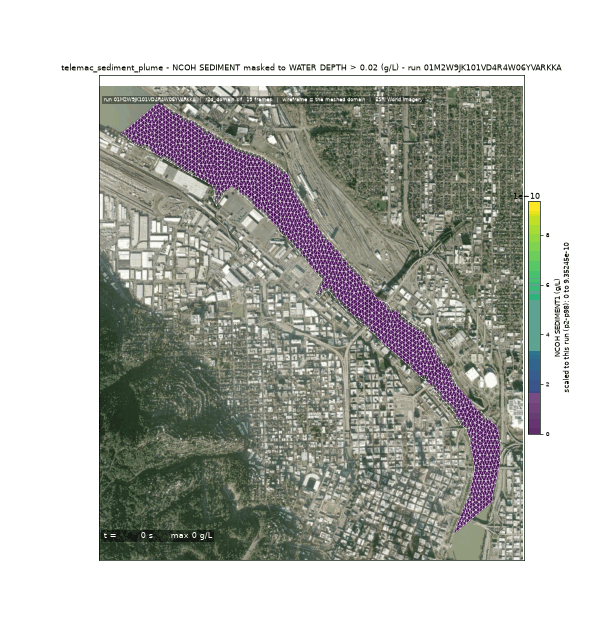
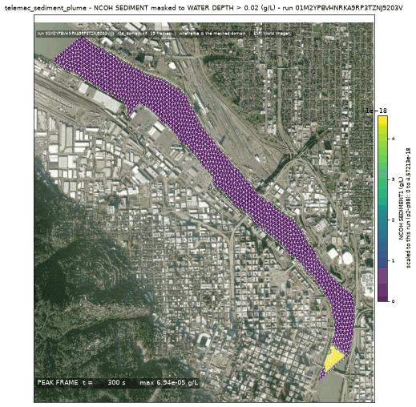
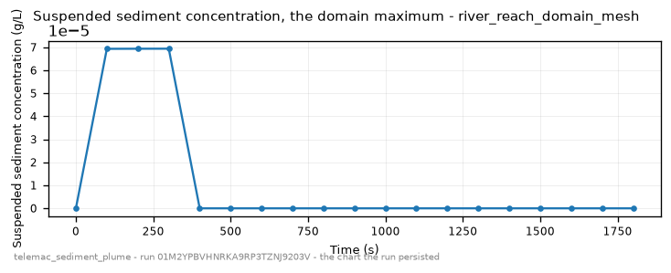

<!-- GENERATED by dev/instruments/gen_template_docs.py. Edit the declaration, not this file. -->

# `telemac_sediment_plume`

A SUSPENDED SEDIMENT plume in a body of water: it settles and deposits on the bed.

|  |  |
|---|---|
| module | `telemac2d` - 376 keywords in its dictionary, of which this template states 35 |
| solves | `trid3nt_server.workflows.telemac.engine.solve_case` |
| engine defaults | every keyword this template does not state keeps the engine's own default; `describe_keywords` names it with that default, and `keywords={...}` sets it |

## The data it consumes

| row | produced by | what it is | datum |
|---|---|---|---|
| `domain` | matched on a need for hydrography | the closed polygon this run solves over, as a uri, a layer name or a drawn shape; unfilled, the run matches a source of hydrography. | - |
| `bed` | matched on a need for bathymetry | what the domain's nodes carry for elevation: a DEM, a bathymetry or survey raster, a layer of soundings, or a depth in metres below the free surface; unfilled, the run matches a source of bathymetry. | - |
| `discharge` | matched on a need for discharge series | the discharge series this run opens on: a layer of sites that report it, or the number itself; unfilled, the run matches a source of discharge series. | - |
| `level` | matched on a need for water level series | the water level series this run opens on: a layer of sites that report it, or the number itself; unfilled, the run matches a source of water level series. | - |

## The sheet

The values the template declares. `desc` is what the model reads when it fills one.

| param | door | units | default | desc |
|---|---|---|---|---|
| `release` | user | - | optional | Where the sediment enters the water, as a Point: the pick's {coordinates, name} verbatim, a (lon, lat) pair, 'lat,lon', a point layer. Geocode a place name first. Its name becomes the marker's name, and on a river with no domain supplied it is also the seed the reach is walked downstream from |
| `spill_fraction` | scenario | - | 0.25 | Along-domain release position, 0=inflow..1=outflow; the source must sit strictly INSIDE the domain, never on a boundary |
| `spill_duration_s` | scenario | s | 300.0 | Finite pulse injection window |
| `injected_mass_kg` | derived | kg | - | The mass the pulse released - the deck's own fixed discharge and concentration x spill_duration_s - which the deposited fraction is measured against |
| `mesh_resolution_m` | scenario | m | 14.0 | Target element edge or cell length the domain is resolved at. The granularity is the USER's lever: no sizing rung derives an edge from a channel nobody surveyed, so the number the run meshes at is either yours or this labeled default |
| `event_time` | question | - | optional | The moment the scenario is read at - an ISO date or datetime ('2026-08-20' or '2026-08-20T06:00:00Z'), from phrasing like 'during last Tuesday's storm'. Each source keeps its own retention, and a request deeper than one refuses typed |
| `compute_class` | constant | - | medium | Solve sizing class - how many cores the solve is partitioned across. An engine that runs on one core says so on the card |
| `vertical_frame` | constant | - | NAVD88 | Vertical datum this run counts every elevation from - the bed under it and the level over it. A source published on another frame reaches this one through a measured offset, and a pair nobody publishes an offset between refuses by name |

## What it answers

| field | the proving run's value |
|---|---|
| `suspended_cmax` | 6.942128675291315e-05 |
| `suspended_peak_time_s` | 300.0 |
| `plume_reach_m` | 0.1 |
| `active_frames` | 3 |
| `bed_evolution_max_m` | 4.488018385018222e-05 |
| `net_bed_mass_kg` | 200.511 |
| `deposit_fraction` | 0.8354625 |
| `mesh_size_m` | 20.888 |

It publishes these layers onto the canvas:

- Input: domain (river_reach)
- Input: bed (ehydro_surveys)
- Input: bed (3dep_extra, datum NAVD88 (metres, positive up))
- Release point (user) - river_reach_domain
- Velocity u over time (river_reach_domain_mesh)
- Velocity v over time (river_reach_domain_mesh)
- Water depth over time (river_reach_domain_mesh)
- Free surface over time (river_reach_domain_mesh)
- Bottom (m) at t = 1800 s (river_reach_domain_mesh)
- Froude number over time (river_reach_domain_mesh)
- Scalar flowrate over time (river_reach_domain_mesh)
- Scalar velocity over time (river_reach_domain_mesh)
- Marker over time (river_reach_domain_mesh)
- Ncoh sediment1 over time (river_reach_domain_mesh)
- Cumul bed evol over time (river_reach_domain_mesh)
- Mean diameter m over time (river_reach_domain_mesh)
- Bed shear stress over time (river_reach_domain_mesh)
- river_reach_domain_mesh

## The proving run

Run `01M2YPBVHNRKA9RP3TZNJ9203V`, 2026-09-20T05:59:47.331401+00:00, 37.434 s, at commit `d38a12f07cc0ea4db86ce0fe8dec728e9f74b2c4-dirty`.


*Every layer the run published, stacked and framed on the result (run 01M2YPBVHNRKA9RP3TZNJ9203V)*



*The solve, frame by frame (run 01M2YPBVHNRKA9RP3TZNJ9203V)*



*peak frame (run 01M2YPBVHNRKA9RP3TZNJ9203V)*



*suspended sediment concentration - the chart the run persisted (run 01M2YPBVHNRKA9RP3TZNJ9203V)*

### The sheet it filled

Every slot the run resolved, with where the value came from. The engine's own defaults are folded: what is not here, the engine chose.

| param | value | units | basis | provenance |
|---|---|---|---|---|
| `release` | {'lon': -122.669784, 'lat': 45.518485, 'name': None} | - | user | supplied on this invocation |
| `spill_duration_s` | 300.0 | s | user | supplied on this invocation |
| `mesh_resolution_m` | 40.0 | m | user | supplied on this invocation |
| `spill_fraction` | 0.25 | - | default_demo | declared scenario default |
| `compute_class` | medium | - | default_demo | declared constant default |
| `vertical_frame` | NAVD88 | - | default_demo | declared constant default |
| `injected_mass_kg` | 240.0 | kg | derived | derived by trid3nt_server.workflows.telemac.helpers.released_mass.released_mass_kg |
| `event_time` | - | - | prompt_interpreted | not supplied (declared optional) |

### Reproduce

```python
from trid3nt_server.tools import TOOL_REGISTRY

await TOOL_REGISTRY['telemac_sediment_plume'].fn(
    mesh_resolution_m=40.0,
    release={'lon': -122.669784, 'lat': 45.518485, 'name': None},
    spill_duration_s=300.0,
    discharge=56.6,
    level=2.776,
    keywords={'DURATION': 1800.0},
)
```

That is the invocation this run came from; the figures above are stamped with run `01M2YPBVHNRKA9RP3TZNJ9203V` and commit `d38a12f07cc0ea4db86ce0fe8dec728e9f74b2c4-dirty`. The full argument record is [`telemac_sediment_plume/run.json`](telemac_sediment_plume/run.json).

