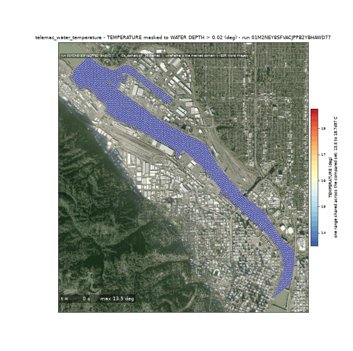
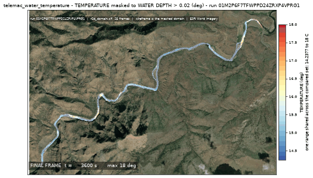
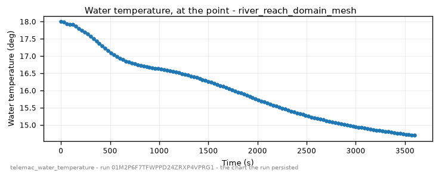

<!-- GENERATED by dev/instruments/gen_template_docs.py. Edit the declaration, not this file. -->

# `telemac_water_temperature`

WATER TEMPERATURE over a body of water under a week of real weather.

|  |  |
|---|---|
| module | `telemac2d` - 376 keywords in its dictionary, of which this template states 29 |
| solves | `trid3nt_server.workflows.telemac.engine.solve_case` |
| engine defaults | every keyword this template does not state keeps the engine's own default; `describe_keywords` names it with that default, and `keywords={...}` sets it |

## The data it consumes

| row | produced by | what it is | datum |
|---|---|---|---|
| `domain` | `fetch_river_reach` | Build a RIVER REACH DOMAIN from one seed point -> the reach polygon, its inflow and outflow boundary runs, and the centerline. | - |
| `runs` | supplied by the caller | the stretches of the domain's edge that carry a boundary condition - each two points on the edge and a type (inflow, outflow, open); a closed body states none | - |
| `survey` | `fetch_ehydro_surveys` | Fetch USACE eHydro CHANNEL SURVEY soundings + the survey footprint for a bbox -> the measured bed. | - |
| `surveyed_bed` | `derive_survey_surface` | Interpolate a POINT layer of measurements onto a raster surface -> a continuous grid. | - |
| `terrain` | `fetch_dem` | Fetch a digital elevation model (DEM) / terrain elevation for a bounding box (USGS 3DEP US lidar; on a 3DEP outage the default path STOPS and asks before any Copernicus GLO-30 swap; either source pinnable). | NAVD88 (metres, positive up) |
| `bed` | `derive_merge_rasters` | MERGE two overlapping surfaces into one, the PRIMARY winning where it measured. | - |
| `carrier` | `fetch_noaa_nwm_streamflow` | Fetch NOAA National Water Model streamflow as a point FlatGeobuf. | - |
| `stage` | supplied by the caller | a layer you supply, as a uri or a layer name; absent is legal and the run reports it. | - |
| `weather` | `fetch_raws_weather` | Fetch RAWS fire-weather station observations as a point FlatGeobuf. | - |
| `water_temperature` | `fetch_usgs_water_quality` | Fetch REAL, OBSERVED water-quality sample sites as a point FlatGeobuf. | - |

## The sheet

The values the template declares. `desc` is what the model reads when it fills one.

| param | door | units | default | desc |
|---|---|---|---|---|
| `seed` | user | - | optional | Where on the channel the modelled stretch STARTS, as a Point: the pick's {coordinates, name} verbatim, a (lon, lat) pair, 'lat,lon', a point layer, or a place name geocoded first. It seeds the reach the domain is cut from; supply the domain polygon - a lake, a pond, a harbour - instead and this is not read |
| `weather_start` | question | - | - | First day of the observed weather the water is driven over, 'YYYY-MM-DD' - from phrasing like 'last week' or 'the first week of August'. The station record is hourly and the network holds the last two weeks, so an earlier day refuses typed |
| `weather_end` | question | - | - | Last day of the observed weather, 'YYYY-MM-DD'. The run is sim_duration_s long from the first observation, so this day has to be far enough past weather_start to cover it; at most 14 days after |
| `station` | user | - | optional | Where the temperature series and its diurnal range are read, as a Point: the pick's {coordinates, name} verbatim, a (lon, lat) pair, 'lat,lon', a point layer, or a place name |
| `sim_duration_s` | scenario | s | 604800.0 | Simulated time. A DIURNAL RANGE needs whole days, and this defaults to seven; a shorter run answers what the water did over that window and no more. The weather record has to span every second of it - a run longer than its own forcing refuses rather than extrapolating |
| `mesh_resolution_m` | scenario | m | 20.0 | Target element edge length the domain is triangulated at; a surface heat budget is divided by the local DEPTH, so what this has to resolve is how deep the water is rather than its planform |
| `event_time` | question | - | optional | The moment the scenario is read at - an ISO date or datetime ('2026-08-20' or '2026-08-20T06:00:00Z'), from phrasing like 'during last Tuesday's storm'. Each source keeps its own retention, and a request deeper than one refuses typed |
| `compute_class` | constant | - | medium | Solve sizing class |
| `vertical_frame` | constant | - | NAVD88 | Vertical datum this run counts every elevation from - the bed under it and the level over it. A source published on another frame reaches this one through a measured offset, and a pair nobody publishes an offset between refuses by name |

## What it answers

| field | the proving run's value |
|---|---|
| `peak_temperature_c` | 18.0 |
| `peak_temperature_time_s` | 0.0 |
| `final_temperature_c` | 14.703310012817383 |
| `diurnal_range_c` | 3.296689987182617 |
| `temperature_spread_c` | 3.7622804641723633 |
| `mean_velocity_mps` | 0.2002688355034483 |
| `mesh_size_m` | 3.0 |

It publishes these layers onto the canvas:

- Input: river reach (river_reach)
- Input: bed elevation (dem, 3DEP 1-10 m US lidar (default 10 m); Copernicus GLO-30 30 m global via source=copernicus, datum NAVD88 (metres, positive up))
- Temperature station (derived) - river_reach_domain
- Input: raws weather (raws_weather)
- Velocity u over time (river_reach_domain_mesh)
- Velocity v over time (river_reach_domain_mesh)
- Water depth over time (river_reach_domain_mesh)
- Free surface over time (river_reach_domain_mesh)
- Bottom (m) at t = 3600 s (river_reach_domain_mesh)
- Froude number over time (river_reach_domain_mesh)
- Scalar flowrate over time (river_reach_domain_mesh)
- Scalar velocity over time (river_reach_domain_mesh)
- Temperature over time (river_reach_domain_mesh)
- Water temperature (river_reach_domain_mesh)
- river_reach_domain_mesh

## The proving run

Run `01M2P6F7TFWPPD24ZRXP4VPRG1`, 2026-09-16T22:49:32.626699+00:00, 152.185 s, at commit `1883ff4c1867377c3bb4efdec4e2a87450e5fefa-dirty`.


*Every layer the run published, stacked and framed on the result (run 01M2P6F7TFWPPD24ZRXP4VPRG1)*



*The solve, frame by frame (run 01M2P6F7TFWPPD24ZRXP4VPRG1)*



*final frame (run 01M2P6F7TFWPPD24ZRXP4VPRG1)*



*water temperature - the chart the run persisted (run 01M2P6F7TFWPPD24ZRXP4VPRG1)*

### The sheet it filled

Every slot the run resolved, with where the value came from. The engine's own defaults are folded: what is not here, the engine chose.

| param | value | units | basis | provenance |
|---|---|---|---|---|
| `seed` | Point(lon=-120.009, lat=44.793, name=None) | - | user | supplied on this invocation |
| `weather_start` | 2026-09-12 | - | user | supplied on this invocation |
| `weather_end` | 2026-09-15 | - | user | supplied on this invocation |
| `sim_duration_s` | 3600.0 | s | user | supplied on this invocation |
| `mesh_resolution_m` | 12.0 | m | user | supplied on this invocation |
| `vertical_frame` | EGM2008 | - | user | supplied on this invocation |
| `compute_class` | medium | - | default_demo | declared constant default |
| `station` | - | - | user | not supplied (declared optional) |
| `event_time` | - | - | prompt_interpreted | not supplied (declared optional) |

### Reproduce

```python
from trid3nt_server.tools import TOOL_REGISTRY

await TOOL_REGISTRY['telemac_water_temperature'].fn(
    mesh_resolution_m=12.0,
    seed='Point(lon=-120.009, lat=44.793, name=None)',
    sim_duration_s=3600.0,
    vertical_frame='EGM2008',
    weather_end='2026-09-15',
    weather_start='2026-09-12',
)
```

That is the invocation this run came from; the figures above are stamped with run `01M2P6F7TFWPPD24ZRXP4VPRG1` and commit `1883ff4c1867377c3bb4efdec4e2a87450e5fefa-dirty`. The full argument record is [`telemac_water_temperature/run.json`](telemac_water_temperature/run.json).

