<!-- GENERATED by dev/instruments/gen_template_docs.py. Edit the declaration, not this file. -->

# `tomawac_nearshore_waves`

NEARSHORE WAVES: what the offshore swell becomes at the shore - how high, how long, which way, and where it breaks.

|  |  |
|---|---|
| module | `tomawac` - 223 keywords in its dictionary, of which this template states 21 |
| solves | `trid3nt_server.workflows.telemac.engine.solve_case` |
| engine defaults | every keyword this template does not state keeps the engine's own default; `describe_keywords` names it with that default, and `keywords={...}` sets it |

## The data it consumes

| row | produced by | what it is | datum |
|---|---|---|---|
| `extent` | supplied by the caller | a rectangle layer you supply, as a uri or a layer name; required - the template names no source for it. | - |
| `domain` | matched on a need for hydrography | the closed polygon this run solves over, as a uri, a layer name or a drawn shape; unfilled, the run matches a source of hydrography. | - |
| `bed` | matched on a need for bathymetry | what the domain's nodes carry for elevation: a DEM, a bathymetry or survey raster, a layer of soundings, or a depth in metres below the free surface; unfilled, the run matches a source of bathymetry. | - |
| `wave` | matched on a need for wave series | the wave series this run reads, as a uri or a layer name; unfilled, the run matches a source of wave series. | - |
| `level` | matched on a need for water level series | the water level series this run opens on: a layer of sites that report it, or the number itself; unfilled, the run matches a source of water level series. | - |
| `mesh` | supplied by the caller | a mesh layer you supply, as a uri or a layer name; absent is legal and the run reports it. | - |

## The sheet

The values the template declares. `desc` is what the model reads when it fills one.

| param | door | units | default | desc |
|---|---|---|---|---|
| `seed` | user | - | optional | Where OFFSHORE the incoming sea state is measured, as a Point: the pick's {coordinates, name} verbatim, a (lon, lat) pair, 'lat,lon', a point layer. Geocode a place name first. The nearest buoy to it is the record the open boundary is forced at, so put it on the water the swell arrives across |
| `station` | user | - | - | Where INSHORE the waves are read over time, as a Point: the pick's {coordinates, name} verbatim, a (lon, lat) pair, 'lat,lon', a point layer. Geocode a place name first. The height, the period and the direction are charted at the node of the mesh it settles onto, so put it on the water you are asking about |
| `mesh_resolution_m` | scenario | m | 30.0 | Target element edge length the water is triangulated at; the waves shoal and then break where the DEPTH falls, so what this has to resolve is the slope of the bed across the surf zone |
| `open_depth_threshold_m` | scenario | m | -12.0 | How deep a boundary stretch must reach for it to be designated the OPEN edge the measured sea state enters through; every stretch that reaches it opens, and a window where none does has no edge for the spectrum and refuses |
| `event_time` | question | - | optional | The moment the scenario is read at - an ISO date or datetime (YYYY-MM-DD or YYYY-MM-DDTHH:MM:SSZ), from phrasing like 'during last Tuesday's storm'. Each source keeps its own retention, and a request deeper than one refuses typed |
| `cores` | constant | - | optional | How many cores the solve is partitioned across. Absent, the module's own processors keyword stands; a count past this box's cores is refused rather than cut down, and an engine that solves on one core says so on the card |
| `vertical_frame` | constant | - | NAVD88 | Vertical datum this run counts every elevation from - the bed under it and the level over it. A source published on another frame reaches this one through a measured offset, and a pair nobody publishes an offset between refuses by name |

It publishes these layers onto the canvas:

- Input: domain (osm_coastline)
- Input: bed (dem, 3DEP 1-10 m US lidar (default 10 m); Copernicus GLO-30 30 m global via source=copernicus, datum NAVD88)
- Input: bed (bluetopo, BlueTopo multi-resolution UTM tiles - 2 m / 4 m / 8 m / 16 m tiers, finer in shallow water, datum NAVD88)
- Input: bed (topobathy, CUDEM 1/9" ~3 m nearshore; ETOPO 2022 15" ~450 m offshore fallback; 3DEP 10 m land, datum NAVD88)
- Wave station (user) - osm_coastline_osm_coastline
- Input: level (noaa_coops_tides, datum MLLW)
- Input: wave (ndbc_buoys)
- Variance m0 over time (osm_coastline_osm_coastline_mesh)
- Wave height hm0 over time (osm_coastline_osm_coastline_mesh)
- Mean direction over time (osm_coastline_osm_coastline_mesh)
- Wave spread over time (osm_coastline_osm_coastline_mesh)
- Bottom (m) at t = 3600 s (osm_coastline_osm_coastline_mesh)
- Water depth over time (osm_coastline_osm_coastline_mesh)
- Force fx over time (osm_coastline_osm_coastline_mesh)
- Force fy over time (osm_coastline_osm_coastline_mesh)
- Stress sxx over time (osm_coastline_osm_coastline_mesh)
- Stress sxy over time (osm_coastline_osm_coastline_mesh)
- Stress syy over time (osm_coastline_osm_coastline_mesh)
- Bottom velocity over time (osm_coastline_osm_coastline_mesh)
- Mean freq fmoy over time (osm_coastline_osm_coastline_mesh)
- Mean freq fm01 over time (osm_coastline_osm_coastline_mesh)
- Mean freq fm02 over time (osm_coastline_osm_coastline_mesh)
- Peak freq fpd over time (osm_coastline_osm_coastline_mesh)
- Peak freq fpr5 over time (osm_coastline_osm_coastline_mesh)
- Peak freq fpr8 over time (osm_coastline_osm_coastline_mesh)
- Ustar over time (osm_coastline_osm_coastline_mesh)
- Wave stress over time (osm_coastline_osm_coastline_mesh)
- Mean period tmoy over time (osm_coastline_osm_coastline_mesh)
- Mean period tm01 over time (osm_coastline_osm_coastline_mesh)
- Mean period tm02 over time (osm_coastline_osm_coastline_mesh)
- Peak period tpd over time (osm_coastline_osm_coastline_mesh)
- Peak period tpr5 over time (osm_coastline_osm_coastline_mesh)
- Peak period tpr8 over time (osm_coastline_osm_coastline_mesh)
- Wave power over time (osm_coastline_osm_coastline_mesh)
- Breaking rat over time (osm_coastline_osm_coastline_mesh)
- Breaker dissip over time (osm_coastline_osm_coastline_mesh)
- Peak direction over time (osm_coastline_osm_coastline_mesh)
- osm_coastline_osm_coastline_mesh

## The proving run

Run `01M30GCFV4KJ1PFCW27NBJ7RZN`, 2026-09-20T22:53:46.092438+00:00, 40.833 s, at commit `4a83b7f8a8b980525179f711b64a7b252c3137cc`.

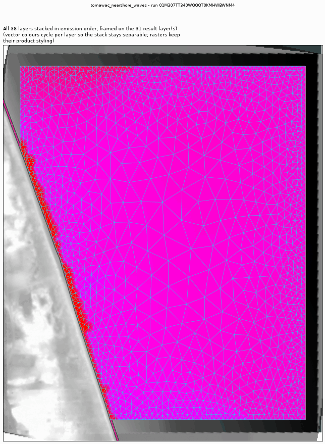

*Every layer the run published, stacked and framed on the result (run 01M30GCFV4KJ1PFCW27NBJ7RZN)*

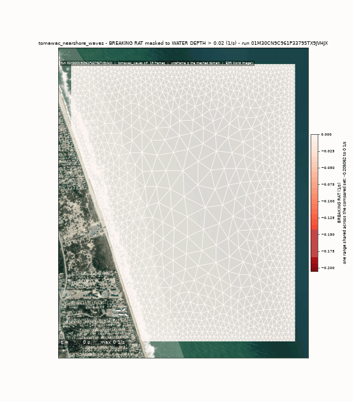

*The solve, frame by frame - breaking (run 01M30GCFV4KJ1PFCW27NBJ7RZN)*

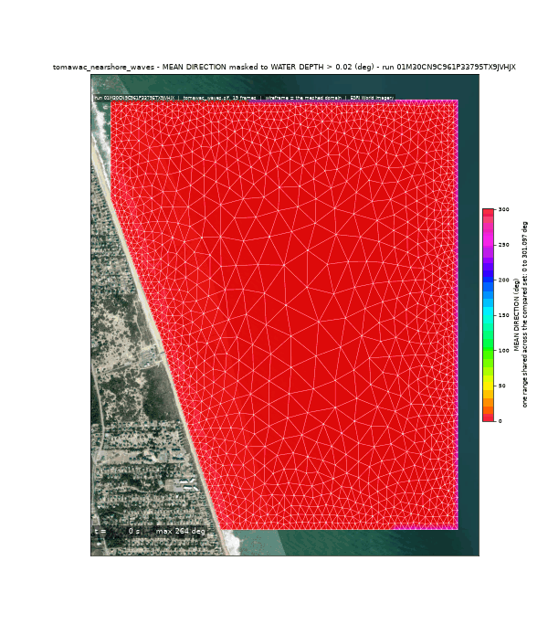

*The solve, frame by frame - direction (run 01M30GCFV4KJ1PFCW27NBJ7RZN)*

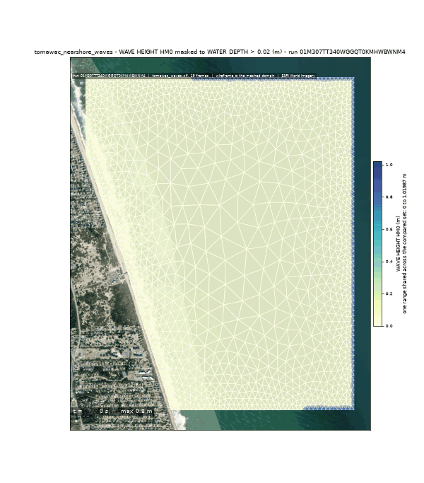

*The solve, frame by frame - wave_height (run 01M30GCFV4KJ1PFCW27NBJ7RZN)*

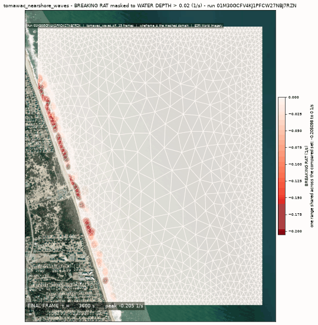

*breaking final frame (run 01M30GCFV4KJ1PFCW27NBJ7RZN)*

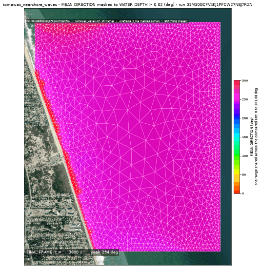

*direction final frame (run 01M30GCFV4KJ1PFCW27NBJ7RZN)*

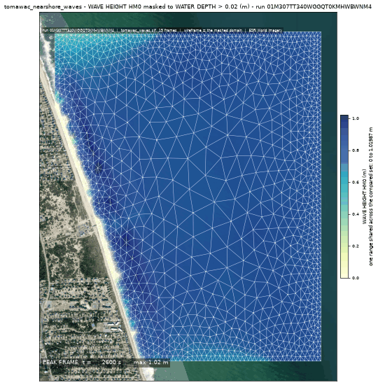

*wave height peak frame (run 01M30GCFV4KJ1PFCW27NBJ7RZN)*

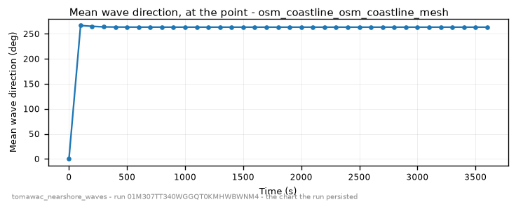

*mean wave direction - the chart the run persisted (run 01M30GCFV4KJ1PFCW27NBJ7RZN)*

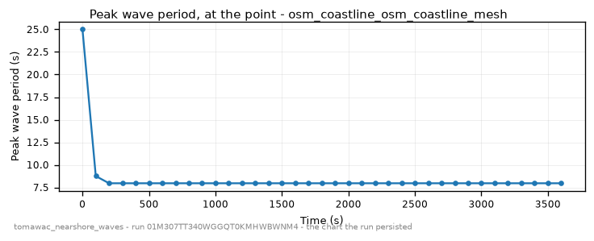

*peak wave period - the chart the run persisted (run 01M30GCFV4KJ1PFCW27NBJ7RZN)*

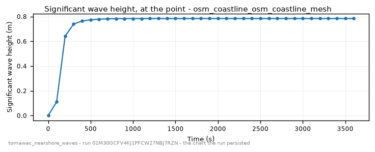

*significant wave height - the chart the run persisted (run 01M30GCFV4KJ1PFCW27NBJ7RZN)*

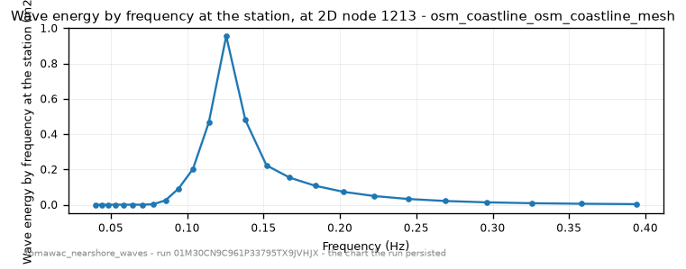

*wave energy by frequency at the station - the chart the run persisted (run 01M30GCFV4KJ1PFCW27NBJ7RZN)*

### The sheet it filled

Every slot the run resolved, with where the value came from. The engine's own defaults are folded: what is not here, the engine chose.

| param | value | units | basis | provenance |
|---|---|---|---|---|
| `seed` | {'lon': -75.593, 'lat': 36.257, 'name': None} | - | user | supplied on this invocation |
| `station` | {'lon': -75.7375, 'lat': 36.184, 'name': None} | - | user | supplied on this invocation |
| `mesh_resolution_m` | 40.0 | m | user | supplied on this invocation |
| `event_time` | 2026-09-17T12:00:00+00:00 | - | user | supplied on this invocation |
| `open_depth_threshold_m` | -12.0 | m | default_demo | declared scenario default |
| `compute_class` | medium | - | default_demo | declared constant default |
| `vertical_frame` | NAVD88 | - | default_demo | declared constant default |

### Reproduce

```python
from trid3nt_server.tools import TOOL_REGISTRY

await TOOL_REGISTRY['tomawac_nearshore_waves'].fn(
    event_time='2026-09-17T12:00:00+00:00',
    mesh_resolution_m=40.0,
    seed={'lon': -75.593, 'lat': 36.257, 'name': None},
    station={'lon': -75.7375, 'lat': 36.184, 'name': None},
    extent="{'bbox': [-75.755, 36.17, -75.725, 36.2], 'name': 'Duck, NC'}",
)
```

That is the invocation this run came from; the figures above are stamped with run `01M30GCFV4KJ1PFCW27NBJ7RZN` and commit `4a83b7f8a8b980525179f711b64a7b252c3137cc`. The full argument record is [`tomawac_nearshore_waves/run.json`](tomawac_nearshore_waves/run.json).

