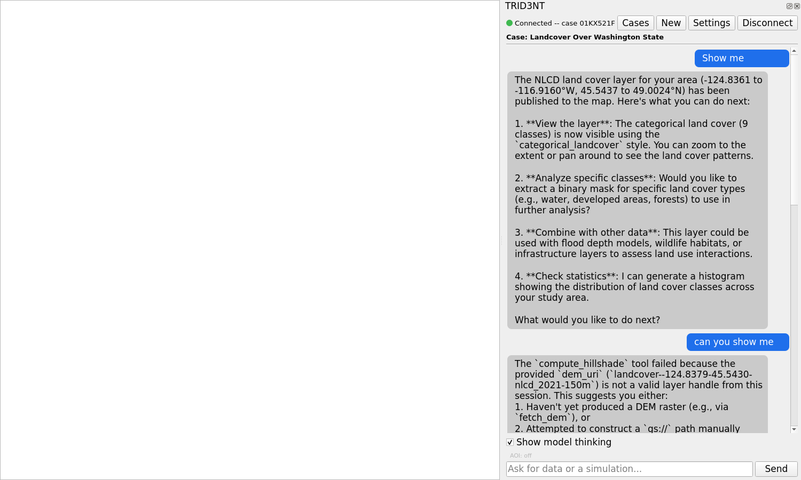
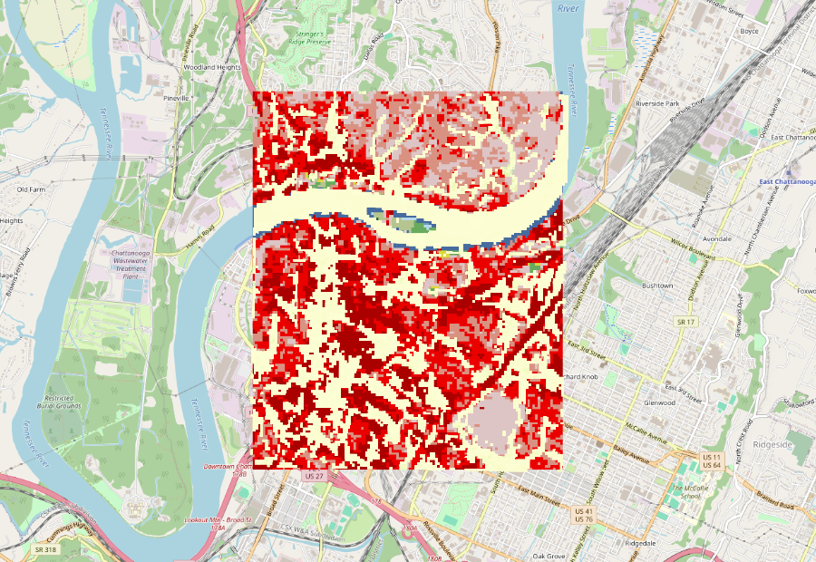

# TRID3NT QGIS Plugin

A QGIS dock panel that connects to a local TRID3NT agent: chat-driven
geospatial data fetching and hazard simulation, with results streaming
straight into your QGIS layer tree as you ask for them.

Ask for a DEM, a flood simulation, a land-cover raster, or a hazard analysis
in plain language. The agent runs the tools, and every layer it publishes is
added to the canvas you are already working in -- no manual downloads, no
copy-pasting file paths.



## Key features

- **Chat-driven data + simulation** -- ask for elevation, land cover,
  hydrology, or a hazard simulation (e.g. flood) in plain language; results
  arrive as native QGIS layers (XYZ raster tiles, vector layers from GeoJSON
  or the local object store).
- **Per-case layer management** -- each conversation ("case") gets its own
  layer group (`TRID3NT <case>`); switching cases clears the previous case's
  group without touching your basemap or other project layers.
- **Auto-connect** -- opening the dock in local mode dials the local agent
  automatically; no manual "Connect" click required.
- **Cases browser** -- a header button lists your existing cases with
  click-to-open: pick one and the dock rebinds, replaying its chat history
  and layers.
- **Streamed model thinking** -- the model's reasoning streams into a
  collapsible "Thinking..." block above the reply, live as it's generated.
- **Resolution confirmation gates** -- before a large or expensive tool run
  (e.g. a large simulation grid), the dock shows an inline card with the
  agent's honest size/cost estimate and a resolution ladder; nothing heavy
  runs without an explicit click.
- **Temporal animation grouping** -- frame-sequence rasters (e.g. flood depth
  over time) are auto-detected and grouped, then stamped with the QGIS
  Temporal Controller so you can scrub or animate them with the native QGIS
  time slider.
- **GeoTIFF / case export** -- pull a case's exported layers (GeoTIFFs,
  vector tables) directly into your current QGIS project via "Open in QGIS".
- **Mesh outputs (MDAL)** -- a SFINCS flood run's native mesh
  (`sfincs_map.nc`) loads as a first-class `QgsMeshLayer` alongside the
  exported GeoTIFFs/vectors (local mode), with its CRS set automatically and
  the peak flood-depth dataset group pre-selected; every dataset group SFINCS
  wrote (bed level, Manning roughness, per-timestep max depth/level) stays
  selectable from Layer Properties.
- **Push layer** -- the reverse of "Open in QGIS": send your ACTIVE QGIS
  layer (vector or raster) into the current case as a first-class input
  layer with one click ("Push layer" in the header). An optional "Set as
  case AOI" checkbox pins the case's bounding box to the pushed layer's
  extent. The layer reappears on the map on the case's next reopen.
- **Probe** -- click "Probe" in the header, then click anywhere on the
  canvas: the dock shows the value of every raster layer loaded on the
  current case at that point (a plain "name: value" line), with detected
  animation-frame sequences (e.g. flood depth over time) collapsed into one
  compact chain, e.g. `Flood depth: 0.02 -> 0.15 -> 0.31 -> 0.28 m (4 steps,
  peak 0.31)`. Deterministic -- no model call, no chat turn -- so it stays
  fast even mid-conversation. Click "Probe" again to release the tool back
  to whatever was active before.



## Requirements

- QGIS 3.28 or later
- A running TRID3NT local stack (agent + MinIO + supporting services). This
  plugin lives in the same repo as that stack (`trid3nt-local`, the parent
  directory of this one) -- see the [daemon-only install](../docs/site/install.md#daemon-only-install-from-scratch)
  if you need to stand one up. The plugin only connects to the stack over
  WebSocket; it never starts or stops it, and a client-only machine (see
  below) needs none of that -- just QGIS.

## Install

There are two ways to get this plugin into QGIS, depending on whether this
machine also runs the server (see the repo root's
[three-path install matrix](../README.md#install-paths)).

**From ZIP (client-only -- no git, no venv, no server on this machine):**

From the repo root (run on the daemon machine, or any checkout -- not
necessarily this one):

```bash
make plugin-zip
```

writes `dist/trid3nt-plugin-<version>.zip` (e.g. `dist/trid3nt-plugin-0.3.2.zip`).
Copy that one file to the client machine, then in QGIS: **Plugins > Manage
and Install Plugins > Install from ZIP**, and point it at the file.

**Dev install (this machine also runs the server):**

From the repo root:

```bash
make plugin
```

This runs `scripts/install_plugin.sh`, which `rsync -a --delete`s
`qgis-plugin/trid3nt/` into
`~/.local/share/QGIS/QGIS3/profiles/default/python/plugins/trid3nt/`. **QGIS
loads that installed profile copy, never this repo checkout directly** -- a
plugin-code edit needs `make plugin` run again before QGIS sees it, and even
then QGIS keeps running the OLD code in memory until you reload:
**Plugins > Plugin Reloader** (or restart QGIS). `scripts/install_plugin.sh
--check` diff-checks what a sync would change without touching anything.

Either way, enable **TRID3NT** in the Plugin Manager afterward (check "Show
also Experimental Plugins" under Settings -- the plugin currently ships with
`experimental=True`).

## Server URL and token settings

Open the dock (toolbar trident icon) > **Settings**. The "Server" section is
exactly two fields:

- **Server URL** -- `ws://127.0.0.1:8765/ws` by default (the local daemon on
  this same machine). Point it at a remote daemon's tailnet address instead,
  e.g. `ws://100.x.x.x:8765/ws`, for the client-only setup.
- **Server token** -- leave blank unless the daemon set the
  `TRID3NT_ACCESS_TOKEN` environment variable, in which case paste the same
  value here.

That one URL is the whole setup -- MinIO and the agent's HTTP API are
auto-derived from the connect handshake, not configured separately. See
[Remote daemon access (tailnet)](../docs/site/configuration.md#remote-daemon-access-tailnet)
for the full derivation. The LLM model can also be switched live from
Settings (no restart).

## Quick start

1. Start your local TRID3NT stack so the agent is listening on
   `ws://127.0.0.1:8765/ws`.
2. In QGIS, click the TRID3NT trident icon in the toolbar to open the chat
   dock. In local mode it auto-connects; the status dot goes amber
   (connecting) then green.
3. Ask for data or a simulation, for example:
   `Fetch a digital elevation model for a 5km box around Asheville, North
   Carolina.`
4. Watch the status lines under the reply as tools run. When a layer event
   arrives it lands in the layer tree under `TRID3NT <case>`.

## Development

The connection layer (`trid3nt/net/trid3nt_client.py`) is a deliberately
**stdlib-only** RFC 6455 WebSocket client (handshake, masking, fragmentation,
ping/pong, TLS via `ssl`). QGIS's bundled Python does not reliably ship a
WebSocket library across platforms, and vendoring one adds a third-party tree
to maintain for a small protocol surface -- so the client, and everything
else that can avoid it, has no PyQGIS/PyQt import and is testable with plain
CPython.

From this directory (needs the agent venv from the root `make venv` /
`make setup` -- `make test` defaults `PYTHON` to `../venvs/agent/bin/python`):

```bash
make test
```

runs the full pure-Python test suite (300 tests as of this writing -- run
`make test` for the current count) -- no QGIS installation is required for
most of it. A small subset that exercises real Qt signal wiring runs in a
subprocess against the system PyQt5 interpreter and skips honestly when one
isn't available. See `trid3nt/net/trid3nt_client.py`'s module docstring for
the full protocol reference, and `tests/` for coverage details.

Other Makefile targets local to this directory:

```bash
make zip       # trid3nt.zip (unversioned) -- for iterating on the plugin without
               # the repo-root plugin-zip/plugin flow above
make install   # zip + unzip into the default QGIS profile (no --delete; prefer
               # the repo root's `make plugin` for a clean sync, see Install above)
make clean     # remove build artifacts
```

## Screenshots

| Chat dock | Flood simulation |
| --- | --- |
|  |  |

## License

MIT -- see [LICENSE](LICENSE).
